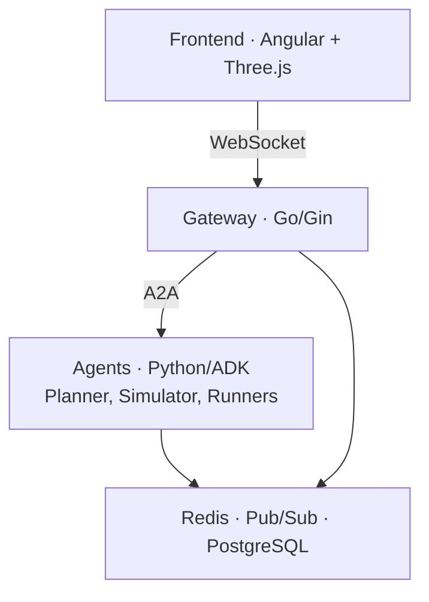

# Exploring the Race Condition Codebase

This is a multi-agent marathon simulation built for the Google Cloud Next '26
Developer Keynote. It also doubles as a reference architecture, so the
layout is meant to be readable on its own. Pick a question from "Where
to start" below and follow the file pointers.

## Where to start (by intent)

| You want to understand... | Read in this order |
|---|---|
| The whole system end-to-end | `docs/architecture/system_architecture.md` → `cmd/gateway/main.go` → one agent's `agent.py` |
| How agents discover and talk to each other | `docs/guides/a2a-implementation-guide.md` → `internal/agent/` → any `agent.json` in `agents/*/` |
| The Hub and session routing | `docs/architecture/multi_session_routing.md` → `internal/hub/` → `internal/session/` |
| The simulator's tick loop | `agents/simulator/agent.py` (`race_engine = LoopAgent(...)`) → `tick_callback.py` → `broadcast.py` → `collector.py` |
| How the planner builds routes | `docs/architecture/route_planning.md` → `agents/planner/agent.py` → `agents/planner/prompts.py` |
| The cached/replay reliability system | `web/frontend/src/app/components/DemoOverlay/demo.service.ts` → `agent-gateway-updates.ts` → the `.ndjson` recordings under `web/frontend/public/assets/` |
| Backend-driven UI (A2UI) | `docs/architecture/a2ui_protocol.md` → `agents/utils/` (search for `a2ui`) → frontend `a2-ui-controller.component.ts` |
| The deterministic runner baseline | `agents/runner/agent.py` (shared mechanics) → `agents/runner_autopilot/agent.py` (overrides) |
| Deployment and infra | `infra/README.md` → `infra/` (Terraform modules) → `Dockerfile` |
| Tests and how they run offline | `docs/guides/testing.md` → root `conftest.py` |

## High-level topology

Four layers:

- **Frontend** in `web/frontend/`. Angular 21 + Three.js renders the 3D
  Las Vegas course, runner positions, weather, and crowds. Talks to the
  gateway over WebSocket using protobuf.
- **Gateway** in `cmd/gateway/` and `internal/`. Go service that owns
  sessions, routes A2A traffic, and batches broadcasts.
- **Agents** in `agents/`. Python ADK processes, one per agent variant,
  each on its own port.
- **Infrastructure**: Redis (sessions, pub-sub), Pub/Sub emulator
  (telemetry), PostgreSQL + pgvector (route memory). Local via
  `docker-compose.yml`; production via Memorystore, Pub/Sub, AlloyDB.

## Patterns worth understanding

### 1. Multiple agent variants instead of feature flags

The repo ships three planner variants (`planner`, `planner_with_eval`,
`planner_with_memory`) and two runner variants (`runner`,
`runner_autopilot`). They are separate ADK agents, not flags inside one
agent.

Why: each variant adds one capability (eval gating, persistent memory in
AlloyDB, deterministic decision-making) and you can read what that
capability costs by diffing two `agent.py` files. Each variant also has its
own A2A endpoint and can be deployed, scaled, or removed independently.

Where: `agents/planner*/agent.py`, `agents/runner*/agent.py`. Compare
`runner/agent.py` to `runner_autopilot/agent.py`: autopilot calls
`get_base_agent()` and overrides only the decision callback, which shows
what the LLM actually does in this codepath.

### 2. Cached vs live replay

The frontend can boot in **Cached** mode and replay NDJSON streams recorded
from real agent runs. Live mode runs agents over WebSockets.

Why: keynote demos cannot afford a network blip. Replay is timing-faithful
to the real run, so UI work and recording happen with zero LLM cost.
Anything that breaks under replay would have broken on stage, which makes
the replay path double as an integration check.

Where: `web/frontend/src/app/components/DemoOverlay/demo.service.ts` (the
`Ctrl+L` toggle and mode flash), `web/frontend/src/app/agent-gateway-updates.ts`
(`beginNdjsonReplay` and `replayPrimaryAgentTypeHint`). Recordings are in
`web/frontend/public/assets/sim-*-log.ndjson`. Each entry in
`web/frontend/src/app/demo-config.ts` references the streams it replays and
its `timeScale`.

### 3. Hub session routing with broadcast batching

Hundreds of runner agents emit telemetry on the same tick. Without batching,
each runner update would push a separate frame to every connected frontend.

Why: thundering-herd avoidance. The hub coalesces broadcasts inside a session
window and writes one frame per WebSocket per tick. Session state lives in
Redis so multiple gateway replicas can serve the same session without
duplicating fanout.

Where: `internal/hub/` (broadcast and fanout), `internal/session/` (Redis +
in-memory fallback), `docs/architecture/multi_session_routing.md` for the
rationale and the failure modes it prevents.

### 4. Tick-based simulator as an ADK pipeline

The simulator is a `SequentialAgent` of three stages:
`PreRace → LoopAgent (≤200 ticks) → PostRace`. Each tick advances the clock,
updates environment, broadcasts to runner agents, collects their decisions.

Why: ADK's `LoopAgent` gives a clean termination contract and lets each tick
emit telemetry events that the dashboard can group by `invocation_id`. The
simulator stays pure-ADK code rather than a bespoke loop.

Where: `agents/simulator/agent.py` (pipeline definition and the
`race_engine` LoopAgent itself), `tick_callback.py` (per-tick body),
`broadcast.py` (fan-out to runners), `collector.py` (decision
aggregation).

### 5. A2UI for backend-driven UI

Agents emit UI primitives (cards, route lists, action buttons) over the wire
as declarative JSON. The frontend renders them generically.

Why: UI shape is a function of agent state, and putting that mapping in the
frontend means every agent change is a frontend change too. With A2UI,
agents own their own UI surfaces and the frontend stays a renderer.

Where: `docs/architecture/a2ui_protocol.md` for the spec,
`agents/utils/` (search for `a2ui`) for the agent-side helpers,
`web/frontend/src/app/components/a2ui/a2-ui-controller.component.ts` for the renderer.
The Sandbox demo's "top 3 routes" panel is the easiest example to read end-to-end.

### 6. A2A for agent-to-agent communication

Agents discover each other via cards at `/.well-known/agent-card.json`. The
gateway fetches them at startup and routes by declared skill.

Why: each agent advertises its own capabilities, so adding a new agent is a
deploy + register, not a code change in callers. `call_agent(tool_context,
agent_name, message)` (in `agents/utils/communication.py`) is the only
entry point for agent-to-agent traffic, which keeps connection management
and registry lookup central.

Where: `agents/utils/communication.py`, `agents/utils/a2a.py`,
`internal/agent/` (the gateway's A2A client),
`docs/guides/a2a-implementation-guide.md`.

## Pragmatic shortcuts to be aware of

Some things in this repo are deliberately simpler than they would be in a
production system. Knowing which is which saves you from "fixing" a
deliberate choice or relying on a temporary one.

- **`InMemorySessionService` locally, `VertexAiSessionService` in cloud.**
  ADK ships a SQLite default; we never use it because file locking thrashes
  under concurrent agents. Both alternatives are intentional.
- **Pub/Sub is emulated locally.** The Pub/Sub client still validates the
  API exists, which is why the GCP project must enable `pubsub.googleapis.com`
  even for local development.
- **`runner_autopilot` is the default for load tests.** It exists because
  benchmarking a Gemini-backed runner at scale is mostly a benchmark of your
  bill. Use it whenever you do not specifically need LLM behavior.
- **Maps API key is optional.** Without `GOOGLE_MAPS_API_KEY` the planner
  falls back to plan-only routes. This is deliberate degradation, not a bug.

## Code map

- `agents/` — Python ADK agents. `planner*/` ships three variants (base,
  eval, memory); `simulator*/` ships base plus a fault-injection variant;
  `runner*/` ships LLM and deterministic versions. Shared helpers
  (A2A, session, telemetry, A2UI) live in `agents/utils/`.
- `cmd/` — Go service entry points: `gateway`, `admin`, `tester`,
  `frontend`. Start at `cmd/gateway/main.go`.
- `internal/` — Go core. `hub/` does session routing and broadcast
  batching; `session/` stores state in Redis (with an in-memory
  fallback); `agent/` is the gateway's A2A client and discovery; plus
  `auth/`, `config/`, `middleware/`.
- `web/` — Frontends. `web/frontend/` is the Angular 21 + Three.js
  keynote UI; `web/admin-dash/`, `web/agent-dash/`, and `web/tester/`
  are internal dashboards.
- `docs/` — Architecture, guides, glossary.
- `infra/` — Terraform for GCP deployment.
- `Dockerfile`, `docker-compose.yml`, `Procfile` — multi-stage container
  build, local infra (Redis / Pub/Sub / PostgreSQL), and Honcho process
  orchestration for `make start`.

## Documentation map

When the developer asks "how does X work?":

1. Check `docs/architecture/` for the *what* and *why*.
2. Check `docs/guides/` for the *how-to*.
3. Read the source — every agent has `agent.py` and an `agent.json` that
   tell you what it does and how callers reach it.
4. Check `docs/glossary.md` if a term is unfamiliar.

Most-useful docs:

- `docs/architecture/system_architecture.md` — full topology with diagrams
- `docs/architecture/agent_architecture.md` — how individual agents are
  structured
- `docs/architecture/communication_protocol.md` — gateway message format
- `docs/architecture/multi_session_routing.md` — Hub session routing
- `docs/architecture/route_planning.md` — Planner internals
- `docs/architecture/a2ui_protocol.md` — backend-driven UI spec
- `docs/guides/a2a-implementation-guide.md` — adding or modifying agents
- `docs/guides/testing.md` — test architecture and offline patterns
- `docs/troubleshooting.md` — common issues and fixes
- `docs/glossary.md` — project-specific terms
