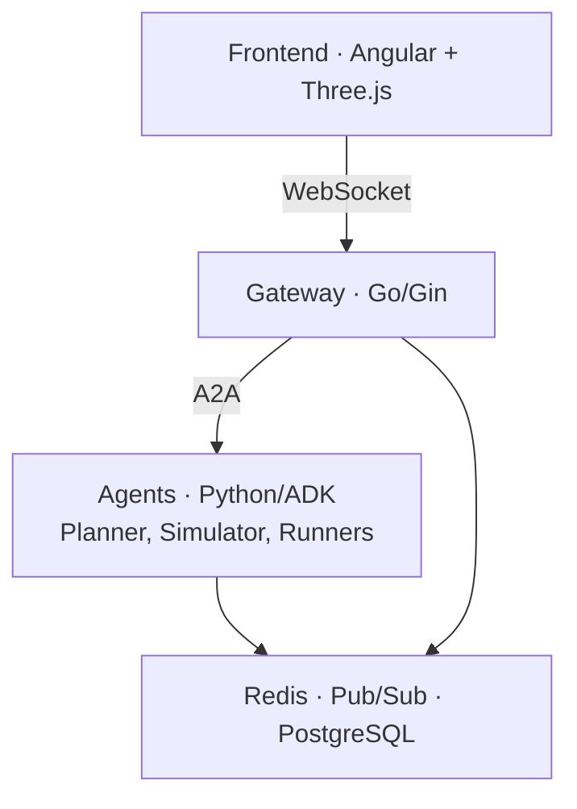

# Exploring the Race Condition Codebase

## System Architecture

Race Condition is a multi-agent marathon simulation with four layers:

For the full system diagram and data flows, read
`docs/architecture/system_architecture.md`.

## The Gateway (`cmd/gateway/`, `internal/`)

The gateway is a Go service built with Gin. It:
- Manages WebSocket connections from the frontend
- Routes messages between frontend and agents via the A2A protocol
- Discovers agents at startup by fetching `/.well-known/agent-card.json`
- Uses Redis for session state and pub-sub fanout

Key packages:
- `internal/hub/` -- Session routing, WebSocket management, broadcast fanout
- `internal/ecs/` -- Entity-Component-System for simulation state tracking
- `internal/sim/` -- Simulation lifecycle (create, start, tick, stop)
- `internal/session/` -- Session store (Redis + in-memory fallback)
- `internal/agent/` -- A2A client and agent discovery

See `docs/architecture/communication_protocol.md` and
`docs/architecture/multi_session_routing.md` for details.

## The Agents (`agents/`)

All agents use Google ADK (Agent Development Kit). Each agent has:
- `agent.py` -- Entry point defining the `root_agent`
- `agent.json` -- A2A agent card (name, skills, URL)
- `prompts.py` -- System prompts (most agents)
- `tests/` -- Unit tests (run with `pytest`)

### Planner Agent (`agents/planner/`)

Designs marathon routes using GIS data and Google Maps MCP tools. Three
variants exist with progressive capability:

| Variant | Directory | Extra capability |
|---|---|---|
| Base planner | `agents/planner/` | Core route planning |
| With eval | `agents/planner_with_eval/` | LLM-as-Judge plan evaluation |
| With memory | `agents/planner_with_memory/` | AlloyDB route persistence + vector search |

### Simulator Agent (`agents/simulator/`)

Runs the race as a `SequentialAgent` pipeline:

1. **Pre-race** (`pre_race_callback.py`) -- Parses the plan, spawns runners
2. **Race engine** (`LoopAgent`, up to 200 ticks) -- Advances clock, updates
   weather/traffic/crowds, broadcasts state to runners, collects decisions
3. **Post-race** -- Compiles results and rankings

Key files: `simulation/engine.py`, `tick_callback.py`, `broadcast.py`,
`collector.py`.

### Runner Agents (`agents/npc/`)

Individual NPC agents making per-tick decisions. Two variants:
- `runner/` -- LLM-powered (Gemini, Ollama, or vLLM)
- `runner_autopilot/` -- Deterministic (zero LLM calls, constant pacing)

Shared logic lives in `runner_shared/` (hydration, running mechanics).

### Shared Utilities (`agents/utils/`)

~40 modules covering: A2A communication, configuration, Redis pooling,
session management, telemetry plugins, simulation data structures, and the
A2UI rendering protocol.

## The Frontend (`web/frontend/`)

Angular 21 + Three.js application rendering a 3D Las Vegas environment. Shows
real-time runner positions, weather effects, and crowd reactions. Communicates
with the gateway via WebSocket using protobuf-encoded messages.

Other web UIs:
- `web/admin-dash/` -- Service health dashboard (Vite, vanilla JS)
- `web/tester/` -- Developer testing console (Vite + Tailwind)
- `web/agent-dash/` -- Real-time agent telemetry (single HTML file)

## Design Patterns

### Entity-Component-System (ECS)

`internal/ecs/` implements an ECS pattern for tracking simulation state. The
gateway doesn't need to understand agent-specific data -- it just routes
components by entity ID and type.

### A2A Protocol

Agents discover each other through agent cards at
`/.well-known/agent-card.json`. The gateway fetches cards at startup and
routes messages based on declared skills. Read
`docs/guides/a2a-implementation-guide.md` for implementation details.

### Pub-Sub Fanout

Redis pub-sub broadcasts simulation state to all connected frontends. The hub
(`internal/hub/`) manages per-session channels and multiplexes WebSocket
writes to avoid thundering-herd problems.

### Tick-Based Simulation

The simulator uses a `LoopAgent` that advances a virtual clock each tick. Each
tick: update environment, broadcast to runners, collect decisions, check
termination. Duration and interval are configurable in `.env`.

### A2UI Protocol

Agents deliver rich UI components to the frontend using the A2UI v0.8.0
declarative JSON protocol. See `docs/architecture/a2ui_protocol.md`.

## Answering Architecture Questions

When the developer asks "how does X work?":

1. Check the `docs/architecture/` directory first -- there are 12 docs
2. Check `docs/guides/` for implementation-focused guides
3. Read the relevant source code starting from `agent.py` or `main.go`
4. The `docs/glossary.md` defines project-specific terms

Key documentation files:
- `docs/architecture/system_architecture.md` -- Full system overview
- `docs/architecture/agent_architecture.md` -- Agent design details
- `docs/architecture/communication_protocol.md` -- Gateway messaging
- `docs/architecture/route_planning.md` -- Planner internals
- `docs/guides/testing.md` -- Test architecture and patterns
- `docs/troubleshooting.md` -- Common issues and fixes
