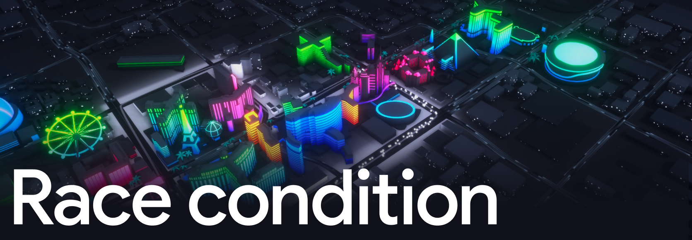
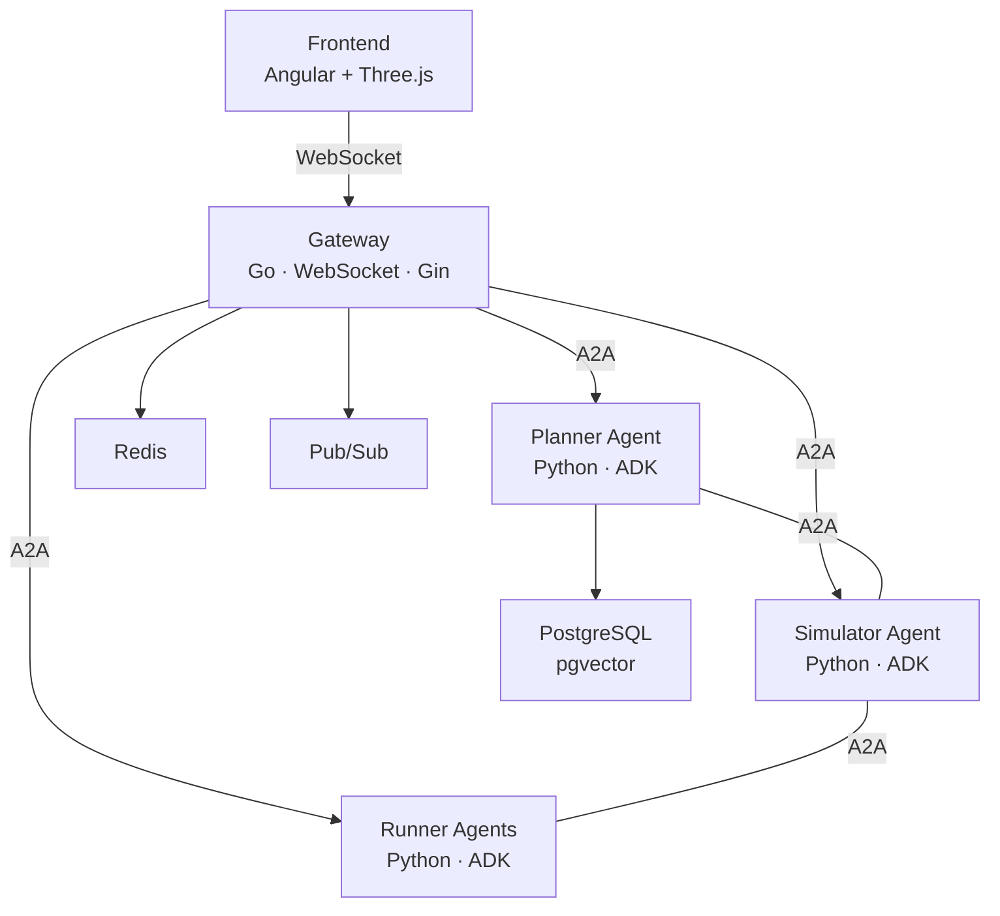
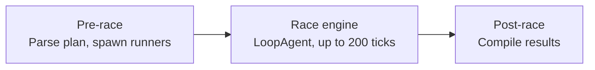

# Race Condition

[](https://github.com/GoogleCloudPlatform/race-condition/actions/workflows/ci.yml)
[](https://github.com/GoogleCloudPlatform/race-condition/blob/main/LICENSE)


[](https://shell.cloud.google.com/cloudshell/editor?cloudshell_git_repo=https://github.com/GoogleCloudPlatform/race-condition.git&cloudshell_tutorial=tutorial.md)
<!-- TODO(public-release): the cloudshell_git_repo URL above assumes the
     public GitHub mirror at GoogleCloudPlatform/race-condition. Verify the
     org/repo name when the public mirror lands and swap if different. -->

<p align="center">
  
</p>

A multi-agent marathon simulation built with [Google ADK](https://google.github.io/adk-docs/) and Gemini. AI agents plan a marathon route through Las Vegas, simulate the environment around it (weather, traffic, crowds), and run the race autonomously. Everything talks over the [A2A protocol](https://github.com/google/a2a).

Originally demoed at the Google Cloud Next '26 Developer Keynote.

## What this repo is good for

This is the open-source release of the multi-agent simulation we ran at the Google Cloud Next '26 Developer Keynote. It is also a working reference architecture for a few patterns that are hard to study in isolation:

- **Cached vs live replay.** The frontend can replay NDJSON streams recorded from real agent runs, indistinguishable from a live session. We use it for keynote reliability; you can use it to demo, test UI changes, or teach without paying for LLM calls.
- **A deterministic runner variant.** `runner_autopilot` makes the same shape of decisions a real LLM-powered runner would, but with zero API calls. It is the right baseline when you want to measure the simulator under load without your bill becoming the experiment.
- **A planner ladder.** Three variants of the planner (`planner`, `planner_with_eval`, `planner_with_memory`) show what each layer actually adds — eval gating, persistent memory in AlloyDB — as separate agents instead of feature flags.
- **The Hub session pattern.** A Go gateway routes WebSocket traffic to and from Python ADK agents over A2A, with batching to keep the system from thundering-herding itself when hundreds of runners broadcast on the same tick.
- **Backend-driven UI via A2UI.** Agents emit UI primitives (cards, route lists, action buttons) over the wire instead of the frontend hard-coding layouts per response shape.

The README and the in-repo agent skills are organized so you can pull any one of these threads without running the whole thing.

## What's different from the keynote build

A few things you saw on stage are not in this repo, and that is intentional:

- Some demos used products that are still in private preview. We cut those paths rather than ship code only the preview list could run.
- Some resources (always-on Memorystore at production sizing, GKE autoscaling) cost more than is reasonable for a demo. The default deploy scales compute to zero between runs.
- Some choices in the code reflect a keynote schedule — deadlines measured in days for things you would normally give weeks. Those edges are real. Other choices look strange and are deliberate; the cached-replay mode is the obvious one. If you are not sure which is which, the agent skills (`exploring-the-codebase`) explain the design decisions.

We will fold preview-gated features back in as those products move to public preview.

## How the agents split the work

A multi-agent system on Google Cloud, dressed up as a marathon. The agents split the work like this:

- A Planner designs the race course using Google Maps data, GIS tools, and a bit of financial modeling.
- A Simulator runs the environment tick by tick: weather, traffic, crowds, race progression.
- Runner agents (the NPCs) each decide their own pacing, hydration, and strategy as the race unfolds.

They coordinate over the Agent-to-Agent (A2A) protocol. A Go gateway sits in the middle and routes WebSocket traffic between a 3D Angular/Three.js frontend and the Python agents.

Locally, it runs on Docker Compose (Redis, Pub/Sub emulator, PostgreSQL). In the cloud, it deploys to Cloud Run and Vertex AI Agent Engine.

## Get started with your AI coding assistant

The fastest way to get Race Condition running is to ask your AI coding assistant to do it. The repo ships an `AGENTS.md` at the root that any modern AI dev tool will read on entry, plus four detailed skill files under `.claude/skills/`.

### If you use Claude Code

Skills auto-discover. Open the repo and ask:

```bash
cd race-condition
claude
> Set up this project and get the simulation running
```

Claude will load the `getting-started` skill on its own.

### If you use Gemini CLI, OpenCode, Cursor, or GitHub Copilot

These tools read `AGENTS.md` automatically but do not auto-discover the skill files. Point your assistant at the relevant skill explicitly:

```bash
cd race-condition
gemini   # or opencode, or open the folder in Cursor / VS Code
> Read .claude/skills/getting-started/SKILL.md and walk me through it
```

Same pattern for any other task. Swap in the skill that fits:

| Task | Skill to point at |
| --- | --- |
| First-time local setup | `.claude/skills/getting-started/SKILL.md` |
| Understanding the architecture and design decisions | `.claude/skills/exploring-the-codebase/SKILL.md` |
| Deploying to your own GCP project | `.claude/skills/deploying/SKILL.md` |
| Preparing a contribution (hooks, tests, PR) | `.claude/skills/contributing/SKILL.md` |

The skill files are plain Markdown with YAML frontmatter. The assistant will walk you through GCP authentication, API enablement, dependency installation, and starting the simulation. Some steps (like `gcloud auth login`) need you to act in a browser; the assistant will tell you when.

You can also set up manually. See the [Quickstart](#quickstart) section below.

## Architecture



| Component | What it does |
| --- | --- |
| Gateway | Central WebSocket hub (Go/Gin). Routes requests, manages sessions, bridges frontends with agents via A2A. |
| Planner | Designs marathon routes using GIS data, Google Maps MCP tools, and financial modeling. Three variants: base, with eval (LLM-as-Judge), and with memory (AlloyDB persistence). |
| Simulator | Runs the race as a pipeline: pre-race setup, a tick-based loop engine (up to 200 ticks), and post-race analysis. Spawns and coordinates runner agents. |
| Runners | Individual NPC agents. The LLM-powered variant uses Gemini to make strategic decisions each tick. The autopilot variant is deterministic (no LLM calls). |
| Frontend | Angular 21 + Three.js app rendering a 3D Las Vegas environment with real-time runner positions, weather, and crowd reactions. |
| Infrastructure | Redis (state/pub-sub fanout), Pub/Sub emulator (telemetry streaming), PostgreSQL with pgvector (route memory and embeddings). |

## Prerequisites

Install these before you start. `make check-prereqs` will verify them for you.

| Tool | Version | What it's for | Install |
| --- | --- | --- | --- |
| Go | 1.25+ | Gateway, admin, and frontend BFF servers | [go.dev/dl](https://go.dev/dl/) |
| Python | 3.13+ | AI agents (installed and managed by uv) | [python.org](https://www.python.org/downloads/) |
| uv | latest | Python package manager, virtual env, and task runner | [docs.astral.sh/uv](https://docs.astral.sh/uv/) |
| Node.js | 24+ | Frontend (Angular), admin dashboard, tester UI | [nodejs.org](https://nodejs.org/) |
| Docker + Compose | latest | Local infrastructure: Redis, Pub/Sub emulator, PostgreSQL | [docs.docker.com](https://docs.docker.com/get-docker/) |
| Google Cloud SDK | latest | `gcloud` CLI for auth and API enablement | [cloud.google.com/sdk](https://cloud.google.com/sdk/docs/install) |

### Cost note

Compute scales to zero by default (`min_instances=0`, `max_instances=1`), so you pay for it only when something is running. The unavoidable fixed cost is around $91/month for Memorystore Redis, Cloud SQL, and Cloud NAT. Each simulation run is roughly $3-4 in Gemini API calls. If you want to develop without burning API credits, use the `runner_autopilot` variant — it's deterministic and makes zero LLM calls.

The deploy entry point (`scripts/deploy.sh` and `make deploy`) prints the same breakdown and waits for confirmation before it provisions anything. Once you confirm, it pre-flights the project (enables the APIs Cloud Build needs and grants the Cloud Build default SA the IAM roles to run Terraform; safe to re-run), then submits the build.

Tear down with `cd infra && terraform destroy`. If you want to keep services warm and skip cold starts, bump `min_instances` for the services you care about in `infra/terraform.tfvars` via the `service_sizing` map and re-apply.

## Quickstart

### 1. Set up your GCP project

You need a GCP project with billing enabled where you are an Owner (or have `roles/aiplatform.user` at minimum). If you just created the project, you're already Owner.

```bash
# Log in and write Application Default Credentials in one step
gcloud auth login --update-adc

# Set your project (replace MY_PROJECT_ID everywhere below)
gcloud config set project MY_PROJECT_ID

# Enable required APIs
gcloud services enable aiplatform.googleapis.com             # Vertex AI (agent LLM calls)
gcloud services enable generativelanguage.googleapis.com     # Gemini API (GIS traffic tool)
gcloud services enable cloudresourcemanager.googleapis.com   # Required by Pub/Sub client
gcloud services enable pubsub.googleapis.com                 # Telemetry (emulated locally, but client validates the API)
gcloud services enable iam.googleapis.com                    # ADC token exchange

# Set the quota project so API calls are billed correctly
gcloud auth application-default set-quota-project MY_PROJECT_ID
```

> **Note:** API enablement can take a minute or two to propagate. If you see 403 errors on first start, wait a minute and run `make restart`.

### 2. Clone and initialize

```bash
git clone https://github.com/GoogleCloudPlatform/race-condition.git
cd race-condition

# Install everything and build (checks prereqs, creates .env, installs deps)
make init

# Set your GCP project in .env (this is what the agents actually read)
sed -i '' 's/your-gcp-project-id/MY_PROJECT_ID/g' .env  # macOS
# sed -i 's/your-gcp-project-id/MY_PROJECT_ID/g' .env   # Linux
```

The `sed` command sets `GOOGLE_CLOUD_PROJECT` and `PROJECT_ID` in `.env`. The agents read their project from this file, not from `gcloud config`.

### 3. Start the simulation

```bash
make start
```

The frontend opens at http://localhost:9119. The admin dashboard at http://localhost:9100 shows service health.

### What `make init` does

1. Checks that Go, Python, uv, Node.js, and Docker are installed.
2. Copies `.env.example` to `.env` (if `.env` doesn't exist).
3. Installs Python dependencies with `uv sync`.
4. Installs and builds the frontend and web UIs.
5. Starts Docker infrastructure (Redis, Pub/Sub emulator, PostgreSQL).
6. Builds Go services.

### What `make start` does

1. Verifies `.env` exists and no services are already running.
2. Starts Docker infrastructure.
3. Checks that all required ports are free.
4. Launches all services via [Honcho](https://github.com/nickstenning/honcho) (13 processes).
5. Logs output to `logs/simulation.log`.

Use `make stop` to shut everything down, or `make restart` to cycle.

## Using the frontend

The frontend boots in **Cached** mode. That is on purpose. When you are presenting to thousands of people on a stage with one network drop, you do not want a live LLM call to be the difference between a clean demo and a long, awkward pause. Cached mode replays NDJSON streams that were recorded from real runs, so the timing is real and the agent output is real, but nothing depends on the network.

**Live** mode talks to the agents over WebSockets and runs them for real.

Toggle between the two with `Ctrl+L`, or use the segmented control in the chat panel's Settings dropdown. A small indicator flashes the new mode in the corner.

### Demos

The simulation ships with nine demos. Each one configures the active agent, the cached recording, and a few UI defaults. Switch between them with `Ctrl+<key>`:

| Hotkey | Demo | What it shows |
| --- | --- | --- |
| `Ctrl+0` | Sandbox | Held intro shot and a pre-loaded marathon plan. Press `Ctrl+I` to release the camera. |
| `Ctrl+1` | Build agents with Agent Platform | The base planner working on its own. |
| `Ctrl+2` | Creating multi-agent systems | Planner with eval (LLM-as-Judge). |
| `Ctrl+3` | Enhancing agents with memory | Planner backed by AlloyDB route memory. |
| `Ctrl+4` | Debugging at scale | Simulator with deliberate fault injection. |
| `Ctrl+5` / `Ctrl+Shift+5` | Intent to infrastructure with Cloud Assist | Base then upgraded variant. |
| `Ctrl+7` / `Ctrl+Shift+7` | Securing agents | Insecure then secure variant. |

`Ctrl+R` resets the current demo. Pressing the same demo's hotkey twice does the same thing.

### Camera

`Ctrl+A`, `Ctrl+S`, and `Ctrl+D` switch between Camera A, B, and C. Heads up: `Ctrl+D` also toggles the alternative side panels because of a hotkey collision we never split apart. Patches welcome.

`Ctrl+I` plays the held camera intro (Sandbox uses this). `Ctrl+Shift+I` skips it.

### Sandbox

Sandbox is the playground. It loads `planner_with_memory` and shows the Organizer's "top 3 routes" panel as soon as the page is ready. In cached mode you get three pre-recorded routes you can preview by clicking **Show Route**. Switch to Live mode and the same panel sends `list the top 3 best routes` to a fresh `planner_with_memory` agent — whatever that agent decides to return is what you see.

If you want to poke at the memory agent ad-hoc without spinning up a full simulation, this is the place to do it.

## Google Maps API key (optional)

The Planner agent can use Google Maps MCP tools (`search_places`, `compute_routes`, `lookup_weather`) to design geographically accurate marathon routes. This requires a Google Maps API key. Without one, the planner still works but plans routes without live map data.

### Step 1: Enable the Maps APIs

Enable these APIs before creating the key -- the key restriction dropdown in the console only shows APIs that are already enabled.

```bash
gcloud services enable apikeys.googleapis.com        # API key management
gcloud services enable agentregistry.googleapis.com  # ADK discovers Maps MCP server here
gcloud services enable mapstools.googleapis.com      # Maps MCP server
gcloud services enable places.googleapis.com         # search_places tool
gcloud services enable weather.googleapis.com        # lookup_weather tool
```

> **Note:** API enablement can take a minute or two to propagate. Wait a couple minutes before creating the key.

### Step 2: Create an API key

1. Open the [Credentials page](https://console.cloud.google.com/apis/credentials) in the Google Cloud Console.
2. Click **Create credentials** > **API key**.
3. Copy the key value (you'll need it for Step 3).
4. Click **Edit API key** (or click the key name in the list).
5. Under **API restrictions**, select **Restrict key**.
6. From the dropdown, select these APIs (use the filter box to find them):
   - Cloud API Registry API
   - Maps Grounding Lite API
   - Places API (New)
   - Weather API
7. Click **Save**.

### Step 3: Add the key to your .env

```bash
GOOGLE_MAPS_API_KEY=AIza...your-key-here
```

Then restart the simulation (`make restart`).

The planner resolves the key in this order:
1. `GOOGLE_MAPS_API_KEY` environment variable (if set and non-empty).
2. Google Cloud Secret Manager: `gcloud secrets versions access latest --secret=maps-api-key --project=$GOOGLE_CLOUD_PROJECT`.
3. If neither is available, Maps tools are disabled and the planner logs a warning.

## Project structure

```
race-condition/
├── agents/                     # Python AI agents (Google ADK)
│   ├── planner/                #   Route planning with GIS + Maps MCP
│   ├── planner_with_eval/      #   + LLM-as-Judge plan evaluation
│   ├── planner_with_memory/    #   + AlloyDB route persistence
│   ├── simulator/              #   Race engine (pipeline: setup → ticks → results)
│   ├── simulator_with_failure/ #   Fault-injection test variant
│   ├── runner/              #   LLM-powered marathon runner (Gemini/Ollama/vLLM)
│   └── runner_autopilot/   #   Deterministic runner (no LLM calls)
├── cmd/                        # Go service entry points
│   ├── gateway/                #   WebSocket hub + A2A routing
│   ├── admin/                  #   Admin dashboard server
│   ├── tester/                 #   Tester UI server
│   └── frontend/               #   Frontend BFF (serves Angular app)
├── internal/                   # Go internal packages
│   ├── hub/                    #   Session routing + WebSocket management
│   ├── ecs/                    #   Entity-Component-System for simulation state
│   ├── sim/                    #   Simulation lifecycle management
│   ├── session/                #   Session store (Redis, in-memory)
│   └── agent/                  #   A2A client + agent discovery
├── web/                        # Web frontends
│   ├── frontend/               #   Angular 21 + Three.js (3D visualization)
│   ├── admin-dash/             #   Service health dashboard (Vite)
│   ├── tester/                 #   Developer testing console (Vite + Tailwind)
│   └── agent-dash/             #   Real-time agent debug console (Chart.js)
├── gen_proto/                  # Generated protobuf code (Go + Python, committed)
├── docker-compose.yml          # Redis, Pub/Sub emulator, PostgreSQL (pgvector)
├── Dockerfile                  # Multi-stage build for all services
├── Makefile                    # Build, test, lint, run targets
├── Procfile                    # Service definitions for Honcho
└── pyproject.toml              # Python dependencies (managed by uv)
```

## Key concepts

### Agent-to-Agent (A2A) protocol

Agents discover each other through agent cards served at `/.well-known/agent-card.json`. The gateway fetches these cards at startup and routes messages to the right agent based on declared skills.

### Simulation pipeline

The simulator runs a `SequentialAgent` pipeline:



Each tick, the simulator advances the race clock, updates conditions (weather, traffic, crowd density), and broadcasts state to all runner agents. Runners respond with their decisions (accelerate, brake, hydrate).

### Runner agent variants

| Variant | Model | Cost | Use case |
| --- | --- | --- | --- |
| `runner` | Gemini 3.1 Flash Lite (default) | Low | LLM-driven strategic decisions per tick |
| `runner` (Ollama) | Gemma 4 (local) | Free | Local development without API costs |
| `runner` (vLLM/GKE) | Gemma 4 on GKE | Self-hosted | Production-scale on Kubernetes |
| `runner_autopilot` | None (deterministic) | Free | Baseline testing, no LLM calls |

Configure the runner model in `.env`:

```bash
# Gemini (default, requires Vertex AI)
RUNNER_MODEL=gemini-3.1-flash-lite-preview

# Ollama (local, free)
RUNNER_MODEL=ollama_chat/gemma4:e2b

# vLLM on GKE
RUNNER_MODEL=openai/gemma-4-E4B-it
VLLM_API_URL=http://localhost:8080/v1
```

## Services and ports

All ports are configured in `.env`. Defaults:

| Service | Port | URL |
| --- | --- | --- |
| Frontend (3D) | 9119 | http://localhost:9119 |
| Admin dashboard | 9100 | http://localhost:9100 |
| Gateway API | 9101 | http://localhost:9101 |
| Tester UI | 9112 | http://localhost:9112 |
| Agent debug console | 9111 | http://localhost:9111 |
| Planner | 9105 | |
| Planner (with eval) | 9106 | |
| Planner (with memory) | 9109 | |
| Simulator | 9104 | |
| Runner | 9108 | |
| Runner (autopilot) | 9110 | |
| Redis | 9102 | |
| Pub/Sub emulator | 9103 | |
| PostgreSQL | 9113 | |

## Common make targets

| Target | What it does |
| --- | --- |
| `make init` | One-time setup: installs deps, creates `.env`, starts infra, builds |
| `make start` | Start all services |
| `make stop` | Stop all services |
| `make restart` | Stop then start |
| `make test` | Run Go + Python + web tests |
| `make build` | Build Go services |
| `make lint` | Run Go + Python linters |
| `make fmt` | Format all code |
| `make coverage` | Generate coverage reports |
| `make eval` | Run agent evaluations (requires Gemini API) |
| `make check-prereqs` | Verify all tools are installed |

## Deployment

In production, Race Condition runs on Cloud Run (gateway, frontend BFF), Vertex AI Agent Engine (Python agents), AlloyDB (route memory, embeddings), Memorystore Redis (sessions), and Pub/Sub (telemetry).

The `Dockerfile` is multi-stage and covers every service. The local `docker-compose.yml` mirrors the same topology, which is what makes "works on my laptop" actually mean something here.

### Recovering from a failed bootstrap

If a Cloud Build run fails partway through `tf-apply-services`, the next run may fail at `tf-apply-base` with:

```
Error: cannot destroy service without setting deletion_protection=false
       and running `terraform apply`
```

This happens when Terraform state holds Cloud Run service resources from the partial run, but those resources were created before the deletion-protection fix was applied to the local code. The recovery is one-shot: delete the orphan Cloud Run services via `gcloud`, then re-run the same Cloud Build:

```bash
PROJECT=$(gcloud config get-value project)
REGION=us-central1

for SVC in admin dash frontend gateway runner-autopilot runner-cloudrun tester; do
  gcloud run services delete "$SVC" \
    --project="$PROJECT" --region="$REGION" --quiet || true
done

# Then re-run the bootstrap (Make target or scripts/deploy.sh).
```

GCP-side `deletionProtection` is `unset` on these services (the block is purely a Terraform-provider-level guard), so the deletes succeed without needing `gcloud run services update --no-deletion-protection` first. After the deletes, Terraform's next `apply` will refresh state, see the resources are gone, and re-create them cleanly with the new declarations.

## Testing

```bash
# Run everything
make test

# Just Go
make test-go

# Just Python (skips slow/eval tests)
make test-py

# Just web UIs
make test-web

# Agent evaluations (calls Gemini, costs money)
make eval
```

Python tests run without real GCP credentials. A root `conftest.py` patches `google.auth.default` with mock credentials so agent modules can import and run tests offline.

## Where to take this

We treat this as scaffolding more than a finished product. Plenty of ideas got cut on our way to the keynote stage that we would love to see someone pick up:

- **Public safety agents.** Medics, traffic management, emergency response. What happens to the runner field when an agent has to reroute the marathon around an incident?
- **Local economy agents.** Coffee shops, rideshare, vendors reacting to crowd density and weather. Pull the simulation out of pure logistics and into something more like a city.
- **Less-cooperative runners.** What if some runner agents cheat — hide a shortcut, draft illegally, lie about their hydration? Can the simulator catch them?
- **Spectator interaction.** Wire a phone, a Twitch chat, or a microphone into the gateway so the crowd can actually cheer for runners. The runner agents already model crowd density as an environmental input; turn that input into something a real human can move, and you have a live multi-agent system the audience is part of.

Those are the ones we still talk about. If you build something interesting, open a PR or just tell us about it on the issue tracker.

## Contributing

Contributions welcome. See [CONTRIBUTING.md](CONTRIBUTING.md) for the CLA process, code style, and PR guidelines.

## Contributors

The humans who built this, grouped by what they led. Inspired by the [all-contributors](https://allcontributors.org/) spec, with role labels that match how the team actually worked.

<!-- ALL-CONTRIBUTORS-LIST:START - Do not remove or modify this section -->
<!-- prettier-ignore-start -->
<!-- markdownlint-disable -->

### 🧭 Technical Leadership

<table>
  <tbody>
    <tr>
      <td align="center" valign="top" width="14.28%">
        <a href="https://github.com/cwest">
          <br />
          <sub><b>Casey West</b></sub>
        </a>
      </td>
      <td align="center" valign="top" width="14.28%">
        <a href="https://github.com/njw275">
          <br />
          <sub><b>Nicholas White</b></sub>
        </a>
      </td>
    </tr>
  </tbody>
</table>

### ⚙️ Backend Development

<table>
  <tbody>
    <tr>
      <td align="center" valign="top" width="14.28%">
        <a href="https://github.com/davenportjw">
          <br />
          <sub><b>Jason Davenport</b></sub>
        </a>
      </td>
      <td align="center" valign="top" width="14.28%">
        <a href="https://github.com/weifonghsia">
          <br />
          <sub><b>Wei Hsia</b></sub>
        </a>
      </td>
      <td align="center" valign="top" width="14.28%">
        <a href="https://github.com/lsubatin">
          <br />
          <sub><b>Lucia Subatin</b></sub>
        </a>
      </td>
      <td align="center" valign="top" width="14.28%">
        <a href="https://github.com/jackwotherspoon">
          <br />
          <sub><b>Jack Wotherspoon</b></sub>
        </a>
      </td>
      <td align="center" valign="top" width="14.28%">
        <a href="https://github.com/moficodes">
          <br />
          <sub><b>Mofi Rahman</b></sub>
        </a>
      </td>
    </tr>
  </tbody>
</table>

### 🖥️ Frontend Development

<table>
  <tbody>
    <tr>
      <td align="center" valign="top" width="14.28%">
        <a href="https://github.com/yogsther">
          <br />
          <sub><b>Olle Kaiser</b></sub>
        </a>
      </td>
      <td align="center" valign="top" width="14.28%">
        <a href="https://github.com/oosmoxiecode">
          <br />
          <sub><b>Klas Kroon</b></sub>
        </a>
      </td>
    </tr>
  </tbody>
</table>

### 🎨 Design

<table>
  <tbody>
    <tr>
      <td align="center" valign="top" width="14.28%">
        <a href="https://www.linkedin.com/in/lisa-granlund/">
          <br />
          <sub><b>Lisa Granlund</b></sub>
        </a>
      </td>
    </tr>
  </tbody>
</table>

### 📋 Project Management

<table>
  <tbody>
    <tr>
      <td align="center" valign="top" width="14.28%">
        <a href="https://github.com/tcmg">
          <br />
          <sub><b>Tom Greenaway</b></sub>
        </a>
      </td>
      <td align="center" valign="top" width="14.28%">
        <span>
          <br />
          <sub><b>Jonatan Vallin</b></sub>
        </span>
      </td>
      <td align="center" valign="top" width="14.28%">
        <a href="https://www.linkedin.com/in/alexandrahsie/">
          <br />
          <sub><b>Alex Hsie</b></sub>
        </a>
      </td>
      <td align="center" valign="top" width="14.28%">
        <span>
          <br />
          <sub><b>Jon Callard</b></sub>
        </span>
      </td>
    </tr>
  </tbody>
</table>

<!-- markdownlint-restore -->
<!-- prettier-ignore-end -->
<!-- ALL-CONTRIBUTORS-LIST:END -->

## License

Apache 2.0. See [LICENSE](LICENSE).

## Disclaimer

This is not an officially supported Google product.
