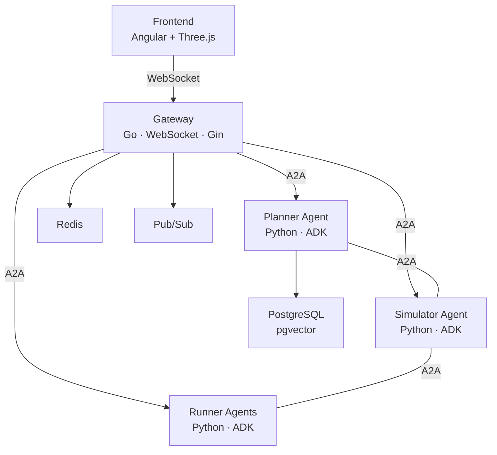
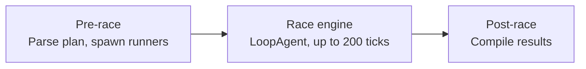

# Race Condition

[](https://github.com/GoogleCloudPlatform/race-condition/actions/workflows/ci.yml)
[](https://github.com/GoogleCloudPlatform/race-condition/blob/main/LICENSE)


A multi-agent marathon simulation built with [Google ADK](https://google.github.io/adk-docs/) and Gemini. AI agents plan routes, simulate environments, and run an autonomous marathon through Las Vegas -- all communicating over the [A2A protocol](https://github.com/google/a2a).

Demonstrated at the Google Cloud Next '26 Developer Keynote.

<p align="center">
  
</p>

## What is this?

Race Condition is a reference architecture for building multi-agent systems on Google Cloud. It models a marathon where AI agents take on different roles:

- A Planner agent designs the race course using Google Maps data, GIS tools, and financial modeling.
- A Simulator agent manages the environment: weather, traffic, crowds, and race progression tick by tick.
- Runner agents (NPCs) each make independent decisions about speed, hydration, and strategy during the race.

Agents coordinate through the Agent-to-Agent (A2A) protocol. A Go gateway routes WebSocket traffic between a 3D Angular/Three.js frontend and the Python agent backends.

Runs locally with Docker Compose (Redis, Pub/Sub emulator, PostgreSQL) and deploys to Cloud Run and Vertex AI Agent Engine.

## Get started with your AI coding assistant

The fastest way to get Race Condition running is to let your AI coding assistant do it. This repo ships with [Agent Skills](https://agentskills.io) that are auto-discovered by Claude Code, Gemini CLI, OpenCode, Cursor, GitHub Copilot, and other compatible tools.

Clone the repo and open it in your tool of choice, then ask:

**Gemini CLI**
```bash
cd race-condition
gemini
> Help me get this project running locally
```

**Claude Code**
```bash
cd race-condition
claude
> Set up this project and get the simulation running
```

**OpenCode**
```bash
cd race-condition
opencode
> I want to run this simulation locally. Walk me through the setup.
```

**Cursor / VS Code / GitHub Copilot**

Open the `race-condition` folder, then ask Copilot Chat or the AI assistant:

> Help me get Race Condition running. I have a GCP project with billing enabled.

The assistant will walk you through GCP authentication, API enablement, dependency installation, and starting the simulation. Some steps (like `gcloud auth login`) require you to act in a browser -- the assistant will tell you when.

### What the assistant knows

The repo includes three skills the assistant can load on demand:

| Skill | What it helps with |
| --- | --- |
| `getting-started` | Clone, configure GCP, install deps, run the simulation |
| `exploring-the-codebase` | Understand the architecture, design patterns, and tech stack |
| `contributing` | Set up pre-commit hooks, run tests, prepare a PR |

You can also set up manually -- see the [Quickstart](#quickstart) section below.

## Architecture



| Component | What it does |
| --- | --- |
| Gateway | Central WebSocket hub (Go/Gin). Routes requests, manages sessions, bridges frontends with agents via A2A. |
| Planner | Designs marathon routes using GIS data, Google Maps MCP tools, and financial modeling. Three variants: base, with eval (LLM-as-Judge), and with memory (AlloyDB persistence). |
| Simulator | Runs the race as a pipeline: pre-race setup, a tick-based loop engine (up to 200 ticks), and post-race analysis. Spawns and coordinates runner agents. |
| Runners | Individual NPC agents. The LLM-powered variant uses Gemini to make strategic decisions each tick. The autopilot variant is deterministic (no LLM calls). |
| Frontend | Angular 21 + Three.js app rendering a 3D Las Vegas environment with real-time runner positions, weather, and crowd reactions. |
| Infrastructure | Redis (state/pub-sub fanout), Pub/Sub emulator (telemetry streaming), PostgreSQL with pgvector (route memory and embeddings). |

## Prerequisites

Install these before you start. `make check-prereqs` will verify them for you.

| Tool | Version | What it's for | Install |
| --- | --- | --- | --- |
| Go | 1.25+ | Gateway, admin, and frontend BFF servers | [go.dev/dl](https://go.dev/dl/) |
| Python | 3.13+ | AI agents (installed and managed by uv) | [python.org](https://www.python.org/downloads/) |
| uv | latest | Python package manager, virtual env, and task runner | [docs.astral.sh/uv](https://docs.astral.sh/uv/) |
| Node.js | 24+ | Frontend (Angular), admin dashboard, tester UI | [nodejs.org](https://nodejs.org/) |
| Docker + Compose | latest | Local infrastructure: Redis, Pub/Sub emulator, PostgreSQL | [docs.docker.com](https://docs.docker.com/get-docker/) |
| Google Cloud SDK | latest | `gcloud` CLI for auth and API enablement | [cloud.google.com/sdk](https://cloud.google.com/sdk/docs/install) |

**Cost note:** The agents call Gemini models through Vertex AI, which is pay-per-use with no free tier. Each simulation run makes LLM calls for every agent on every tick, so costs scale with runner count and simulation length. Use the `runner_autopilot` variant (deterministic, zero LLM calls) to develop and test without API costs.

## Quickstart

### 1. Set up your GCP project

You need a GCP project with billing enabled where you are an Owner (or have `roles/aiplatform.user` at minimum). If you just created the project, you're already Owner.

```bash
# Log in and write Application Default Credentials in one step
gcloud auth login --update-adc

# Set your project (replace MY_PROJECT_ID everywhere below)
gcloud config set project MY_PROJECT_ID

# Enable required APIs
gcloud services enable aiplatform.googleapis.com             # Vertex AI (agent LLM calls)
gcloud services enable generativelanguage.googleapis.com     # Gemini API (GIS traffic tool)
gcloud services enable cloudresourcemanager.googleapis.com   # Required by Pub/Sub client
gcloud services enable pubsub.googleapis.com                 # Telemetry (emulated locally, but client validates the API)
gcloud services enable iam.googleapis.com                    # ADC token exchange

# Set the quota project so API calls are billed correctly
gcloud auth application-default set-quota-project MY_PROJECT_ID
```

> **Note:** API enablement can take a minute or two to propagate. If you see 403 errors on first start, wait a minute and run `make restart`.

### 2. Clone and initialize

```bash
git clone https://github.com/GoogleCloudPlatform/race-condition.git
cd race-condition

# Install everything and build (checks prereqs, creates .env, installs deps)
make init

# Set your GCP project in .env (this is what the agents actually read)
sed -i '' 's/your-gcp-project-id/MY_PROJECT_ID/g' .env  # macOS
# sed -i 's/your-gcp-project-id/MY_PROJECT_ID/g' .env   # Linux
```

The `sed` command sets `GOOGLE_CLOUD_PROJECT` and `PROJECT_ID` in `.env`. The agents read their project from this file, not from `gcloud config`.

### 3. Start the simulation

```bash
make start
```

The frontend opens at http://localhost:9119. The admin dashboard at http://localhost:9100 shows service health.

### What `make init` does

1. Checks that Go, Python, uv, Node.js, and Docker are installed.
2. Copies `.env.example` to `.env` (if `.env` doesn't exist).
3. Installs Python dependencies with `uv sync`.
4. Installs and builds the frontend and web UIs.
5. Starts Docker infrastructure (Redis, Pub/Sub emulator, PostgreSQL).
6. Builds Go services.

### What `make start` does

1. Verifies `.env` exists and no services are already running.
2. Starts Docker infrastructure.
3. Checks that all required ports are free.
4. Launches all services via [Honcho](https://github.com/nickstenning/honcho) (13 processes).
5. Logs output to `logs/simulation.log`.

Use `make stop` to shut everything down, or `make restart` to cycle.

## Google Maps API key (optional)

The Planner agent can use Google Maps MCP tools (`search_places`, `compute_routes`, `lookup_weather`) to design geographically accurate marathon routes. This requires a Google Maps API key. Without one, the planner still works but plans routes without live map data.

### Step 1: Enable the Maps APIs

Enable these APIs before creating the key -- the key restriction dropdown in the console only shows APIs that are already enabled.

```bash
gcloud services enable apikeys.googleapis.com        # API key management
gcloud services enable agentregistry.googleapis.com  # ADK discovers Maps MCP server here
gcloud services enable mapstools.googleapis.com      # Maps MCP server
gcloud services enable places.googleapis.com         # search_places tool
gcloud services enable weather.googleapis.com        # lookup_weather tool
```

> **Note:** API enablement can take a minute or two to propagate. Wait a couple minutes before creating the key.

### Step 2: Create an API key

1. Open the [Credentials page](https://console.cloud.google.com/apis/credentials) in the Google Cloud Console.
2. Click **Create credentials** > **API key**.
3. Copy the key value (you'll need it for Step 3).
4. Click **Edit API key** (or click the key name in the list).
5. Under **API restrictions**, select **Restrict key**.
6. From the dropdown, select these APIs (use the filter box to find them):
   - Cloud API Registry API
   - Maps Grounding Lite API
   - Places API (New)
   - Weather API
7. Click **Save**.

### Step 3: Add the key to your .env

```bash
GOOGLE_MAPS_API_KEY=AIza...your-key-here
```

Then restart the simulation (`make restart`).

The planner resolves the key in this order:
1. `GOOGLE_MAPS_API_KEY` environment variable (if set and non-empty).
2. Google Cloud Secret Manager: `gcloud secrets versions access latest --secret=maps-api-key --project=$GOOGLE_CLOUD_PROJECT`.
3. If neither is available, Maps tools are disabled and the planner logs a warning.

## Project structure

```
race-condition/
├── agents/                     # Python AI agents (Google ADK)
│   ├── planner/                #   Route planning with GIS + Maps MCP
│   ├── planner_with_eval/      #   + LLM-as-Judge plan evaluation
│   ├── planner_with_memory/    #   + AlloyDB route persistence
│   ├── simulator/              #   Race engine (pipeline: setup → ticks → results)
│   ├── simulator_with_failure/ #   Fault-injection test variant
│   └── npc/
│       ├── runner/             #   LLM-powered marathon runner (Gemini/Ollama/vLLM)
│       ├── runner_autopilot/   #   Deterministic runner (no LLM calls)
│       └── runner_shared/      #   Shared running + hydration logic
├── cmd/                        # Go service entry points
│   ├── gateway/                #   WebSocket hub + A2A routing
│   ├── admin/                  #   Admin dashboard server
│   ├── tester/                 #   Tester UI server
│   └── frontend/               #   Frontend BFF (serves Angular app)
├── internal/                   # Go internal packages
│   ├── hub/                    #   Session routing + WebSocket management
│   ├── ecs/                    #   Entity-Component-System for simulation state
│   ├── sim/                    #   Simulation lifecycle management
│   ├── session/                #   Session store (Redis, in-memory)
│   └── agent/                  #   A2A client + agent discovery
├── web/                        # Web frontends
│   ├── frontend/               #   Angular 21 + Three.js (3D visualization)
│   ├── admin-dash/             #   Service health dashboard (Vite)
│   ├── tester/                 #   Developer testing console (Vite + Tailwind)
│   └── agent-dash/             #   Real-time agent debug console (Chart.js)
├── gen_proto/                  # Generated protobuf code (Go + Python, committed)
├── docker-compose.yml          # Redis, Pub/Sub emulator, PostgreSQL (pgvector)
├── Dockerfile                  # Multi-stage build for all services
├── Makefile                    # Build, test, lint, run targets
├── Procfile                    # Service definitions for Honcho
└── pyproject.toml              # Python dependencies (managed by uv)
```

## Key concepts

### Agent-to-Agent (A2A) protocol

Agents discover each other through agent cards served at `/.well-known/agent-card.json`. The gateway fetches these cards at startup and routes messages to the right agent based on declared skills.

### Simulation pipeline

The simulator runs a `SequentialAgent` pipeline:



Each tick, the simulator advances the race clock, updates conditions (weather, traffic, crowd density), and broadcasts state to all runner agents. Runners respond with their decisions (accelerate, brake, hydrate).

### Runner agent variants

| Variant | Model | Cost | Use case |
| --- | --- | --- | --- |
| `runner` | Gemini 3.1 Flash Lite (default) | Low | LLM-driven strategic decisions per tick |
| `runner` (Ollama) | Gemma 4 (local) | Free | Local development without API costs |
| `runner` (vLLM/GKE) | Gemma 4 on GKE | Self-hosted | Production-scale on Kubernetes |
| `runner_autopilot` | None (deterministic) | Free | Baseline testing, no LLM calls |

Configure the runner model in `.env`:

```bash
# Gemini (default, requires Vertex AI)
RUNNER_MODEL=gemini-3.1-flash-lite-preview

# Ollama (local, free)
RUNNER_MODEL=ollama_chat/gemma4:e2b

# vLLM on GKE
RUNNER_MODEL=openai/gemma-4-E4B-it
VLLM_API_URL=http://localhost:8080/v1
```

## Services and ports

All ports are configured in `.env`. Defaults:

| Service | Port | URL |
| --- | --- | --- |
| Frontend (3D) | 9119 | http://localhost:9119 |
| Admin dashboard | 9100 | http://localhost:9100 |
| Gateway API | 9101 | http://localhost:9101 |
| Tester UI | 9112 | http://localhost:9112 |
| Agent debug console | 9111 | http://localhost:9111 |
| Planner | 9105 | |
| Planner (with eval) | 9106 | |
| Planner (with memory) | 9109 | |
| Simulator | 9104 | |
| Runner | 9108 | |
| Runner (autopilot) | 9110 | |
| Redis | 9102 | |
| Pub/Sub emulator | 9103 | |
| PostgreSQL | 9113 | |

## Common make targets

| Target | What it does |
| --- | --- |
| `make init` | One-time setup: installs deps, creates `.env`, starts infra, builds |
| `make start` | Start all services |
| `make stop` | Stop all services |
| `make restart` | Stop then start |
| `make test` | Run Go + Python + web tests |
| `make build` | Build Go services |
| `make lint` | Run Go + Python linters |
| `make fmt` | Format all code |
| `make coverage` | Generate coverage reports |
| `make eval` | Run agent evaluations (requires Gemini API) |
| `make check-prereqs` | Verify all tools are installed |

## Deployment

Race Condition runs on Google Cloud with Cloud Run (gateway, frontend BFF), Vertex AI Agent Engine (Python agents), AlloyDB (route memory, embeddings), Memorystore Redis (sessions), and Pub/Sub (telemetry).

The `Dockerfile` contains multi-stage builds for each service. See `docker-compose.yml` for the local infrastructure setup that mirrors the cloud topology.

## Testing

```bash
# Run everything
make test

# Just Go
make test-go

# Just Python (skips slow/eval tests)
make test-py

# Just web UIs
make test-web

# Agent evaluations (calls Gemini, costs money)
make eval
```

Python tests run without real GCP credentials. A root `conftest.py` patches `google.auth.default` with mock credentials so agent modules can import and run tests offline.

## Contributing

Contributions welcome. See [CONTRIBUTING.md](CONTRIBUTING.md) for the CLA process, code style, and PR guidelines.

## License

Apache 2.0. See [LICENSE](LICENSE).

## Disclaimer

This is not an officially supported Google product.
