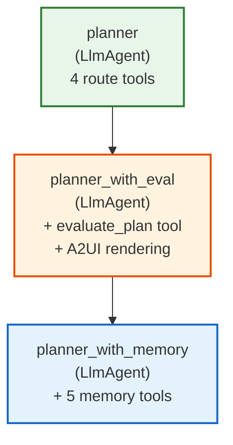

# Planner with Memory Agent

ADK-powered marathon planner with persistent route memory for cross-session
recall and iterative improvement.

## Overview

The Planner with Memory extends `planner_with_eval` with a route memory
database. It stores planned routes, records simulation outcomes against them,
and recalls past routes for comparison — enabling the agent to learn from
previous planning iterations across sessions.

## Architecture

The agent forms a 3-level inheritance chain, accumulating tools at each layer:



## Memory Tools

| Tool                | Description                              | Key Parameters                       |
| :------------------ | :--------------------------------------- | :----------------------------------- |
| `store_route`       | Persist a planned route                  | `route_data`, `evaluation_result?`   |
| `record_simulation` | Attach a simulation result to a route    | `route_id`, `simulation_result`      |
| `recall_routes`     | Query stored routes                      | `count?` (10), `sort_by?` ("recent") |
| `get_route`         | Retrieve a specific route by UUID        | `route_id`                           |
| `get_best_route`    | Get the highest-scoring route            | _(none)_                             |

All tools return structured JSON dicts per ADK tool compliance rules.

## Running Locally

Because this agent requires a database connection (via AlloyDB Auth Proxy), use the worktree environment variables to route the SQLAlchemy engine correctly.

### 1. Enable Application Default Credentials
Authenticate to allow the AlloyDB proxy to connect to the cluster:
```bash
gcloud auth login --update-adc
```

### 2. Download Proxy Binary
Ensure the proxy binary is downloaded into the repository root:
```bash
bash scripts/core/install_alloydb_proxy.sh
```

### 3. Generate Environment & Protobufs
Before compiling the Go backends or running the services, you must generate your worktree environment and the protocol buffer bindings:
```bash
# Generate .env with ALLOYDB flag for local_dev
make worktree-env SLOT=1 ALLOYDB=true

# Ensure Go protobuf plugins are installed and make the protos
go install google.golang.org/protobuf/cmd/protoc-gen-go@latest
make proto
```

### 4. Start the Agent
```bash
uv run start
```

The server listens on port **8209** by default (offset by the `SLOT` you chose).

## Configuration

| Variable                     | Required | Default                 | Description                        |
| :--------------------------- | :------- | :---------------------- | :--------------------------------- |
| `PORT`                       | No       | `8209`                  | HTTP listen port                   |
| `PLANNER_WITH_MEMORY_PORT`   | No       | `8209`                  | Fallback port variable             |
| `PLANNER_MODEL`              | No       | `gemini-3-flash-preview`| LLM model for the planner         |
| `EVALUATOR_MODEL`            | No       | `gemini-3-pro-preview`  | LLM model for evaluation judge and feedback |
| `GOOGLE_CLOUD_LOCATION`      | No       | `global`                | Gemini API region                  |

## Roadmap

| Phase | Backend              | Description                                         |
| :---- | :------------------- | :-------------------------------------------------- |
| 1     | **In-Memory** (now)  | Dict-based `RouteMemoryStore` — fast, no persistence |
| 2     | MCP Toolbox          | Swap to MCP Toolbox for AlloyDB-backed persistence  |
| 3     | Cloud Run            | Deploy as a Cloud Run service with AlloyDB backend  |
| 4     | AlloyDB + Embeddings | Vector similarity search for route recommendations  |
