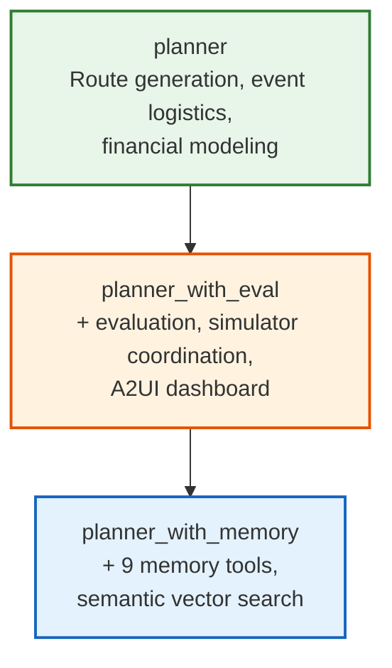

# Planner with memory

Extended planner that adds persistent route storage, simulation recording, and
semantic vector search over past runs using AlloyDB and pgvector. Inherits
route generation from the [base planner](../planner/) and evaluation from
[planner_with_eval](../planner_with_eval/).

## What it adds

The planner_with_eval produces plans and evaluates them. This variant adds
persistence and cross-session learning:

1. **Route storage**: saves planned routes with evaluation scores to AlloyDB
2. **Simulation recording**: links simulation results to routes, auto-generates
   searchable summaries
3. **Semantic recall**: vector search over past simulation summaries and local
   traffic regulations using `gemini-embedding-001` embeddings
4. **Cross-session memory**: `VertexAiMemoryBankService` accumulates learning
   across sessions via an `after_agent_callback`

## Inheritance chain

Tools accumulate at each layer:



## Memory tools

| Tool | Purpose |
|:-----|:--------|
| `store_route` | Persist route GeoJSON + evaluation to `planned_routes` |
| `record_simulation` | Link simulation results to a route, auto-store searchable summary |
| `recall_routes` | List routes sorted by recency or score |
| `get_route` | Fetch a specific route by UUID, optionally hydrate session state |
| `get_best_route` | Return the highest-scoring route |
| `get_planned_routes_data` | Batch retrieval for A2UI route list cards |
| `recall_past_simulations` | Semantic vector search over simulation summaries |
| `get_local_and_traffic_rules` | Semantic vector search over local traffic regulations |
| `store_simulation_summary` | Explicitly persist a combined prompt+result summary |

## Database schema

Four tables in AlloyDB (or local Postgres with pgvector):

| Table | Purpose | Key columns |
|:------|:--------|:------------|
| `planned_routes` | Route persistence | `route_id PK`, `route_data JSONB`, `eval_score FLOAT` |
| `simulation_records` | Simulation results linked to routes | `simulation_id PK`, `route_id FK`, `sim_result JSONB` |
| `simulation_summaries` | RAG search over past outcomes | `summary TEXT`, `embedding VECTOR(3072)`, `route_id FK` |
| `rules` | RAG search over traffic regulations | `text TEXT`, `embedding VECTOR(3072)`, `city VARCHAR` |

See [alloydb/README.md](alloydb/README.md) for full schema, setup, and RAG
query patterns.

## How cross-session learning works

### Store phase (during a session)

1. Agent plans a route -> `store_route` persists it with evaluation score
2. Agent runs simulation -> `record_simulation` persists results AND auto-
   generates a searchable summary with embeddings
3. `auto_save_memories` callback persists the full session to ADK's memory
   bank

### Recall phase (next session)

1. New query arrives -> workflow Step 2 calls `recall_past_simulations` with
   the query text
2. Vector similarity search finds the 2 most relevant past summaries
3. Agent also calls `get_local_and_traffic_rules` for regulatory context
4. Past runs and regulations inform current planning decisions

## Dual-mode embeddings

The system supports two embedding modes:

**AlloyDB (production)**: server-side embeddings via the `ai.embedding()`
SQL function. Embeddings auto-refresh on INSERT/UPDATE. No client-side
computation needed.

**Local Postgres**: client-side embeddings via Vertex AI's
`gemini-embedding-001` model. Pre-computed 3072-dimension embeddings are
included in `alloydb/seed_local.sql` for the seed data. New data gets
embeddings generated at insert time.

## Seed data

Four pre-built routes are included as JSON seeds in `memory/seeds/`:

| Route | Distance | Score |
|:------|:---------|:------|
| Strip Classic | 26.99 mi | 0.92 |
| Entertainment Circuit | 26.72 mi | 0.87 |
| Grand Loop | 26.75 mi | 0.83 |
| East Side Explorer | 27.02 mi | 0.78 |

Seeds are auto-loaded into the in-memory store on construction. For AlloyDB,
run `alloydb/seed_routes.py` or use the deployment script.

## Prompt architecture

Overrides `PLANNER_WITH_EVAL` via `PromptBuilder.override()`:

| Section | Status | Content |
|:--------|:-------|:--------|
| `role`, `rules`, `skills` | inherited | From base planner |
| `financial` | inherited | Financial modeling modes |
| `simulator`, `a2ui` | inherited | From planner_with_eval |
| `tools` | **overridden** | Adds "DO NOT HALLUCINATE TOOLS" rule |
| `workflow` | **overridden** | Triage step (recall vs new planning), parallel recall + rules lookup |
| `execution` | **overridden** | Execute-by-reference workflow for stored routes |
| `memory` | **added** | All 9 memory tools, pre-seeded plans, route list A2UI format |
| `post_simulation` | **added** | Record-keeping requirements after simulation |

## Configuration

| Variable | Default | Description |
|:---------|:--------|:------------|
| `PORT` / `PLANNER_WITH_MEMORY_PORT` | `8209` | HTTP listen port |
| `GOOGLE_CLOUD_LOCATION` | `global` | Gemini API endpoint |
| `DATABASE_URL` | -- | AlloyDB/Postgres connection string |
| `USE_ALLOYDB` | `false` | Use AlloyDB extensions (server-side embeddings) |
| `ALLOYDB_PASSWORD` | -- | DB password (or resolved via Secret Manager) |

## Running locally

### With local Postgres (no AlloyDB proxy needed)

```bash
# Start infrastructure (includes Postgres with pgvector)
docker compose up -d

# Apply schema and seed data
psql "$DATABASE_URL" -f agents/planner_with_memory/alloydb/schema_local.sql
psql "$DATABASE_URL" -f agents/planner_with_memory/alloydb/seed_local.sql

# Start the agent
uv run python -m agents.planner_with_memory.agent
```

### With AlloyDB (requires GCP auth + proxy)

```bash
gcloud auth login --update-adc
bash scripts/core/install_alloydb_proxy.sh
bash agents/planner_with_memory/alloydb/deploy_alloydb.sh
uv run python -m agents.planner_with_memory.agent
```

## File layout

```
agents/planner_with_memory/
├── agent.py                  # root_agent, A2A deployment, auto_save_memories
├── adk_tools.py              # Tool registry (eval tools + 9 memory tools)
├── prompts.py                # PromptBuilder overrides (memory, post_simulation)
├── memory/
│   ├── schemas.py            # PlannedRoute, SimulationRecord dataclasses
│   ├── store.py              # In-memory RouteMemoryStore (with seed auto-load)
│   ├── store_alloydb.py      # AlloyDBRouteStore (asyncpg, Secret Manager)
│   ├── tools.py              # 9 tool function implementations
│   ├── adk_tools.py          # FunctionTool wrappers, get_memory_tools()
│   ├── embeddings.py         # Client-side embedding generation
│   └── seeds/                # 4 pre-built route JSON files
├── services/
│   ├── memory_manager.py     # VertexAiMemoryBankService integration
│   └── session_manager.py    # A2A context_id to session_id mapping
├── alloydb/
│   ├── schema.sql            # Production DDL (4 tables)
│   ├── schema_local.sql      # Local DDL (pgvector only)
│   ├── seed_local.sql        # Pre-computed embeddings for local dev
│   ├── seed_rules.sql        # Traffic regulation chunks
│   ├── seed_routes.py        # Route seeding script
│   ├── deploy_alloydb.sh     # Full deployment automation
│   └── README.md             # Detailed setup docs
├── tests/                    # 12 test files
└── evals/
    └── test_trajectory.py    # ADK trajectory evaluation
```

## Further reading

- [AlloyDB AI](https://cloud.google.com/alloydb/docs/ai) -- server-side
  embedding and vector search
- [pgvector](https://github.com/pgvector/pgvector) -- the Postgres extension
  used for local vector search
- [Vertex AI Embeddings](https://cloud.google.com/vertex-ai/generative-ai/docs/embeddings/get-text-embeddings) --
  the embedding model used for semantic search
- The AlloyDB setup guide ([alloydb/README.md](alloydb/README.md)) covers
  schema, deployment, and RAG query patterns
