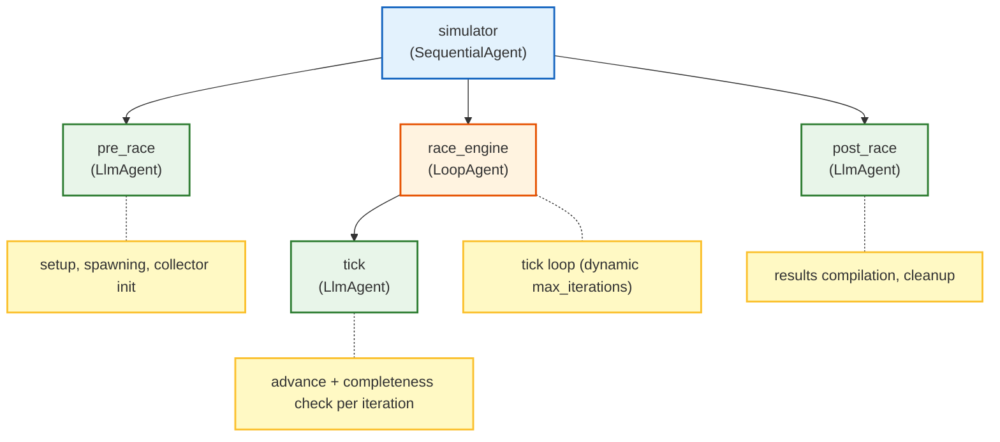

# Simulator Agent (N26 Simulation)

The Simulator Agent is a **three-phase SequentialAgent** that orchestrates the
full lifecycle of a marathon simulation — from setup through race execution to
results compilation.

## Architecture

The root agent is a `SequentialAgent` named `simulator` that executes three
sub-agents in order:



### Phase 1: Pre-Race (`pre_race`)

Parses the incoming simulation plan, configures session state, spawns runner
agents, and starts the RaceCollector for Redis PubSub telemetry.

**Model**: `gemini-3-flash-preview` (temperature 0.2)

**Tools**:
- `prepare_simulation` — parse plan parameters into session state
- `spawn_runners` — create runner agent sessions via A2A
- `start_race_collector` — start a `RaceCollector` subscribed to
  `gateway:broadcast` for runner telemetry
- `call_agent` — inter-agent A2A communication

### Phase 2: Race Engine (`race_engine` / `tick`)

A `LoopAgent` that iterates up to `max_ticks` (from session state, default 24).
Each iteration runs the `tick` LlmAgent which advances the simulation clock and
checks for completion.

**Model**: `gemini-flash-lite-latest` (temperature 0.1, zero thinking budget,
256 max output tokens — optimized for minimal-latency tick processing)

**Tools**:
- `advance_tick` — advance the simulation clock by one tick
- `check_race_complete` — evaluate whether the race has finished

### Phase 3: Post-Race (`post_race`)

Compiles final results from session state, stops the RaceCollector, and
summarizes findings.

**Model**: `gemini-3-flash-preview` (temperature 0.2)

**Tools**:
- `compile_results` — aggregate race data into final results
- `stop_race_collector` — shut down the Redis PubSub subscription
- `call_agent` — inter-agent A2A communication

## Features

- **ADK-powered**: Built on the Google Agent Development Kit (ADK) using
  `SequentialAgent`, `LoopAgent`, and `LlmAgent` composition.
- **A2A Protocol**: Communicates with Runner Agents and the Gateway via A2A
  using the `call_agent` tool.
- **RaceCollector**: Subscribes to Redis PubSub (`gateway:broadcast`) for
  real-time runner telemetry during the race phase.
- **Telemetry Attribution**: Orchestrates inter-agent communication with
  session-scoped attribution for dashboard visibility.
- **Skill Toolsets**: Each phase loads both tool functions and a `SkillToolset`
  from its skill directory for structured guidance.

## Local Execution

Run the Simulator Agent server:

```bash
.venv/bin/python3 agents/simulator/agent.py
```

The server will be available locally on port 8202.

## Configuration

| Variable         | Required | Default | Description                          |
| :--------------- | :------- | :------ | :----------------------------------- |
| `PORT`           | No       | `8202`  | HTTP server port                     |
| `SIMULATOR_PORT` | No       | `8202`  | Fallback port variable               |
| `REDIS_URL`      | No       | —       | Redis URL for RaceCollector PubSub   |
