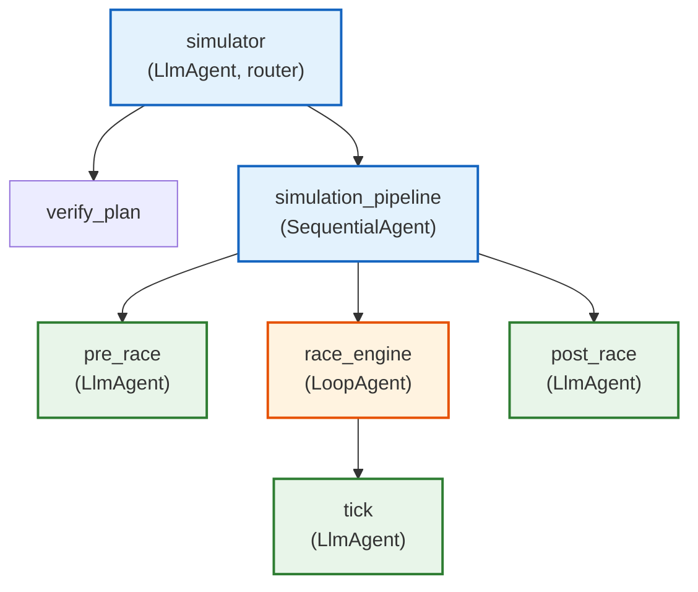

# Simulator agent

Three-phase simulation engine that orchestrates marathon races: spawns runner
agents, drives a tick-by-tick race loop, collects telemetry, and compiles
results. All three phases run deterministically without LLM calls.

## Agent topology

The root agent is an `LlmAgent` that routes requests by `action` field:
`verify` calls `verify_plan` (lightweight validation), `execute` wraps the
full `simulation_pipeline` as an `AgentTool`.



All three sub-agents use `gemini-flash-lite-latest` (temperature 0.1), but
their `before_model_callback` intercepts every invocation and issues
deterministic `FunctionCall` responses. The LLM is never called during a
simulation. The model declarations exist only because ADK requires them on
`LlmAgent`.

## Phase 1: pre-race

A five-phase state machine driven by `pre_race_callback`:

| Phase | Tool called | What happens |
|:------|:------------|:-------------|
| PREPARE | `prepare_simulation` | Parse plan JSON, compute `max_ticks`, build traffic model from route GeoJSON, load route data from Redis side-channel |
| SPAWN | `spawn_runners` | POST to gateway `/api/v1/spawn`, store `runner_session_ids` in state |
| COLLECT | `start_race_collector` | Create `RaceCollector` subscribed to Redis (or skip for direct-write runners) |
| START | `fire_start_gun` | Wait for all runners to register in simulation registry, then broadcast `START_GUN` event |
| DONE | (text) | Return summary, end agent |

Phase detection works by scanning the last `function_response` name in the
request and advancing to the next tool in sequence.

### Runner spawning

Runners are spawned via the gateway's `/api/v1/spawn` endpoint. The simulator
waits for all spawned runners to appear in the Redis simulation registry
before firing the start gun. Valid runner types:

| Type | Description |
|:-----|:------------|
| `runner_autopilot` | Deterministic, no LLM (default) |
| `runner` | LLM-powered, local |
| `runner_cloudrun` | LLM-powered, Cloud Run |
| `runner_gke` | LLM-powered, GKE |

Runner count is capped at 1000.

## Phase 2: race engine

A `LoopAgent` wrapping a `tick` agent. The loop's `max_iterations` is set
dynamically to `max_ticks + 1` (the extra iteration is for tick 0, the
initialization tick).

### Tick lifecycle

Each tick iteration is a three-phase state machine driven by `tick_callback`:

1. **ADVANCE** -- calls `advance_tick`
2. **CHECK** -- calls `check_race_complete`
3. **SUMMARIZE** -- returns text summary, ends iteration

### advance_tick in detail

This is the most complex tool in the system (~410 lines):

1. **Stale flush**: drain the collector buffer before broadcasting to discard
   leftover messages from the previous tick. Rescue any `finished` status
   results to prevent lost finishers.

2. **Broadcast**: build a `RunnerEvent(TICK)` with timing data, tick number,
   `collector_buffer_key`, and runner count. Publish to
   `simulation:{id}:broadcast` Redis channel. Finished and collapsed runners
   are excluded via `exclude_runner_ids`.

3. **Collection with early-wake drain**: during the `tick_interval` sleep
   window, drain the collector every 200ms. Track unique runners by
   `session_id`. If all active runners report early, exit the sleep. If
   runners are still missing after the sleep, enter a bounded post-sleep poll
   loop.

4. **Aggregation**: filter for `process_tick` tool_end events. Deduplicate by
   session ID. Skip stale results where `result.tick != current_tick`. Compute
   averages for velocity, water, and distance. Track finished and collapsed
   runners cumulatively.

5. **Traffic computation**: if a traffic model exists, compute per-segment
   congestion via `compute_tick_traffic()`.

6. **Snapshot**: append tick stats to `state["tick_snapshots"]`.

### check_race_complete

If `current_tick >= max_ticks`, sets `tool_context.actions.escalate = True`
to signal the LoopAgent to exit.

## Phase 3: post-race

Two tools run in sequence:

| Tool | What it does |
|:-----|:-------------|
| `compile_results` | Aggregate `tick_snapshots` into vitals trends, final status counts, notable events, sampling quality |
| `stop_race_collector` | Stop the collector, broadcast `end_simulation` event, clear simulation flags |

## Telemetry collection

Two paths for collecting runner results:

**PubSub path**: the `RaceCollector` subscribes to `gateway:broadcast`,
filters for matching runner session IDs, and buffers results in a Redis LIST.

**Direct-write path** (preferred for `runner_autopilot`): runners RPUSH
results directly to `collector:buffer:{session_id}` Redis LISTs. The tick
events include a `collector_buffer_key` so runners know where to write. This
eliminates PubSub contention at high runner counts.

Both paths converge at the `drain()` method, which does an atomic
`LRANGE + DELETE` pipeline on the Redis buffer.

## Safety guards

| Guard | Purpose |
|:------|:--------|
| `_guard_pipeline_reexecution` | Prevents the simulation pipeline from running more than once per session |
| `_configure_race_engine` | Skips the race engine entirely if pre-race failed (`simulation_ready` not set) |
| `simulation_in_progress` flag | Blocks duplicate runs from A2A retries |
| `runner_count` cap (1000) | Prevents runaway spawns |
| `stop_race_collector` clears flags | Prevents re-execution after race ends |

## Configuration

| Variable | Default | Description |
|:---------|:--------|:------------|
| `PORT` / `SIMULATOR_PORT` | `8202` | HTTP listen port |
| `REDIS_ADDR` | -- | Redis for collector, broadcast, simulation registry |
| `GATEWAY_INTERNAL_URL` / `GATEWAY_URL` | `http://localhost:8101` | Gateway for runner spawning |

## File layout

```
agents/simulator/
├── agent.py                 # Agent topology, pipeline wiring, server startup
├── broadcast.py             # publish_to_runners, wait_for_runners_ready, end_simulation
├── collector.py             # RaceCollector (Redis PubSub + buffer + drain)
├── pre_race_callback.py     # Five-phase deterministic state machine
├── tick_callback.py         # Three-phase deterministic state machine
├── skills/
│   ├── pre-race/tools.py    # prepare_simulation, spawn_runners, fire_start_gun (~410 lines)
│   ├── advancing-race-ticks/tools.py   # advance_tick, check_race_complete (~410 lines)
│   └── post-race/tools.py   # compile_results, stop_race_collector
└── tests/                   # 13 test files including stress and integration tests
```

## Testing

- **Unit tests**: tool behavior, state machine phases, broadcast envelope
  format, collector lifecycle
- **Integration test** (`test_runner_sim_integration.py`): runs 5 real
  `runner_autopilot` agents through 6 ticks, feeds actual session state to
  `advance_tick`, verifies aggregation invariants
- **Stress tests**: 50 concurrent simulations x 5 runners x 12 ticks,
  validates runners_reporting never drops, averages never zero, finished count
  monotonically increases

## Further reading

- [ADK SequentialAgent](https://google.github.io/adk-docs/agents/workflow-agents/sequential-agents/) --
  the pipeline pattern used for phase orchestration
- [ADK LoopAgent](https://google.github.io/adk-docs/agents/workflow-agents/loop-agents/) --
  the loop pattern used for the tick engine
- The runner agents ([agents/runner/](../runner/),
  [agents/runner_autopilot/](../runner_autopilot/)) are spawned and driven by
  this simulator
- The shared utilities ([agents/utils/](../utils/)) provide the dispatcher,
  communication, and telemetry infrastructure
