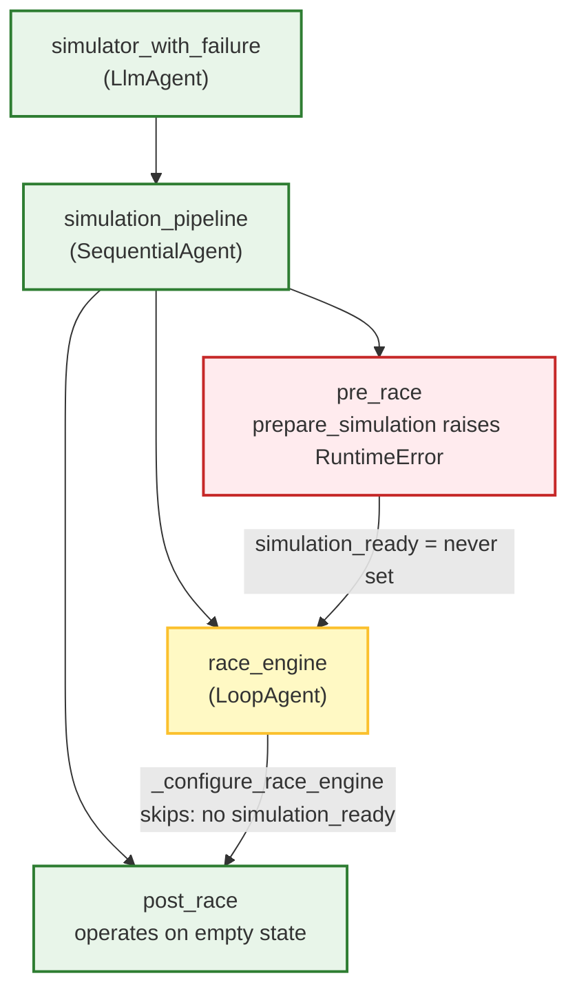

# Simulator with failure

A chaos engineering variant of the [simulator](../simulator/) that injects a
deterministic failure during pre-race setup. Used to test error propagation
through the ADK plugin system, A2A protocol, and frontend error handling.

## What it does

This agent reuses the entire base simulator architecture and surgically
replaces one tool: `prepare_simulation`. The replacement sleeps for 3 seconds
(simulating coordination latency), then raises a `RuntimeError`. Everything
else -- the root router, tick loop, post-race phase, all safety guards -- is
inherited unchanged from the base simulator.

The result: the pre-race phase fails, `simulation_ready` is never set, the
race engine is skipped entirely via its existing guard, and a structured error
propagates back through the A2A network to the caller.

## How the failure is injected

The base simulator's `get_agent()` factory accepts `pre_race_tools_override`
and `pre_race_skillset_override` parameters. This variant passes a single
failing tool:

```python
root_agent = get_agent(
    name="simulator_with_failure",
    pre_race_tools_override=failing_pre_race_tools,
    pre_race_skillset_override=failing_pre_race_skillset,
)
```

The failing `prepare_simulation`:

1. Logs that it's starting (failure variant)
2. Sleeps 3 seconds (`asyncio.sleep(3)`)
3. Raises `RuntimeError("Simulation engine failure: runner agent coordination
   timed out after 3s...")`)

No other pre-race tools (`spawn_runners`, `start_race_collector`,
`fire_start_gun`) are included because the simulation never gets past setup.

## Cascade behavior



1. `prepare_simulation` raises before setting `simulation_ready = True`
2. `_configure_race_engine` callback sees `simulation_ready` is falsy, returns
   early with "Race skipped" -- zero ticks execute
3. `post_race` still runs (SequentialAgent continues) but operates on empty
   tick snapshots

This validates that the system degrades gracefully rather than running a tick
loop with no runners, no simulation ID, and no initialized state.

## What it tests

| Behavior | Why it matters |
|:---------|:---------------|
| `tool_error` callbacks in ADK plugins | Verifies `SimulationCommunicationPlugin` reports tool failures through A2A |
| Race engine skip logic | Confirms `_configure_race_engine` guard works when `simulation_ready` is missing |
| Error propagation to caller | The planner/frontend receives a structured error, not a crash |
| 3-second realistic delay | Error handling must work with real-world latency, not instant failures |

## Differences from base simulator

| Component | Base simulator | This variant |
|:----------|:---------------|:-------------|
| Agent name | `simulator` | `simulator_with_failure` |
| Port | 8202 | 8206 |
| Pre-race tools | 5 tools (full setup pipeline) | 1 tool (always fails) |
| Pre-race callback | Deterministic 5-phase state machine | None (LLM-driven, but tool always raises) |
| Everything else | -- | Identical (inherited via `get_agent()`) |

## Configuration

| Variable | Default | Description |
|:---------|:--------|:------------|
| `PORT` / `SIMULATOR_WITH_FAILURE_PORT` | `8206` | HTTP listen port |

## File layout

```
agents/simulator_with_failure/
├── agent.py                    # get_agent() call with tool override
├── skills/
│   └── pre-race/
│       ├── SKILL.md            # Skill metadata
│       └── tools.py            # Failing prepare_simulation (sleep + raise)
└── tests/
    ├── test_agent.py           # Agent wiring, tool presence, pipeline structure
    └── test_tools.py           # Verifies 3s delay and RuntimeError
```

## Further reading

- The base simulator ([agents/simulator/](../simulator/)) provides the full
  pipeline architecture this variant extends
- The `get_agent()` factory pattern is documented in
  [agents/simulator/agent.py](../simulator/agent.py)
