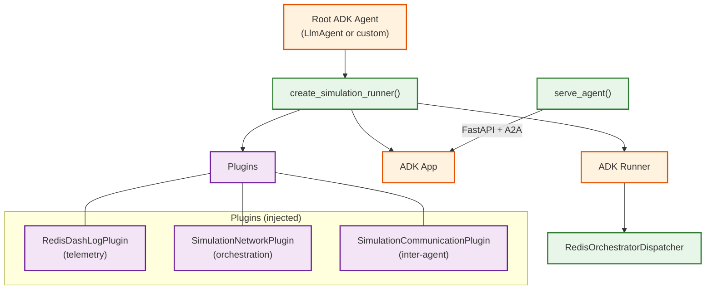

# Agent utilities

Shared Python infrastructure for all simulation agents. Every agent in the
system -- planner, simulator, runners -- imports from this package for
communication, telemetry, session management, dispatching, and serving.

## What's in here

This package has 27 modules. Rather than listing them alphabetically, here's
how they group by responsibility:

### Agent wiring

| Module | What it does |
|:-------|:-------------|
| `factory.py` | `create_simulation_runner()` -- wires an ADK agent with plugins, session service, and a `Runner`. The single entry point for assembling any agent. |
| `serve.py` | `create_agent_app()` + `serve_agent()` -- creates a FastAPI app with CORS, A2A routes, and uvicorn serving. Every agent's `__main__.py` calls this. |
| `a2a.py` | Generates `AgentCard` from `agent.json`, registers A2A protocol routes on FastAPI. Handles env var expansion in card URLs. |
| `runtime.py` | `create_services()` -- selects session/artifact/memory services based on environment variables (InMemory for local, Redis for Cloud Run, VertexAI for Agent Engine). |

### Communication

| Module | What it does |
|:-------|:-------------|
| `communication.py` | `SimulationA2AClient` -- discovers agents via the gateway, calls them with retry and transport normalization. `call_agent()` is the ADK tool all agents use for inter-agent communication. |
| `communication_plugin.py` | `SimulationCommunicationPlugin` -- ADK plugin that manages per-invocation A2A client lifecycle. |
| `pulses.py` | High-throughput gateway message emission. 16 background workers drain a bounded queue and batch-publish protobuf messages via Redis pipelines. |

### Dispatching

| Module | What it does |
|:-------|:-------------|
| `dispatcher.py` | `RedisOrchestratorDispatcher` -- background thread with its own event loop. Listens on Redis Pub/Sub (broadcast events) and Redis Lists (8 sharded spawn queues) simultaneously. Routes events to the ADK runner with per-session locking. |
| `simulation_plugin.py` | `SimulationNetworkPlugin` -- ADK plugin that manages the dispatcher lifecycle (start on runner set, stop on close). |

### Telemetry

| Module | What it does |
|:-------|:-------------|
| `plugins.py` | `BaseDashLogPlugin`, `DashLogPlugin`, `RedisDashLogPlugin` -- ADK lifecycle plugins that emit telemetry for every agent/tool/model event. Publishes to Pub/Sub for debug logs and Redis for frontend delivery. Extracts A2UI blocks from tool results. |

### Session management

| Module | What it does |
|:-------|:-------------|
| `session_manager.py` | `SessionManager` -- maps A2A context IDs to Vertex AI session IDs with L1 (in-process `TTLCache`) and L2 (Redis) caching. Needed because Vertex AI generates its own session IDs. |
| `simulation_registry.py` | Distributed session-to-simulation mapping with L1 dict + Redis L2. Also tracks the reverse mapping from Vertex session IDs to spawn UUIDs. |
| `pruned_session_service.py` | `PrunedRedisSessionService` -- wraps ADK's `RedisSessionService` to cap stored events per session, preventing Redis blob growth. |

### Simulation engine

| Module | What it does |
|:-------|:-------------|
| `simulation_executor.py` | `SimulationExecutor` -- custom A2A executor replacing ADK's default. Bridges simulation/session IDs, handles orchestration events in callable mode, and deduplicates concurrent executions via Redis NX locks. |
| `runner_protocol.py` | `RunnerEvent` dataclass and parser for the structured event format agents use to communicate tick data (velocity, distance, hydration, etc). |
| `runner_types.py` | Constants for runner agent type names (`RUNNER_AUTOPILOT`, `RUNNER_CLOUDRUN`, etc). |
| `sim_defaults.py` | Default simulation parameters (duration, tick interval, max ticks) with env-var-driven overrides. |
| `traffic.py` | Route analysis: haversine distance, segment indexing, closed/affected segment identification, per-tick congestion computation. |
| `simdata.py` | Redis side-channel for large simulation data (route GeoJSON, traffic assessments) that doesn't fit in session state. |

### Configuration and models

| Module | What it does |
|:-------|:-------------|
| `config.py` | `.env` loading, `require()` and `optional()` env var helpers. |
| `env.py` | `configure_project_env()` -- normalizes GCP project env vars for Vertex AI compatibility. |
| `global_gemini.py` | `GlobalGemini` -- Gemini model subclass that routes to the `global` endpoint, required for Gemini 3 preview models. |
| `retry.py` | `resilient_model()` -- wraps `GlobalGemini` with retry config (exponential backoff for Gemini API calls). |
| `redis_pool.py` | `get_shared_redis_client()` -- process-wide singleton Redis connection pool. |
| `prompt_builder.py` | `PromptBuilder` -- immutable, section-based prompt composition with override support. |

### UI components

| Module | What it does |
|:-------|:-------------|
| `a2ui.py` | A2UI v1.0 component builder. 18 primitive property builders + `Surface` class for composing UI component trees that agents deliver to the frontend. |
| `deployment.py` | `create_a2a_deployment()` -- factory for Agent Engine deployment artifacts. |

## How agents are assembled

Every agent follows the same wiring pattern through `factory.py`:



1. Agent defines a `root_agent` (ADK `LlmAgent` or custom agent)
2. `create_simulation_runner()` wraps it with three plugins and an `App`
3. `create_services()` selects the right session/artifact services for the
   runtime (local, Cloud Run, or Agent Engine)
4. `serve_agent()` mounts the app on FastAPI with A2A routes and starts uvicorn
5. The `SimulationNetworkPlugin` creates a `RedisOrchestratorDispatcher` that
   starts listening on Redis for orchestration events

## Dispatcher: the agent event loop

The `RedisOrchestratorDispatcher` is the most complex component. It runs in a
background thread with its own `asyncio` event loop and does two things
concurrently:

1. **Pub/Sub listener**: subscribes to `simulation:broadcast` and
   simulation-scoped channels for broadcast events
2. **Queue listener**: `BLPOP` on 8 sharded spawn queues (matching the
   gateway's `SpawnQueueName` hashing) for spawn events

If either listener exits (Redis pool exhaustion, connection drop), both are
cancelled and restarted together.

Events are routed by type: `spawn_agent` triggers a new agent run,
`broadcast` fan-outs to all sessions, `environment_reset` clears state,
`a2ui_action` routes to the owning session.

Per-session `asyncio.Lock` serializes concurrent events for the same session
while allowing full concurrency across sessions.

## Telemetry pipeline

The `RedisDashLogPlugin` hooks into every ADK lifecycle callback:

```
before_agent → before_model → after_model → before_tool → after_tool → after_agent
```

Each callback emits a protobuf `gateway.Wrapper` message via `pulses.py`,
which batches messages through a 16-worker pool publishing to Redis. The
gateway's switchboard picks these up and fans them out to WebSocket clients.

Tool results are inspected for A2UI JSON blocks, which are extracted and
emitted as separate `msg_type="a2ui"` messages for the frontend renderer.

## Service selection at runtime

`create_services()` in `runtime.py` picks services based on what's available
in the environment:

| Condition | Session service | Target |
|:----------|:----------------|:-------|
| `SESSION_STORE_OVERRIDE=inmemory` | `InMemorySessionService` | Any |
| `SESSION_STORE_OVERRIDE=redis` | `PrunedRedisSessionService` | Any |
| `AGENT_ENGINE_ID` set | `VertexAiSessionService` | Agent Engine |
| `DATABASE_URL` set | `DatabaseSessionService` | Cloud Run |
| None of the above | `InMemorySessionService` | Local dev |

## File layout

```
agents/utils/
├── __init__.py                # Skill/tool discovery and loading
├── a2a.py                     # AgentCard generation, A2A route registration
├── a2ui.py                    # A2UI v1.0 component builders
├── communication.py           # SimulationA2AClient, call_agent() tool
├── communication_plugin.py    # Per-invocation A2A client lifecycle
├── config.py                  # .env loading, require/optional helpers
├── deployment.py              # Agent Engine deployment factory
├── dispatcher.py              # RedisOrchestratorDispatcher (~700 lines)
├── env.py                     # GCP project env var normalization
├── factory.py                 # create_simulation_runner() agent wiring
├── global_gemini.py           # GlobalGemini model (global endpoint)
├── plugins.py                 # DashLogPlugin telemetry (~660 lines)
├── prompt_builder.py          # Section-based prompt composition
├── pruned_session_service.py  # Capped Redis session storage
├── pulses.py                  # Batched protobuf emission via worker pool
├── redis_pool.py              # Singleton Redis connection pool
├── retry.py                   # Gemini API retry configuration
├── runner_protocol.py         # RunnerEvent format (parse/build/serialize)
├── runner_types.py            # Runner type constants
├── runtime.py                 # Env-driven session service factory
├── serve.py                   # FastAPI app creation + uvicorn serving
├── session_manager.py         # Vertex AI session ID mapping with L1/L2 cache
├── sim_defaults.py            # Default simulation parameters
├── simdata.py                 # Redis side-channel for large data
├── simulation_executor.py     # Custom A2A executor (~500 lines)
├── simulation_plugin.py       # Dispatcher lifecycle plugin
├── simulation_registry.py     # Session-to-simulation distributed mapping
├── traffic.py                 # Route analysis and congestion computation
└── tests/                     # 23 test files
```

## Further reading

- [Google ADK](https://google.github.io/adk-docs/) -- the Agent Development
  Kit that provides the plugin and runner infrastructure
- [A2A protocol](https://google.github.io/A2A/) -- the agent-to-agent
  communication standard
- The gateway ([cmd/gateway/](../../cmd/gateway/)) is the hub that routes
  events between agents
- The hub package ([internal/hub/](../../internal/hub/)) handles the Redis
  Pub/Sub relay that agents publish to
