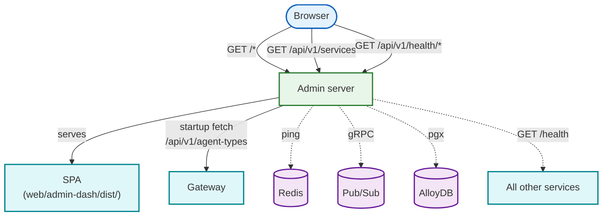

# Admin dashboard server

Go service that hosts the admin dashboard SPA and monitors the health of every
service and infrastructure component in the simulation. It has no simulation
logic of its own -- it's a monitoring portal.

## What it does

The admin server has three jobs:

1. **Serve the SPA**: hosts the pre-built `web/admin-dash/` Vite app as static
   files with SPA fallback routing (any unmatched GET without a file extension
   returns `index.html`)

2. **Build a service registry**: at startup, fetches the agent catalog from the
   gateway's `/api/v1/agent-types` endpoint and merges it with a hardcoded list
   of infrastructure services. The SPA renders this as a grid of service cards.

3. **Run health checks**: pings Redis, Pub/Sub, and AlloyDB directly, and
   probes every registered service's `/health` endpoint concurrently. Agent
   Engine agents get authenticated health checks using GCP Application Default
   Credentials.



## API

| Method | Path | Description |
|:-------|:-----|:------------|
| `GET` | `/health` | Basic health probe (`{"status":"ok","service":"admin"}`) |
| `GET` | `/api/v1/services` | Full service registry with categories and metadata |
| `GET` | `/api/v1/health/infra` | Redis, Pub/Sub, AlloyDB connectivity status |
| `GET` | `/api/v1/health/services` | Concurrent `/health` probe of all registered services |
| `GET` | `/config.js` | Runtime `window.ENV = {...}` with all service URLs |

## Service registry

The registry organizes services into five categories:

| Category | Services |
|:---------|:---------|
| Admin & System | admin, gateway |
| Core Infrastructure | redis, pubsub, alloydb |
| AI Agents | (discovered from gateway at startup) |
| Developer UIs | tester, dash |
| Frontend | frontend-app, frontend-bff |

Static services use hardcoded port defaults that can be overridden via
environment variables (e.g., `GATEWAY_URL`). AI agents are discovered
dynamically from the gateway's agent catalog. Agent Engine agents are detected
by checking if their URL contains `aiplatform.googleapis.com`.

The registry is fetched once at startup and cached for the lifetime of the
process. Restarting the admin server refreshes the agent list.

## Health checking

### Infrastructure (`/api/v1/health/infra`)

| Component | Method | Connection |
|:----------|:-------|:-----------|
| Redis | `client.Ping()` | Direct go-redis client |
| Pub/Sub | `TopicAdminClient.GetTopic()` | Lazy gRPC, auto-reconnects on failure |
| AlloyDB | `pgx.Ping()` | Lazy PostgreSQL, auto-reconnects on failure |

Both Pub/Sub and AlloyDB use a **lazy, self-healing connection** pattern:
the connection is established on the first health check call, protected by a
mutex. If the connection fails, it's cleared and retried on the next call.

In emulator mode (`PUBSUB_EMULATOR_HOST` set), the Pub/Sub checker uses
insecure gRPC and proactively creates the topic if it doesn't exist.

### Service health (`/api/v1/health/services`)

Checks all registered services concurrently (up to 10 goroutines) by hitting
their `/health` endpoint. Agent Engine agents use GCP OAuth2 access tokens
via `google.DefaultClient`. Each check has a 5-second timeout.

## SPA hosting

The admin server serves files from `./web/admin-dash/dist/`:

- `/assets/*` -- hashed JS/CSS bundles (Vite output)
- `/favicon.ico` -- static file
- `/*` (catch-all) -- `index.html` for SPA client-side routing

The SPA loads `/config.js` before its main script. This dynamically generated
file injects `window.ENV` with URLs for the gateway, agents, and other
services, so the SPA knows where to find everything without build-time
configuration.

The SPA calls the **gateway** directly (via `window.ENV.GATEWAY_URL`) for
write operations like environment reset. The admin server itself is read-only.

## Configuration

| Variable | Default | Description |
|:---------|:--------|:------------|
| `PORT` / `ADMIN_PORT` | `8000` | HTTP listen port |
| `REDIS_ADDR` | -- | Redis address for health checks |
| `PUBSUB_EMULATOR_HOST` | -- | Pub/Sub emulator (triggers insecure gRPC) |
| `PUBSUB_PROJECT_ID` / `PROJECT_ID` | -- | GCP project for Pub/Sub topic |
| `PUBSUB_TOPIC_ID` | -- | Topic name to check/create |
| `DATABASE_URL` | -- | AlloyDB/PostgreSQL connection string |
| `GATEWAY_INTERNAL_URL` / `GATEWAY_URL` | `http://127.0.0.1:8101` | Gateway for agent discovery |
| `CORS_ALLOWED_ORIGINS` | `*` | Allowed CORS origins |

Service URL variables injected into `config.js`: `GATEWAY_URL`,
`SIMULATOR_URL`, `PLANNER_URL`, `TESTER_URL`, `ADMIN_URL`, `DASH_URL`,
`FRONTEND_APP_URL`, `FRONTEND_BFF_URL`.

## File layout

```
cmd/admin/
├── main.go       # Server, service registry, health checkers, SPA hosting
└── main_test.go  # Tests for all endpoints, health states, AE detection
```

## Running locally

```bash
# Build the SPA first
cd web/admin-dash && npm run build

# Then start the server
go run ./cmd/admin

# Or via Honcho (builds are handled separately)
honcho start admin
```

## Further reading

- The admin dashboard SPA ([web/admin-dash/](../../web/admin-dash/)) is the
  frontend this server hosts
- The gateway ([cmd/gateway/](../gateway/)) provides the agent catalog that
  populates the service registry
- [pgx](https://github.com/jackc/pgx) -- PostgreSQL driver used for AlloyDB
  health checks
