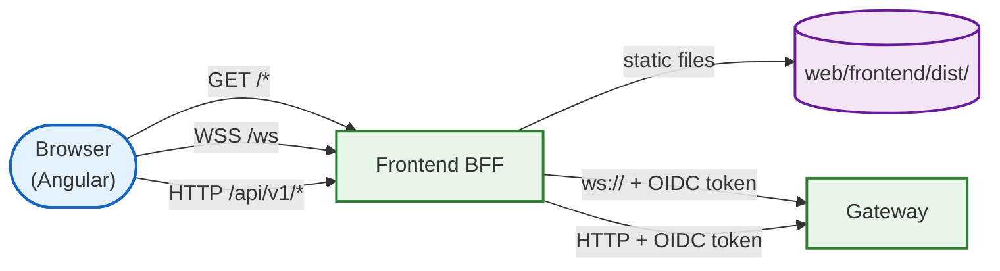

# Frontend BFF

The frontend BFF (Backend-for-Frontend) sits between the Angular frontend and
the simulation gateway. It serves static assets, proxies API and WebSocket
traffic, and handles authentication -- so the browser only ever talks to one
origin.

## Why a BFF?

Without the BFF, the Angular app would need to know the gateway's internal URL,
handle CORS, and manage authentication tokens in the browser. The BFF
eliminates all three problems:

- **Same-origin**: the frontend, API, and WebSocket all live on the same host
  and port, so CORS is unnecessary
- **Server-side auth**: OIDC tokens for service-to-service communication are
  attached by the BFF, never exposed to the browser
- **Header hygiene**: IAP-injected `x-goog-*` headers are stripped from proxied
  requests, preventing header spoofing
- **Runtime configuration**: `config.js` is generated at startup with relative
  URLs, so the same Angular build works in every environment



## What gets proxied

### REST API (`/api/v1/*`)

All HTTP methods on `/api/v1/*` are forwarded to `GATEWAY_URL/api/v1/*`.
The proxy:

- Strips `Host`, `Authorization`, and all `x-goog-*` headers from the
  outbound request
- Attaches a Google OIDC `Authorization: Bearer` token (no-op if
  `IAP_CLIENT_ID` is empty)
- Preserves query strings, request body, and all other headers
- Forwards the gateway's response (status, headers, body) unchanged

A shared `http.Client` pools connections to the gateway (100 max idle, 20 per
host, 90s idle timeout, 30s request timeout).

### WebSocket (`/ws`)

The WebSocket proxy upgrades the connection and forwards frames
bidirectionally using
[koding/websocketproxy](https://github.com/koding/websocketproxy). The
director function strips `x-goog-iap-*` headers and attaches OIDC tokens,
same as the REST proxy.

### Static files (catch-all)

Unmatched GET requests serve files from `./web/frontend/dist/`. In dev mode
(when `FRONTEND_DEV_URL` is set), they proxy to the Angular dev server
instead, enabling live reload.

## Dual mount points

Every route exists at both `/` and `/frontend/`:

```
/health           /frontend/health
/config.js        /frontend/config.js
/ws               /frontend/ws
/api/v1/*         /frontend/api/v1/*
```

This supports Cloud Run path-based routing where the BFF might be mounted
at `/frontend/` behind a shared load balancer. `GET /frontend` (no trailing
slash) redirects to `/frontend/`.

## Runtime configuration

`GET /config.js` returns:

```javascript
window.ENV = {
  "NG_APP_GATEWAY_URL": "/ws",
  "NG_APP_GATEWAY_ADDR": ""
};
```

Both values are relative/empty, meaning the Angular app always connects to
its own origin. The BFF handles the rest. No rebuild needed when deploying
to a new environment.

## Local development

For live-reload development with the Angular dev server:

```bash
# Terminal 1: Angular dev server
cd web/frontend && npm start

# Terminal 2: BFF pointing at the dev server
FRONTEND_DEV_URL=http://localhost:4200 go run ./cmd/frontend
```

The BFF proxies unmatched requests to the Angular dev server while still
routing `/api/v1/*` and `/ws` to the gateway. The `/frontend/` prefix is
stripped before proxying to the dev server.

## Configuration

| Variable | Default | Description |
|:---------|:--------|:------------|
| `PORT` | `8080` | HTTP listen port (set to `8502` via `.env`) |
| `GATEWAY_INTERNAL_URL` | -- | Internal gateway URL (highest priority) |
| `GATEWAY_URL` | `http://localhost:8101` | Gateway URL (fallback) |
| `IAP_CLIENT_ID` | -- | OAuth client ID for OIDC token generation |
| `FRONTEND_DEV_URL` | -- | Angular dev server URL (enables dev proxy) |

Gateway URL resolution: `GATEWAY_INTERNAL_URL` > `GATEWAY_URL` >
`http://localhost:8101`.

## File layout

```
cmd/frontend/
├── main.go       # Router, WS proxy, API proxy, static serving, dev proxy
└── main_test.go  # Health, config.js, WS binary frames, API proxy, dev proxy
```

## Further reading

- [BFF pattern](https://samnewman.io/patterns/architectural/bff/) -- Sam
  Newman's original description of Backends for Frontends
- [koding/websocketproxy](https://github.com/koding/websocketproxy) --
  WebSocket proxy library
- The Angular frontend ([web/frontend/](../../web/frontend/)) is the SPA
  this BFF serves
- The gateway ([cmd/gateway/](../gateway/)) is the upstream for all proxied
  traffic
