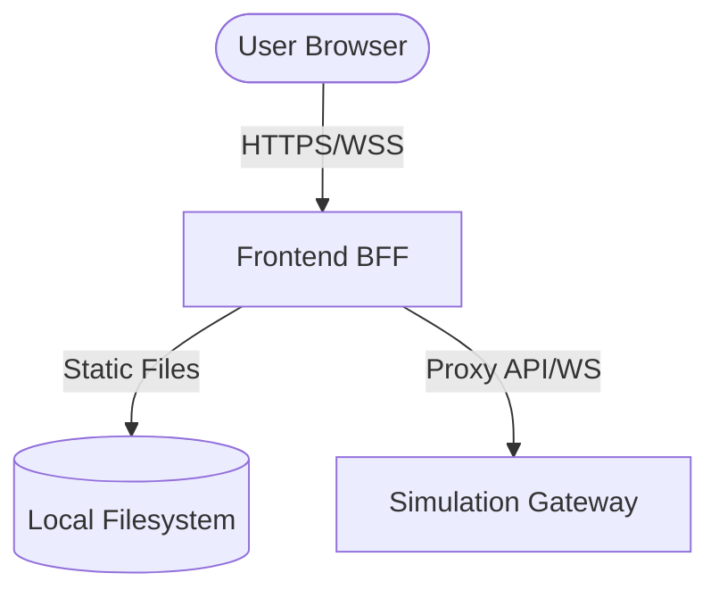

# Frontend BFF Subservice

The Frontend BFF (Backend-for-Frontend) is the entry point for the system's
primary user interface. It is designed for horizontal scaling on **Google Cloud
Run** and provides a secure bridge between the Angular frontend and the
simulation gateway.

## Role

- **Static Asset Hosting**: Serves the built Angular frontend from
  `./web/frontend/dist`.
- **API Proxy**: Securely proxies REST calls to the Gateway
  (`/api/v1/*` -> `GATEWAY_URL/api/v1/*`).
- **WebSocket Proxy**: Proxies real-time telemetry and A2UI traffic
  (`/ws` -> `GATEWAY_URL/ws`).
- **Identity & Auth**: Attaches OIDC tokens for service-to-service
  communication and integrates with IAP (Identity-Aware Proxy).

## Local Development

The BFF is configured to serve the Angular application. For local development,
you can run both the frontend and the BFF.

1. **Angular Dev Server**: Run `npm start` in the `../frontend` repository.
2. **BFF Go Server**: Run `go run cmd/frontend/main.go` from the `backend`
   repository.

### Environment Variables

- `PORT`: The local port to listen on (default: `8080`).
- `GATEWAY_URL`: The URL of the simulation gateway (default:
  `http://localhost:8101`).
- `IAP_CLIENT_ID`: (Optional) The OAuth client ID for OIDC token generation in
  cloud environments.

## Architecture

The BFF uses **Gin** for routing and **websocketproxy** for transparent
WebSocket forwarding.



## Build & Deployment

The BFF is included in the unified backend container image and built using the
`scripts/deploy/deploy.py` tool.

```bash
# Build and deploy the frontend service to dev
python3 scripts/deploy/deploy.py frontend --build --env dev
```
