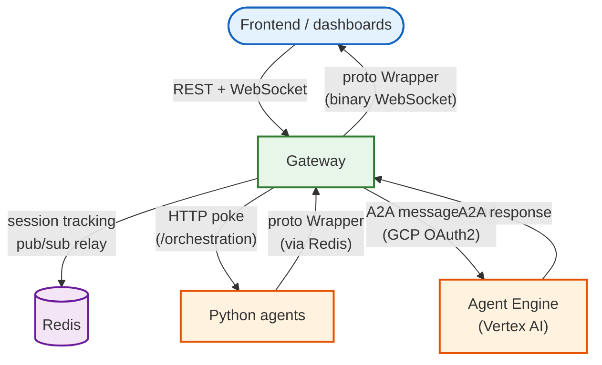

# Gateway

The gateway is the single entry point for all client communication. Every REST
call, every WebSocket connection, and every agent orchestration event flows
through this service. It coordinates session tracking, agent discovery,
spawn orchestration, and real-time event delivery.

## What it does

The gateway connects three worlds: browser clients (frontend, dashboards),
Python AI agents (planner, simulator, runners), and infrastructure (Redis,
GCP Pub/Sub). Clients talk to the gateway over HTTP and WebSocket. The gateway
talks to agents via HTTP poke or A2A JSON-RPC. Redis handles cross-instance
coordination.



## API reference

### Health and configuration

| Method | Path | Description |
|:-------|:-----|:------------|
| `GET` | `/health` | Informational probe. Always 200. Reports Redis and Pub/Sub status. |
| `GET` | `/healthz` | Strict probe for load balancers. Returns 503 if Redis is unreachable. |
| `GET` | `/config` | Returns `{"max_runners": N}`. |

### Agent discovery

| Method | Path | Description |
|:-------|:-----|:------------|
| `GET` | `/api/v1/agent-types` | Fetches agent cards from all configured `AGENT_URLS` and returns them as a map. Cards are cached for 30 seconds. |

### Session management

| Method | Path | Description |
|:-------|:-----|:------------|
| `GET` | `/api/v1/sessions` | Lists all active session IDs. |
| `POST` | `/api/v1/sessions` | Spawns a single agent session. Body: `{"agentType", "userId", "simulation_id?"}`. Returns `201` with `{"sessionId", "status": "pending"}`. |
| `POST` | `/api/v1/sessions/flush` | Clears all sessions from the registry. Returns count. |
| `POST` | `/api/v1/spawn` | Batch spawn. Body: `{"agents": [{"agentType", "count"}], "simulation_id?"}`. Validates types, enforces `MAX_RUNNERS`, batch-tracks and batch-enqueues in single Redis pipelines. |

### Simulation management

| Method | Path | Description |
|:-------|:-----|:------------|
| `GET` | `/api/v1/simulations` | Lists all active simulation IDs. |
| `POST` | `/api/v1/environment/reset` | Selective reset. Body: `{"targets?": ["sessions", "queues", "maps", "pubsub"]}`. Notifies all agents before clearing state. |

### Orchestration

| Method | Path | Description |
|:-------|:-----|:------------|
| `POST` | `/api/v1/orchestration/push` | Receives GCP Pub/Sub push messages containing `gateway.Wrapper` protos. Dispatches to the appropriate agent based on `Origin.Id`. |

## WebSocket protocol

### Connecting

```
ws://localhost:8101/ws?sessionId=abc-123&simulationId=sim-456
```

- `sessionId` identifies the client for targeted message routing
- `simulationId` (optional) auto-subscribes to a simulation's event stream
- An empty `sessionId` (`""`) creates a **global observer** that receives all
  messages (used by dashboards)

### Inbound messages (client to gateway)

**Binary frames** are parsed as `gateway.Wrapper` protobuf:

- **`type: "broadcast"`**: the gateway broadcasts to all instances via Redis
  Pub/Sub, then resolves target session IDs from the inner `BroadcastRequest`
  to agent types and dispatches targeted events
- **`type: "a2ui_action"`**: the gateway looks up which agent owns the
  session and dispatches the action to that specific agent

**Text frames** are parsed as JSON for simulation subscription management:

```json
{"type": "subscribe_simulation", "simulation_id": "sim-456"}
{"type": "unsubscribe_simulation", "simulation_id": "sim-456"}
```

### Outbound messages (gateway to client)

All outbound messages are **binary** `gateway.Wrapper` protobuf frames. The
hub routes them based on three criteria:

1. **Destination/SessionId** in the wrapper targets specific sessions
2. **SimulationId** routes to clients subscribed to that simulation
3. Messages with neither are broadcast to all connected clients

## Spawn flow

### Single spawn (`POST /api/v1/sessions`)

1. Generate UUID session ID
2. Track session in Redis registry (session -> agent type + simulation ID)
3. Enqueue `spawn_agent` event to a sharded Redis queue
4. Return `201` with session ID

### Batch spawn (`POST /api/v1/spawn`)

1. Validate all agent types exist in the catalog
2. Enforce `MAX_RUNNERS` cap (proportional scaling if over limit)
3. **One pipeline** to batch-track all sessions in Redis
4. **One pipeline** to batch-enqueue all spawn events
5. Poke agents based on dispatch mode:
   - **Subscriber agents**: one poke per agent type (they share a Redis queue)
   - **Callable agents**: one poke per session (no queue listener)

The sharded spawn queue distributes events across 8 sub-queues using FNV-1a
hashing on session ID, preventing competing-consumer hotspots when multiple
dispatcher instances `BLPOP`.

## Environment reset

The reset endpoint (`POST /api/v1/environment/reset`) accepts a list of
targets to clear selectively:

| Target | What it clears |
|:-------|:---------------|
| `sessions` | All session tracking keys via `registry.Flush()` |
| `queues` | All `simulation:spawns:*` Redis keys |
| `maps` | All `session_map:*` Redis keys |
| `pubsub` | Seeks GCP Pub/Sub subscriptions to "now" (discards stale messages) |

The reset captures which agent types are active **before** flushing, then
notifies each agent type **after** flush. Without this ordering, callable
agents on Agent Engine would miss the reset notification because the registry
is empty post-flush.

## Startup sequence

1. Load configuration from `.env`
2. Connect to Redis (pool size 50, min idle 10)
3. Create Hub with Redis-backed subscription store and 16 remote workers
4. Create session registry (`RedisSessionRegistry`, 2-hour TTL)
5. Parse `AGENT_URLS`, create agent catalog
6. Create Switchboard with session-aware routing
7. Start Hub event loop and Switchboard Redis listener
8. Start session reaper (30-minute interval)
9. Wire HTTP routes and start Gin server
10. Wait for SIGINT/SIGTERM, then graceful 10-second drain

## Configuration

| Variable | Default | Description |
|:---------|:--------|:------------|
| `PORT` / `GATEWAY_PORT` | `8101` | HTTP listen port |
| `REDIS_ADDR` | (required) | Redis connection address |
| `AGENT_URLS` | (required) | Comma-separated agent base URLs |
| `MAX_RUNNERS` | `100` | Max runners per spawn batch (clamped to 1-1000) |
| `HOSTNAME` | `"local-gw"` | Gateway instance ID for logging |
| `REAP_INTERVAL` | `30m` | Session registry garbage collection interval |
| `CORS_ALLOWED_ORIGINS` | `""` | Allowed CORS origins (empty = allow all) |

## File layout

```
cmd/gateway/
├── main.go                # Router setup, all endpoint handlers, startup/shutdown
├── main_test.go           # Unit tests (~1900 lines, ~50 test functions)
├── protocol_test.go       # MockSwitchboard, binary message tests
├── testhelpers_test.go    # Shared test infrastructure (mock agents, Redis helpers)
├── integration_test.go    # Integration tests requiring Docker Redis (~1340 lines)
├── bdd_test.go            # Godog/Cucumber BDD harness
└── features/
    ├── gateway_health.feature
    ├── gateway_sessions.feature
    ├── gateway_spawn.feature
    ├── gateway_orchestration.feature
    └── gateway_simulator.feature
```

## Testing strategy

The gateway has three test layers:

- **Unit tests** (`main_test.go`): mock switchboard, in-memory registry,
  httptest agent servers. Cover every endpoint, dispatch mode, edge case.
  Include a cross-boundary contract test that verifies spawn event payloads
  use snake_case keys (`simulation_id`) since the Python dispatcher reads
  them with `payload.get("simulation_id")`.

- **Integration tests** (`integration_test.go`): require Docker Redis. Cover
  end-to-end session-aware routing, simulation isolation, batch operations
  against real Redis pipelines.

- **BDD tests** (`bdd_test.go` + `.feature` files): Gherkin scenarios for
  health, sessions, spawn, orchestration, and simulator discovery. Readable
  specifications that double as documentation.

## Design decisions

**Single `setupRouter()` function.** All route wiring happens in one function
that takes all dependencies as parameters. This makes it trivial to construct
the full router in tests with mocked or real dependencies.

**Dispatch mode from agent cards.** Rather than hard-coding which agents are
subscriber vs callable, the gateway reads the `n26:dispatch/1.0` extension
from each agent's card. Add a new agent and the gateway adapts automatically.

**Pre-flush snapshot for reset.** The environment reset handler captures
`ActiveAgentTypes()` before flushing, then pokes each type after flush.
This ensures all agents learn about the reset even though the registry is
empty by the time notifications go out.

**Pipeline batching for spawn.** A 500-runner spawn generates ~3000 Redis
commands (6 per session). Without pipelining, that's 3000 round-trips.
`BatchTrackSessions` and `BatchEnqueueOrchestration` reduce this to 2 round-
trips total.

## Further reading

- [Gin web framework](https://github.com/gin-gonic/gin) -- HTTP router
- [gorilla/websocket](https://github.com/gorilla/websocket) -- WebSocket
  protocol
- [Protocol Buffers](https://protobuf.dev/) -- wire format
  (see [gen_proto/gateway/](../../gen_proto/gateway/))
- The hub package ([internal/hub/](../../internal/hub/)) handles WebSocket
  fan-out and Redis relay
- The session package ([internal/session/](../../internal/session/)) provides
  the distributed registry
- The agent package ([internal/agent/](../../internal/agent/)) handles catalog
  discovery
