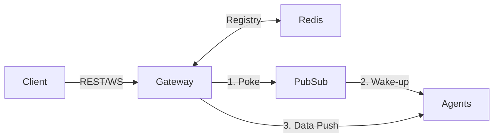

# Gateway Subservice

The Gateway is the central API and WebSocket hub for the racing simulator. It is
designed for horizontal scaling on **Google Cloud Run**.

## Role

- **Edge Entry Point**: The primary ingress for all frontend and tester
  communications.
- **Agent Discovery**: Provides a central catalog of available simulation
  agents.
- **Session Orchestration**: Routes spawning and broadcast events between
  frontends and Python-based agents.

## API Reference (v1)

### Agent Discovery

`GET /api/v1/agent-types` Returns a map of available agent types and their
metadata.

### Session Management

`GET /api/v1/sessions` Lists all active simulation sessions.

`POST /api/v1/sessions` Spawns a new simulation agent and starts a session.

- **Payload**: `{"agentType": "string", "userId": "string"}`
- **Response**: `{"sessionId": "uuid", "status": "pending"}`

`POST /api/v1/sessions/flush` Clears all active sessions from the registry
(Developer/Test only).

### A2A Brokerage

`ANY /a2a/{agent_name}/*` Proxies A2A requests to the registered endpoints of
specific agents (e.g., `/a2a/runner/get_vitals`).

## WebSocket Protocol (`/ws?sessionId=...`)

The Gateway is physically multi-protocol, handling both **NDJ (Newline-Delimited
JSON)** and **Binary Protobuf** frames.

### Handshake

Clients MUST connect with a `sessionId` query parameter to enable targeted
routing.

```http
ws://[HOST]:8101/ws?sessionId=user-123
```

### 1. Binary Protobuf (Bi-Directional)

Used for complex agent-to-user (A2UI) updates and narrative.

#### Outgoing from Gateway

Agents emit binary updates wrapped in a `gateway.Wrapper` envelope. Found in
`gen_proto/gateway/gateway.proto`.

- **Frame Type**: `BinaryMessage`
- **Fields**: `type` (e.g., "narrative"), `request_id`, `payload`.

#### Incoming to Gateway

Clients can trigger fanned-out broadcasts to multiple agent sessions.

- **Frame Type**: `BinaryMessage`
- **Envelope**: `gateway.Wrapper`
- **Inner Payload**: `gateway.BroadcastRequest`

### 2. Agent Responses (Outgoing)

Messages originating from simulation agents are delivered as `BinaryMessage`
frames.

- **Envelope**: `gateway.Wrapper` (Type: `narrative`)
- **Payload**: `gateway.NarrativePulse`
  - `text`: Contains the agent's narrative or **stringified A2UI JSON**.
  - `emotion`: The current emotional state of the agent.

#### Handling A2UI in Narrative

Frontend clients should parse the `text` field for JSON blocks starting with
`{ "type": "a2ui-`. These blocks should be passed to the A2UI rendering engine.

## Architecture



> **📐 Full design doc:**
> [Gateway Messaging Protocol](../../docs/design/gateway-messaging.md) — session
> lifecycle, dispatch modes, agent discovery, and testing contract.

## Dependencies

- `internal/hub`: Manages local observer connections.
- `Gin`: HTTP and WebSocket routing.

## Scaling

The Gateway is stateless and can be scaled horizontally. In a multi-instance
setup:

1. Use `LocalBroadcaster` for single-node development.
2. Swap to a `PubSubBroadcaster` for global segment distribution across multiple
   nodes.
