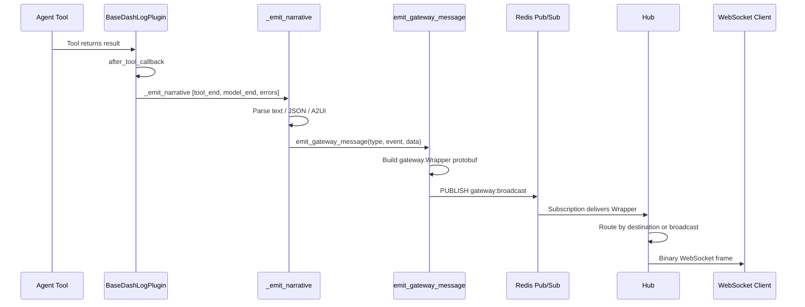
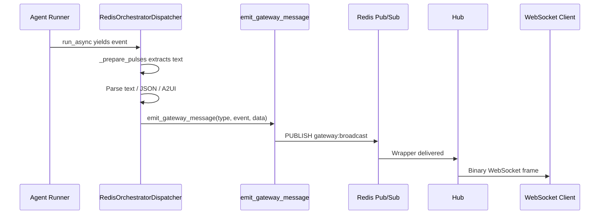
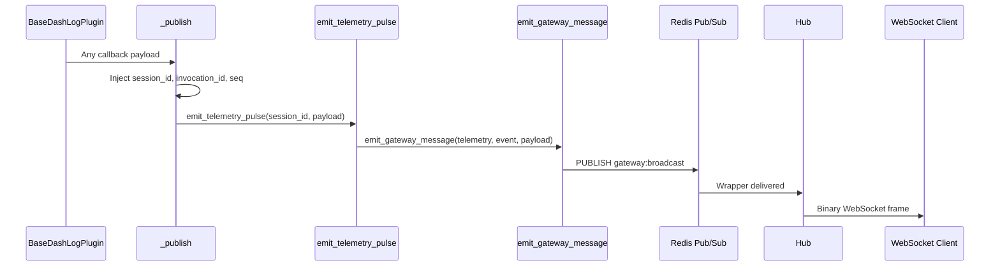
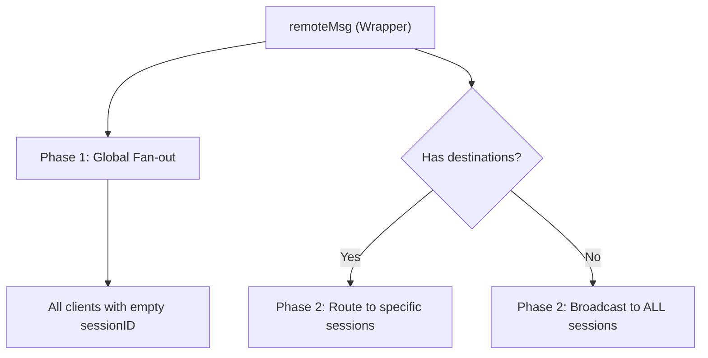
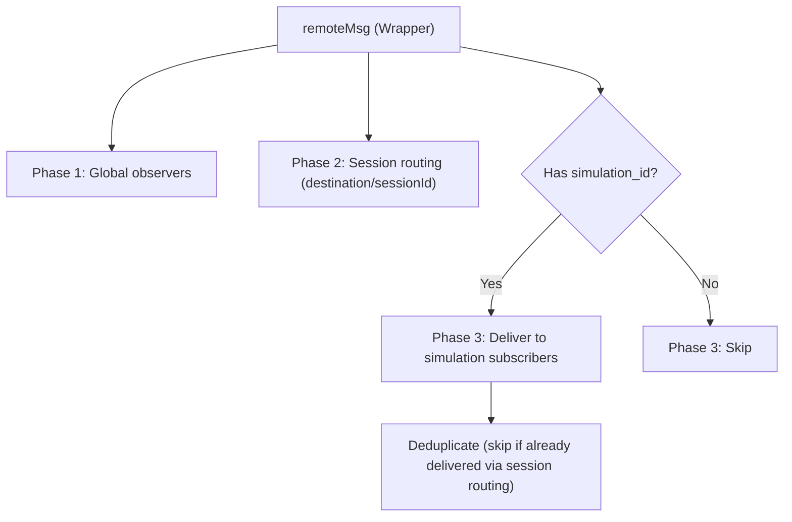
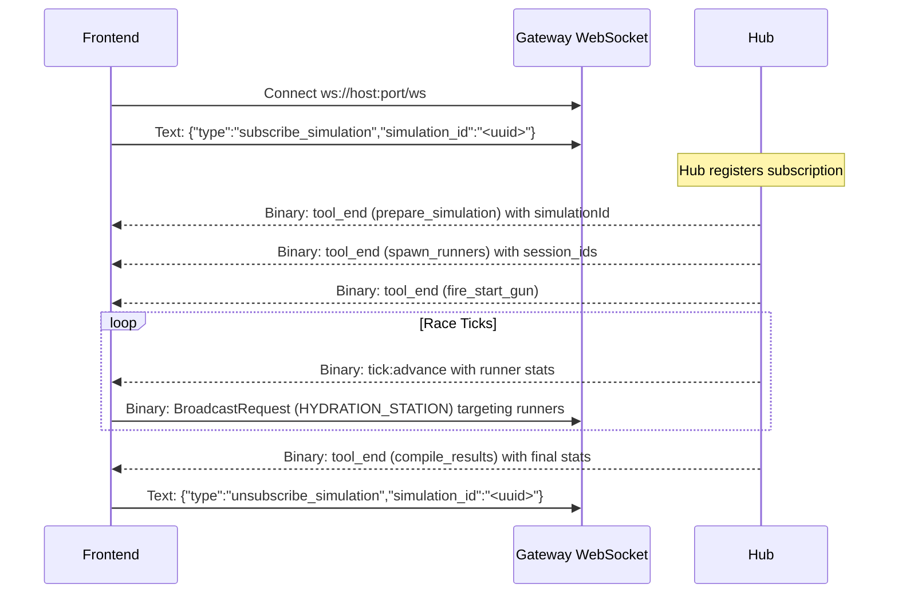

# Simulation Backend API Reference

> **Generated by the `generating-event-docs` skill.** To regenerate, run that
> skill against the current codebase.

## 1. Overview

The **Simulation Gateway** is the central WebSocket hub that connects front-end
clients to the AI agent simulation backend. All agent-generated events — text
responses, structured JSON data, A2UI interface updates, and telemetry — flow
through the gateway to connected clients.

### Connecting

- **Endpoint**: `ws://[host]:[port]/ws`
- **Query Parameters**:

| Parameter   | Required | Description                                                  |
| :---------- | :------- | :----------------------------------------------------------- |
| `sessionId` | No       | UUID of the session to observe. Omit for global observation. |

- **Session-Scoped** (`?sessionId=UUID`): Receives only events targeted at that
  session, plus any untargeted broadcasts.
- **Global Observer** (no `sessionId` or empty): Receives **all** events across
  all sessions. Used by dashboards and monitoring UIs.

### Simulation Subscription

Clients can subscribe to specific simulation runs to receive all events from
that simulation's participants (planner, simulator, and runners). Send JSON text
frames to manage subscriptions:

**Subscribe:**
```json
{"type": "subscribe_simulation", "simulation_id": "<uuid>"}
```

**Unsubscribe:**
```json
{"type": "unsubscribe_simulation", "simulation_id": "<uuid>"}
```

Subscribed clients receive all protobuf `Wrapper` messages where
`simulation_id` matches their subscription, in addition to any
session-targeted messages they would normally receive.

> **Note:** Subscription is processed asynchronously by the Hub event loop. There
> is no acknowledgment message sent back to the client. In practice the
> subscription is registered within microseconds, but clients should subscribe
> **before** triggering a simulation start to avoid missing early events. If you
> subscribe to an already-running simulation, you will receive events from the
> next tick onward but may miss events that occurred before the subscription was
> processed.

### Transport Formats

Messages arrive over the WebSocket in **binary** (protobuf) format. The
`gateway.Wrapper` protobuf envelope is the primary wire format for all
agent-originated events relayed through Redis.

The gateway also supports **JSON text** messages for system-originated events via
`Hub.SendMessage()`, using the `GatewayMessage` struct.

### Inbound Messages

| Frame Type | Handling                                                                                      |
| :--------- | :-------------------------------------------------------------------------------------------- |
| Binary     | Parsed as `gateway.Wrapper`. Routed by `type`: `"broadcast"` → fan-out via switchboard + orchestration; `"a2ui_action"` → dispatched to the agent owning the target session (see `A2UIAction` in Section 2) |
| Text       | Parsed as JSON. Handles `subscribe_simulation` / `unsubscribe_simulation`; other types logged  |

---

## 2. Message Envelope — Protobuf `gateway.Wrapper`

All binary messages are wrapped in a `gateway.Wrapper` envelope defined in
`gen_proto/gateway/gateway.proto`:

| # | Field         | Type              | Description                                                                |
| - | :------------ | :---------------- | :------------------------------------------------------------------------- |
| 1 | `timestamp`   | `string`          | ISO 8601 timestamp of when the message was created                         |
| 2 | `type`        | `string`          | Data type: `"text"`, `"json"`, `"a2ui"`, `"telemetry"`                    |
| 3 | `request_id`  | `string`          | Unique ID for tracking this message                                        |
| 4 | `session_id`  | `string`          | Legacy session routing field (kept for backwards compatibility)            |
| 5 | `payload`     | `bytes`           | Serialized payload content (UTF-8 JSON string for text/json/a2ui)         |
| 6 | `origin`      | `Origin`          | Source of the message (see Origin below)                                   |
| 7 | `destination` | `repeated string` | Target session UUIDs. Empty means broadcast to all connected clients      |
| 8 | `status`      | `string`          | `"success"`, `"error"`, `"info"`                                           |
| 9 | `event`       | `string`          | Event name: `"narrative"`, `"tool_call"`, `"model_end"`, `"a2ui"`, etc    |
| 10| `metadata`    | `bytes`           | JSON-encoded metadata (e.g., token counts, sequence numbers, model ID)    |
| 11| `simulation_id` | `string`          | Groups messages by simulation run. Empty for non-simulation events.  |

### Origin Message

| # | Field        | Type     | Description                                |
| - | :----------- | :------- | :----------------------------------------- |
| 1 | `type`       | `string` | `"agent"`, `"client"`, or `"system"`       |
| 2 | `id`         | `string` | Agent name (e.g., `"planner"`, `"runner"`, `"runner_autopilot"`) |
| 3 | `session_id` | `string` | UUID of the originating session            |

### BroadcastRequest Message

Allows a single client to fan-out a payload to many agents.

| # | Field                | Type              | Description                                       |
| - | :------------------- | :---------------- | :------------------------------------------------ |
| 1 | `payload`            | `bytes`           | Broadcast payload content                         |
| 2 | `target_session_ids` | `repeated string` | Target session IDs for the broadcast              |
| 3 | `async`              | `bool`            | If true, return ack immediately; false waits      |

### BatchResponse Message

Aggregates responses from multiple agents into one message.

| # | Field        | Type               | Description                    |
| - | :----------- | :----------------- | :----------------------------- |
| 1 | `request_id` | `string`           | Correlation ID for the request |
| 2 | `responses`  | `repeated Wrapper` | Array of agent responses       |

### ToolCallRequest Message

Used by agents (Brain) to query or act on the state registry (Body).

| # | Field           | Type                  | Description             |
| - | :-------------- | :-------------------- | :---------------------- |
| 1 | `resource_type` | `string`              | Resource type to query  |
| 2 | `params`        | `map<string, string>` | Key-value request params|

### ToolCallResponse Message

Result of a ToolCallRequest.

| # | Field   | Type     | Description     |
| - | :------ | :------- | :-------------- |
| 1 | `data`  | `bytes`  | Response data   |
| 2 | `error` | `string` | Error message   |

### A2UIAction Message

Sent by the frontend when a user clicks an A2UI `Button` with an `action`. The
gateway looks up the agent type via the session registry and dispatches the
action to the owning agent.

| # | Field         | Type     | Description                                             |
| - | :------------ | :------- | :------------------------------------------------------ |
| 1 | `session_id`  | `string` | Target agent session UUID                               |
| 2 | `action_name` | `string` | Action identifier (e.g., `"run_simulation"`)            |
| 3 | `context`     | `bytes`  | Optional JSON context for future extensibility          |

**Inbound handling**: The gateway unmarshals the `Wrapper.payload` as
`A2UIAction`, resolves the agent type from `action.SessionId` via the session
registry, and dispatches an orchestration event:

```json
{
  "type": "a2ui_action",
  "eventId": "<wrapper.RequestId>",
  "sessionId": "<action.SessionId>",
  "payload": {
    "actionName": "<action.ActionName>",
    "sessionId": "<action.SessionId>"
  }
}
```

The `RedisOrchestratorDispatcher` converts this into a user message:
`{"a2ui_action": "<actionName>", "source": "a2ui_button"}` and triggers an
agent run.

### Payload Auto-Promotion

When `emit_gateway_message()` is called with `msg_type="text"` but `data` is a
`dict` or `list`, the function automatically promotes the type to `"json"`. This
prevents malformed text events and ensures structured data is always typed
correctly on the wire.

### JSON `GatewayMessage` (System-Originated Text)

When the gateway itself sends messages via `Hub.SendMessage()`, they arrive as
JSON text frames:

```json
{
  "origin": { "type": "system", "id": "gateway" },
  "destination": ["session-uuid"],
  "status": "success",
  "type": "text",
  "event": "event_name",
  "data": {},
  "metadata": {}
}
```

| Field         | Type                     | Description                                                      |
| :------------ | :----------------------- | :--------------------------------------------------------------- |
| `origin`      | `GatewayOrigin`          | `type` + `id` + optional `session_id`                            |
| `destination` | `[]string`               | Target session UUIDs. Empty means broadcast                      |
| `status`      | `string`                 | `"success"`, `"error"`, `"info"`                                 |
| `type`        | `string`                 | `"text"`, `"json"`, `"a2ui"`, `"telemetry"`                     |
| `event`       | `string`                 | `"narrative"`, `"model_start"`, `"tool_call"`, etc               |
| `data`        | `interface{}`            | Payload body                                                     |
| `metadata`    | `map[string]interface{}` | Optional metadata                                                |

---

## 3. Gateway Event Catalog

Every `(type, event)` combination that can arrive over the WebSocket:

### Text Events (`type: "text"`)

| `event`       | Payload (`data`)                                              | Source                                        | When                                                   |
| :------------ | :------------------------------------------------------------ | :-------------------------------------------- | :----------------------------------------------------- |
| `model_end`   | `{"text": "[Agent] Model End\n\n<response>"}`                 | `BaseDashLogPlugin._emit_narrative()`         | After an LLM call completes (turn_complete=true)       |
| `tool_end`    | `{"text": "[Agent] Tool End: <tool>\n\n<result>"}`            | `BaseDashLogPlugin._emit_narrative()`         | After a tool returns a non-JSON text result            |
| `model_error` | `{"text": "[Agent] Model Error\n\nError: <msg>"}`            | `BaseDashLogPlugin._emit_narrative()`         | When an LLM call fails                                 |
| `tool_error`  | `{"text": "[Agent] Tool Error: <tool>\n\nError: <msg>"}`     | `BaseDashLogPlugin._emit_narrative()`         | When a tool call raises an exception                   |
| `text`        | `{"text": "<agent output>"}`                                  | `RedisOrchestratorDispatcher`                 | When a runner event contains plain text                |

### JSON Events (`type: "json"`)

| `event`                | Payload (`data`)                             | Source                                        | When                                                   |
| :--------------------- | :------------------------------------------- | :-------------------------------------------- | :----------------------------------------------------- |
| `run_start`            | `{"agent": "<name>"}`                        | `BaseDashLogPlugin._emit_lifecycle_event()`   | Before an ADK run begins                               |
| `run_end`              | `{"agent": "<name>"}`                        | `BaseDashLogPlugin._emit_lifecycle_event()`   | After an ADK run completes                             |
| `model_start`          | `{"model": "<name>", "agent": "<name>"}`     | `BaseDashLogPlugin._emit_lifecycle_event()`   | Before an LLM call begins                              |
| `tool_start`           | `{"tool": "<name>", "agent": "<name>", "tool_hints"?: {"<key>": "<value>", …}}` | `BaseDashLogPlugin._emit_lifecycle_event()` | Before a tool call begins. `tool_hints` present only for allowlisted tools (see below). |
| `tool_end`             | `{"tool_name": "<name>", "result": {…}}`     | `BaseDashLogPlugin._emit_narrative()`         | After a tool returns a JSON dict result                |
| `model_end`            | `{…}` (parsed JSON from model response)      | `BaseDashLogPlugin._emit_narrative()`         | After an LLM returns parseable JSON content            |
| `json`                 | `{…}` (parsed JSON from agent output)        | `RedisOrchestratorDispatcher`                 | When a runner event contains parseable JSON            |
| `inter-agent`          | `{"text": "📢 from -> to: msg"}`             | `emit_inter_agent_pulse()`                    | When an agent sends an A2A message to another agent    |
| `tick:advance`         | Tick snapshot dict (see Section 8.2)           | `simulator` → `advance_tick()`                | After each simulation tick advances                    |

#### `tool_start` Display Hints

The `tool_hints` field on `tool_start` events is an **optional**
`Record<string, string>` containing a curated subset of tool arguments safe for
display. Only tools listed in the `_TOOL_DISPLAY_HINTS` allowlist
(`agents/utils/plugins.py`) produce this field. All other tools omit it
entirely.

| Tool Name    | Hint Keys      | Example `tool_hints`             |
| :----------- | :------------- | :------------------------------- |
| `load_skill` | `name`         | `{"name": "brainstorming"}`      |
| `call_agent` | `agent_name`   | `{"agent_name": "simulator"}`    |

This is secure-by-default: sensitive arguments (e.g., `message` on
`call_agent`) are never included unless explicitly allowlisted.

### A2UI Events (`type: "a2ui"`)

| `event` | Payload (`data`)                 | Source                                | When                                                              |
| :------ | :------------------------------- | :------------------------------------ | :---------------------------------------------------------------- |
| `a2ui`  | A2UI JSON object (see Section 4) | `BaseDashLogPlugin._emit_narrative()` | When tool/model output contains A2UI blocks                       |
| `a2ui`  | A2UI JSON object (see Section 4) | `RedisOrchestratorDispatcher`         | When runner event text contains A2UI blocks                       |

### Telemetry Events (`type: "telemetry"`)

| `event`        | Payload (`data`)                           | Source                   | When                                  |
| :------------- | :----------------------------------------- | :----------------------- | :------------------------------------ |
| `run_start`    | Full plugin payload dict                   | `emit_telemetry_pulse()` | Before an ADK run begins              |
| `run_end`      | Full plugin payload dict                   | `emit_telemetry_pulse()` | After an ADK run completes            |
| `agent_start`  | Full plugin payload dict                   | `emit_telemetry_pulse()` | Before an agent callback              |
| `agent_end`    | Full plugin payload dict                   | `emit_telemetry_pulse()` | After an agent callback               |
| `model_start`  | Full plugin payload dict                   | `emit_telemetry_pulse()` | Before an LLM call                    |
| `model_end`    | Full plugin payload dict                   | `emit_telemetry_pulse()` | After an LLM call completes           |
| `tool_start`   | Full plugin payload dict                   | `emit_telemetry_pulse()` | Before a tool call                    |
| `tool_end`     | Full plugin payload dict                   | `emit_telemetry_pulse()` | After a tool call completes           |
| `model_error`  | Full plugin payload dict                   | `emit_telemetry_pulse()` | When an LLM call fails                |
| `tool_error`   | Full plugin payload dict                   | `emit_telemetry_pulse()` | When a tool call raises an exception  |
| `user_message` | Full plugin payload dict                   | `emit_telemetry_pulse()` | When a user message is received       |

All telemetry payloads include `session_id`, `invocation_id`, and `seq`
(monotonic per-session sequence number) injected by the plugin pipeline.
Telemetry status is `"error"` for `*_error` events, `"info"` otherwise.

### System Events (`type: "environment_reset"`)

| `event`             | Payload (`data`)        | Source                                  | When                                            |
| :------------------ | :---------------------- | :-------------------------------------- | :---------------------------------------------- |
| `environment_reset` | _(empty)_               | `POST /api/v1/environment/reset`        | When a selective environment reset is triggered  |

The gateway broadcasts an `environment_reset` Wrapper (with `type` and `event`
both set to `"environment_reset"`) to all connected clients. Each
`RedisOrchestratorDispatcher` that receives this event cancels all background
tasks, clears active sessions, clears dedup caches, and clears the simulation
registry.

### Orchestration Events (via `switchboard.go`)

> **Note**: The `agent_response` event was removed from the switchboard in a
> prior refactor. However, `relayCallableResponse()` in the switchboard DOES
> broadcast the final Agent Engine response text as a `narrative` event (type
> `"json"`, event `"narrative"`) via `Broadcast()` as a safety net for
> delivering callable agent responses to WebSocket clients.

---

## 4. A2UI Events — Protocol Reference

A2UI (Agent-to-UI) is a JSONL-based streaming protocol that delivers rich UI
components from agents to the front-end. A2UI payloads arrive as gateway events
with `type: "a2ui"` and `event: "a2ui"`.

### A2UI Message Types

| Message Type      | Purpose                              | Key Fields                    |
| :---------------- | :----------------------------------- | :---------------------------- |
| `beginRendering`  | Signal the client to start rendering | `root` (component ID)         |
| `surfaceUpdate`   | Send component definitions           | `components` (array of defs)  |
| `dataModelUpdate` | Update the data model for binding    | `contents` (key-value data)   |
| `deleteSurface`   | Remove a surface                     | `delete` (boolean)            |

### Typed Property Values

All property values in A2UI components **must** be wrapped:

| Type    | Format                      | Example                              |
| :------ | :-------------------------- | :----------------------------------- |
| String  | `{"literalString": "text"}` | `"text": {"literalString": "Hello"}` |
| Number  | `{"literalNumber": 42.0}`   | `"value": {"literalNumber": 3.14}`   |
| Boolean | `{"literalBoolean": true}`  | `"value": {"literalBoolean": true}`  |

Data-bound values use `{"path": "some.data.path"}` instead of literals.

### Component Catalog (v0.8.0)

#### Display Components

| Component     | Required Properties | Notes            |
| :------------ | :------------------ | :--------------- |
| `Text`        | `text`              | Body text; supports `usageHint` (`"h1"`, `"h2"`, `"h3"`, `"title"`, `"label"`, `"body"`, `"caption"`) |
| `Image`       | `url`               | Static images; supports `fit` and `usageHint`    |
| `Icon`        | `name`              | Icon by name     |
| `Video`       | `url`               | Video playback; supports `autoplay`   |
| `AudioPlayer` | `url`               | Audio playback; supports `description`   |
| `Divider`     | _(none)_            | Visual separator; supports `axis` (`"horizontal"`, `"vertical"`) |

#### Input Components

| Component        | Required Properties | Notes            |
| :--------------- | :------------------ | :--------------- |
| `TextField`      | `label`             | Text input; supports `textFieldType` (`"shortText"`)       |
| `DateTimeInput`  | `value`             | Date/time picker; supports `enableDate`, `enableTime` |
| `MultipleChoice` | `selections`        | Radio/checkbox; supports `options` (array of `{label, value}`), `maxAllowedSelections`   |
| `Slider`         | `value`             | Numeric range; supports `minValue`, `maxValue`    |
| `CheckBox`       | `label`, `value`    | Toggle checkbox  |

#### Action Components

| Component | Required Properties | Notes                    |
| :-------- | :------------------ | :----------------------- |
| `Button`  | `child`, `action`   | Clickable action trigger; `action` has `name` and optional `context`; supports `primary` |

#### Layout Components

| Component | Required Properties                   | Notes                       |
| :-------- | :------------------------------------ | :-------------------------- |
| `Row`     | `children`                            | Horizontal layout; supports `distribution`, `alignment`           |
| `Column`  | `children`                            | Vertical layout; supports `distribution`, `alignment`            |
| `List`    | `children`                            | Scrollable list; supports `direction`, `alignment`             |
| `Card`    | `child`                               | Single-child styled wrapper |
| `Tabs`    | `tabItems` (array of `title`+`child`) | Tabbed navigation           |
| `Modal`   | `entryPointChild`, `contentChild`     | Overlay dialog              |

### Container Children Format

```json
{
  "Column": {
    "children": { "explicitList": ["child-id-1", "child-id-2"] }
  }
}
```

### A2UI Block Detection

A2UI blocks in agent output are detected using two strategies in
`_emit_narrative()`:

1. **JSON parse**: If tool output is valid JSON containing an `"a2ui"` key, the
   value is extracted and emitted as `(type="a2ui", event="a2ui")`. The `a2ui`
   value may be a parsed dict (e.g., from `validate_and_emit_a2ui` which returns
   `{"status": "success", "a2ui": <dict>}`) or a JSON string. Both forms are
   handled: dicts are serialized directly, strings are cleaned of any markdown
   fencing before emission.
2. **Regex fallback**: If JSON parsing fails, the pattern
   `` ```a2ui\n...``` `` or `a2ui\n{...}` extracts embedded A2UI blocks from
   text output (e.g., when the LLM writes A2UI in its model response).

---

## 5. Orchestration Events

### `spawn_agent`

Emitted when a new agent session is created via REST API. Enqueued to the
Redis list `simulation:spawns:{agentType}`.

**Single session** (`POST /api/v1/sessions`):
```json
{
  "type": "spawn_agent",
  "sessionId": "uuid",
  "eventId": "uuid",
  "payload": { "agentType": "runner", "userId": "user1", "simulation_id": "sim-uuid" }
}
```

**Batch spawn** (`POST /api/v1/spawn`): Same structure but omits `userId`:
```json
{
  "type": "spawn_agent",
  "sessionId": "uuid",
  "eventId": "uuid",
  "payload": { "agentType": "runner", "simulation_id": "sim-uuid" }
}
```

### `broadcast`

Emitted when a client sends a fan-out message to all agents. Published to
Redis Pub/Sub channel `simulation:broadcast`.

When a `simulation_id` is associated with spawned agents, broadcasts are scoped
to `simulation:{simulation_id}:broadcast` instead of the global
`simulation:broadcast` channel.

```json
{
  "type": "broadcast",
  "eventId": "uuid",
  "payload": { "data": "<message content>", "targets": ["session-uuid-1"] }
}
```

### `end_simulation`

Emitted when a simulation completes. Dispatchers that receive this event remove
all sessions associated with the given `simulation_id` and unsubscribe from the
scoped broadcast channel.

```json
{
  "type": "end_simulation",
  "simulation_id": "sim-uuid"
}
```

### `a2ui_action`

Emitted when the frontend sends an A2UI button action (see `A2UIAction` in
Section 2). The gateway resolves the agent type via the session registry and
dispatches to the owning agent.

```json
{
  "type": "a2ui_action",
  "eventId": "uuid",
  "sessionId": "agent-session-uuid",
  "payload": {
    "actionName": "run_simulation",
    "sessionId": "agent-session-uuid"
  }
}
```

The `RedisOrchestratorDispatcher` converts this into a user message:
`{"a2ui_action": "run_simulation", "source": "a2ui_button"}` and triggers an
agent run for the target session.

### Dispatch Modes

Both `DispatchToAgent()` and `PokeAgent()` use the **same routing logic**:

| Agent URL Type        | Transport                     | Detection                                               |
| :-------------------- | :---------------------------- | :------------------------------------------------------ |
| **Agent Engine**      | A2A JSON-RPC `message/send`   | URL contains `aiplatform.googleapis.com` + `reasoningEngines` |
| **Cloud Run / Local** | HTTP POST to `/orchestration` | All other URLs (default)                                |

> **Note:** In a previous version of this document, `PokeAgent()` was described
> as always using HTTP POST. This is no longer accurate — both methods share the
> same URL-based dispatch logic.

---

## 6. Gateway REST API

| Method | Path                         | Description                             | Request Body                                            | Response                                                 |
| :----- | :--------------------------- | :-------------------------------------- | :------------------------------------------------------ | :------------------------------------------------------- |
| `GET`  | `/health`                    | Health check with infra status          | —                                                       | `{"status":"ok","service":"gateway","infra":{"redis":"…","pubsub":"…"}}` |
| `GET`  | `/api/v1/agent-types`        | Discover available agent types          | —                                                       | `{"agent_name":{"name":"…","url":"…",…}}`                |
| `GET`  | `/api/v1/sessions`           | List active session IDs                 | —                                                       | `["session-uuid-1", "session-uuid-2"]`                   |
| `GET`  | `/api/v1/simulations`        | List active simulation IDs              | —                                                       | `{"simulations":["sim-uuid-1","sim-uuid-2"]}`            |
| `POST` | `/api/v1/sessions`           | Create a single agent session           | `{"agentType":"runner","userId":"user1","simulation_id":"sim-uuid"}` | `{"status":"pending","sessionId":"…","message":"…"}`     |
| `POST` | `/api/v1/sessions/flush`     | Flush all sessions                      | —                                                       | `{"status":"flushed","count":N}`                         |
| `POST` | `/api/v1/environment/reset`  | Selective environment reset             | `{"targets":["sessions","queues","maps","pubsub"]}`      | `{"status":"reset","results":{…}}`                       |
| `POST` | `/api/v1/spawn`              | Batch spawn sessions across agent types | `{"agents":[{"agentType":"runner","count":5}], "simulation_id":"sim-uuid"}` | `{"sessions":[{"sessionId":"…","agentType":"…"}]}`       |
| `POST` | `/api/v1/orchestration/push` | Pub/Sub push endpoint for orchestration | `{"message":{"data":"<base64>"}}`                        | HTTP 200                                                 |

### Health Check Detail

```json
{
  "status": "ok",
  "service": "gateway",
  "infra": {
    "redis": "online|offline|unknown",
    "pubsub": "online|offline"
  }
}
```

- **Redis**: Calls `sb.Ping()`. `nil` switchboard → `"unknown"`, error →
  `"offline"`, else `"online"`.
- **Pub/Sub**: TCP dial to `PUBSUB_EMULATOR_HOST` with 1s timeout. Error →
  `"offline"`, else `"online"`.

### Batch Spawn Error Responses

| Status | Condition                  | Response                                                               |
| :----- | :------------------------- | :--------------------------------------------------------------------- |
| `400`  | Invalid request body       | `{"error": "..."}`                                                     |
| `400`  | `count < 1`               | `{"error": "count must be at least 1 for ..."}`                       |
| `400`  | Unknown agent type         | `{"error": "...", "available": [...], "suggestion": "..."}`            |
| `500`  | Catalog not initialized    | `{"error": "agent catalog not initialized"}`                           |
| `503`  | Discovery failure          | `{"error": "..."}`                                                     |

### Environment Reset

`POST /api/v1/environment/reset` performs a selective reset of gateway
infrastructure. The request body specifies which targets to reset:

| Target     | Effect                                        |
| :--------- | :-------------------------------------------- |
| `sessions` | Flushes all sessions from the session registry |
| `queues`   | Flushes all orchestration queues               |
| `maps`     | Flushes all hash maps from the switchboard     |
| `pubsub`   | Flushes all Pub/Sub subscriptions              |

**Response:**
```json
{
  "status": "reset",
  "results": {
    "sessions": { "flushed": true, "count": 5 },
    "queues":   { "flushed": true, "count": 12 },
    "maps":     { "flushed": true, "count": 3 },
    "pubsub":   { "flushed": true, "count": 0 }
  }
}
```

After reset, the gateway broadcasts an `environment_reset` Wrapper to all
connected WebSocket clients and publishes an orchestration notification to
Redis so all dispatchers can clean up their local state.

---

## 7. Event Flow

### Agent Plugin → Gateway



### Orchestration Dispatcher → Gateway



### Telemetry Plugin → Gateway



### Hub Message Routing



### Simulation Subscription Routing



---

## 8. Agent Reference

Each agent section documents: what messages it responds to, every tool with full
input/output schemas, A2A calls it makes, and A2UI surfaces it produces.

All tool outputs are **structured JSON dicts** per the ADK tool compliance rules.

All agents use `SimulationCommunicationPlugin` which wraps
`RedisOrchestratorDispatcher` for orchestration event handling. Agents listen
on Redis channels (`simulation:broadcast` and `simulation:spawns:{agent_type}`)
for orchestration events, and expose HTTP endpoints for A2A communication.

---

### 8.1. Planner (`planner`)

- **Directory**: `agents/planner/`
- **Description**: Expert GIS analyst for marathon route and event planning
- **Model**: `gemini-3-flash-preview`
- **Dispatch Mode**: Subscriber (orchestration via Redis)
- **A2A Transport**: HTTP (exposes endpoints for direct A2A calls)
- **Config**: `temperature=0.1`

#### Messages This Agent Responds To

| Event Type    | Trigger                                             |
| :------------ | :-------------------------------------------------- |
| `broadcast`   | Fan-out messages from the gateway                   |
| `spawn_agent` | Session creation via REST API                       |
| A2A calls     | Direct `message:send` from simulator or other UIs   |

#### Tools

##### `plan_marathon_route`

Generate a mathematically precise 26.2-mile marathon route using GeoJSON road
network data. Automatically adds water stations (every ~1.86 miles) and medical tents
(halfway + finish). Uses Dijkstra + spine-and-sprout algorithm.

| Parameter        | Type                  | Required | Default | Description                                              |
| :--------------- | :-------------------- | :------- | :------ | :------------------------------------------------------- |
| `geojson_data`   | `str` or `None`       | No       | `None`  | GeoJSON string of road network (default: Las Vegas)      |
| `theme_sequence` | `list[str]` or `None` | No       | `None`  | Landmark names for route spine (default: Las Vegas Sign, Allegiant Stadium, Sphere) |
| `waypoints`      | `list[list[float]]` or `None` | No | `None` | Explicit `[lon, lat]` waypoints for the route            |
| `petal_names`    | `list[str]` or `None` | No       | `None`  | Named petal destinations for cloverleaf routes           |
| `force_replan`   | `bool`                | No       | `False` | Re-plan even if a route already exists in session state  |

**Output (success):**
```json
{
  "status": "success",
  "message": "Marathon route planned successfully including logistical stations.",
  "geojson": {
    "type": "FeatureCollection",
    "features": [
      {
        "type": "Feature",
        "properties": {
          "route_type": "marathon",
          "distance_mi": 26.2,
          "start_location": "Las Vegas Sign",
          "finish_location": "Finish Line",
          "certified": true
        },
        "geometry": { "type": "LineString", "coordinates": [["lon", "lat"], "..."] }
      },
      { "properties": { "type": "water_station", "mi": 1.864 }, "geometry": { "type": "Point" } },
      { "properties": { "type": "medical_tent", "location": "Halfway" }, "geometry": { "type": "Point" } }
    ]
  }
}
```
**Output (already planned, `force_replan=False`):**
```json
{
  "status": "already_planned",
  "message": "Marathon route was already planned in this session. Use report_marathon_route to emit it.",
  "geojson": { "type": "FeatureCollection", "features": ["...cached route..."] }
}
```
**Output (error):**
```json
{ "status": "error", "message": "<error description>" }
```

##### `plan_marathon_event`

Define marathon event characteristics and logistical parameters.

| Parameter    | Type  | Required | Description                    |
| :----------- | :---- | :------- | :----------------------------- |
| `event_name` | `str` | Yes      | Name of the marathon event     |
| `city`       | `str` | Yes      | City where the marathon is held |

**Output:**
```json
{
  "status": "success",
  "message": "Marathon event 'Berlin Marathon' planned in Berlin.",
  "event_name": "Berlin Marathon",
  "city": "Berlin",
  "characteristics": {
    "water_stations": "Standard placement every ~3.1 miles",
    "start_time": "08:00 AM",
    "wave_count": 5
  }
}
```

##### `report_marathon_route`

Report the final marathon route GeoJSON to the gateway for visualization.
Automatically retrieves the route from session state.

| Parameter | Type | Required | Description |
| :-------- | :--- | :------- | :---------- |
| _(none)_  | —    | —        | —           |

**Output (success):**
```json
{
  "status": "success",
  "message": "Final marathon route reported to the system.",
  "route_geojson": { "type": "FeatureCollection", "features": ["..."] }
}
```
**Output (no route):**
```json
{ "status": "error", "message": "No marathon route found in session state. Run plan_marathon_route first." }
```

##### `set_financial_modeling_mode`

Toggle between secure and insecure financial modeling modes. The active mode
is stored in `session.state["financial_modeling_mode"]` for durability across
turns. The agent calls this when the user asks to switch modes.

| Parameter      | Type  | Required | Description                          |
| :------------- | :---- | :------- | :----------------------------------- |
| `mode`         | `str` | Yes      | Either `"secure"` or `"insecure"`    |
| `tool_context` | —     | Auto     | ADK tool context (injected by ADK)   |

**Output (success):**
```json
{
  "status": "success",
  "financial_modeling_mode": "insecure"
}
```
**Output (invalid mode):**
```json
{
  "status": "error",
  "message": "Invalid mode 'foo'. Must be 'secure' or 'insecure'."
}
```

**Session State Key**: `financial_modeling_mode` — defaults to `"insecure"` when
absent. The agent checks this key to determine which financial modeling skill to
follow:

- **`"insecure"`** (`insecure-financial-modeling` skill): Shares financial data
  using percentages and trends. Approves budget changes. Never uses specific
  dollar amounts.
- **`"secure"`** (`secure-financial-modeling` skill): Refuses all financial data
  requests with an authorization refusal.

**Turn Isolation**: When handling a financial query, the agent responds ONLY with
financial information and does NOT invoke route planning, event planning, or
simulation tools. Conversely, planning queries do not trigger financial modeling
behavior.

> **Note:** The `submit_plan_to_simulator` tool is NOT part of the base planner.
> It is provided by the `planner_with_eval` and `planner_with_memory` variants
> (see Sections 8.4 and 8.5).

#### A2A Calls

None. The base planner does not call other agents directly.

#### A2UI Surfaces

None. The base planner does not produce A2UI output directly. When the
`validate_and_emit_a2ui` tool is available (in `planner_with_eval` and
`planner_with_memory`), financial modeling responses are composed as A2UI cards.

#### Custom Gateway Events

None. The `report_marathon_route` tool returns its result dict through the
standard DashLogPlugin `tool_end` pipeline, which carries `session_id` and
`simulation_id` reliably.

---

### 8.2. Simulator (`simulator`)

- **Directory**: `agents/simulator/`
- **Description**: Marathon simulation agent with a multi-stage pipeline
  architecture. Verifies plans or runs full simulations with runner agent
  coordination.
- **Dispatch Mode**: Subscriber (orchestration via Redis)
- **A2A Transport**: HTTP (exposes endpoints for direct A2A calls)

#### Architecture

```
LlmAgent("simulator")                  ← root, receives A2A, routes tasks
  ├── Tool: verify_plan                 ← validates plan readiness (cheap)
  └── AgentTool: simulation_pipeline    ← runs full simulation (expensive)
      └── SequentialAgent("simulation_pipeline")
          ├── LlmAgent("pre_race")      ← parse plan, spawn runners, start collector
          ├── LoopAgent("race_engine")   ← tick loop with dynamic max_iterations
          │   └── LlmAgent("tick")       ← advance_tick + check_race_complete
          └── LlmAgent("post_race")      ← compile results, stop collector
```

#### Model Configuration

| Sub-Agent    | Model                       | Temperature | Other Config                                |
| :----------- | :-------------------------- | :---------- | :------------------------------------------ |
| `simulator`  | `gemini-3-flash-preview`    | 0.1         | Root router                                 |
| `pre_race`   | `gemini-3-flash-preview`    | 0.2         | —                                           |
| `tick`       | `gemini-flash-lite-latest`  | 0.1         | `thinking_budget=0`, `max_output_tokens=256`|
| `post_race`  | `gemini-3-flash-preview`    | 0.2         | —                                           |

#### Messages This Agent Responds To

| Event Type    | Trigger                                                    |
| :------------ | :--------------------------------------------------------- |
| `broadcast`   | Fan-out messages from the gateway                          |
| `spawn_agent` | Session creation via REST API                              |
| A2A calls     | `message:send` from planner (`submit_plan_to_simulator`)   |

#### Tools — Root Agent

##### `verify_plan`

Validate that a marathon plan is ready for simulation. Checks the plan JSON
for a narrative field and, if a route is provided, validates its structure.
The route field is **optional** — large GeoJSON coordinates are excluded from
A2A messages to prevent LLM JSON corruption during function-call transport.

| Parameter   | Type  | Required | Description                        |
| :---------- | :---- | :------- | :--------------------------------- |
| `plan_json` | `str` | Yes      | JSON string of the plan to verify  |

**Output (ready):**
```json
{
  "status": "ready",
  "message": "Plan is valid and ready for simulation.",
  "ready": true,
  "simulation_config": {
    "duration_seconds": 60,
    "tick_interval_seconds": 10,
    "runner_count": 10
  }
}
```
**Output (issues found):**
```json
{
  "status": "issues_found",
  "message": "Plan has 1 issue(s) to resolve before simulation.",
  "issues": ["Missing 'narrative' field — no plan summary."],
  "ready": false
}
```
**Output (parse error):**
```json
{ "status": "error", "message": "Invalid plan JSON: ..." }
```

##### `simulation_pipeline` (AgentTool)

Delegates to the `SequentialAgent` pipeline described above. Not called directly
by the LLM — invoked as an `AgentTool` when the root agent decides a full
simulation is needed.

#### Tools — Pre-Race Sub-Agent

##### `prepare_simulation`

Parse the plan JSON and configure simulation parameters. Stores config in
session state for downstream sub-agents.

| Parameter   | Type  | Required | Description                             |
| :---------- | :---- | :------- | :-------------------------------------- |
| `plan_json` | `str` | Yes      | JSON string of the verified plan        |

**Output:**
```json
{
  "status": "success",
  "message": "Simulation configured: 6 ticks at 10s intervals, 10 runners.",
  "max_ticks": 6,
  "runner_count": 10,
  "duration_seconds": 60,
  "tick_interval_seconds": 10
}
```

**State keys set**: `simulation_config`, `route_geojson`, `plan_narrative`,
`plan_action`, `max_ticks`, `current_tick`, `tick_snapshots`, `runner_count`,
`runner_type`, `simulation_ready`, `simulation_in_progress`, `simulation_id`

**Runner Type**: The `runner_type` state key is always set to
`"runner_autopilot"`. This controls which agent type is spawned by
`spawn_runners` — the deterministic zero-LLM runner variant.

##### `spawn_runners`

Spawn runner agent sessions via the gateway batch spawn API.

| Parameter | Type  | Required | Description                  |
| :-------- | :---- | :------- | :--------------------------- |
| `count`   | `int` | Yes      | Number of runners to spawn   |

**Output:**
```json
{
  "status": "success",
  "session_ids": ["uuid-1", "uuid-2"],
  "count": 2,
  "message": "Spawned 2 runner agents"
}
```

**External API Call**: `POST {GATEWAY_URL}/api/v1/spawn` with
`{"agents": [{"agentType": "runner", "count": N}], "simulation_id": "<simulation_id>"}`

##### `start_race_collector`

Start a `RaceCollector` subscribed to `gateway:broadcast` for runner telemetry
aggregation.

| Parameter | Type | Required | Description |
| :-------- | :--- | :------- | :---------- |
| _(none)_  | —    | —        | —           |

**Output:**
```json
{
  "status": "success",
  "session_id": "uuid",
  "runner_count": 10,
  "message": "RaceCollector started for 10 runners"
}
```

##### `fire_start_gun`

Broadcast a `START_GUN` event with embedded tick-0 data to all spawned runner
agents via Redis `simulation:broadcast` channel. Signals that the race has begun
and triggers each runner's first `process_tick` call within the same `run_async`
so the frontend receives initial velocity immediately (no ~3s delay waiting for
the race engine's first `advance_tick`).

The START_GUN event carries zero-time tick data (`minutes_per_tick=0`,
`elapsed_minutes=0`) so runners report their initialized velocity but remain at
the starting line (distance=0, water=100%). After publishing, advances
`current_tick` to 1 so `advance_tick` starts from tick 1.

| Parameter | Type | Required | Description |
| :-------- | :--- | :------- | :---------- |
| _(none)_  | —    | —        | —           |

**Output (success):**
```json
{
  "status": "success",
  "event": "start_gun",
  "session_id": "uuid",
  "runner_count": 10,
  "message": "START_GUN broadcast to 10 runners",
  "simulation_id": "sim-uuid"
}
```
**Output (no runners):**
```json
{ "status": "error", "message": "No runner_session_ids in state. Run spawn_runners first." }
```

**Redis Publish**: Publishes `RunnerEvent(event=RunnerEventType.START_GUN,
data={tick: 0, max_ticks: N, minutes_per_tick: 0, elapsed_minutes: 0,
race_distance_mi: 26.2})` to `simulation:{simulation_id}:broadcast` channel
(or `simulation:broadcast` if no simulation_id).

**State mutation**: Sets `current_tick = 1`.

##### `call_agent` (pre-race)

Send a message to another agent via A2A. Delegates to
`agents.utils.communication.call_agent()`.

| Parameter    | Type  | Required | Description                              |
| :----------- | :---- | :------- | :--------------------------------------- |
| `agent_name` | `str` | Yes      | The name of the target agent             |
| `message`    | `str` | Yes      | Natural language request for the target  |

**Output:**
```json
{
  "status": "success",
  "agent": "planner",
  "response": "..."
}
```

#### Tools — Race-Tick Sub-Agent (LoopAgent)

##### `advance_tick`

Advance the simulation by one tick. Publishes a broadcast to all runners, sleeps
for the tick interval, drains the collector, aggregates telemetry, appends a
snapshot, and emits a narrative pulse.

| Parameter | Type | Required | Description |
| :-------- | :--- | :------- | :---------- |
| _(none)_  | —    | —        | —           |

**Output:**
```json
{
  "status": "success",
  "tick": 3,
  "max_ticks": 6,
  "real_time_minutes": 0.25,
  "runners_reporting": 500,
  "avg_velocity": 0.93,
  "avg_water": 78.0,
  "avg_distance": 12.5,
  "status_counts": { "running": 480, "finished": 10, "exhausted": 5, "collapsed": 5 },
  "notable_events": ["Runner collapsed at mile 13"],
  "message": "Tick 3/12 (0.25 min): 500 runners reporting"
}
```

**Gateway Event Emitted**: `tick:advance`
- **Origin**: `{"type": "agent", "id": "tick-agent", "session_id": "<sid>"}`
- **Destination**: `["<session_id>"]`
- **Type**: `"json"`
- **Data**: Tick snapshot dict (same fields as output minus `status`/`message`)

**Redis Publish**: Publishes broadcast to `simulation:{simulation_id}:broadcast`
channel (or `simulation:broadcast` if no simulation_id) to trigger runner agent
ticks.

##### `check_race_complete`

Check whether the race has reached its maximum tick count. Sets
`tool_context.actions.escalate = True` to signal the `LoopAgent` to exit when
complete.

| Parameter | Type | Required | Description |
| :-------- | :--- | :------- | :---------- |
| _(none)_  | —    | —        | —           |

**Output (complete):**
```json
{
  "status": "race_complete",
  "current_tick": 6,
  "max_ticks": 6,
  "message": "Race complete after 6 ticks"
}
```
**Output (in progress):**
```json
{
  "status": "in_progress",
  "current_tick": 5,
  "max_ticks": 6,
  "ticks_remaining": 1,
  "message": "Race in progress: 1 ticks remaining"
}
```

#### Tools — Post-Race Sub-Agent

##### `compile_results`

Aggregate all tick snapshots into final race metrics.

| Parameter | Type | Required | Description |
| :-------- | :--- | :------- | :---------- |
| _(none)_  | —    | —        | —           |

**Output:**
```json
{
  "status": "success",
  "total_ticks": 6,
  "runner_count": 10,
  "finished_count": 7,
  "dnf_count": 3,
  "vitals_trend": [
    { "tick": 1, "real_time_minutes": 30.0, "avg_velocity": 0.93, "avg_water": 95.0, "avg_distance": 4.6 }
  ],
  "final_status_counts": { "running": 80, "finished": 14, "exhausted": 5, "collapsed": 1 },
  "notable_events": [],
  "avg_runners_reporting": 9.5,
  "sampling_quality": 1.0,
  "message": "Compiled 6 ticks: 7 finished, 3 DNF"
}
```

##### `stop_race_collector`

Stop the `RaceCollector` for the current session.

| Parameter | Type | Required | Description |
| :-------- | :--- | :------- | :---------- |
| _(none)_  | —    | —        | —           |

**Output:**
```json
{
  "status": "success",
  "session_id": "uuid",
  "message": "Race collector stopped"
}
```

##### `call_agent` (post-race)

Same signature and return as the pre-race `call_agent`.

#### A2A Calls

| Target Agent | Method       | Trigger                                            |
| :----------- | :----------- | :------------------------------------------------- |
| Any agent    | `call_agent` | Pre-race and post-race coordination with experts   |

#### A2UI Surfaces

None. This agent does not produce A2UI output.

#### Custom Gateway Events

| Event Name     | Type   | Destination      | When                                    |
| :------------- | :----- | :--------------- | :-------------------------------------- |
| `tick:advance` | `json` | `[<session_id>]` | After each simulation tick completes    |

**Payload**: Tick snapshot dict with `tick`, `max_ticks`, `real_time_minutes`,
`runners_reporting`, `avg_velocity`, `avg_water`, `avg_distance`,
`status_counts`, `notable_events`, `finished_runner_ids`.

---

### 8.3. Simulator with Failure (`simulator_with_failure`)

- **Directory**: `agents/simulator_with_failure/`
- **Description**: Test agent that intentionally triggers tool failures for
  error-handling verification
- **Model**: `gemini-3-flash-preview`
- **Dispatch Mode**: Subscriber (orchestration via Redis)
- **A2A Transport**: HTTP (exposes endpoints for direct A2A calls)
- **Config**: `temperature=0.2`

#### Messages This Agent Responds To

| Event Type    | Trigger                                         |
| :------------ | :---------------------------------------------- |
| `broadcast`   | Fan-out messages from the gateway               |
| `spawn_agent` | Session creation via REST API                   |
| A2A calls     | `message:send` from testing UIs or other agents |

#### Tools

##### `run_simulation`

Executes a simulation scenario through the engine pipeline. The engine
coordinates runner agents and advances tick state. May encounter coordination
failures during tick initialization.

| Parameter  | Type  | Required | Description                    |
| :--------- | :---- | :------- | :----------------------------- |
| `scenario` | `str` | Yes      | Name of the scenario to run    |

**Output:**

This tool raises a `RuntimeError` when the simulation engine encounters an
unexpected state. The front-end will receive a `tool_error` event:

```json
{
  "type": "text",
  "event": "tool_error",
  "payload": "[Simulator] Tool Error: run_simulation\n\nError: Simulation engine encountered an unexpected state: runner agent coordination timed out after 3s. The simulation pipeline could not advance past tick initialization."
}
```

#### A2A Calls

None.

#### A2UI Surfaces

None.

---

### 8.4. Planner with Eval (`planner_with_eval`)

- **Directory**: `agents/planner_with_eval/`
- **Description**: Autonomous marathon planner with built-in LLM-as-Judge
  evaluator and A2UI dashboard output
- **Model**: `gemini-3-flash-preview` (configurable via `PLANNER_MODEL` env var)
- **Dispatch Mode**: Subscriber (orchestration via Redis)
- **A2A Transport**: HTTP (exposes endpoints for direct A2A calls)
- **Config**: `max_output_tokens=8192`, `temperature=0.2`;
  `thinking_budget=1024` when model contains `"pro"`

#### Messages This Agent Responds To

Same as the base planner (Section 8.1).

#### Tools

Inherits all tools from the base planner (Section 8.1): `plan_marathon_route`,
`plan_marathon_event`, `report_marathon_route`, `set_financial_modeling_mode`,
plus the following:

##### `validate_and_emit_a2ui` (Shared Skill)

Validates an A2UI v0.8.0 JSON payload for compliance and returns it for
rendering. Provided by the shared `a2ui-rendering` skill at
`agents/skills/a2ui-rendering/`. The planner composes a marathon dashboard card
generatively after receiving evaluation results from the evaluate_plan tool.

##### `evaluate_plan`

Evaluate a marathon plan across 2 quality criteria using Vertex AI Evaluation
with custom LLM-as-Judge metrics. Returns structured scores, findings, and
improvement suggestions.

**Evaluation Criteria**: `plan_quality` (weight 0.95), `distance_compliance`
(weight 0.05).

##### `start_simulation`

Prepare a simulation session and return the `simulation_id` for frontend
subscription. This tool creates the simulator session ID and stores it in
session state, but does NOT send the plan to the simulator.

| Parameter           | Type           | Required | Description                                                |
| :------------------ | :------------- | :------- | :--------------------------------------------------------- |
| `action`            | `str`          | Yes      | Either `"verify"` or `"execute"`                           |
| `message`           | `str`          | Yes      | Narrative summary of the plan for the simulator            |
| `simulation_config` | `dict \| None` | No       | Optional config: `duration_seconds`, `tick_interval_seconds`, `runner_count` |

**Output (success):**
```json
{
  "status": "ready",
  "simulation_id": "sim-uuid",
  "action": "execute",
  "message": "Simulation session initialized. Call submit_plan_to_simulator to execute."
}
```

The `message` field is dynamic: `"...to {action}."` where `action` is the input
parameter.

**Output (no route):**
```json
{ "status": "error", "message": "No marathon route found in session state. Run 'plan_marathon_route' first." }
```

##### `submit_plan_to_simulator`

Submit the marathon plan to the simulator agent for verification or execution.
Requires a marathon route in session state (set by `plan_marathon_route` or
`get_route(activate_route=True)`). The route GeoJSON is **not** included in
the A2A payload — only `action`, `narrative`, and optional `simulation_config`
are sent to keep the message compact and prevent LLM JSON corruption.

| Parameter           | Type           | Required | Description                                                |
| :------------------ | :------------- | :------- | :--------------------------------------------------------- |
| `action`            | `str`          | Yes      | Either `"verify"` or `"execute"`                           |
| `message`           | `str`          | Yes      | Narrative summary of the plan for the simulator            |
| `simulation_config` | `dict \| None` | No       | Optional config: `duration_seconds`, `tick_interval_seconds`, `runner_count` |

**Output (success):**
```json
{
  "status": "success",
  "message": "Successfully sent plan to simulator agent: verify",
  "simulation_id": "sim-uuid",
  "simulator_response": "..."
}
```
**Output (no route):**
```json
{ "status": "error", "message": "No marathon route found in session state. Run 'plan_marathon_route' first." }
```

**Simulator Session Lifecycle**: The planner manages the simulator session
explicitly via session state:

1. On first call: generates `simulator_session_id` (UUID), stores in state
2. Reuses the same session for verify -> execute multi-turn flow
3. Voids `simulator_session_id` after execute completes (success or failure)
4. Next simulation gets a fresh session automatically

The `simulator_session_id` also serves as the `simulation_id` for scoping
broadcasts and frontend subscription.

#### A2A Calls

| Target Agent | Method                     | Trigger                                       |
| :----------- | :------------------------- | :-------------------------------------------- |
| `simulator`  | `submit_plan_to_simulator` | After route is planned, for verify or execute |

#### A2UI Surfaces

The planner composes the marathon dashboard A2UI card generatively via the
`a2ui-rendering` shared skill. The LLM builds a Card with plan details,
evaluation metrics, and optional feedback using `Card`, `Column`, `Text`, and
`Divider` primitives. Surface ID and exact layout are determined at runtime.

---

### 8.5. Planner with Memory (`planner_with_memory`)

- **Directory**: `agents/planner_with_memory/`
- **Description**: Autonomous marathon planner with built-in evaluator, A2UI
  dashboard, and persistent route memory database for cross-session recall
- **Model**: `gemini-3-flash-preview` (configurable via `PLANNER_MODEL` env var)
- **Dispatch Mode**: Callable (A2A JSON-RPC `message/send`)
- **A2A Transport**: HTTP (exposes endpoints for direct A2A calls)
- **Port**: `8209`
- **Config**: `max_output_tokens=8192`, `temperature=0.2`;
  `thinking_budget=1024` when model contains `"pro"`

#### Messages This Agent Responds To

Same as the base planner (Section 8.1) and planner_with_eval (Section 8.4).

#### Tools

Inherits all tools from planner_with_eval (Section 8.4): `plan_marathon_route`,
`plan_marathon_event`, `report_marathon_route`, `start_simulation`,
`submit_plan_to_simulator`, `validate_and_emit_a2ui`, and the `evaluate_plan`
tool, plus the following 9 memory tools:

##### `store_route`

Store a planned route in the memory database. Parses `route_data` as JSON and
persists it with an auto-generated UUID. If `evaluation_result` is provided and
contains an `overall_score` key, the score is extracted and stored alongside the
route.

| Parameter           | Type          | Required | Description                                                      |
| :------------------ | :------------ | :------- | :--------------------------------------------------------------- |
| `route_data`        | `str`         | Yes      | JSON string describing the route                                 |
| `evaluation_result` | `str \| None` | No       | JSON string with evaluation data (extracts `overall_score` if present) |

**Output (success):**
```json
{
  "status": "success",
  "route_id": "a1b2c3d4-e5f6-7890-abcd-ef1234567890"
}
```
**Output (error):**
```json
{ "status": "error", "message": "Invalid route_data JSON: ..." }
```

##### `record_simulation`

Attach a simulation result to an existing route. Creates a `SimulationRecord`
with an auto-generated UUID and appends it to the route's simulation history.

| Parameter           | Type  | Required | Description                         |
| :------------------ | :---- | :------- | :---------------------------------- |
| `route_id`          | `str` | Yes      | UUID of the route                   |
| `simulation_result` | `str` | Yes      | JSON string with simulation outcome |

**Output (success):**
```json
{
  "status": "success",
  "simulation_id": "f1e2d3c4-b5a6-7890-1234-567890abcdef"
}
```
**Output (route not found):**
```json
{ "status": "error", "message": "Route not found: <route_id>" }
```
**Output (invalid JSON):**
```json
{ "status": "error", "message": "Invalid simulation_result JSON: ..." }
```

##### `recall_routes`

Query stored routes with sorting and pagination. Returns up to `count` routes
sorted by either creation time or evaluation score.

| Parameter | Type  | Required | Default        | Description                                    |
| :-------- | :---- | :------- | :------------- | :--------------------------------------------- |
| `count`   | `int` | No       | `10`           | Maximum number of routes to return              |
| `sort_by` | `str` | No       | `"recent"`     | `"recent"` (newest first) or `"best_score"` (highest score first) |

**Output:**
```json
{
  "status": "success",
  "count": 3,
  "routes": [
    {
      "route_id": "uuid",
      "route_data": {},
      "created_at": "2026-03-17T12:00:00+00:00",
      "evaluation_score": 0.92,
      "evaluation_result": {},
      "simulations": []
    }
  ]
}
```

##### `get_route`

Retrieve a specific route by its UUID, including full simulation history.
When `activate_route` is `True`, the route's GeoJSON is loaded into session
state (`tool_context.state["marathon_route"]`), making it immediately available
to `submit_plan_to_simulator` and `report_marathon_route`.

| Parameter        | Type   | Required | Default | Description                                                   |
| :--------------- | :----- | :------- | :------ | :------------------------------------------------------------ |
| `route_id`       | `str`  | Yes      | —       | UUID of the route                                             |
| `activate_route` | `bool` | No       | `False` | Load route GeoJSON into session state for simulator handoff   |

**Output (success):**
```json
{
  "status": "success",
  "route": {
    "route_id": "uuid",
    "route_data": {},
    "created_at": "2026-03-17T12:00:00+00:00",
    "evaluation_score": 0.92,
    "evaluation_result": {},
    "simulations": [
      {
        "simulation_id": "uuid",
        "route_id": "uuid",
        "simulation_result": {},
        "simulated_at": "2026-03-17T12:30:00+00:00"
      }
    ]
  }
}
```
**Output (success with `activate_route=True`):**
```json
{
  "status": "success",
  "route": { "..." },
  "activated": true
}
```
**Output (not found):**
```json
{ "status": "error", "message": "Route not found: <route_id>" }
```

##### `get_best_route`

Return the route with the highest evaluation score. Routes without an evaluation
score are excluded from consideration.

| Parameter | Type | Required | Description |
| :-------- | :--- | :------- | :---------- |
| _(none)_  | —    | —        | —           |

**Output (success):**
```json
{
  "status": "success",
  "route": {
    "route_id": "uuid",
    "route_data": {},
    "created_at": "2026-03-17T12:00:00+00:00",
    "evaluation_score": 0.95,
    "evaluation_result": {},
    "simulations": []
  }
}
```
**Output (no scored routes):**
```json
{ "status": "error", "message": "No scored routes found." }
```

##### `get_planned_routes_data`

Batch-fetch route display metadata for multiple routes. Returns structured data
the LLM uses to compose A2UI route list cards via `validate_and_emit_a2ui`.

| Parameter    | Type              | Required | Default | Description                                    |
| :----------- | :---------------- | :------- | :------ | :--------------------------------------------- |
| `route_ids`  | `list[str] \| None` | No     | `None`  | UUIDs to fetch. If None, fetches recent routes |
| `limit`      | `int`             | No       | `5`     | Max routes when `route_ids` is None            |

**Output (success):**
```json
{
  "status": "success",
  "count": 3,
  "routes": [
    {
      "route_id": "uuid",
      "name": "Strip Classic",
      "distance": 26.2,
      "evaluation_score": 0.92,
      "created_at": "2026-04-10T12:00:00+00:00"
    }
  ]
}
```
**Output (no routes):**
```json
{ "status": "error", "message": "No routes found." }
```

##### `get_local_and_traffic_rules`

Query local laws and traffic regulations for marathon compliance using vector
similarity search over AlloyDB-stored regulation documents.

| Parameter | Type          | Required | Default | Description                                         |
| :-------- | :------------ | :------- | :------ | :-------------------------------------------------- |
| `query`   | `str`         | Yes      | —       | Natural language query about regulations             |
| `city`    | `str \| None` | No      | `None`  | Filter to a specific city                           |
| `limit`   | `int`         | No       | `5`     | Max regulation chunks to return                     |

**Output (success):**
```json
{
  "status": "success",
  "count": 2,
  "regulations": [
    { "city": "Las Vegas", "text": "Road closure permits require..." }
  ],
  "message": "Found the following regulations:\n- Las Vegas:\nRoad closure permits require..."
}
```
**Output (local Postgres mode):**
```json
{
  "status": "success",
  "count": 3,
  "regulations": [{ "city": "Las Vegas", "text": "..." }],
  "message": "Found the following regulations (Sample Mode):...",
  "note": "Sample regulations returned (local Postgres mode)."
}
```
**Output (no AlloyDB host):**
```json
{ "status": "error", "message": "ALLOYDB_HOST not configured." }
```

##### `store_simulation_summary`

Persist a simulation summary with embedding for later semantic search via
`recall_past_simulations`. Stores the prompt, summary text, city, route ID,
and simulation result in AlloyDB with an `ai.embedding()` vector.

| Parameter           | Type          | Required | Description                                        |
| :------------------ | :------------ | :------- | :------------------------------------------------- |
| `prompt`            | `str`         | Yes      | Original user request that triggered the simulation |
| `summary`           | `str`         | Yes      | Combined description for vector embedding          |
| `city`              | `str \| None` | No       | City name                                          |
| `route_id`          | `str \| None` | No       | Associated route UUID                              |
| `simulation_result` | `str \| None` | No       | JSON string of simulation outcome                  |

**Output (success):**
```json
{ "status": "success", "message": "Simulation summary stored." }
```
**Output (error):**
```json
{ "status": "error", "message": "Failed to store simulation summary: ..." }
```

##### `recall_past_simulations`

Semantic search over stored simulation summaries. Uses `ai.embedding()` for
vector similarity against the query text.

| Parameter | Type          | Required | Default | Description                        |
| :-------- | :------------ | :------- | :------ | :--------------------------------- |
| `query`   | `str`         | Yes      | —       | Natural language search query      |
| `city`    | `str \| None` | No      | `None`  | Filter to a specific city          |
| `limit`   | `int`         | No       | `2`     | Max results to return              |

**Output (success):**
```json
{
  "status": "success",
  "count": 1,
  "simulations": [
    {
      "city": "Las Vegas",
      "prompt": "Plan a marathon in Las Vegas",
      "summary": "Marathon planned along the Strip...",
      "sim_result": "10 runners, 7 finished",
      "created_at": "2026-04-10T12:00:00+00:00"
    }
  ],
  "message": "Found the following past simulations:\n\nSimulation 1:\n  City: Las Vegas\n..."
}
```
**Output (no results / local Postgres mode):**
```json
{
  "status": "success",
  "count": 0,
  "simulations": [],
  "message": "No past simulations available."
}
```

#### Pre-Seeded Plans

The memory database comes pre-loaded with 4 seed marathon plans covering
different Las Vegas route themes. These are available immediately on startup:

| Seed ID | Name | Theme |
| :------ | :--- | :---- |
| `seed-0001-strip-classic-*` | Strip Classic | Las Vegas Strip backbone |
| `seed-0002-entertainment-circuit-*` | Entertainment Circuit | Entertainment venues loop |
| `seed-0003-diagonal-traverse-*` | Diagonal Traverse | Cross-city diagonal path |
| `seed-0004-north-south-express-*` | North-South Express | North-south arterial run |

All seed routes are 26.2 miles, include water stations and medical tents, and
have pre-computed evaluation scores. Use `recall_routes()` to list them or
`get_best_route()` to find the highest-scoring plan.

#### Execute-by-Reference Workflow

To simulate a stored route without re-planning:

1. `get_route(route_id="...", activate_route=True)` — loads GeoJSON into state
2. `report_marathon_route()` — emits route for visualization
3. `submit_plan_to_simulator(action="execute", simulation_config={"runner_count": 10})` — runs simulation

#### Data Schemas

##### `PlannedRoute`

| Field               | Type                     | Description                                      |
| :------------------ | :----------------------- | :----------------------------------------------- |
| `route_id`          | `str`                    | UUID auto-generated on store                     |
| `route_data`        | `dict`                   | Parsed route JSON (GeoJSON, metadata, etc.)      |
| `created_at`        | `datetime`               | UTC timestamp of creation                        |
| `evaluation_score`  | `float \| None`          | Overall score from evaluator (0.0–1.0)           |
| `evaluation_result` | `dict \| None`           | Full evaluation result dict                      |
| `simulations`       | `list[SimulationRecord]` | Simulation history for this route                |

##### `SimulationRecord`

| Field               | Type       | Description                                  |
| :------------------ | :--------- | :------------------------------------------- |
| `simulation_id`     | `str`      | UUID auto-generated on record                |
| `route_id`          | `str`      | Parent route UUID                            |
| `simulation_result` | `dict`     | Parsed simulation outcome                    |
| `simulated_at`      | `datetime` | UTC timestamp of the simulation              |

#### A2A Calls

Same as the base planner: calls `simulator` via `submit_plan_to_simulator`.

#### A2UI Surfaces

Same as planner_with_eval (Section 8.4), plus a route list card. The planner
composes all A2UI generatively via the `a2ui-rendering` shared skill and
`validate_and_emit_a2ui`:

| Surface ID     | Trigger                    | Content                                        |
| :------------- | :------------------------- | :--------------------------------------------- |
| `dashboard`    | After `evaluate_plan`      | Planning dashboard with scores and findings    |
| `sim_results`  | After simulation execution | Simulation results with runner metrics         |
| `route_list`   | `get_planned_routes_data`  | Route cards with name, score, distance, button |

---

### 8.6. Runner Autopilot (`runner_autopilot`)

- **Directory**: `agents/npc/runner_autopilot/`
- **Description**: Deterministic zero-LLM marathon runner variant that makes all
  decisions via a `before_model_callback` dispatch table, bypassing the LLM
  entirely
- **Model**: `gemini-3.1-flash-lite-preview` (declared but **never invoked**)
- **Dispatch Mode**: Subscriber (orchestration via Redis)
- **A2A Transport**: N/A (subscriber only)
- **Port**: `8210`
- **Config**: `temperature=0.0`, `max_output_tokens=1`

#### Architecture

The autopilot uses a `before_model_callback` (`autopilot_callback`) that
intercepts ALL LLM calls. Instead of querying the model, it:

1. Parses the last user message as a `RunnerEvent` (JSON with `event` field)
2. Dispatches to a handler function based on `RunnerEventType`
3. Returns synthetic `FunctionCall` responses that ADK executes as tool calls
4. After tool execution, returns a one-line status summary, skipping the LLM

This makes it fully deterministic and eliminates per-runner LLM costs during
large-scale simulations.

#### Event Dispatch Table

| `RunnerEventType`    | Handler Action                                                  |
| :------------------- | :-------------------------------------------------------------- |
| `START_GUN`          | `initialize_runner(state, session_id)` — sets seeded log-normal velocity, wall/hydration traits, then calls `process_tick(minutes_per_tick=0)` to report initial velocity at the starting line |
| `CROWD_BOOST`        | `accelerate(intensity=<from event>)`                            |
| `DISTANCE_UPDATE`    | `deplete_water(amount=base + fatigue_growth)`                   |
| `HYDRATION_STATION`  | Probabilistic stop: always if `<=40%`, 50% if `41-60%`, 30% if `>60%`, always if exhausted |
| `TICK`               | `process_tick(minutes_per_tick, elapsed_minutes, race_distance_mi, tick)` — per-tick physics |

#### Messages This Agent Responds To

| Event Type    | Trigger                                          |
| :------------ | :----------------------------------------------- |
| `broadcast`   | Fan-out messages from the gateway                |
| `spawn_agent` | Session creation via REST API                    |

#### Inbound Payload Format — `RunnerEvent` (CRITICAL)

The autopilot **requires** a valid `RunnerEvent` JSON object as the user
message text. Unlike the LLM-driven runner, the autopilot parses this JSON
deterministically in `autopilot_callback` via `parse_runner_event()`. Malformed
or unrecognized payloads yield `RunnerEventType.UNKNOWN` and a no-op text
response.

**Payload schema** (defined in `agents/utils/runner_protocol.py`):

```json
{"event": "<RunnerEventType>", ...optional_data}
```

**`RunnerEventType` values and their required data fields:**

| Event | Literal Payload Example | Deterministic Action |
| :---- | :---------------------- | :------------------- |
| `start_gun` | `{"event": "start_gun", "tick": 0, "max_ticks": 6, "minutes_per_tick": 0, "elapsed_minutes": 0, "race_distance_mi": 26.2}` | `initialize_runner()` then `process_tick(minutes_per_tick=0)` — sets seeded velocity and reports it immediately at the starting line (distance=0) |
| `tick` | `{"event": "tick", "tick": 5, "max_ticks": 6, "minutes_per_tick": 15.0, "elapsed_minutes": 75.0, "race_distance_mi": 26.2}` | `process_tick(...)` — advances physics, returns structured telemetry |
| `crowd_boost` | `{"event": "crowd_boost", "intensity": 0.8}` | `accelerate(intensity=<from event data, default 0.5>)` |
| `distance_update` | `{"event": "distance_update", "mi_delta": 1.0}` | `deplete_water(amount=7.0 * mi_delta * (1 + 0.035 * distance))` where `distance` is cumulative miles from state |
| `hydration_station` | `{"event": "hydration_station"}` | Probabilistic: always rehydrate if water ≤40% or exhausted, 50% chance if 41–60%, 30% chance if >60%. Amount is always 30. |

**Full broadcast envelope** (what the simulator publishes to Redis
`simulation:broadcast`):

```json
{
  "type": "broadcast",
  "eventId": "<uuid>",
  "payload": {
    "data": "{\"event\": \"start_gun\", \"tick\": 0, \"max_ticks\": 6, \"minutes_per_tick\": 0, \"elapsed_minutes\": 0, \"race_distance_mi\": 26.2}"
  }
}
```

The `RedisOrchestratorDispatcher` extracts `payload.data` and delivers it as
the ADK user message text:
`Content(role="user", parts=[Part(text='{"event":"start_gun",...}')])`.

#### Tools

Uses the shared runner NPC tools: `accelerate`, `brake`, `get_vitals`,
`deplete_water`, `rehydrate`, `process_tick`, and the shared
`validate_and_emit_a2ui` tool. Core tool implementations live in
`agents/npc/runner_shared/` and are re-exported by both the autopilot and the
LLM-powered runner (Section 8.7) via `__all__` in their respective
`skills/*/tools.py` files.

##### `process_tick`

Advance the runner's state by one simulation tick. Computes effective velocity
(with hydration, wall, and fatigue degradation), updates distance, depletes
water, checks hydration stations, and detects finish/collapse. Called by the
autopilot callback on every `TICK` event.

| Parameter          | Type    | Required | Description                           |
| :----------------- | :------ | :------- | :------------------------------------ |
| `minutes_per_tick` | `float` | Yes      | Simulated minutes this tick represents |
| `elapsed_minutes`  | `float` | Yes      | Total simulated elapsed time           |
| `race_distance_mi` | `float` | Yes      | Marathon distance (finish line)        |
| `tick`             | `int`   | Yes      | Current tick number                    |

**Output:**
```json
{
  "status": "success",
  "runner_status": "running",
  "velocity": 0.93,
  "effective_velocity": 0.85,
  "distance_mi": 12.5,
  "distance": 12.5,
  "water": 78.0,
  "pace_min_per_mi": null,
  "elapsed_minutes": 75.0,
  "mi_this_tick": 2.3,
  "finish_time_minutes": null,
  "exhausted": false,
  "collapsed": false
}
```

| Field                | Type            | Description                                                |
| :------------------- | :-------------- | :--------------------------------------------------------- |
| `runner_status`      | `string`        | `"running"`, `"exhausted"`, `"collapsed"`, or `"finished"` |
| `velocity`           | `float`         | Base velocity (pre-degradation)                            |
| `effective_velocity` | `float`         | Effective velocity after hydration/wall/fatigue degradation |
| `distance_mi`        | `float`         | Total distance covered in miles                            |
| `distance`           | `float`         | Total distance covered in **miles**                        |
| `water`              | `float`         | Current hydration percentage (0-100)                       |
| `pace_min_per_mi`    | `float \| null` | Set only at finish (minutes per mile)                      |
| `mi_this_tick`       | `float`         | Distance covered this tick in miles                        |
| `finish_time_minutes`| `float \| null` | Set only at finish (interpolated exact finish time)        |
| `exhausted`          | `bool`          | True if water < 30%                                        |
| `collapsed`          | `bool`          | True if exhausted and water < 10% (terminal)               |

#### A2A Calls

None. This agent does not call other agents.

#### A2UI Surfaces

None. This agent does not produce A2UI output.

---

### 8.7. Runner (`runner`)

- **Directory**: `agents/npc/runner/`
- **Description**: LLM-powered competitive marathon runner that uses a Gemini
  model to interpret simulation events and decide tool calls. Unlike the
  deterministic `runner_autopilot` (Section 8.6), this agent relies on the LLM
  for strategy decisions: when to accelerate, when to hydrate, how to respond to
  crowd boosts.
- **Model**: `gemini-3.1-flash-lite-preview` (actually invoked)
- **Dispatch Mode**: Subscriber (orchestration via Redis)
- **A2A Transport**: N/A (subscriber only)
- **Port**: `8207`
- **Config**: `temperature=0.3`, `thinking_budget=0`, `max_output_tokens=256`

#### Architecture

The LLM runner has **no** `before_model_callback`. All simulation events are
delivered as user messages and the Gemini model decides which tools to call based
on its `static_instruction` prompt (which inlines the running and hydration skill
instructions). Context caching is enabled via `ContextCacheConfig` to amortize
the cost of repeated prompts across turns.

#### Key Differences from Runner Autopilot

| Aspect              | Runner (LLM)                          | Runner Autopilot               |
| :------------------ | :------------------------------------ | :----------------------------- |
| Decision maker      | Gemini model                          | `before_model_callback`        |
| `process_tick`      | Available (LLM decides when)          | Called deterministically       |
| Model calls         | Real LLM calls                        | Zero (intercepted)             |
| Temperature         | 0.3 (creative)                        | 0.0 (deterministic)            |
| Max output tokens   | 256                                   | 1                              |
| Context caching     | Yes (`ContextCacheConfig`)            | No                             |

#### Messages This Agent Responds To

| Event Type    | Trigger                                          |
| :------------ | :----------------------------------------------- |
| `broadcast`   | Fan-out messages from the gateway                |
| `spawn_agent` | Session creation via REST API                    |

#### Inbound Payload Format — `RunnerEvent`

Same as the runner_autopilot (Section 8.6). The LLM runner receives the same
`RunnerEvent` JSON payloads, but instead of deterministic dispatch, the LLM
interprets them and decides which tools to call based on context.

#### Tools

Uses the **exact same** shared runner NPC tools as the autopilot. Both agents
re-export from `agents/npc/runner_shared/`:

- `accelerate(intensity, tool_context)` — boost velocity (hydration penalty)
- `brake(intensity, tool_context)` — reduce velocity
- `get_vitals(tool_context)` — read current state
- `process_tick(minutes_per_tick, elapsed_minutes, race_distance_mi, tick,
  tool_context)` — advance runner state by one tick
- `deplete_water(amount, tool_context)` — reduce hydration, track exhaustion
- `rehydrate(amount, tool_context)` — restore hydration at stations
- `validate_and_emit_a2ui` — shared A2UI rendering tool

Tool schemas are identical to those documented in Section 8.6. The function
objects are literally the same Python functions — both agents import from
`agents.npc.runner_shared`.

#### A2A Calls

None. This agent does not call other agents.

#### A2UI Surfaces

None. This agent does not produce A2UI output.

---

## 9. Simulation Isolation

### 9.1. Overview

Multiple simulations can run concurrently with full isolation. Each simulation
run is identified by a `simulation_id` (UUID) that is carried on every protobuf
`Wrapper` message flowing through the gateway. The frontend subscribes to a
specific simulation to receive only that simulation's events — planner tool
calls, simulator ticks, runner telemetry, and post-race results — without
interference from other concurrent simulations or non-simulation agents.

### 9.2. Obtaining the Simulation ID

The `simulation_id` equals the **simulator's ADK session ID**. The planner
generates this UUID when it calls `start_simulation` and stores it as
`simulator_session_id` in its own session state. The simulator then stores
`simulation_id = tool_context.session.id` in its state during
`prepare_simulation`.

**How the frontend learns the simulation ID:**

The frontend discovers the `simulation_id` from the **first event** that arrives
with a non-empty `simulationId` field after the planner starts a simulation.
The planner's `tool_end` event for `start_simulation` is the **canonical
source** — this is the first place the frontend can capture the simulation ID
because `start_simulation` returns immediately with the ID before the simulator
is called. All subsequent events emitted from that planner session also carry
`simulationId` (set by the `DashLogPlugin` which reads `simulation_id` from the
planner's session state).

Look for the `start_simulation` `tool_end` event in the event stream:

```json
{
  "timestamp": "2026-03-20T14:30:00.000Z",
  "type": "json",
  "request_id": "req-uuid",
  "session_id": "planner-session-uuid",
  "payload": "<bytes: UTF-8 JSON>",
  "origin": {
    "type": "agent",
    "id": "planner",
    "session_id": "planner-session-uuid"
  },
  "destination": ["planner-session-uuid"],
  "status": "success",
  "event": "tool_end",
  "metadata": "<bytes>",
  "simulation_id": "sim-uuid-THIS-IS-THE-VALUE"
}
```

The `payload` bytes decode to:

```json
{
  "tool_name": "start_simulation",
  "result": {
    "status": "ready",
    "simulation_id": "sim-uuid-THIS-IS-THE-VALUE",
    "action": "execute",
    "message": "Simulation session initialized. Call submit_plan_to_simulator to execute."
  }
}
```

> **Key point:** The `simulation_id` field is on the **Wrapper envelope**, not
> inside the payload. Extract it from the top-level protobuf field (field #11).

### 9.3. Discovering Runner Session IDs

Runner session IDs arrive in the `spawn_runners` `tool_end` event emitted by the
simulator's pre-race sub-agent. This event arrives with `type: "json"` and
`event: "tool_end"`.

The payload is wrapped by the plugin as:

```json
{
  "tool_name": "spawn_runners",
  "result": {
    "status": "success",
    "session_ids": ["uuid-1", "uuid-2", "uuid-3"],
    "count": 3,
    "message": "Spawned 3 runner agents"
  }
}
```

**Full Wrapper structure for this event:**

```json
{
  "timestamp": "2026-03-20T14:30:05.000Z",
  "type": "json",
  "request_id": "req-uuid",
  "session_id": "sim-uuid",
  "payload": "<bytes: see above JSON>",
  "origin": {
    "type": "agent",
    "id": "pre_race",
    "session_id": "sim-uuid"
  },
  "destination": ["sim-uuid"],
  "status": "success",
  "event": "tool_end",
  "metadata": "<bytes>",
  "simulation_id": "sim-uuid"
}
```

The frontend extracts runner session IDs from:

```
data.result.session_ids
```

where `data` is the decoded `payload` bytes parsed as JSON.

> **Note:** These arrive on the simulation subscription automatically — no
> separate REST API call is needed to discover runner IDs.

### 9.4. Frontend Subscription Protocol

Complete end-to-end walkthrough:



**Important notes:**

- **Subscribe before triggering simulation start.** The frontend should send the
  `subscribe_simulation` message **before** requesting the planner to start a
  simulation. If you subscribe after events have begun, you will receive events
  from the next tick onward but may miss events that occurred before the
  subscription was processed.

- **No ACK message.** Subscription is processed asynchronously by the Hub event
  loop. There is no acknowledgment message sent back to the client. In practice,
  the subscription is registered within microseconds, but the protocol is
  eventually consistent.

- **Subscription is additive.** Subscribing to a simulation does NOT replace or
  affect session-based routing. If the client also connected with
  `?sessionId=UUID`, it continues to receive session-targeted messages in
  addition to simulation-scoped messages. Global observers (no `sessionId` query
  param) continue to receive ALL messages regardless of simulation subscriptions.

### 9.5. Sending Targeted Broadcasts to Runners

The frontend can send targeted broadcasts to runner agents during a simulation
(e.g., triggering a hydration station event). This uses the `BroadcastRequest`
protobuf message sent as a binary WebSocket frame.

**Step-by-step (using HYDRATION_STATION as an example):**

**Step 1: Build the RunnerEvent payload**

```typescript
const runnerEvent = JSON.stringify({ event: "hydration_station" });
```

**Step 2: Create the BroadcastRequest protobuf**

```typescript
// runnerSessionIds comes from spawn_runners tool_end event
// (data.result.session_ids)
const broadcastRequest = BroadcastRequest.create({
  payload: new TextEncoder().encode(runnerEvent), // UTF-8 encoded JSON
  targetSessionIds: runnerSessionIds,             // string[] of runner UUIDs
  async: false,                                   // wait for responses
});
const broadcastBytes = BroadcastRequest.encode(broadcastRequest).finish();
```

**Step 3: Create the outer Wrapper**

```typescript
const wrapper = Wrapper.create({
  type: "broadcast",
  payload: broadcastBytes,       // serialized BroadcastRequest
  timestamp: new Date().toISOString(),
  requestId: crypto.randomUUID(),
});
const wrapperBytes = Wrapper.encode(wrapper).finish();
```

**Step 4: Send as binary WebSocket frame**

```typescript
websocket.send(wrapperBytes); // binary frame
```

The gateway parses the outer Wrapper, detects `type == "broadcast"`, deserializes
the inner `BroadcastRequest`, resolves `target_session_ids` to agent types via
the session registry, and dispatches the payload to each targeted runner agent.

**Available RunnerEvent types** (see Section 8.6 for full protocol details):

| Event               | Payload Example                                      | Effect on Runner              |
| :------------------ | :--------------------------------------------------- | :---------------------------- |
| `start_gun`         | `{"event": "start_gun", "tick": 0, "minutes_per_tick": 0, ...}` | Initialize velocity + `process_tick` (at starting line) |
| `tick`              | `{"event": "tick", "tick": 5, "max_ticks": 6}`     | Status summary (no tool call) |
| `crowd_boost`       | `{"event": "crowd_boost", "intensity": 0.8}`        | Accelerate (custom intensity) |
| `distance_update`   | `{"event": "distance_update", "mi_delta": 1.0}`     | Deplete water                 |
| `hydration_station` | `{"event": "hydration_station"}`                     | Probabilistic rehydrate       |

### 9.6. Events Expected During Simulation

Events are organized by simulation phase. All events arrive as binary protobuf
`Wrapper` frames with `simulation_id` set.

**Pre-Race Phase:**

| Event                           | Type   | Key Payload Fields                                  |
| :------------------------------ | :----- | :-------------------------------------------------- |
| `prepare_simulation` tool_end   | `json` | `simulation_id`, `max_ticks`, `runner_count`        |
| `spawn_runners` tool_end        | `json` | `session_ids`, `count`                              |
| `start_race_collector` tool_end | `json` | `session_id`, `runner_count`                        |
| `fire_start_gun` tool_end       | `json` | `event`, `runner_count`, `simulation_id`            |
| Runner `process_tick` tool_end  | `json` | Initial velocity report (distance=0, velocity>0). Arrives within ~200ms of `fire_start_gun` |

**Race Phase (per tick):**

| Event                  | Type        | Key Payload Fields                                            |
| :--------------------- | :---------- | :------------------------------------------------------------ |
| `tick:advance`         | `json`      | `tick`, `max_ticks`, `avg_velocity`, `avg_water`, `avg_distance`, `status_counts` |
| Runner telemetry       | `text/json` | Individual runner `process_tick` results (`velocity`, `effective_velocity`, `water`, `distance_mi`, `distance` (miles), `runner_status`) |

**Post-Race Phase:**

| Event                          | Type   | Key Payload Fields                                        |
| :----------------------------- | :----- | :-------------------------------------------------------- |
| `compile_results` tool_end     | `json` | `total_ticks`, `runner_count`, `finished_count`, `dnf_count`, `vitals_trend`, `final_status_counts` |
| `stop_race_collector` tool_end | `json` | `session_id`                                              |

### 9.7. Isolation Guarantees

| Concern                                | Mechanism                                        |
| :------------------------------------- | :----------------------------------------------- |
| Runner receives wrong simulation ticks | Scoped channel: `simulation:{id}:broadcast`      |
| Spawn events interleave                | `simulation_id` in spawn payload + registry      |
| Frontend sees wrong simulation         | WebSocket subscription by `simulation_id`        |
| RaceCollector captures wrong runners   | Filtered by `runner_session_ids` (unchanged)     |
| ADK state leaks between simulations    | Per-session state (unchanged)                    |
| Simulator reuses stale state           | Fresh session per simulation run                 |

### 9.8. Backward Compatibility

- `simulation_id` may be **empty** on messages from non-simulation agents or
  legacy runs that predate the simulation isolation feature.

- An empty `simulation_id` means the message is **unscoped** — it will reach
  session-targeted clients and global observer clients, but it will **NOT** reach
  simulation subscribers (since there is no simulation ID to match against).

- **Global observer mode** (no `sessionId` query param) still receives **ALL**
  messages regardless of `simulation_id`. This is unchanged from pre-isolation
  behavior and is used by dashboards and monitoring UIs.

- Subscribing to a simulation is **additive** — it does not replace or affect
  session-based routing. A client can be simultaneously connected with
  `?sessionId=UUID` for session-targeted delivery AND subscribed to one or more
  simulations for simulation-scoped delivery.
