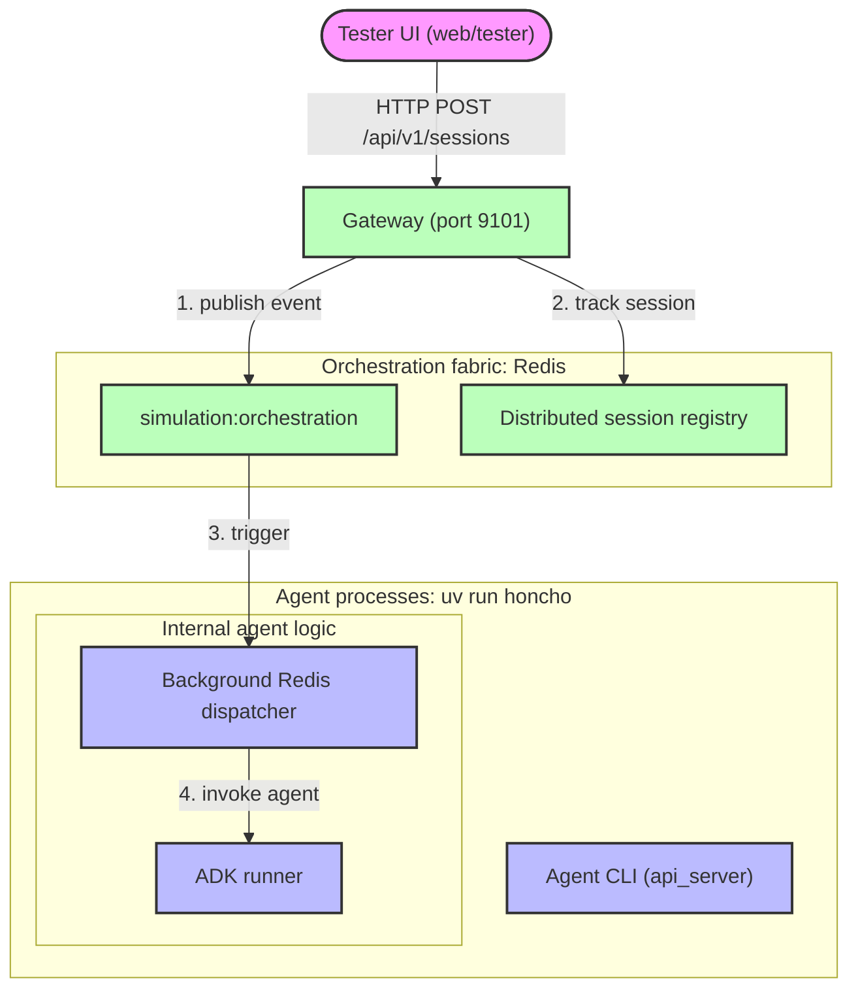
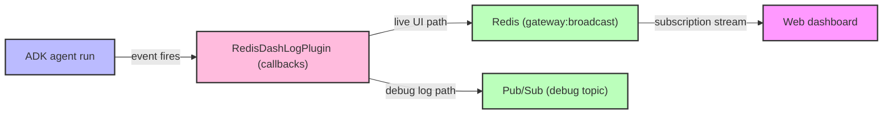

# Agent System Architecture

This document describes the topology and data flow of Race Condition's agent
network.

## A2A Network Topology

Each agent is an isolated process. Agents talk to each other over HTTP using the
A2A protocol; lifecycle events flow over Redis Pub/Sub.

### Why this shape

The gateway uses a dual dispatch model that branches on the agent's declared
mode. Each agent advertises `DISPATCH_MODE=subscriber` or `callable` in the
`Procfile` (and in the `n26:dispatch/1.0` extension on its agent card).

- **Subscriber mode** (`runner`, `runner_autopilot`): the agent holds a
  long-lived Redis subscription on `simulation:broadcast`. Pulses arrive
  with sub-millisecond latency.
- **Callable mode** (every other agent): no Redis listener. The agent only
  reacts to HTTP pokes on its `/orchestration` endpoint. This is the mode
  Cloud Run and Agent Engine require because both scale to zero between
  requests.

The gateway always sends the HTTP poke when there are active sessions for the
agent type, regardless of mode. Subscriber agents therefore receive the event
twice — once over Redis, once over HTTP — and the dispatcher de-duplicates
inside the agent process. The redundancy is intentional: the Redis path keeps
warm agents instantly responsive, and the HTTP path covers cold-start cases
and gives the gateway a single uniform "every interested agent gets poked"
guarantee.

Agents run a dedicated background thread (`RedisOrchestratorDispatcher`) that
listens for messages independently of the ADK's HTTP invocation lifecycle.
That separation is what lets the subscribers stay subscribed even when the
agent isn't actively servicing a request.

Agents still talk to each other directly on their local ports for A2A data
exchange. Only lifecycle management goes through Redis.

### GKE deployment variant

The LLM runner is also deployed on a dedicated GKE cluster (`runner-cluster`)
on the main VPC. The image is the same as the Cloud Run runner, but the agent
advertises itself under a distinct name (`runner_gke`) via the `AGENT_NAME` env
var. The gateway discovers it via `AGENT_URLS` pointing at an Internal
LoadBalancer, and treats `runner_gke` as a separate pool alongside
`runner_cloudrun` and `runner_autopilot`. Autoscaling is HPA-driven (20–200
pods).

## Telemetry streaming flow

Agent telemetry — tool calls, model invocations, routing events — is captured
in a single ADK plugin so the agent code itself stays clean.

### The `RedisDashLogPlugin` lifecycle

1. **Intercept.** The plugin hooks into ADK lifecycle callbacks (`agent_start`,
   `tool_start`, `model_end`, etc.).
2. **Enrich.** It attaches `session_id` and `invocation_id` to every payload so
   downstream consumers can stitch interleaved runs back together.
3. **Dual emit.** Each event is published asynchronously to two channels:
   `gateway:broadcast` on Redis (the dashboard's live source) and the agent
   debug-log Pub/Sub topic (consumed by offline tools and the admin UI's audit
   log). Async publishing keeps the agent execution thread unblocked.
4. **Display.** The dashboard subscribes to the gateway over WebSocket and
   orders events by `invocation_id`. There is nothing magical about the
   ordering — it's just a sort.

For implementation details, see `agents/utils/plugins.py:RedisDashLogPlugin`.

## Why these design choices

### `InMemorySessionService` instead of SQLite

ADK ships with a `SqliteSessionService` by default. SQLite uses a whole-file
lock, so once you spin up dozens of runners hitting the same session store the
write contention pushes lock-acquire latency past ADK's timeout and you get
`database is LOCKED` errors. Race Condition overrides the default with
`InMemorySessionService` for local development — each honcho process gets its
own heap and there's no cross-process write contention. In deployed environments
this is replaced with `VertexAiSessionService`, which delegates concurrency to
Google's session-store infrastructure.

### Latency budget

A single tick from UI input to dashboard render runs about 1.2 seconds end to
end on the local stack:

| Layer | Stage | Typical latency |
| :--- | :--- | :--- |
| Edge | Redis dispatcher trigger | < 2 ms |
| Logic | ADK context assembly (in-memory session) | 10–50 ms |
| AI | Vertex Flash-Lite first-token latency | 400–800 ms |
| Streaming | Redis broadcast → gateway → WebSocket → dashboard | < 100 ms |

The dominant cost is LLM TTFT. Optimizing anything else is rearranging deck
chairs until you change the model or batch the requests.
