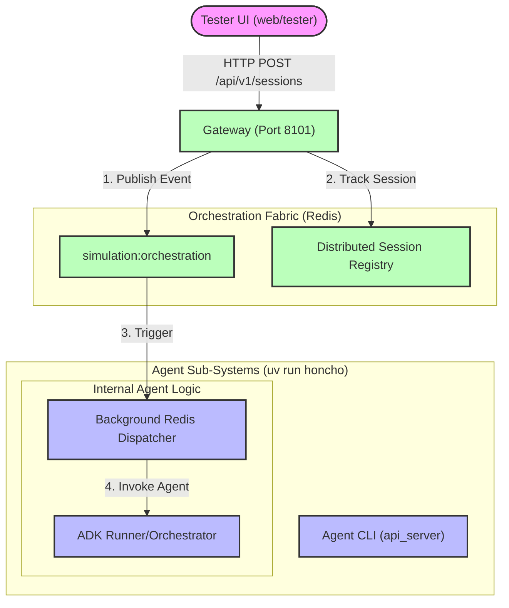
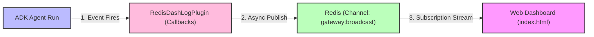

# Agent System Architecture

This document details the topological and data-flow architecture of the N26
Developer Key Simulation Agent Infrastructure.

## A2A Network Topology

The simulation relies on a distributed Agent-to-Agent (A2A) pattern. Agents are
isolated processes that communicate via HTTP, routed through local domains for
consistency.

### Key Architectural Decisions

1. **Hybrid Dispatch**: The Gateway uses a **Dual Dispatch** model. It publishes
   low-latency events to Redis Pub/Sub for active agents and sends explicit HTTP
   POST "wake-up" pokes via `/a2a/` endpoints for agents that are scaled to
   zero.
2. **Always-On Subscribers**: Agents run a dedicated background thread
   (`RedisDispatcher`) that listens for messages independently of the ADK's HTTP
   invocation lifecycle.
3. **Domain Routing**: Agents still communicate with each other using standard
   local ports for A2A data exchange, but lifecycle management is now
   event-driven.

### GKE Deployment Variant

The LLM-powered runner agent is also deployed on a dedicated GKE cluster
(`runner-cluster`) on the main VPC. This GKE deployment:

- Uses the **same container image** as `runner_cloudrun` (Cloud Run)
- Advertises a **distinct agent name** (`runner_gke`) via the `AGENT_NAME` env var
- Exposes an **Internal LoadBalancer** for gateway discovery via `AGENT_URLS`
- Provides **Kubernetes-native autoscaling** (HPA, 20-200 pods)

The gateway treats `runner_gke` as a separate agent pool alongside
`runner_cloudrun` and `runner_autopilot`.

## Telemetry Streaming Flow

Agent telemetry (tools, model invocations, routing events) is extracted globally
without polluting the core Agent logic.

### The `DashLogPlugin` Lifecycle

1. **Intercept**: The plugin hooks into intrinsic ADK lifecycle events
   (`agent_start`, `tool_start`, `model_end`).
2. **Enrichment**: The plugin attaches the critical `session_id` and
   `invocation_id` to every stray payload.
3. **Transport**: The enriched JSON payload is fired asynchronously to the local
   GCP Pub/Sub emulator to avoid blocking the synchronous Agent execution
   thread.
4. **Reconstitution**: The Dashboard connects to the Pub/Sub emulator's
   WebSocket interface and mathematically reconstructs the interleaved logs by
   sorting chronologically on `invocation_id`.
