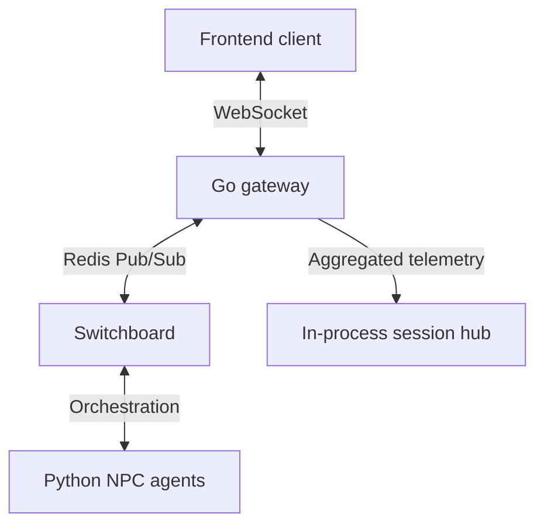
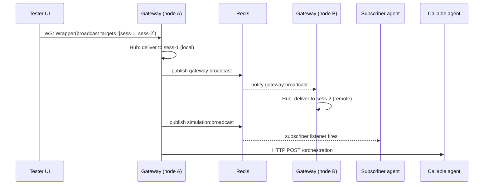

# Communication Protocol

How the simulation frontend (Tester UI, audience sidecar, dashboard) talks to
the backend gateway, and how the gateway routes messages between front-end
sessions and Python agents.

## 1. Architectural overview

The simulation uses a hybrid transport model: binary protobuf for high-volume
real-time traffic, JSON for human-readable lifecycle commands, REST for
discovery and stateless ingress.



## 2. Transport layers

### 2.1. Protobuf over WebSocket (primary)

All high-frequency or state-critical events. Messages are binary-encoded using
the `gateway.Wrapper` envelope. Binary encoding is materially smaller than the
JSON-RPC alternative — see the benchmarks in `internal/hub/`.

### 2.2. JSON-RPC (administrative)

Simulation lifecycle commands (initial load, jump-to-phase). Low frequency,
human-readable, useful when debugging by hand.

### 2.3. REST (bootstrap & public)

Endpoints for agent discovery (`/.well-known/agent-card.json`), session
creation, and stateless audience reactions.

## 3. The `gateway.Wrapper` envelope

All WebSocket binary frames decode to a `Wrapper`. The full schema is in
`gen_proto/gateway/gateway.proto`; reproduced here for reference:

```proto
message Wrapper {
  string timestamp = 1;
  string type = 2;       // data type: "text", "json", "a2ui", "telemetry"
  string request_id = 3;
  string session_id = 4;
  bytes payload = 5;     // serialized payload content
  Origin origin = 6;
  repeated string destination = 7; // session UUIDs; empty means broadcast
  string status = 8;
  string event = 9;      // semantic event: "narrative", "tool_call", "model_end"
  bytes metadata = 10;   // JSON metadata (token counts, model ID, etc.)
  string simulation_id = 11; // groups frames by simulation run
}
```

Two fields drive most of the routing logic:

- **`type`** classifies the wire format of `payload`: `"text"`, `"json"`,
  `"a2ui"`, or `"telemetry"`. The gateway and frontends dispatch
  `payload` decoding off this.
- **`event`** is the semantic event name: `"narrative"` for agent text
  output, `"tool_call"` and `"model_end"` for ADK lifecycle telemetry,
  and so on. The dashboard and audit log filter on this.

## 4. Routing mechanisms

### 4.1. The Hub (per-instance session routing)

The Go `Hub` maintains a map of active WebSocket connections inside one
gateway process. It handles two routing patterns: global broadcasts that
fan out to every connected client, and targeted delivery to specific
`session_id`s (or groups of IDs).

### 4.2. The Switchboard (cross-instance sync)

The `Switchboard` uses Redis to synchronize events across multiple gateway
instances. If an agent is connected to gateway A and the user is on gateway B,
the Switchboard ensures the message still gets there.

### 4.3. Multi-session broadcast

Targeted multi-session broadcast lets a single admin client (e.g. the Tester
UI) send one message that fans out to multiple agents or user sessions.

The mechanism uses the `Wrapper` envelope and a `BroadcastRequest`
sub-message:

```proto
message BroadcastRequest {
  bytes payload = 1;
  repeated string target_session_ids = 2;
  bool async = 3;
}
```

When the gateway receives a broadcast request it does three things in
parallel, all over Redis:

1. **Local Hub fan-out.** The gateway looks up the listed
   `target_session_ids` in its in-process Hub and delivers the wrapper to any
   matching local connections. If specific targets are listed, the Hub never
   does a global broadcast.
2. **Cross-instance fan-out via the `gateway:broadcast` channel.** The
   Switchboard publishes the wrapper to that Redis Pub/Sub channel. Other
   gateway instances pick it up and run their own local Hub fan-out.
3. **Agent-side fan-out via the `simulation:broadcast` channel.** The gateway
   transforms the wrapper into a JSON orchestration event and publishes it
   to `simulation:broadcast` on Redis. Subscriber-mode agents (`runner`,
   `runner_autopilot`) hold a long-lived subscription on this channel.
   Callable-mode agents are reached separately via HTTP `/orchestration`
   pokes; see `agent_architecture.md` for the dual-dispatch detail.



The gateway never needs to know which node holds which session: Redis
fan-out handles cross-node delivery, the `simulation:broadcast` channel
handles subscriber-mode agents, and the HTTP poke handles callable-mode
agents (which can be scaled to zero between events).

## 5. Agent-to-client response flow

The reverse direction (agent → client) reuses the `Wrapper` envelope. There
is no separate `NarrativePulse` message type — the "narrative pulse" name
refers to a *category* of wrapper (`event="narrative"`), not a distinct
protobuf:

1. **Agent output.** When an agent generates text or triggers a tool, the
   Python dispatcher intercepts the event via the `RedisDashLogPlugin`.
2. **Wrap.** The dispatcher constructs a `Wrapper` with `type="json"` and
   `event="narrative"` (or `event="tool_call"` / `event="model_end"` /
   etc. depending on the lifecycle event). See `agents/utils/pulses.py`
   for the helpers; `emit_narrative_pulse` is a thin wrapper around the
   generic `emit_gateway_message`.
3. **Relay.** The agent publishes the serialized wrapper to
   `gateway:broadcast` on Redis.
4. **Delivery.** All gateway instances receive the message from Redis and
   deliver it to their connected clients via the local Hub.

### 5.1. A2UI embedding

If an agent tool returns an A2UI component, the dispatcher embeds the
stringified JSON payload into the wrapper's `payload` field with
`type="a2ui"`. Frontend clients dispatch on the `type` field: `"a2ui"`
payloads go to the rendering engine, which validates them against the
v0.8.0 spec (capitalized primitive names like `"Card"`, `"List"`) and
mounts the resulting component tree.

## 6. Security & isolation

- **Inbound filtering.** The gateway classifies WebSocket connections as
  testing or audience. Audience connections are restricted to `reaction`
  message types so they cannot hijack the simulation.
