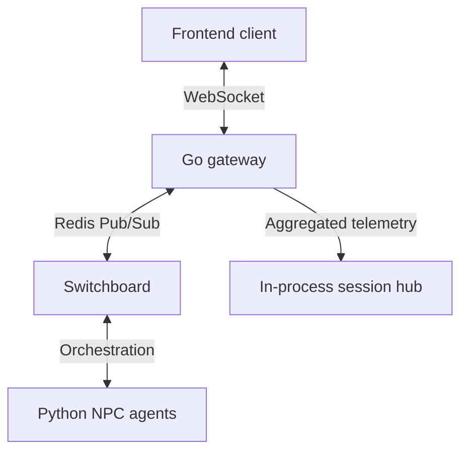
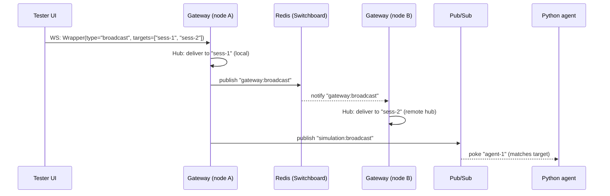

# Communication Protocol

How the simulation frontend (Tester UI, audience sidecar, dashboard) talks to
the backend gateway, and how the gateway routes messages between front-end
sessions and Python agents.

## 1. Architectural overview

The simulation uses a hybrid transport model: binary protobuf for high-volume
real-time traffic, JSON for human-readable lifecycle commands, REST for
discovery and stateless ingress.



## 2. Transport layers

### 2.1. Protobuf over WebSocket (primary)

All high-frequency or state-critical events. Messages are binary-encoded using
the `gateway.Wrapper` envelope. Binary encoding is materially smaller than the
JSON-RPC alternative — see the benchmarks in `internal/hub/`.

### 2.2. JSON-RPC (administrative)

Simulation lifecycle commands (initial load, jump-to-phase). Low frequency,
human-readable, useful when debugging by hand.

### 2.3. REST (bootstrap & public)

Endpoints for agent discovery (`/.well-known/agent-card.json`), session
creation, and stateless audience reactions.

## 3. The `gateway.Wrapper` envelope

All WebSocket binary frames decode to a `Wrapper`:

```proto
message Wrapper {
  string type = 1;       // e.g. "broadcast", "reaction", "narrative"
  string request_id = 2; // UUID for tracing
  string session_id = 3; // source or target session
  bytes payload = 4;     // sub-message payload
}
```

## 4. Routing mechanisms

### 4.1. The Hub (per-instance session routing)

The Go `Hub` maintains a map of active WebSocket connections inside one
gateway process. It handles:

- **Global broadcasts** — fan-out to every connected client.
- **Targeted sessions** — direct delivery to specific `session_id`s or groups
  of IDs.

### 4.2. The Switchboard (cross-instance sync)

The `Switchboard` uses Redis to synchronize events across multiple gateway
instances. If an agent is connected to gateway A and the user is on gateway B,
the Switchboard ensures the message still gets there.

### 4.3. Multi-session broadcast

Targeted multi-session broadcast lets a single admin client (e.g. the Tester
UI) send one message that fans out to multiple agents or user sessions.

The mechanism uses the `Wrapper` envelope and a `BroadcastRequest`
sub-message:

```proto
message BroadcastRequest {
  bytes payload = 1;
  repeated string target_session_ids = 2;
  bool async = 3;
}
```

When the gateway receives a `Wrapper` with `type="broadcast"` it does three
things in parallel:

1. **Local Hub fan-out.** The gateway looks up the listed
   `target_session_ids` in its in-process Hub and delivers the wrapper to any
   matching local connections. If specific targets are listed, the Hub never
   does a global broadcast.
2. **Cross-instance fan-out via Redis.** The Switchboard publishes the
   wrapper to the global `gateway:broadcast` Redis channel. Other gateway
   instances pick it up from the channel and run their own local Hub fan-out.
3. **Agent-side fan-out via Pub/Sub.** The gateway transforms the wrapper
   into a JSON orchestration event and publishes it to `simulation:broadcast`
   on Pub/Sub. Python agents subscribe to that topic and "poke" themselves
   only when their `session_id` matches one of the targets.



The gateway never needs to know which node holds which session: Redis fan-out
handles cross-node delivery, and Pub/Sub handles agent-side routing.

## 5. Agent-to-client response flow

The reverse direction (agent → client) uses the `narrative` message type:

1. **Agent output.** When an agent generates text or triggers a tool, the
   Python dispatcher intercepts the event.
2. **Binary wrapping.** The dispatcher wraps the output in a
   `gateway.NarrativePulse` protobuf, then places that pulse inside a
   `gateway.Wrapper` with `type="narrative"`.
3. **Relay.** The agent publishes the wrapper to `gateway:broadcast` on
   Redis.
4. **Delivery.** All gateway instances receive the message from Redis and
   deliver it to their connected clients via the local Hub.

### 5.1. A2UI embedding

If an agent tool returns an A2UI component, the dispatcher embeds the
stringified JSON payload into the `text` field of the `NarrativePulse`.
Frontend clients check the `text` field for JSON fragments containing A2UI
primitives (capitalized names per the v0.8.0 spec, e.g. `"Card"`, `"List"`)
and route them to the rendering engine.

## 6. Security & isolation

- **Inbound filtering.** The gateway classifies WebSocket connections as
  testing or audience. Audience connections are restricted to `reaction`
  message types so they cannot hijack the simulation.
