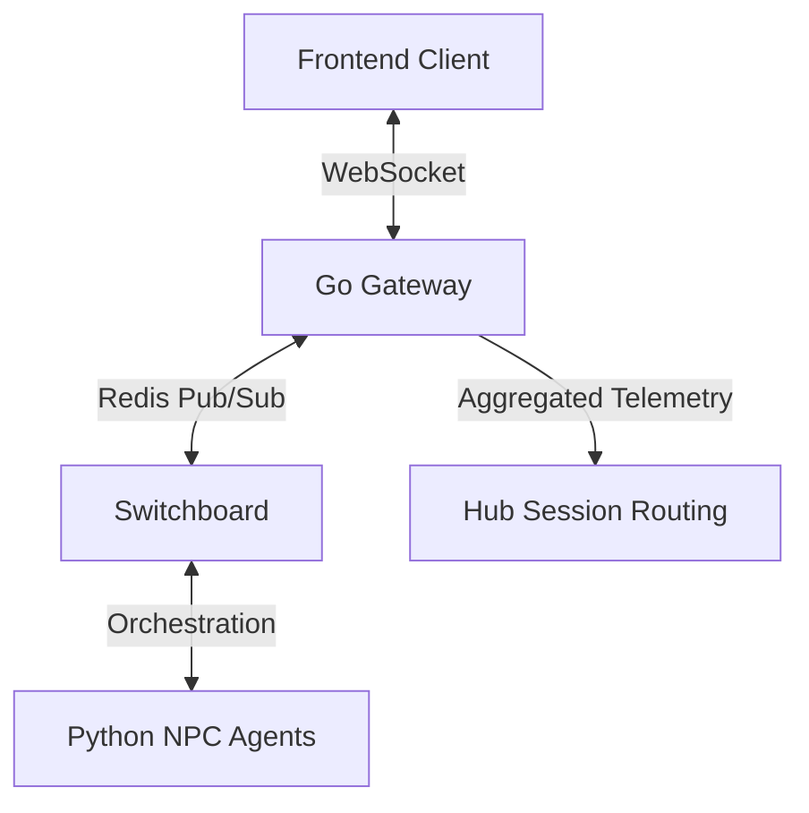

# Communication Protocol Architecture

This document describes the multi-layered communication architecture between the simulation frontend (Tester UI, Audience Sidecar) and the backend gateway.

## 1. Architectural Overview

The simulation uses a hybrid transport model to balance administrative control with high-frequency telemetry.



## 2. Transport Layers

### 2.1. Protobuf over WebSocket (Primary)
Used for all high-frequency or state-critical events. Messages are binary-encoded using the `gateway.Wrapper` envelope. This reduces bandwidth by ~60% compared to JSON.

### 2.2. JSON-RPC (Administrative)
Used for simulation lifecycle commands (Initial Load, Jump to Phase). These are low-frequency and benefit from the human-readability of JSON during debugging.

### 2.3. REST (Bootstrap & Public)
Endpoints for agent discovery, session creation, and stateless audience reactions.

## 3. The `gateway.Wrapper` Envelope

All WebSocket binary frames MUST decode to a `Wrapper` message:

```proto
message Wrapper {
  string type = 1;       // e.g., "broadcast", "reaction", "narrative"
  string request_id = 2; // UUID for tracing
  string session_id = 3; // Source or Target session
  bytes payload = 4;     // Sub-message payload
}
```

## 4. Routing Mechanisms

### 4.1. The Hub (Session Routing)
The Go `Hub` maintains a map of active WebSocket connections. It handles:
- **Global Broadcasts**: Fan-out to all connected clients.
- **Targeted Sessions**: Direct delivery to specific `session_id`s or groups of IDs. See [Multi-Session Routing](multi_session_routing.md) for technical implementation details.

### 4.2. The Switchboard (Distributed Sync)
The `Switchboard` uses Redis to synchronize events across multiple Gateway instances. This ensures that even if an agent is connected to Gateway A and the user is on Gateway B, messages are routed correctly.

## 5. Security & Isolation

- **Inbound Filtering**: Gateway classifies connections (Testing vs. Audience). Audience connections are restricted to `reaction` types to prevent simulation hijacking.
- **DLP Compliance**: All text payloads are scanned to prevent PII leakage in simulation logs.
