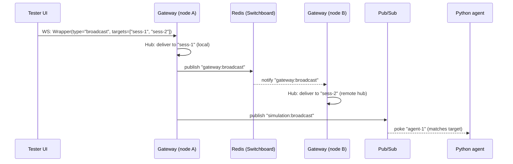

# Multi-Session Routing

The Race Condition gateway supports targeted multi-session broadcasting: a
single admin client (such as the Tester UI) sends one message and the gateway
fans it out to multiple simulation agents or user sessions.

## 1. Protocol Mechanism

The mechanism relies on the `gateway.Wrapper` binary envelope and the
`gateway.BroadcastRequest` sub-message.

### The Request Flow

1. **Client Message**: The client sends a `BinaryMessage` frame containing a
   `gateway.Wrapper`.
2. **Wrapper Type**: The `type` field must be set to `"broadcast"`.
3. **Payload**: The `payload` field contains a serialized
   `gateway.BroadcastRequest` Protobuf message.
4. **Targeting**: The `BroadcastRequest` includes a
   `repeated string target_session_ids` field.

```proto
message BroadcastRequest {
  bytes payload = 1;
  repeated string target_session_ids = 2;
  bool async = 3;
}
```

## 2. Gateway Processing Logic

When the Gateway receives a "broadcast" wrapper:

### 2.1. Internal Hub Fan-out

The Gateway passes the wrapper to the `Switchboard`, which uses the local `Hub`
to find all active WebSocket connections matching any of the
`target_session_ids`.

- **Optimization**: The `Hub` only sends to the specific sessions listed in
  `target_session_ids`, avoiding a global broadcast if specific targets are
  provided.

### 2.2. Distributed Fan-out (Redis)

The `Switchboard` publishes the wrapper to the global `gateway:broadcast` Redis
channel. Every other Gateway instance listening on that channel will receive the
message and perform its own local `Hub` fan-out. This ensures delivery even if
target sessions are balanced across different Go instances.

### 2.3. Orchestration Fan-out (Pub/Sub)

The Gateway transforms the Protobuf request into a JSON orchestration event and
publishes it to the `simulation:broadcast` Pub/Sub topic.

- **Routing to Agents**: Python-based agents subscribe to this topic. The
  orchestration layer filters the events and "pokes" only the agents whose
  `session_id` matches one of the `targets`.

## 3. Visual Routing Logic



## 4. Agent-to-Client Response Flow

The reverse flow (Agent -> Client) is orchestrated using the `narrative` message
type.

### 4.1. Narrative Relay

1. **Agent Output**: When an agent generates text or triggers a tool, the Python
   `dispatcher` intercepts the event.
2. **Binary Wrapping**: The dispatcher wraps the output in a
   `gateway.NarrativePulse` Protobuf message.
3. **Envelope**: The pulse is then placed inside a `gateway.Wrapper` with
   `type="narrative"`.
4. **Relay**: The agent publishes this wrapper to the `gateway:broadcast` Redis
   channel.
5. **Gateway Delivery**: All Gateway instances receive the Redis message and
   deliver it to connected clients via the `Hub`.

### 4.2. A2UI Embedding Logic

If an agent tool returns an A2UI component (e.g., a video player), the
dispatcher **embeds the stringified JSON payload** directly into the `text`
field of the `NarrativePulse`.

Frontend clients should check the `text` field for JSON fragments containing
A2UI primitives (capitalized names per the v0.8.0 spec, e.g. `"Card"`,
`"List"`) and pass them to the rendering engine.

The gateway never needs to know which node holds which session — Redis fan-out
handles cross-node delivery, and Pub/Sub handles agent-side routing.
