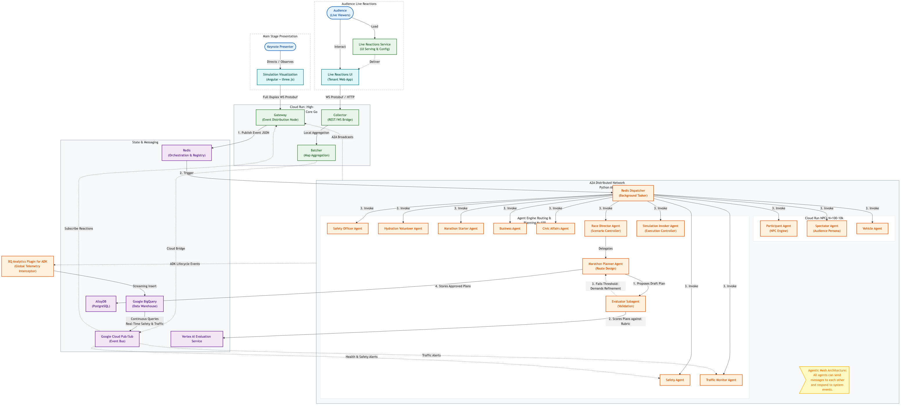

# System Architecture

This document tracks the high-level architecture of the `n26-devkey-simulation-code` backend, including both the high-performance telemetry pipeline in Go and the agent-to-agent distributed network in Python.



## Source (Mermaid)

The source map of this diagram is maintained in `system_architecture.mmd`. 

To update the high-resolution diagram after making changes, run the Mermaid CLI:
```bash
mmdc -i system_architecture.mmd -o system_architecture.png -s 4 -b white
```

```mermaid
flowchart TD
    %% Modern Professional Color Palette
    classDef client fill:#E3F2FD,stroke:#1565C0,stroke-width:2px,color:#0D47A1;
    classDef golang fill:#E8F5E9,stroke:#2E7D32,stroke-width:2px,color:#1B5E20;
    classDef python fill:#FFF3E0,stroke:#E65100,stroke-width:2px,color:#E65100;
    classDef infra fill:#F3E5F5,stroke:#6A1B9A,stroke-width:2px,color:#4A148C;
    classDef web fill:#E0F7FA,stroke:#00838F,stroke-width:2px,color:#004D40;
    classDef note fill:#FFF9C4,stroke:#FBC02D,stroke-width:2px,color:#F57F17;

    %% Subgraph Styling
    style MainStage fill:#ffffff,stroke:#ccc,stroke-width:2px,stroke-dasharray: 5 5
    style HighPerformanceCore fill:#f8f9fa,stroke:#adb5bd,stroke-width:2px
    style Infrastructure fill:#f8f9fa,stroke:#adb5bd,stroke-width:2px
    style AgentSubsystem fill:#f8f9fa,stroke:#adb5bd,stroke-width:2px
    style CloudRun fill:#ffffff,stroke:#dee2e6,stroke-width:1px
    style AgentEngine fill:#ffffff,stroke:#dee2e6,stroke-width:1px

    %% Main Stage Box (Primary Starting Point)
    subgraph MainStage[Main Stage Presentation]
        KeynotePresenter(["Keynote Presenter"]):::client
        SimulationVisualization["Simulation Visualization<br/>(Angular + three.js)"]:::web
    end

    %% Go Backend Services
    subgraph HighPerformanceCore[Cloud Run: High-Performance Core Go]
        Gateway["Gateway<br/>(Event Distribution Node)"]:::golang
    end

    %% Infrastructure Layer
    subgraph Infrastructure[State & Messaging]
        Redis["Redis<br/>(Orchestration & Registry)"]:::infra
        PubSub["Google Cloud Pub/Sub<br/>(Event Bus)"]:::infra
        BigQuery["Google BigQuery<br/>(Data Warehouse)"]:::infra
        AlloyDB["AlloyDB<br/>(PostgreSQL)"]:::infra
        VertexAIEval["Vertex AI Evaluation Service"]:::infra
    end

    %% Python Agent Subsystem
    subgraph AgentSubsystem[A2A Distributed Network Python ADK]
        Dispatcher["Redis Dispatcher<br/>(Background Tasker)"]:::python
        
        AgenticMeshNote>Agentic Mesh Architecture:<br/>All agents can send messages to each other<br/>and respond to system events.]:::note
        
        subgraph CloudRun[Cloud Run NPCs N=100-10k]
            ParticipantAgent["Participant Agent<br/>(NPC Engine)"]:::python
            SpectatorAgent["Spectator Agent<br/>(Audience Persona)"]:::python
            VehicleAgent["Vehicle Agent"]:::python
        end

        subgraph GKE[GKE Runner Cluster N=20-200]
            RunnerGKEAgent["Runner GKE Agent<br/>(LLM Runner on K8s)"]:::python
        end

        subgraph AgentEngine[Agent Engine Routing & Planning N<100]
            SafetyOfficerAgent["Safety Officer Agent"]:::python
            HydrationVolunteerAgent["Hydration Volunteer Agent"]:::python
            SafetyAgent["Safety Agent"]:::python
            TrafficMonitorAgent["Traffic Monitor Agent"]:::python
            MarathonStarterAgent["Marathon Starter Agent"]:::python
            BusinessAgent["Business Agent"]:::python
            CivicAffairsAgent["Civic Affairs Agent"]:::python
            RaceDirectorAgent["Race Director Agent<br/>(Scenario Controller)"]:::python
            MarathonPlannerAgent["Marathon Planner Agent<br/>(Route Design)"]:::python
            SimulationInvokerAgent["Simulation Invoker Agent<br/>(Execution Controller)"]:::python
        end
    end
    
    BQAnalyticsPlugin["BQ Analytics Plugin for ADK<br/>(Global Telemetry Interceptor)"]:::python

    %% --- Data Flows ---

    %% Main Stage Flow
    KeynotePresenter -->|Directs / Observes| SimulationVisualization
    SimulationVisualization -->|Full Duplex WS Protobuf| Gateway

    %% Agent Invocation Flow
    Gateway -->|1. Publish Event JSON| Redis
    Redis -->|2. Trigger| Dispatcher
    Dispatcher -->|3. Invoke| ParticipantAgent
    Dispatcher -->|3. Invoke| SafetyOfficerAgent
    Dispatcher -->|3. Invoke| VehicleAgent
    Dispatcher -->|3. Invoke| HydrationVolunteerAgent
    Dispatcher -->|3. Invoke| SafetyAgent
    Dispatcher -->|3. Invoke| TrafficMonitorAgent
    Dispatcher -->|3. Invoke| MarathonStarterAgent
    Dispatcher -->|3. Invoke| BusinessAgent
    Dispatcher -->|3. Invoke| CivicAffairsAgent
    Dispatcher -->|3. Invoke| RaceDirectorAgent
    Dispatcher -->|3. Invoke| SpectatorAgent
    Dispatcher -->|3. Invoke| SimulationInvokerAgent
    Dispatcher -->|3. Invoke| RunnerGKEAgent
    RaceDirectorAgent -->|Delegates| MarathonPlannerAgent

    %% State & Storage Edges
    MarathonPlannerAgent -->|Stores Approved Plans| AlloyDB
    MarathonPlannerAgent -->|Scores Plans against Rubric| VertexAIEval

    %% Streaming Analytics Feedback Loop
    BigQuery -->|Continuous Queries<br/>Real-Time Safety & Traffic| PubSub
    PubSub -.->|Health & Safety Alerts| SafetyAgent
    PubSub -.->|Traffic Alerts| TrafficMonitorAgent

    %% Agent Communication & Telemetry
    AgentSubsystem -.->|A2A Broadcasts| Gateway
    AgentSubsystem -.->|ADK Lifecycle Events| BQAnalyticsPlugin
    BQAnalyticsPlugin -->|Streaming Insert| BigQuery
```


