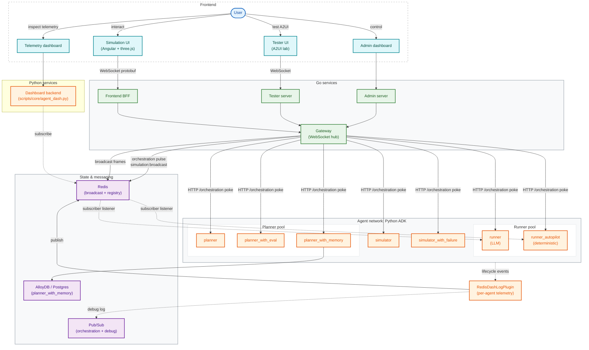

# System Architecture

High-level architecture of the Race Condition backend: the Go services that
handle the high-frequency telemetry pipeline, and the Python agent network
built on Google ADK.

This diagram reflects what actually exists in the repo today (`cmd/`,
`internal/`, `agents/`). Earlier versions described aspirational components;
those have been pruned. If you add a new agent or service, update both
`system_architecture.mmd` and the inline mermaid block below.

## Notes on the diagram

- **Two dispatch modes.** `runner` and `runner_autopilot` use *subscriber*
  mode (`DISPATCH_MODE=subscriber` in the `Procfile`) — they hold a long-lived
  Redis subscription on `simulation:broadcast` so they wake on a pulse with
  near-zero latency. Every other agent uses *callable* mode
  (`DISPATCH_MODE=callable`) and only reacts to HTTP pokes on its
  `/orchestration` endpoint. The gateway always sends the HTTP poke
  regardless of mode, so subscribers receive the event twice; the
  dispatcher de-duplicates inside the agent process. Callable mode is what
  makes scale-to-zero possible on Cloud Run / Agent Engine in production.
- **GCP Pub/Sub is only used for the debug-log topic.** The "orchestration"
  channel `simulation:broadcast` lives on Redis, not GCP Pub/Sub.
  `RedisDashLogPlugin` is the only thing in the system that publishes to
  GCP Pub/Sub.
- **No BigQuery feedback loop.** Older versions of this diagram showed a
  BigQuery → Pub/Sub continuous-query loop and a `BQAnalyticsPlugin`. Neither
  exists in the repo.
- **GKE deployment.** The runner is also deployed on GKE in production via
  `infra/modules/gke-runner/`. Locally it runs as a single process on port
  9108. The diagram shows the local topology.
