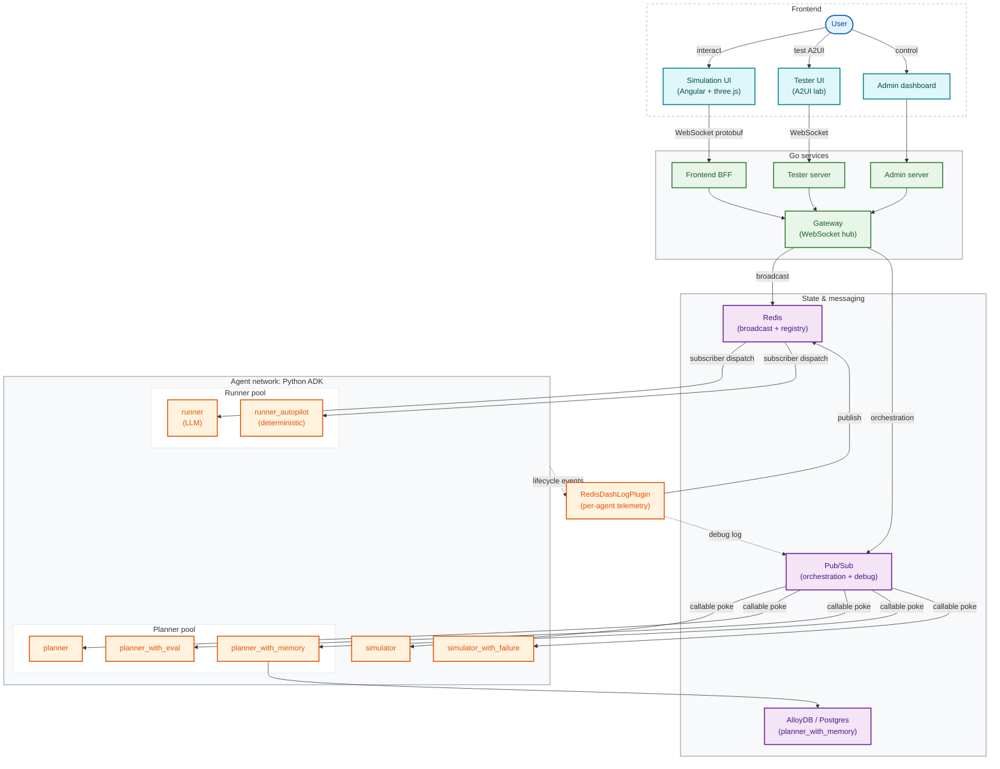

# System Architecture

High-level architecture of the Race Condition backend: the Go services that
handle the high-frequency telemetry pipeline, and the Python agent network
built on Google ADK.

This diagram reflects what actually exists in the repo today (`cmd/`,
`internal/`, `agents/`). Earlier versions described aspirational components;
those have been pruned. If you add a new agent or service, update both
`system_architecture.mmd` and the inline mermaid block below.

## Notes on the diagram

- **Two dispatch modes.** `runner` and `runner_autopilot` use *subscriber*
  mode — they hold a long-lived Redis subscription and react to broadcasts.
  All other agents use *callable* mode and are poked over Pub/Sub when needed.
  See `Procfile` for the `DISPATCH_MODE` per agent.
- **No BigQuery feedback loop.** Older versions of this diagram showed a
  BigQuery → Pub/Sub continuous-query loop and a `BQAnalyticsPlugin`. Neither
  exists in the repo. Telemetry is dual-emitted to Redis (live UI) and
  Pub/Sub (debug log) by the `RedisDashLogPlugin` and that's the whole
  pipeline.
- **GKE deployment**. The runner is also deployed on GKE in production via
  `infra/modules/gke-runner/`. Locally it runs as a single process on port
  9108. The diagram shows the local topology.
