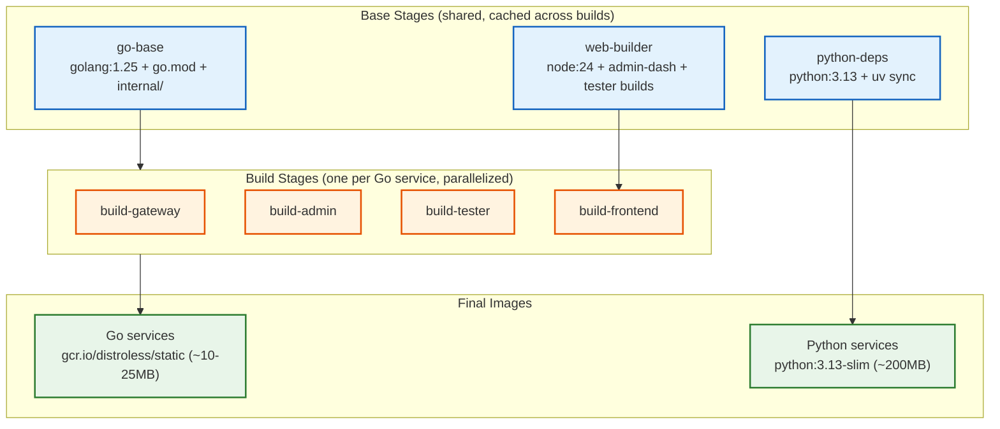

# Backend Services

This guide covers building container images, configuring environment variables,
and deploying all backend services to Cloud Run and Vertex AI Agent Engine.

> **Previous step:** [Infrastructure](02-infrastructure.md)

## 1. Create Environment File

Copy the example environment file and name it for your environment:

```bash
cp .env.example .env.YOUR-ENV
# e.g., cp .env.example .env.dev
```

See [`.env.dev`](../../.env.dev) for a fully populated cloud example. Below is a
walkthrough of each variable group.

### Port and address variables

These control local-development ports. **For Cloud Run, you can leave the
defaults** -- Cloud Run ignores port variables and serves on `8080` internally.
The `PORT`, `*_PORT`, and `*_ADDR` variables are only used by Honcho (local
process management).

```bash
# These are fine as-is for cloud deployment:
PORT=8000
GATEWAY_PORT=8101
# ... etc.
```

### Service URLs

Each Cloud Run service gets a per-service custom domain following the pattern
`https://{service}.{env}.{domain}`. During initial deployment, set these to
placeholders -- they become real after Cloud Run services are deployed and DNS is
configured in [step 5](05-domain-and-auth.md):

```bash
GATEWAY_URL=https://gateway.YOUR-ENV.YOUR-DOMAIN
ADMIN_URL=https://admin.YOUR-ENV.YOUR-DOMAIN
TESTER_URL=https://tester.YOUR-ENV.YOUR-DOMAIN
DASH_URL=https://dash.YOUR-ENV.YOUR-DOMAIN
```

### Infrastructure

These come from Terraform outputs (see [02-infrastructure.md, Section 7](02-infrastructure.md#7-capture-outputs)):

```bash
# Redis -- Memorystore IP:port from Terraform output `redis_host`
REDIS_ADDR=10.x.x.x:6379

# Pub/Sub -- uses real GCP Pub/Sub (NOT the emulator)
# Do NOT set PUBSUB_EMULATOR_HOST for cloud deployments
PUBSUB_PROJECT_ID=YOUR-DEV-PROJECT-ID
PUBSUB_TOPIC_ID=agent-telemetry
ORCHESTRATION_TOPIC_ID=specialist-orchestration

# GCS artifact bucket
GCS_ARTIFACT_BUCKET=
```

### GCP settings

```bash
PROJECT_ID=YOUR-DEV-PROJECT-ID
GOOGLE_CLOUD_PROJECT=YOUR-DEV-PROJECT-ID
GOOGLE_CLOUD_LOCATION=global
GOOGLE_GENAI_USE_VERTEXAI=TRUE
```

> **Important:** `GOOGLE_CLOUD_LOCATION=global` is required for Gemini 3 model
> access during the preview phase. The deployment script (`deploy.py`) sets this
> automatically for Cloud Run services. Agent Engine deployments temporarily
> override it to the real region (`us-central1`) since Agent Engine requires a
> regional endpoint.

### Authentication and CORS

```bash
# IAP OAuth client ID -- from Secret Manager or Terraform output
# Leave empty for first deploy; populate after step 5
IAP_CLIENT_ID=

# CORS -- placeholder for now, updated in step 5
# deploy.py auto-generates this from UI service domains
# Note: frontend is not behind the LB by default, so add its .run.app URL if needed
CORS_ALLOWED_ORIGINS=https://admin.YOUR-ENV.YOUR-DOMAIN,https://tester.YOUR-ENV.YOUR-DOMAIN,https://dash.YOUR-ENV.YOUR-DOMAIN
```

### Agent Engine URLs

These are populated **after** deploying agents in Phase 3 (Section 4 below).
Leave them empty initially:

```bash
SIMULATOR_INTERNAL_URL=
PLANNER_INTERNAL_URL=
DEBUG_INTERNAL_URL=
PLANNER_WITH_EVAL_INTERNAL_URL=
SIMULATOR_WITH_FAILURE_INTERNAL_URL=
```

### Gateway agent discovery

The gateway discovers agents by fetching `/.well-known/agent-card.json` from
each URL in `AGENT_URLS`. This is populated after Phase 3:

```bash
AGENT_URLS=
```

## 2. Build Docker Images

### Dockerfile architecture

The [`Dockerfile`](../../Dockerfile) uses a multi-stage build with three shared
base stages and per-service final images:



**Go services** (4): Each compiles a static binary with `CGO_ENABLED=0` and runs
on `distroless/static-debian12:nonroot`. The entry point is baked into each
image -- no `--command` or `--args` needed at deploy time.

**Python services** (3): `dash`, `runner_autopilot`, and `runner_cloudrun` are
built on `python:3.13-slim` with dependencies installed via
`uv sync --frozen --no-dev`. Each has its own `CMD`.

### Build all images

```bash
make docker-build-all
```

This builds all 7 service images using Docker BuildKit. Shared base stages are
cached, so subsequent builds are fast.

### Build individual images

```bash
make docker-build-gateway
make docker-build-admin
# ... etc.
```

### Build targets and sizes

| Make Target | Dockerfile Target | Base Image | Approx. Size |
| :--- | :--- | :--- | :--- |
| `docker-build-gateway` | `gateway` | `distroless/static` | ~15 MB |
| `docker-build-admin` | `admin` | `distroless/static` | ~15 MB |
| `docker-build-tester` | `tester` | `distroless/static` | ~15 MB |
| `docker-build-frontend` | `frontend` | `distroless/static` | ~15 MB |
| `docker-build-dash` | `dash` | `python:3.13-slim` | ~200 MB |

### Custom registry or tag

```bash
# Custom registry
make docker-build-all REGISTRY=us-central1-docker.pkg.dev/YOUR-PROJECT/cloudrun

# Custom tag
make docker-build-all TAG=v1.2.3

# Both
make docker-build-gateway REGISTRY=us-central1-docker.pkg.dev/YOUR-PROJECT/cloudrun TAG=v1.2.3
```

> **Note:** The `frontend` service requires pre-built Angular assets in
> `web/frontend/dist/`. These come from the separate `frontend` repository and
> are covered in [04-frontend.md](04-frontend.md).

## 3. Push to Artifact Registry

### Configure Docker authentication

```bash
gcloud auth configure-docker us-central1-docker.pkg.dev
```

This stores credentials for the Artifact Registry in your Docker config. You
only need to run this once per machine.

### Push images

The Makefile tags images with the registry path already. Push them:

```bash
REPO="us-central1-docker.pkg.dev/YOUR-PROJECT-ID/cloudrun"

# Push all services
for SERVICE in gateway admin tester frontend dash; do
  docker push "${REPO}/${SERVICE}:latest"
done
```

Or push individual images:

```bash
docker push us-central1-docker.pkg.dev/YOUR-PROJECT-ID/cloudrun/gateway:latest
```

## 4. Deploy Cloud Run Services (Dependency Order)

The deployment script [`scripts/deploy/deploy.py`](../../scripts/deploy/deploy.py) manages
deploying services to both Cloud Run and Vertex AI Agent Engine. It:

- Auto-loads `.env.{env}` files (e.g., `.env.dev`)
- Constructs per-service domain URLs (`https://{service}.{env}.{domain}`)
- Builds the full set of environment variables for each service
- Generates CORS origins from the UI service list
- Configures VPC connector, min instances, and ingress settings
- For Agent Engine agents, handles source packaging, staging, and deployment via
  the Vertex AI SDK

### Service registry

`deploy.py` defines two service types:

| Type | Services | Deployment Target |
| :--- | :--- | :--- |
| `run` | gateway, admin, tester, frontend, dash, runner_autopilot, runner_cloudrun | Cloud Run |
| `reasoning-engine` | simulator, planner, debug, planner_with_eval, simulator_with_failure | Vertex AI Agent Engine |
| `gke` | runner_gke | GKE (Kubernetes) |

### `deploy.py` interface

```bash
python scripts/deploy/deploy.py SERVICE [OPTIONS]

# Positional:
#   SERVICE              Service name (e.g., "gateway") or "all"

# Options:
#   --env ENV            Environment name (default: dev)
#   --project PROJECT    GCP project ID (default: from env)
#   --domain DOMAIN      Base domain (default: from env)
#   --region REGION       GCP region (default: us-central1)
#   --redis ADDR         Redis address (default: from env)
#   --gcs-bucket BUCKET  GCS artifact bucket name
#   --iap-client-id ID   IAP OAuth client ID
#   --build              Build frontend + container image before deploying
#   --image-only         Build image only, don't deploy
#   --verify             Verify health endpoint after deployment
```

### Phase 1: Redis + Pub/Sub dependent services

The **dash** service needs Redis and Pub/Sub. Ensure your `.env.YOUR-ENV` has
the correct `REDIS_ADDR` from Terraform output before deploying:

```bash
python scripts/deploy/deploy.py dash --env YOUR-ENV
```

### Phase 2: Agent Engine services

Agent Engine agents are deployed differently from Cloud Run services. Instead of
container images, `deploy.py` uploads Python source code directly to Vertex AI
using the `vertexai.agent_engines.create()` SDK:

```bash
python scripts/deploy/deploy.py simulator --env YOUR-ENV
python scripts/deploy/deploy.py planner --env YOUR-ENV
python scripts/deploy/deploy.py debug --env YOUR-ENV
python scripts/deploy/deploy.py planner_with_eval --env YOUR-ENV
python scripts/deploy/deploy.py simulator_with_failure --env YOUR-ENV
```

For each agent, `deploy.py`:

1. Initializes the Vertex AI SDK with the project and a staging GCS bucket
2. Dynamically imports the agent module (e.g., `agents.simulator.agent`) to get
   the `A2aAgent` instance
3. Reads dependencies from `pyproject.toml`
4. Stages source packages to a clean temp directory, filtering out `__pycache__`,
   test files, `.adk/` state, and other non-essential files
5. Calls `agent_engines.create()` with the agent, requirements, staged packages,
   environment variables, PSC network attachment, and service account
6. Prints the A2A endpoint URL for catalog wiring

**Agent Engine environment variables** set automatically:

| Variable | Value |
| :--- | :--- |
| `PROJECT_ID` | Your project ID |
| `DISPATCH_MODE` | `callable` (A2A JSON-RPC, not HTTP poke) |
| `GATEWAY_URL` | `https://gateway.{env}.{domain}` |
| `REDIS_ADDR` | From env file |
| `PUBSUB_PROJECT_ID` | Your project ID |
| `PUBSUB_TOPIC_ID` | `agent-telemetry` |
| `ORCHESTRATION_TOPIC_ID` | `specialist-orchestration` |
| `GOOGLE_CLOUD_LOCATION` | `global` |
| `GOOGLE_GENAI_USE_VERTEXAI` | `true` |

> **Important:** Agent Engine requires `AGENT_ENGINE_LOCATION` (defaults to
> `us-central1`), which is a real region -- not `global`. The deployment script
> temporarily overrides `GOOGLE_CLOUD_LOCATION` to the regional value during
> Agent Engine deployment, then restores it.

After each agent deploys successfully, `deploy.py` prints the A2A endpoint URL:

```
✅ Agent Engine deployed successfully!
   Resource:     projects/YOUR-NUMBER/locations/us-central1/reasoningEngines/XXXXXXX
   Engine ID:    XXXXXXX
   A2A Endpoint: https://us-central1-aiplatform.googleapis.com/v1beta1/projects/YOUR-NUMBER/locations/us-central1/reasoningEngines/XXXXXXX

📌 Set this env var on the gateway for catalog wiring:
   SIMULATOR_INTERNAL_URL=https://us-central1-aiplatform.googleapis.com/v1beta1/projects/...
```

**Capture these URLs** -- you need them for Phase 4.

### Phase 2.5: GKE Runner

The `runner_gke` service deploys the same LLM-powered runner container image to
a dedicated GKE cluster on the main VPC. This requires the GKE cluster to be
provisioned via Terraform first (see
[02-infrastructure.md](02-infrastructure.md)).

> **Prerequisites:**
> - GKE cluster `runner-cluster` created via Terraform (`code-infra/projects/dev/runner_gke.tf`)
> - Kustomize manifests applied (`code-infra/k8s/runner/overlays/{env}/`)
> - `kubectl` configured for the runner cluster

```bash
python scripts/deploy/deploy.py runner_gke --env YOUR-ENV
```

`deploy.py` will:

1. Authenticate to the GKE cluster via `gcloud container clusters get-credentials`
2. Apply the kustomize overlay from `../code-infra/k8s/runner/overlays/{env}/`
3. Wait for the deployment rollout to complete
4. Print the Internal LoadBalancer IP for gateway wiring

After deployment, capture the Internal LB IP and add it to your `.env.YOUR-ENV`:

```bash
# Add to .env.YOUR-ENV:
RUNNER_GKE_INTERNAL_URL=http://<internal-lb-ip>:8207
```

Then re-deploy the gateway (Phase 3) to pick up the new agent URL.

### Phase 3: Gateway

The gateway needs agent URLs to discover and route to agents. After Phase 2
and Phase 2.5, update your `.env.YOUR-ENV` with the Agent Engine URLs and the
GKE Internal LB URL from each deployment:

```bash
# Add to .env.YOUR-ENV:
SIMULATOR_INTERNAL_URL=https://us-central1-aiplatform.googleapis.com/v1beta1/projects/.../reasoningEngines/...
PLANNER_INTERNAL_URL=https://us-central1-aiplatform.googleapis.com/v1beta1/projects/.../reasoningEngines/...
DEBUG_INTERNAL_URL=https://us-central1-aiplatform.googleapis.com/v1beta1/projects/.../reasoningEngines/...
PLANNER_WITH_EVAL_INTERNAL_URL=https://us-central1-aiplatform.googleapis.com/v1beta1/projects/.../reasoningEngines/...
SIMULATOR_WITH_FAILURE_INTERNAL_URL=https://us-central1-aiplatform.googleapis.com/v1beta1/projects/.../reasoningEngines/...

# GKE Runner (from Phase 2.5)
RUNNER_GKE_INTERNAL_URL=http://<internal-lb-ip>:8207
```

Then deploy the gateway:

```bash
python scripts/deploy/deploy.py gateway --env YOUR-ENV
```

`deploy.py` automatically constructs the `AGENT_URLS` environment variable for
the gateway from the Agent Engine agent URLs, Cloud Run URLs, and GKE Internal
LB URLs in the `*_INTERNAL_URL` environment variables.

The gateway uses `AGENT_URLS` for **dynamic agent discovery** -- at startup, it
fetches `/.well-known/agent-card.json` from each URL to build its agent catalog.

### Phase 4: UI services

UI services serve web frontends and proxy API/WebSocket requests to the gateway.
Deploy them last:

```bash
python scripts/deploy/deploy.py admin --env YOUR-ENV
python scripts/deploy/deploy.py tester --env YOUR-ENV
python scripts/deploy/deploy.py frontend --env YOUR-ENV
```

> **Note:** The `frontend` service requires pre-built Angular assets. See
> [04-frontend.md](04-frontend.md) for building and copying the frontend
> distribution before deploying this service.

### Deploy everything at once

If your `.env.YOUR-ENV` is fully populated (including Agent Engine URLs from a
previous deployment), you can deploy all Cloud Run services in one command:

```bash
python scripts/deploy/deploy.py all --env YOUR-ENV
```

This deploys every service in the registry. Agent Engine services (`reasoning-engine`
type) are deployed via the Vertex AI SDK; Cloud Run services (`run` type) are
deployed via `gcloud run deploy`.

## 5. Post-Deployment Configuration

### Capture Agent Engine URLs

After Phase 2, you must capture the Agent Engine A2A endpoint URLs and persist
them in your `.env.YOUR-ENV` file. Each `deploy.py` run prints the URL -- copy
the `*_INTERNAL_URL=...` line for each agent.

The URL format is:

```
https://{region}-aiplatform.googleapis.com/v1beta1/projects/{project-number}/locations/{region}/reasoningEngines/{engine-id}
```

### Re-deploy gateway with agent URLs

After updating `.env.YOUR-ENV` with all Agent Engine URLs, re-deploy the
gateway so it picks up the full agent catalog:

```bash
python scripts/deploy/deploy.py gateway --env YOUR-ENV
```

### Verify agent discovery

The gateway exposes its discovered agents at the health endpoint. After
deployment, verify that all agents are registered:

```bash
python scripts/deploy/deploy.py gateway --env YOUR-ENV --verify
```

This runs `gcloud run services describe gateway` to confirm the service is
healthy. You can also test agent discovery directly once DNS is configured (see
[step 5](05-domain-and-auth.md)):

```bash
curl https://gateway.YOUR-ENV.YOUR-DOMAIN/health
```

### Internal vs. external URLs

`deploy.py` sets two URL types for each Cloud Run service:

| Variable Pattern | Example | Purpose |
| :--- | :--- | :--- |
| `{SERVICE}_URL` | `https://gateway.dev.example.com` | Browser-facing, IAP-protected |
| `{SERVICE}_INTERNAL_URL` | `https://gateway-{number}.{region}.run.app` | Service-to-service, bypasses IAP |

Internal URLs are used by services that need to communicate directly (e.g.,
tester to gateway for WebSocket proxying). The project number is resolved
automatically by `deploy.py` via `gcloud projects describe`.

## 6. Alternative: Cloud Build Pipeline

For automated CI/CD, the project includes two Cloud Build configurations.

### `cloudbuild.yaml` -- full pipeline

Builds all 7 service images, pushes them, and deploys to Cloud Run in a single
pipeline:

```bash
gcloud builds submit \
  --config cloudbuild.yaml \
  --substitutions \
    _TARGET_PROJECT_ID="YOUR-PROJECT-ID",\
    _ENV_NAME="YOUR-ENV",\
    _DOMAIN="YOUR-DOMAIN",\
    _REDIS_ADDR="10.x.x.x:6379",\
    _IAP_CLIENT_ID="YOUR-CLIENT-ID.apps.googleusercontent.com",\
    _PUBSUB_TOPIC_ID="agent-telemetry",\
    _ORCHESTRATION_TOPIC_ID="specialist-orchestration" \
  .
```

Available substitutions:

| Substitution | Default | Description |
| :--- | :--- | :--- |
| `_TARGET_PROJECT_ID` | `n26-devkey-simulation-dev` | GCP project ID |
| `_ENV_NAME` | `dev` | Environment name |
| `_DOMAIN` | `keynote2026.cloud-demos.goog` | Base domain |
| `_REDIS_ADDR` | (empty) | Redis IP:port |
| `_GCS_ARTIFACT_BUCKET` | (empty) | GCS bucket for artifacts |
| `_IAP_CLIENT_ID` | (empty) | IAP OAuth client ID |
| `_PUBSUB_TOPIC_ID` | `agent-telemetry` | Pub/Sub telemetry topic |
| `_ORCHESTRATION_TOPIC_ID` | `specialist-orchestration` | Pub/Sub orchestration topic |

### `cloudbuild-service.yaml` -- single service

Builds and pushes a single service image. Used internally by `deploy.py --build`:

```bash
gcloud builds submit \
  --config cloudbuild-service.yaml \
  --substitutions \
    _SERVICE=gateway,\
    _TAG=us-central1-docker.pkg.dev/YOUR-PROJECT/cloudrun/gateway:latest \
  .
```

### Limitations

- Cloud Build does **not** deploy Agent Engine agents. The `deploy-agent-engine`
  step in `cloudbuild.yaml` is a placeholder. Use `deploy.py` for Agent Engine
  deployments.
- Cloud Build does not auto-load `.env` files. All configuration must be passed
  via substitutions.
- For iterative development, `deploy.py` is faster since it deploys individual
  services without rebuilding everything.

---

> **Next step:** [Frontend](04-frontend.md)
