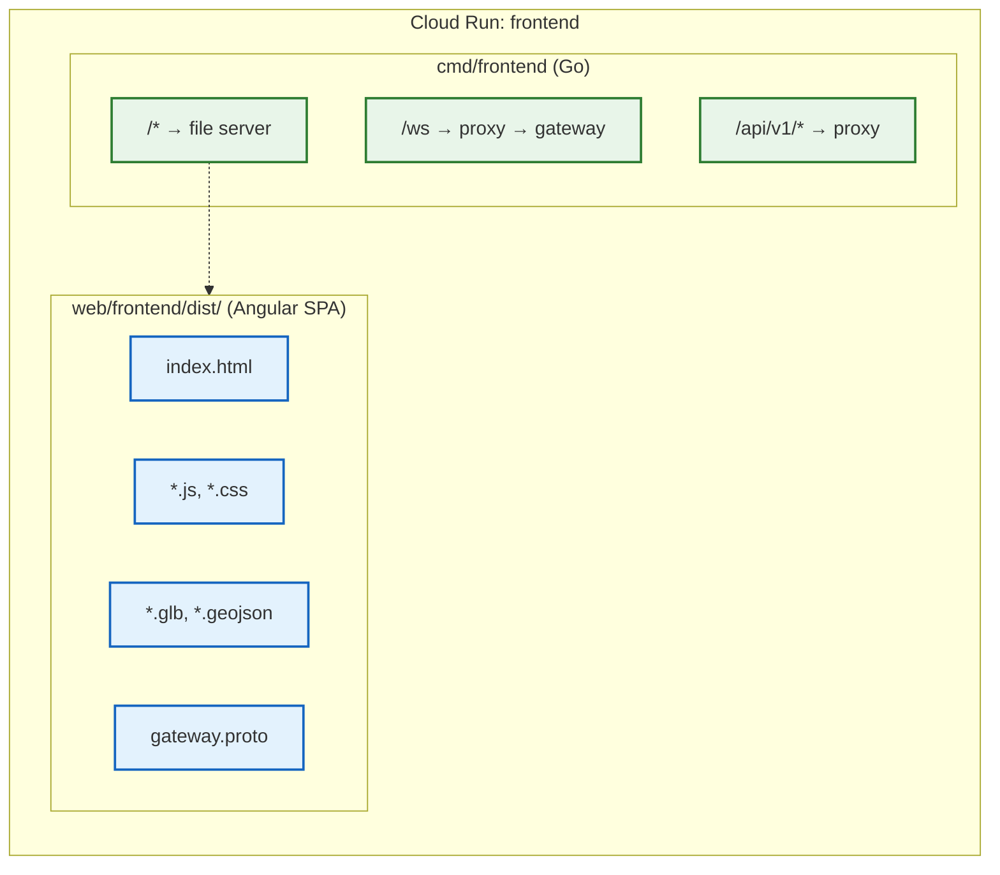

# Frontend

This guide covers building the Angular frontend application and deploying it as
a Cloud Run service. The frontend provides the 3D simulation viewport using
Three.js and connects to the backend gateway for agent communication.

> **Previous step:** [Backend Services](03-backend-services.md)

## 1. Overview

The frontend is an **Angular 21** single-page application that renders a 3D
simulation using **Three.js**. It communicates with the backend gateway over two
channels:

- **WebSocket** (protobuf-encoded) -- for real-time agent event streaming
  (connects to `/ws`)
- **HTTP REST** -- for spawning agents (`POST /api/v1/spawn`) and other API
  calls

The frontend has **no Dockerfile of its own**. Instead, it is built externally
and its static output is copied into the backend repository, where the
[`Dockerfile`](../../Dockerfile) `frontend` stage packages it with a Go BFF
(backend-for-frontend) binary. The Go binary
([`cmd/frontend/main.go`](../../cmd/frontend/main.go)) serves the static assets
and proxies WebSocket and API requests to the gateway, attaching OIDC tokens for
IAP-protected environments.

### How the frontend service works



The Go BFF injects a `/config.js` endpoint that overrides `NG_APP_GATEWAY_URL`
and `NG_APP_GATEWAY_ADDR` to use relative paths (`/ws` and empty string
respectively). This means the browser connects to the **frontend service
itself**, which proxies to the gateway internally. This avoids CORS issues and
allows IAP token attachment on the server side.

## 2. Configure Environment

The frontend repository uses [`@ngx-env/builder`](https://github.com/nickvdyck/ngx-env)
to inject environment variables at **build time** via `import.meta.env`.

### Create the `.env` file

```bash
cd ../frontend   # Navigate to the frontend repository root
cp .env.example .env
```

### Set the gateway URLs

Edit `.env` with your deployed gateway's URLs:

```bash
NG_APP_GATEWAY_URL=wss://gateway.YOUR-ENV.YOUR-DOMAIN/ws
NG_APP_GATEWAY_ADDR=https://gateway.YOUR-ENV.YOUR-DOMAIN
```

These variables are declared in
[`src/vite-env.d.ts`](../../../frontend/src/vite-env.d.ts):

```typescript
interface ImportMetaEnv {
  readonly NG_APP_GATEWAY_URL: string;
  readonly NG_APP_GATEWAY_ADDR: string;
}
```

And consumed in
[`src/app/agent-gateway.ts`](../../../frontend/src/app/agent-gateway.ts):

```typescript
const wsUrl = import.meta.env.NG_APP_GATEWAY_URL || 'ws://127.0.0.1:8101/ws';
```

> **Important:** These values are **baked into the JavaScript bundle at build
> time**, not runtime-configurable. If you change the gateway URL, you must
> rebuild the frontend. However, in the deployed Cloud Run setup, the Go BFF
> serves `/config.js` which overrides these to relative paths -- so the
> build-time values are only used for local development.

## 3. Build the Frontend

From the `frontend` repository root:

```bash
cd ../frontend
npm install
npm run build
```

This runs `ng build` (with `@ngx-env/builder:application` as the builder), which
produces a production build with output hashing.

### Build output

The build output goes to:

```
frontend/dist/client/browser/
├── index.html
├── *.js          # Angular bundles (hashed filenames)
├── *.css         # Compiled SCSS styles
├── gateway.proto # Protobuf schema (loaded at runtime by protobufjs)
└── assets/
    ├── *.glb     # Three.js 3D models
    └── *.geojson # Geographic data for the simulation map
```

### Build budgets

The Angular build enforces size budgets (defined in `angular.json`):

| Budget Type | Warning | Error |
| :--- | :--- | :--- |
| Initial bundle | 500 kB | 1.5 MB |
| Any component style | 16 kB | 24 kB |

## 4. Build the Docker Image

The frontend Docker image is built from the **backend** repository's Dockerfile.
The `frontend` stage expects pre-built Angular assets at `web/frontend/dist/`
within the build context.

### Copy the build output

After building the frontend (Section 3), copy the output into the backend repo:

```bash
# From the backend repository root
mkdir -p web/frontend/dist
rsync -av --delete ../frontend/dist/client/browser/ web/frontend/dist/
```

This places the Angular SPA files where the Dockerfile expects them:

```dockerfile
# From the Dockerfile — frontend final stage
FROM gcr.io/distroless/static-debian12:nonroot AS frontend
WORKDIR /app
COPY --from=build-frontend /bin/service /bin/service
COPY web/frontend/dist/ ./web/frontend/dist/
ENTRYPOINT ["/bin/service"]
```

The image contains:

1. **`/bin/service`** -- the Go binary compiled from `cmd/frontend/main.go`,
   which serves static files from `./web/frontend/dist/` and proxies `/ws` and
   `/api/v1/*` requests to the gateway
2. **`./web/frontend/dist/`** -- the Angular SPA assets

### Build the image

```bash
make docker-build-frontend
```

This runs:

```bash
docker buildx build --target frontend -t us-central1-docker.pkg.dev/YOUR-PROJECT/cloudrun/frontend:latest --load .
```

To use a custom registry or tag:

```bash
make docker-build-frontend REGISTRY=us-central1-docker.pkg.dev/YOUR-PROJECT/cloudrun TAG=v1.0.0
```

### Automated build (alternative)

The `deploy.py --build` flag automates the entire process -- it builds the
frontend from the sibling `../frontend` directory, syncs the output, and builds
the Docker image via Cloud Build:

```bash
python scripts/deploy/deploy.py frontend --build --env YOUR-ENV
```

This calls `build_frontend()` internally, which:

1. Builds the admin-dash and tester web UIs (for other services)
2. Runs `npm install` and `npm run build` in `../frontend`
3. Rsyncs `../frontend/dist/client/browser/` to `web/frontend/dist/`
4. Submits a Cloud Build job to build the `frontend` Docker target

## 5. Push and Deploy

### Push to Artifact Registry

```bash
docker push us-central1-docker.pkg.dev/YOUR-PROJECT/cloudrun/frontend:latest
```

### Deploy to Cloud Run

```bash
python scripts/deploy/deploy.py frontend --env YOUR-ENV
```

This deploys the frontend service to Cloud Run with:

- The `frontend:latest` image from Artifact Registry
- Environment variables including `GATEWAY_URL` and `GATEWAY_INTERNAL_URL` for
  the Go BFF's WebSocket/API proxy
- VPC connector for internal service-to-service communication
- Min instances set to 1

The Go BFF uses `GATEWAY_INTERNAL_URL` (the internal Cloud Run URL that bypasses
IAP) to proxy requests to the gateway. It attaches OIDC tokens using the
`IAP_CLIENT_ID` when proxying to IAP-protected services.

## 6. Verify

### Access the frontend

> **Note:** The frontend service is NOT routed through the load balancer or IAP
> by default. It is accessed directly via its Cloud Run URL. If you want it
> behind the load balancer with a custom domain, add `"frontend"` to the
> `local.services` map in `iap.tf` and re-apply Terraform.

Access the frontend using its Cloud Run URL:

```bash
gcloud run services describe frontend --region YOUR-REGION --format='value(status.url)'
```

Open that URL in your browser. You should see the 3D simulation viewport
rendered by Three.js.

### Check WebSocket connectivity

Open the browser developer console (F12). You should see:

```
AgentGateway: connecting monitor to /ws
AgentGateway: monitor connected
```

The frontend connects to `/ws` (relative path, proxied by the Go BFF), which
forwards to the gateway's WebSocket endpoint. If you see reconnection messages
instead:

```
AgentGateway: monitor disconnected — reconnecting in 2s
```

Check that:

1. The gateway service is running and healthy
2. The `GATEWAY_INTERNAL_URL` environment variable on the frontend service
   points to the gateway's internal Cloud Run URL
3. The VPC connector allows traffic between the frontend and gateway services

### Test agent spawning

Click the UI control to spawn an agent. The browser issues a `POST /api/v1/spawn`
request (proxied through the Go BFF to the gateway). If the gateway has
discovered agents (via `AGENT_URLS`), you should see the agent appear in the 3D
viewport.

---

> **Next step:** [Domain & Auth](05-domain-and-auth.md)
