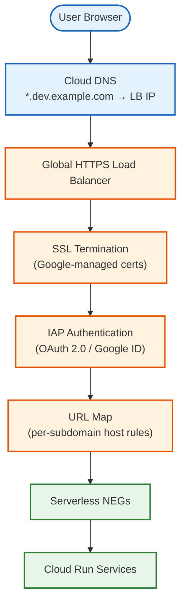
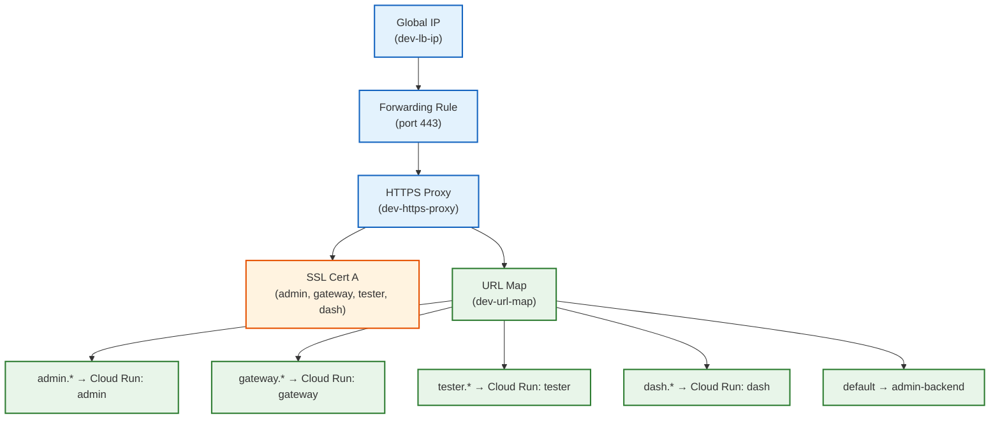

# Domain & Authentication

This guide covers connecting your deployed Cloud Run services to a custom domain
with SSL certificates and Identity-Aware Proxy (IAP) authentication.

> **Previous step:** [Frontend](04-frontend.md)

## 1. Overview

The domain and authentication layer sits in front of all Cloud Run services,
providing:

- **Custom subdomains** for each service (e.g., `gateway.dev.example.com`)
- **Google-managed SSL certificates** for HTTPS
- **Identity-Aware Proxy (IAP)** for SSO-style authentication

Traffic flows through this architecture:



The Terraform in `iap.tf` creates all of this as a single unit. Each of the
**4 services** gets its own subdomain, serverless NEG, and backend service with
IAP enabled:

| Subdomain     | Cloud Run Service |
| :------------ | :---------------- |
| `admin.*`     | admin             |
| `gateway.*`   | gateway           |
| `tester.*`    | tester            |
| `dash.*`      | dash              |

> **Note:** Agent Engine services (simulator, planner, debug, etc.) are
> accessed internally via Vertex AI endpoints and are not exposed through the
> load balancer.

## 2. Domain Setup

### 2.1 Choose your domain

The Terraform creates a Cloud DNS managed zone for your domain. In the reference
deployment, this is:

```hcl
# dns.tf
resource "google_dns_managed_zone" "dev_keynote2026" {
  name     = "dev-keynote2026-cloud-demos-goog"
  dns_name = "dev.keynote2026.cloud-demos.goog."
}
```

If you are using a different domain, update the `domain_suffix` local in
`iap.tf`:

```hcl
locals {
  domain_suffix = "dev.your-domain.com"  # Change this
}
```

And update `dns.tf` to match your domain.

### 2.2 Configure NS records at your registrar

After applying the Terraform that creates the DNS zone (done in
[Infrastructure](02-infrastructure.md)), retrieve the nameservers:

```bash
# Get nameservers from Terraform output
cd code-infra/projects/dev
terraform output dev_zone_name_servers
```

This returns a list of nameservers like:

```
[
  "ns-cloud-a1.googledomains.com.",
  "ns-cloud-a2.googledomains.com.",
  "ns-cloud-a3.googledomains.com.",
  "ns-cloud-a4.googledomains.com.",
]
```

At your domain registrar, create **NS records** for the subdomain zone (e.g.,
`dev.your-domain.com`) pointing to these Google Cloud DNS nameservers.

### 2.3 Wait for NS propagation

NS propagation typically takes 5-30 minutes but can take up to 48 hours
depending on your registrar. Verify with:

```bash
dig +short NS dev.your-domain.com
```

You should see the Google Cloud DNS nameservers in the response.

## 3. OAuth Consent Screen and Client Credentials

IAP requires an OAuth 2.0 client for user authentication. Create one in the
GCP Console.

### 3.1 Create the OAuth consent screen

1. Go to **APIs & Services → OAuth consent screen** in the
   [GCP Console](https://console.cloud.google.com/apis/credentials/consent)
2. Select user type:
   - **Internal** -- only users within your Google Workspace organization
     (recommended for private deployments)
   - **External** -- any Google account (requires verification for production)
3. Fill in the required fields:
   - **App name:** N26 DevKey Simulation
   - **User support email:** your email
   - **Developer contact:** your email
4. Click **Save and Continue** through the Scopes and Test Users sections
   (defaults are sufficient)

### 3.2 Create OAuth 2.0 client credentials

1. Go to **APIs & Services → Credentials** in the
   [GCP Console](https://console.cloud.google.com/apis/credentials)
2. Click **+ CREATE CREDENTIALS → OAuth client ID**
3. Select **Web application** as the application type
4. Set the name (e.g., `IAP Client - Dev`)
5. Under **Authorized redirect URIs**, add a URI for each service:

   ```
   https://iap.googleapis.com/v1/oauth/clientIds/CLIENT_ID:handleRedirect
   ```

   > **Note:** You will need to come back and update this URI after you have
   > the client ID. The format requires the client ID itself in the redirect
   > URI.

6. Click **Create** and note the **Client ID** and **Client Secret**

### 3.3 Store credentials securely

The Terraform automatically stores these credentials in Secret Manager:

```hcl
# secrets.tf
resource "google_secret_manager_secret" "iap_client_id" {
  secret_id = "iap-oauth2-client-id"
}

resource "google_secret_manager_secret" "iap_client_secret" {
  secret_id = "iap-oauth2-client-secret"
}
```

The compute service account is granted `roles/secretmanager.secretAccessor` on
both secrets, so Cloud Run services can read them at runtime.

## 4. Update Terraform and Apply

### 4.1 Set variables

Add the OAuth credentials to your `terraform.tfvars`:

```hcl
# code-infra/projects/dev/terraform.tfvars
iap_oauth2_client_id     = "YOUR_CLIENT_ID.apps.googleusercontent.com"
iap_oauth2_client_secret = "YOUR_CLIENT_SECRET"
```

> **Security:** Never commit `terraform.tfvars` to version control. It is
> already in `.gitignore`.

### 4.2 Apply Terraform

```bash
cd code-infra/projects/dev
terraform plan    # Review the resources to be created
terraform apply
```

This creates the following resources (defined in `iap.tf`):

| Resource Type | Count | Description |
| :--- | :--- | :--- |
| `google_compute_region_network_endpoint_group` | 4 | Serverless NEGs (one per Cloud Run service) |
| `google_compute_backend_service` | 4 | Backend services with IAP enabled |
| `google_iap_web_backend_service_iam_binding` | 4 | IAP access bindings per backend |
| `google_compute_url_map` | 1 | URL map with host rules routing subdomains to backends |
| `google_compute_managed_ssl_certificate` | 1 | SSL certificate (max 5 domains per cert) |
| `google_compute_target_https_proxy` | 1 | HTTPS proxy connecting URL map to SSL cert |
| `google_compute_global_address` | 1 | Static global IP for the load balancer |
| `google_compute_global_forwarding_rule` | 1 | Forwarding rule binding port 443 to the proxy |
| `google_dns_record_set` | 4 | DNS A records (one per service, all pointing to LB IP) |

### 4.3 Understand the resource relationships



With only 4 services, all domains fit within a single Google-managed
certificate (maximum of 5 domains per certificate when using load balancer
authorization):

- **Cert A:** `admin`, `gateway`, `tester`, `dash`

## 5. SSL Certificate Provisioning

### 5.1 Provisioning timeline

Google-managed SSL certificates are created automatically by Terraform, but
**provisioning takes 15-60 minutes** after the DNS A records resolve to the
load balancer IP. During this time, HTTPS requests will fail with certificate
errors.

### 5.2 Check certificate status

```bash
# List all SSL certificates
gcloud compute ssl-certificates list --global

# Check a specific certificate's status
gcloud compute ssl-certificates describe CERT_NAME --global \
  --format="get(managed.status)"
```

Status values:

| Status | Meaning |
| :--- | :--- |
| `PROVISIONING` | Certificate is being issued (wait) |
| `ACTIVE` | Certificate is ready |
| `FAILED_NOT_VISIBLE` | DNS does not resolve to LB IP |
| `FAILED_CAA_CHECKING` | CAA record blocks issuance |
| `FAILED_CAA_FORBIDDEN` | CAA record explicitly forbids Google |
| `FAILED_RATE_LIMITED` | Too many certificate requests |

### 5.3 Check per-domain status

Each certificate covers multiple domains. Check individual domain status:

```bash
gcloud compute ssl-certificates describe CERT_NAME --global \
  --format="yaml(managed.domainStatus)"
```

### 5.4 Troubleshooting certificate provisioning

Certificates will **not** provision until all of these conditions are met:

1. **DNS A records exist** -- each subdomain must have an A record pointing to
   the global LB IP address
2. **DNS resolves** -- `dig +short admin.dev.your-domain.com` must return the
   LB IP
3. **No CAA conflicts** -- if your domain has CAA records, ensure
   `pki.goog` is allowed:

   ```bash
   dig CAA your-domain.com
   # If CAA records exist, add: 0 issue "pki.goog"
   ```

4. **NS delegation is complete** -- the nameservers at your registrar must
   point to Google Cloud DNS

If certificates are stuck in `PROVISIONING`:

```bash
# Verify the LB IP
gcloud compute addresses describe dev-lb-ip --global \
  --format="get(address)"

# Verify DNS resolves to that IP
dig +short gateway.dev.your-domain.com

# These should match
```

## 6. IAP Access Configuration

### 6.1 Default access bindings

The Terraform creates IAP access bindings for each backend service, granting
the `roles/iap.httpsResourceAccessor` role:

```hcl
# iap.tf
resource "google_iap_web_backend_service_iam_binding" "iap_access" {
  for_each = local.services
  role     = "roles/iap.httpsResourceAccessor"

  members = [
    "domain:google.com",
    "domain:cloud-demos.goog",
    "domain:northkingdom.com",
    local.compute_sa,
  ]
}
```

The default deployment grants access to:

- `domain:google.com` -- all Google employees
- `domain:cloud-demos.goog` -- demo environment accounts
- `domain:northkingdom.com` -- partner organization
- The compute service account (for service-to-service communication)

### 6.2 Customize for your deployment

**External deployers must replace these with their own access grants.** Edit
the `members` list in `iap.tf` using one or more of these member types:

| Member format | Example | Scope |
| :--- | :--- | :--- |
| `domain:` | `domain:example.com` | All users in a Google Workspace domain |
| `user:` | `user:alice@example.com` | A single Google account |
| `group:` | `group:team@example.com` | A Google Group |
| `serviceAccount:` | `serviceAccount:sa@project.iam.gserviceaccount.com` | A service account |

Example for an external deployment:

```hcl
members = [
  "domain:your-company.com",
  "user:external-reviewer@gmail.com",
  "group:demo-team@your-company.com",
  local.compute_sa,
]
```

> **Important:** Always keep `local.compute_sa` in the members list. This
> allows service-to-service communication (e.g., Pub/Sub push subscriptions
> to the gateway use OIDC tokens with the IAP client ID as the audience).

### 6.3 Test IAP authentication

1. Open any service URL in your browser (e.g.,
   `https://admin.dev.your-domain.com`)
2. You should be redirected to Google sign-in
3. Sign in with an account that is in the IAP access list
4. After authentication, you should see the service response

If you get a **403 Forbidden** after signing in, your account is not in the
IAP access list. Update the `members` in `iap.tf` and re-apply Terraform.

## 7. CORS Configuration

Services that accept cross-origin requests (primarily the gateway) need their
CORS configuration updated to include the custom domain origins.

### 7.1 Update `.env.{env}`

Set `CORS_ALLOWED_ORIGINS` to a comma-separated list of all frontend service
origins:

```bash
# .env.dev
CORS_ALLOWED_ORIGINS=https://admin.dev.your-domain.com,https://tester.dev.your-domain.com,https://dash.dev.your-domain.com
```

For reference, the dev environment uses:

```bash
CORS_ALLOWED_ORIGINS=https://admin.dev.keynote2026.cloud-demos.goog,https://tester.dev.keynote2026.cloud-demos.goog,https://dash.dev.keynote2026.cloud-demos.goog
```

### 7.2 Re-deploy affected services

At minimum, re-deploy the **gateway** service to pick up the CORS changes:

```bash
# From the backend directory
gcloud run services update gateway \
  --region=$REGION \
  --update-env-vars="CORS_ALLOWED_ORIGINS=$CORS_ALLOWED_ORIGINS"
```

Or re-deploy using the full deployment process from
[Backend Services](03-backend-services.md).

### 7.3 Also update IAP_CLIENT_ID

The gateway uses `IAP_CLIENT_ID` to verify OIDC tokens on Pub/Sub push
requests. Ensure this is set in your `.env.{env}`:

```bash
IAP_CLIENT_ID=YOUR_CLIENT_ID.apps.googleusercontent.com
```

## 8. Verify Domain Setup

Run through these checks to confirm everything is working.

### 8.1 DNS resolution

```bash
# Each service should resolve to the LB IP
dig +short gateway.dev.your-domain.com
dig +short admin.dev.your-domain.com
dig +short tester.dev.your-domain.com

# Compare against the LB IP
gcloud compute addresses describe dev-lb-ip --global \
  --format="get(address)"
```

### 8.2 SSL certificates

```bash
# Check that certificates are ACTIVE
gcloud compute ssl-certificates list --global \
  --format="table(name, managed.status, managed.domains)"

# Test HTTPS connectivity
curl -I https://gateway.dev.your-domain.com
```

Expected responses:

- **302 Found** with `Location: https://accounts.google.com/...` -- IAP is
  working and redirecting to sign-in
- **200 OK** -- you are already authenticated (cookie present)
- **SSL error** -- certificates are still provisioning (wait 15-60 minutes)

### 8.3 IAP authentication flow

1. Open `https://admin.dev.your-domain.com` in a browser
2. You should be redirected to Google sign-in
3. Sign in with an authorized account
4. You should see the admin dashboard

### 8.4 Certificate status in Console

You can also check certificate status in the GCP Console:

1. Go to **Network Services → Load balancing**
2. Click on the load balancer (`dev-forwarding-rule`)
3. Check the **Certificate** tab for provisioning status

### 8.5 Checklist

- [ ] NS records configured at registrar and propagated
- [ ] OAuth consent screen created
- [ ] OAuth client ID and secret created and added to `terraform.tfvars`
- [ ] Terraform applied successfully (all resources created)
- [ ] SSL certificates in `ACTIVE` status
- [ ] All 4 subdomains resolve to the LB IP
- [ ] IAP redirects to Google sign-in
- [ ] Authorized users can access services after sign-in
- [ ] `CORS_ALLOWED_ORIGINS` updated and gateway re-deployed
- [ ] `IAP_CLIENT_ID` set in `.env.{env}`

---

> **Next step:** [Verification](06-verification.md)
