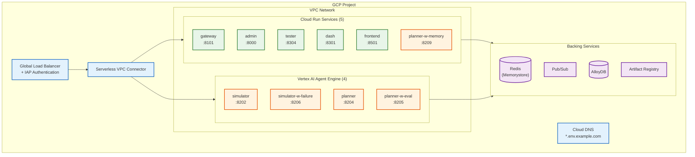

# Deploying the N26 DevKey Simulation

This guide provides a step-by-step walkthrough for deploying the full N26 DevKey
Simulation to a single Google Cloud Platform project. It is intended for
external deployers who are forking the project and need to stand up the complete
simulation environment from scratch.

## Architecture Overview

## Service Inventory

| Service                  | Type         | Purpose                                | Default Port |
| :----------------------- | :----------- | :------------------------------------- | :----------- |
| **gateway**              | Cloud Run    | API gateway, WebSocket hub, agent discovery | 8101    |
| **admin**                | Cloud Run    | Admin dashboard SPA                    | 8000         |
| **tester**               | Cloud Run    | Tester UI SPA                          | 8304         |
| **dash**                 | Cloud Run    | Agent telemetry dashboard (Python)     | 8301         |
| **frontend**             | Cloud Run    | Angular 3D simulation viewer           | 8501         |
| **simulator**            | Agent Engine | Simulation orchestrator                | 8202         |
| **simulator-with-failure** | Agent Engine | Simulation with failure injection    | 8206         |
| **planner**              | Agent Engine | Marathon planner agent                 | 8204         |
| **planner-with-eval**    | Agent Engine | Planner with evaluation tools          | 8205         |
| **planner-with-memory**  | Cloud Run    | Planner with route memory database     | 8209         |

## Guide Reading Order

This deployment guide is split into six documents, designed to be followed in
order. Each guide builds on the previous one.

| #   | Guide                                        | Description                                                         | Est. Time |
| :-- | :------------------------------------------- | :------------------------------------------------------------------ | :-------- |
| 1   | [Prerequisites](01-prerequisites.md)         | GCP project setup, tool installation, authentication                | ~30 min   |
| 2   | [Infrastructure](02-infrastructure.md)       | Terraform-managed VPC, Redis, Pub/Sub, AlloyDB, Artifact Registry   | ~45 min   |
| 3   | [Backend Services](03-backend-services.md)   | Build and deploy Cloud Run services and Agent Engine agents         | ~60 min   |
| 4   | [Frontend](04-frontend.md)                   | Build and deploy the Angular 3D simulation viewer                   | ~20 min   |
| 5   | [Domain & Auth](05-domain-and-auth.md)       | Custom domain configuration, DNS, load balancer, IAP setup          | ~30 min   |
| 6   | [Verification](06-verification.md)           | End-to-end smoke tests and health check validation                  | ~15 min   |

**Total estimated time: ~3.5 hours**

## What You'll Have When Done

After completing all six guides, you will have:

- A **fully deployed simulation** accessible via custom domain subdomains
  (e.g., `gateway.dev.example.com`, `admin.dev.example.com`)
- **IAP (Identity-Aware Proxy)** protecting all web-facing endpoints with
  Google account authentication
- **4 AI agents** running on **Vertex AI Agent Engine**, communicating over the
  A2A protocol
- **6 Cloud Run services** handling the web tier, API gateway, and agent
  hosting (including planner-with-memory)
- **Backing infrastructure** (Redis, Pub/Sub, AlloyDB) providing session
  management, event streaming, and persistent storage
- A **Global Load Balancer** routing traffic to the correct service based on
  subdomain
