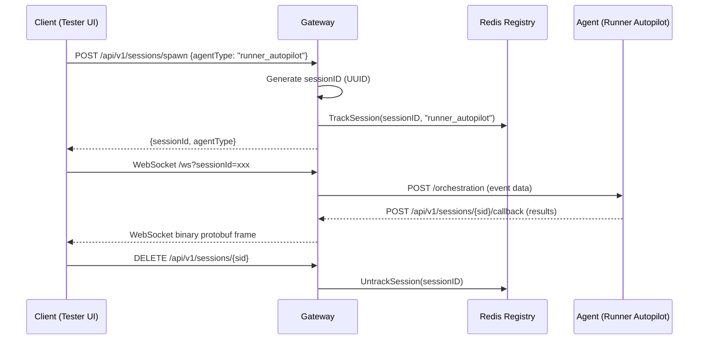
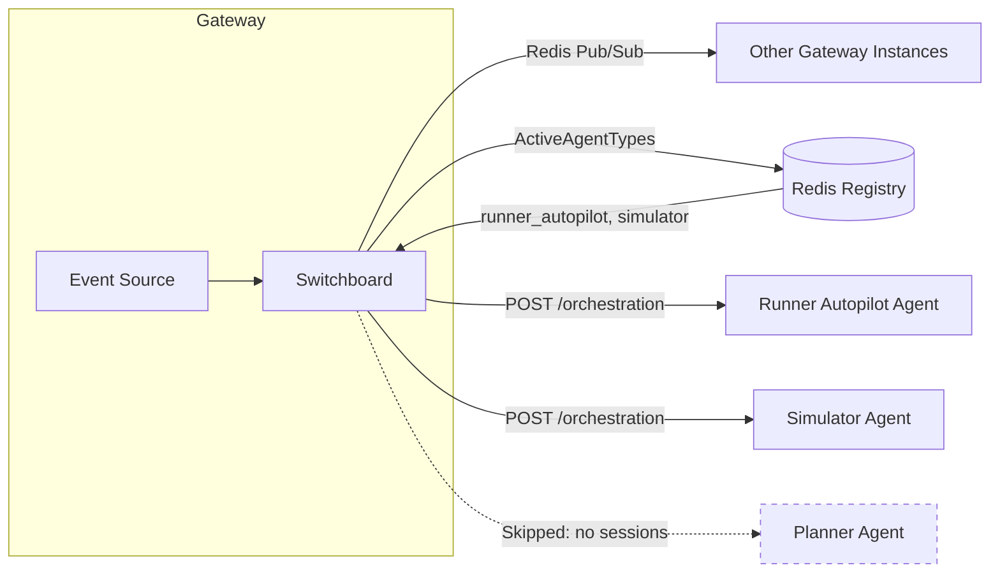
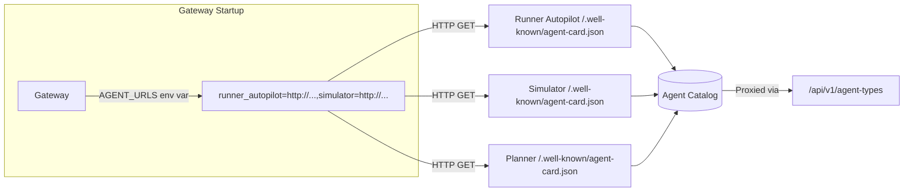

# Gateway Messaging Protocol

> Architecture design for session-aware message routing in the N26 simulation
> gateway.

## Overview

The gateway is the primary API entry point and session router for the
simulation. It manages WebSocket client connections, routes messages to AI
agents, and broadcasts telemetry events. All agent communication flows through
the gateway — clients never connect directly to agents.

## Session Lifecycle



### Key Design Decisions

- **Gateway generates session IDs.** The gateway owns session identity, ensuring
  consistent routing across horizontally scaled instances.
- **Session→AgentType mapping in Redis.** `DistributedRegistry` stores
  `sessionID → agentType` so any gateway instance can route any request (no
  sticky sessions needed).
- **Agent-type SETs.** Redis maintains `{prefix}:agent-sessions:{agentType}`
  sets, enabling O(1) lookup of which agent types have active sessions.

## Message Routing

### Broadcast (Fan-Out)

Used for global simulation events (phase transitions, time ticks).



`PublishOrchestration` queries `ActiveAgentTypes()` and only pokes agents that
have ≥1 active session. This prevents:

- Waking callable agents (Agent Engine) from scale-to-zero for nothing
- Creating unwanted A2A sessions on idle agents
- O(all agents) HTTP requests when only O(active agents) needed

### Targeted Dispatch

Used for directing events to a specific agent type.

`DispatchToAgent(agentType, event)` uses dispatch-mode routing:

| Dispatch Mode | Transport                 | Use Case               |
| :------------ | :------------------------ | :--------------------- |
| `subscriber`  | HTTP POST /orchestration  | Local/Cloud Run agents |
| `callable`    | A2A JSON-RPC message/send | Agent Engine agents    |

### Agent Callbacks

Agents emit results back to the gateway via callback URLs:

```
POST /api/v1/sessions/{sessionId}/callback
```

The gateway receives the callback, looks up the session's WebSocket connection,
and forwards the result to the connected client as a binary protobuf frame.

## Dispatch Modes

Each agent declares its dispatch mode via environment variable:

```bash
DISPATCH_MODE=subscriber  # Default: listens on Redis Pub/Sub + HTTP
DISPATCH_MODE=callable    # HTTP orchestration only, no Redis listener
```

### Subscriber Mode (Default)

- Python `RedisOrchestratorDispatcher` starts a Redis Pub/Sub listener
- Also receives HTTP POST to `/orchestration` endpoint
- Suitable for always-on agents (local dev, Cloud Run)

### Callable Mode

- Python `RedisOrchestratorDispatcher` skips Redis listener entirely
- Receives events only via HTTP POST to `/orchestration` (broadcast) or A2A
  JSON-RPC `message/send` (targeted dispatch)
- Suitable for scale-to-zero agents (Agent Engine)

## Agent Discovery

Agents are discovered dynamically via HTTP, not static configuration:



### Agent Card Proxy

The gateway proxies agent cards losslessly using `json.RawMessage` to preserve
all fields (including `preferredTransport`, `additionalInterfaces`, custom
extensions). Clients and inter-agent communication use the gateway's
`/api/v1/agent-types` endpoint to discover other agents.

### URL Convention

Agent cards advertise their A2A RPC endpoint with a trailing slash to match
Starlette's mount behavior:

```
url: "http://127.0.0.1:8210/a2a/runner_autopilot/"
```

`AgentCardBuilder` strips the trailing slash; `prepare_simulation_agent` adds it
back after build to prevent 307 redirects.

## Client Communication

### WebSocket Protocol

Clients connect via WebSocket at `/ws?sessionId={id}`:

- **Binary frames:** Protobuf-encoded `gateway.Wrapper` messages containing
  simulation events, telemetry, and A2UI content.
- **Text frames:** JSON-encoded messages for direct agent interaction (e.g.,
  sending text prompts to the simulator).

### Hub Architecture

The `Hub` manages WebSocket connection lifecycle:

- Clients register/unregister on connect/disconnect
- `Broadcast()` fans out to all connected clients
- Each gateway instance has its own Hub; cross-instance broadcast uses Redis
  Pub/Sub via the Switchboard

## Component Reference

| Component            | Package                         | Role                         |
| :------------------- | :------------------------------ | :--------------------------- |
| Gateway (`main.go`)  | `cmd/gateway`                   | HTTP/WS server, route setup  |
| Hub                  | `internal/hub`                  | WebSocket connection manager |
| Switchboard          | `internal/hub`                  | Redis-backed message fan-out |
| Session Service      | `internal/session`              | Entity↔Session mapping       |
| Distributed Registry | `internal/session`              | Session→AgentType tracking   |
| Agent Catalog        | `internal/agent`                | HTTP-based agent discovery   |
| Dispatcher           | `agents/utils/dispatcher.py`    | Python-side event reception  |
| Communication        | `agents/utils/communication.py` | Inter-agent A2A calls        |

## Testing Contract

### Unit Tests

```bash
go test ./internal/session/ -v  # Registry tests
go test ./internal/hub/ -v      # Switchboard tests
go test ./internal/agent/ -v    # Catalog tests
uv run pytest agents/ -v        # Python agent + dispatcher tests
```

### Integration Tests (Docker Redis)

```bash
make verify-full  # All layers including integration tests
```

### Full Verification

```bash
make verify       # Lint + unit tests + coverage (Layers 1-3)
```

### Key Test Scenarios

- **Session-aware routing:** Broadcast only reaches agent types with sessions
- **Dispatch mode isolation:** Callable agents skip Redis listeners
- **Agent card integrity:** URL contains A2A path with trailing slash
- **Static file guards:** No `agent.json` or tracked `catalog.json` in git
- **Catalog degradation:** Gateway starts even when agents are unreachable
- **Card proxy fidelity:** `json.RawMessage` preserves all card fields
