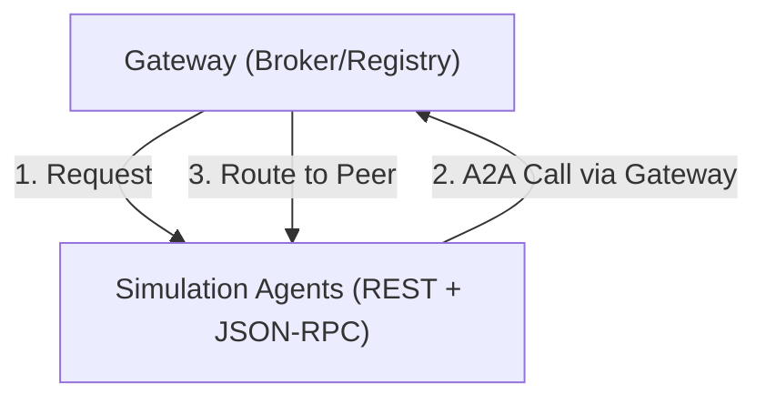

# Technical Guide: A2A Multi-Agent Communication (Simulation Edition)

This guide provides a detailed technical implementation blueprint for
Agent-to-Agent (A2A) communication within the N26 Simulation. It reflects the
production architecture where the Simulation Gateway acts as an A2A Broker and
agents utilize a decoupled Redis-based orchestration layer.

## 1. Architecture: The Simulation Stack

Our architecture bridges high-level A2A intents (JSON-RPC) with low-latency
binary broadcasting (Go/Redis/Protobuf) to support hundreds of concurrent runner
sessions.

### 1.1 Topology & Sequential Flow



---

## 2. Agent Endpoint Registry

Simulation agents are mounted at consistent sub-paths to enable path-based
routing in the Gateway.

| Endpoint               | Path                                      | Protocol             |
| :--------------------- | :---------------------------------------- | :------------------- |
| **Well-Known Card**    | `/a2a/{name}/.well-known/agent-card.json` | HTTP GET / JSON      |
| **A2A RPC**            | `/a2a/{name}/`                            | HTTP POST / JSON-RPC |
| **Orchestration Poke** | `/a2a/{name}/orchestration`               | HTTP POST / JSON     |
| **Health Check**       | `/a2a/{name}/health`                      | HTTP GET / JSON      |

---

## 3. Implementation Details

### 3.1 Advanced Agent Preparation

Instead of manual dictionary construction, use `prepare_simulation_agent` to
expand environment variables and inject required extensions (like `a2ui`).

```python
# agents/utils/a2a.py
from agents.utils.a2a import prepare_simulation_agent, register_a2a_routes

# 1. Prepare card with ENV expansion
agent_card = prepare_simulation_agent(app, "agents")

# 2. Register standard routes on FastAPI app
register_a2a_routes(api_app, app, agent_card)
```

### 3.2 The Push Model (Authoritative)

In Cloud Run / Agent Engine, agents cannot reliably subscribe to Redis due to
scale-to-zero. Instead, the **Gateway Pushes** orchestration pulses directly to
the agent's `/orchestration` endpoint.

```python
# agents/utils/a2a.py

@api_app.post("/a2a/{agent_name}/orchestration")
async def handle_orchestration_poke(request: Request):
    data = await request.json()
    # Dispatcher.handle_event() triggers local fan-out to all sessions
    await orchestration_plugin.dispatcher.handle_event(data)
    return {"status": "success"}
```

### 3.3 Multi-Session Fan-out (Local Execution)

When the agent receives a push, it iterates through its in-memory sessions:

```python
# agents/utils/dispatcher.py

async def _process_event(self, data: dict):
    # Iterate through all active NPCs (sessions) in this process
    for sid in self.active_sessions:
        async for event in runner.run_async(session_id=sid, ...):
            # Relay binary results back to Gateway
            await redis.publish("gateway:broadcast", wrapper.SerializeToString())
```

### 3.4 Gateway Dual-Dispatch Logic (Go)

The Gateway orchestrates both paths to ensure total delivery.

```go
// internal/hub/switchboard.go

func (sb *Switchboard) Broadcast(ctx context.Context, wrapper *gateway.Wrapper) {
    // Path A: Low-latency Redis Pulse (for warm/local agents)
    sb.redis.Publish(ctx, "simulation:broadcast", wrapper.Payload)

    // Path B: Scale-to-Zero Wake-up (for cold/cloud agents)
    for _, agent := range sb.catalog.Agents {
        go sb.httpClient.Post(agent.URL + "/orchestration", "application/json", ...)
    }
}
```

### 3.5 A2A Authorization (Mandatory)

A2A requires valid security schemes in the manifest. The `AgentCardBuilder`
handles this by default for the simulation.

```json
{
  "security_schemes": {
    "goog_internal_auth": {
      "type": "google_service_account",
      "google_service_account": {
        "audience": "https://n26-ssm-central-516035864253.us-central1.sourcemanager.dev"
      }
    }
  }
}
```

---

## 4. Discovery and Registry

In a dynamic simulation with hundreds of entities, agents need a way to discover
their peers.

### 4.1 Type Discovery (The Catalog)

The Simulation Gateway maintains an authoritative **Catalog** of all available
agent types (e.g., `runner`, `spectator`, `orchestrator`).

- **Endpoint**: `GET /api/v1/agent-types`
- **Purpose**: Returns the `AgentCard` for every registered agent, including
  their base A2A URL.

### 4.2 Instance Discovery (The Session Registry)

While an Agent Card identifies a _Type_ (Entity Type), a **Session** identifies
an _Instance_ (NPC Instance).

- **Endpoint**: `GET /api/v1/sessions`
- **Purpose**: Lists active sessions. See **Scalability at Scale** for usage
  limitations.

### 4.3 Scalability at Scale (100,000+ Sessions)

Retrieving a full list of 100,000 sessions in a single JSON response is not
recommended due to network latency and memory overhead. For massive simulations,
follow these patterns:

1. **Paged Listing**: Future versions of the Gateway API will support
   `?cursor={val}` and `?limit={n}`. Clients should iterate through the registry
   in batches of 100-500.
2. **Scoped Discovery**: Avoid listing _all_ sessions. Instead, list by **Agent
   Type** (e.g., `GET /api/v1/agent-types/runner/sessions`). This narrows the
   working set significantly.
3. **Topic-Based Reactivity**: Reiterate the **Hybrid Model**. At 100k sessions,
   the Orchestrator should not poll the registry for 100k addresses. It
   publishes a single pulse to the Gateway. The Gateway then utilizes the **Dual
   Dispatch Path**:
   - **Performance Path (Redis)**: Low-latency pulse for agents already awake.
   - **Wake-up Path (HTTP)**: Explicit POST to `/a2a/{name}/orchestration` to
     wake up agents that have **scaled to zero** (Cloud Run / Agent Engine).

### 4.4 The "Introduction" Pattern

Agents don't typically "hunt" for each other in the A2A protocol. Instead, they
are **introduced** by the Orchestrator or the Gateway.

1. **Capability Discovery**: When the Orchestrator starts a race, it fetches the
   URLs of the required **Agent Types** (e.g., `runner`) from the Gateway's
   Catalog.
2. **Bulk Spin-up**: It sends a single A2A message to those URLs (via the
   Gateway) with instructions to spawn the required number of sessions (NPCs).
3. **Session Context**: The Gateway tracks these new Session IDs in the
   Registry. From this point on, individual NPC interactions use point-to-point
   A2A with the shared Agent URL and unique Session IDs.

---

## 5. Scaling: Entity Types vs. Instances

### Standardized Client Management

All agents must use the `SimulationCommunicationPlugin` to manage the lifecycle
of A2A clients during an invocation. This ensures that non-serializable RPC
clients do not corrupt the session state.

```python
from agents.utils.communication_plugin import SimulationCommunicationPlugin

agent = Agent(
    # ...
    plugins=[SimulationCommunicationPlugin()]
)
```

### Proactive Tool Calling (`call_agent`)

Instead of manual client lookups, agents should use the standardized
`call_agent` utility to communicate with peers. This tool handles registry
lookups, connection management, and response unrolling automatically.

```python
from agents.utils.communication import call_agent

# Inside a tool function
result = await call_agent(
    agent_name="runner",
    message="Get current vitals",
    tool_context=tool_context
)
```

It is critical to distinguish between the **Agent Service** and the **NPC
Session**. Per-NPC identity is managed at the **Session level**, not the **URL
level**.

| Concept          | Level   | A2A Addressing                                                                                          |
| :--------------- | :------ | :------------------------------------------------------------------------------------------------------ |
| **Agent Type**   | Service | Identified by the `AgentCard.url` (e.g., `https://runner-service/a2a/runner/`)                          |
| **NPC Instance** | Session | Identified by the `context_id` (Session URL format: `https://runner-service/a2a/runner/sessions/{sid}`) |

**Scaling Strategy**: 10,000 active NPCs in a simulation does _not_ require
10,000 agent processes. It requires a handful of runner service instances each
hosting thousands of lightweight ADK Sessions in memory.

**Recommendation**: When broadcasting from the Orchestrator, use the **Gateway
Hub** (Binary Fan-out). When an individual NPC needs to consult a specific peer,
use **Standard A2A** (Point-to-Point).

---

## 6. Gaps and Considerations

1. **Orchestration Discovery**: Standard A2A clients (`RemoteA2aAgent`) do not
   know about the `/orchestration` path. You must use a specialized client or
   the "Poke" tool (`poke_sim_gateway`) to trigger simulation-wide events.
2. **Binary Traceability**: All results from fanned-out A2A sessions are relayed
   through Redis via **Protobuf Wrappers**. Ensure the Gateway logic for the
   `gateway:broadcast` channel is synced with `gateway.proto`.
3. **State Management**: Use `InMemorySessionService` for local simulation
   testing to avoid WAL lockouts, but switch to `VertexAiSessionService` for
   production scale deployments.
