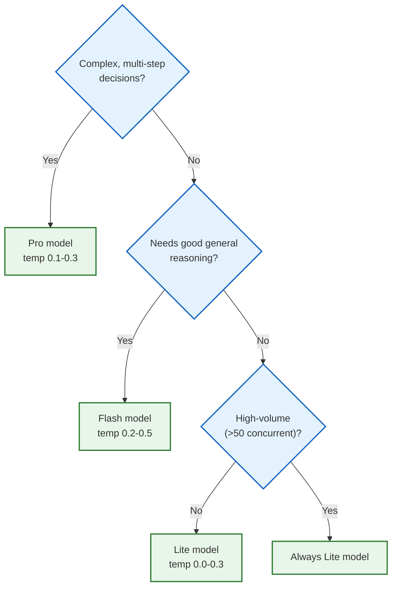

# ADK Agent Performance Optimization Guide

A comprehensive, project-agnostic guide to optimizing Google ADK agents for
latency, throughput, cost, and reliability. Written against **ADK v1.26.0** and
**google-genai v1.64.0**.

---

## How to Read This Guide

Every technique is scored on three axes:

| Axis       | Scale | Meaning                                                |
| :--------- | :---- | :----------------------------------------------------- |
| **Impact** | 1–5   | How much performance improvement you can expect        |
| **Effort** | 1–5   | Implementation complexity (1 = trivial, 5 = major)     |
| **Risk**   | 1–5   | Chance of introducing regressions or behavioral change |

> [!TIP] Start with high-impact / low-effort items. Sort the summary table at
> the end to find your best bang-for-buck.

---

## Table of Contents

1.  [Model Selection & Configuration](#1-model-selection--configuration)
2.  [Thinking Budget Control](#2-thinking-budget-control)
3.  [Context Caching (Explicit)](#3-context-caching-explicit)
4.  [Static vs Dynamic Instructions](#4-static-vs-dynamic-instructions)
5.  [Parallel Tool Execution](#5-parallel-tool-execution)
6.  [Tool Thread Pool Offloading](#6-tool-thread-pool-offloading)
7.  [Parallel Agent Execution](#7-parallel-agent-execution)
8.  [Parallel A2A Orchestration](#8-parallel-a2a-orchestration)
9.  [Context Window Compression](#9-context-window-compression)
10. [Event Compaction](#10-event-compaction)
11. [Output Token Budgeting](#11-output-token-budgeting)
12. [LLM Call Guards](#12-llm-call-guards)
13. [Content Inclusion Control](#13-content-inclusion-control)
14. [Streaming Mode Selection](#14-streaming-mode-selection)
15. [Prompt Engineering for Efficiency](#15-prompt-engineering-for-efficiency)
16. [Automated Prompt Optimization (GEPA)](#16-automated-prompt-optimization-gepa)
17. [Session Service Selection](#17-session-service-selection)
18. [Python Async Best Practices](#18-python-async-best-practices)
19. [Python General Performance](#19-python-general-performance)
20. [Monitoring & Measurement](#20-monitoring--measurement)
21. [Summary Table](#21-summary-table)

---

## 1. Model Selection & Configuration

**Impact: 5 · Effort: 1 · Risk: 2**

The single most impactful decision is choosing the right model for each agent's
job.

### Model Tiers

| Tier  | Example Model                   | Speed   | Cost | Quality  | Best For                    |
| :---- | :------------------------------ | :------ | :--- | :------- | :-------------------------- |
| Pro   | `gemini-3.1-pro-preview`        | Slow    | High | Best     | Complex reasoning, planning |
| Flash | `gemini-3-flash-preview`        | Fast    | Med  | Good     | General-purpose agents      |
| Lite  | `gemini-3.1-flash-lite-preview` | Fastest | Low  | Adequate | High-volume NPCs, routing   |

### Temperature Guidelines

| Value   | Behavior      | Use Case                              |
| :------ | :------------ | :------------------------------------ |
| 0.0     | Deterministic | Classification, routing, tool calling |
| 0.1–0.3 | Focused       | Planning, structured output           |
| 0.4–0.7 | Balanced      | General conversation                  |
| 0.8–1.0 | Creative      | Storytelling, brainstorming           |

### Additional `GenerateContentConfig` Levers

```python
from google.genai import types

config = types.GenerateContentConfig(
    temperature=0.2,
    top_p=0.95,             # Nucleus sampling threshold
    top_k=40,               # Limits token candidates per step
    max_output_tokens=1024, # Hard cap on response length
    stop_sequences=["END"], # Early termination triggers
    seed=42,                # Reproducible outputs (for testing)
)
```

### Decision Framework



---

## 2. Thinking Budget Control

**Impact: 4 · Effort: 1 · Risk: 2**

Gemini models that support "thinking" (internal chain-of-thought) consume
additional tokens for reasoning before producing a response. You can control
this with `ThinkingConfig`.

### Configuration

```python
from google.genai import types

# Disable thinking entirely — fastest responses
types.GenerateContentConfig(
    thinking_config=types.ThinkingConfig(thinking_budget=0),
)

# Automatic thinking — model decides how much to think
types.GenerateContentConfig(
    thinking_config=types.ThinkingConfig(thinking_budget=-1),
)

# Fixed budget — 1024 thinking tokens max
types.GenerateContentConfig(
    thinking_config=types.ThinkingConfig(thinking_budget=1024),
)
```

### When to Use Each Setting

| Setting     | Use When                                        |
| :---------- | :---------------------------------------------- |
| `budget=0`  | Reactive agents, routing, simple tool calls     |
| `budget=-1` | Default — let the model decide                  |
| `budget=N`  | You need reasoning but want to cap cost/latency |

> [!IMPORTANT] Disabling thinking on agents that need multi-step reasoning
> **will degrade output quality**. Always validate with your evaluation suite
> before shipping.

---

## 3. Context Caching (Explicit)

**Impact: 5 · Effort: 2 · Risk: 1**

Gemini's Context Caching stores system instructions, tools, and early
conversation turns server-side. Subsequent requests reuse the cache, cutting
input token costs by **50–75%** and reducing latency.

### Configuration

```python
from google.adk.apps import App
from google.adk.agents.context_cache_config import ContextCacheConfig

app = App(
    name="my_agent",
    root_agent=root_agent,
    context_cache_config=ContextCacheConfig(
        cache_intervals=10,   # Reuse cache for N invocations before refresh
        ttl_seconds=1800,     # 30-minute time-to-live
        min_tokens=4096,      # Only cache if request exceeds this threshold
    ),
)
```

### How It Works

1. ADK's `ContextCacheRequestProcessor` checks session events for existing cache
   metadata.
2. `GeminiContextCacheManager` generates a fingerprint (hash of system
   instruction + tools + first N contents).
3. If the fingerprint matches an existing valid cache, it's reused.
4. Cached content is removed from the request payload, reducing billed tokens.

### Cost Model

- Cached input tokens are billed at **~0.25×** the normal input rate.
- Cache storage incurs a small per-hour fee.
- Break-even point: typically 3–5 requests with the same cached prefix.

### Best Practices

- Pair with `static_instruction` (see §4) for maximum cache hit rate.
- Set `min_tokens` high enough to avoid caching small requests where overhead
  exceeds savings.
- Monitor hit rates with `CachePerformanceAnalyzer` (see §20).

---

## 4. Static vs Dynamic Instructions

**Impact: 4 · Effort: 2 · Risk: 1**

`LlmAgent` supports two instruction fields that control prompt placement:

| Field                | Placement                          | Variable substitution | Cacheable                               |
| :------------------- | :--------------------------------- | :-------------------- | :-------------------------------------- |
| `static_instruction` | System instruction (first)         | ❌ None               | ✅ Yes                                  |
| `instruction`        | System instruction OR user content | ✅ `{var}` syntax     | ⚠️ Only if static_instruction is absent |

### The Key Insight

When `static_instruction` is set, `instruction` moves to **user content**. This
means the stable prefix (system instruction) never changes, making it an ideal
candidate for context caching.

### Pattern

```python
STATIC_RULES = """
You are a financial advisor agent. You must always:
- Comply with SEC regulations
- Never provide specific stock recommendations
- Always disclose that you are an AI
... (large static knowledge base that never changes) ...
"""

DYNAMIC_PART = """
The user's portfolio value is ${portfolio_value}.
Their risk tolerance is {risk_level}.
"""

agent = LlmAgent(
    name="advisor",
    static_instruction=STATIC_RULES,
    instruction=DYNAMIC_PART,       # Goes to user content
    ...
)
```

### When to Split

| Content Type                    | Where It Goes        |
| :------------------------------ | :------------------- |
| Persona, rules, compliance text | `static_instruction` |
| Reference documents, schemas    | `static_instruction` |
| Session-specific variables      | `instruction`        |
| User-dependent context          | `instruction`        |

---

## 5. Parallel Tool Execution

**Impact: 4 · Effort: 1 · Risk: 1**

When the LLM returns **multiple function calls in a single response**, ADK
automatically executes them in parallel via `asyncio.gather()`.

### Requirements

1. **Tools must be `async def`** — synchronous tools block the event loop and
   prevent true concurrency.
2. **Tools must be independent** — no tool should depend on another tool's
   output within the same batch.
3. **Tools must be thread-safe** — avoid shared mutable state.

### How It Works (Under the Hood)

```python
# google/adk/flows/llm_flows/functions.py
tasks = [asyncio.create_task(_execute_single_function_call_async(...))
         for function_call in filtered_calls]
function_response_events = await asyncio.gather(*tasks)
```

### Encouraging Parallel Calls

The LLM decides whether to emit multiple function calls. You can encourage this
behavior through prompt engineering:

```
When you need information from multiple independent sources,
call all relevant tools simultaneously in a single response.
```

---

## 6. Tool Thread Pool Offloading

**Impact: 3 · Effort: 1 · Risk: 1**

For tools with blocking I/O or for Live API mode, ADK can run tools in a
background `ThreadPoolExecutor` to keep the event loop responsive.

### Configuration

```python
from google.adk.agents.run_config import RunConfig, ToolThreadPoolConfig

run_config = RunConfig(
    tool_thread_pool_config=ToolThreadPoolConfig(max_workers=8),
)
```

### When It Helps

| Scenario                       | Benefits?                        |
| :----------------------------- | :------------------------------- |
| Blocking network calls         | ✅ Yes — GIL released during I/O |
| File I/O, database queries     | ✅ Yes — GIL released during I/O |
| C extensions (numpy, hashlib)  | ✅ Yes — GIL released            |
| Pure Python loops/calculations | ❌ No — GIL held                 |
| Already-async tools            | ⚠️ Marginal — catches mistakes   |

---

## 7. Parallel Agent Execution

**Impact: 4 · Effort: 3 · Risk: 2**

ADK's `ParallelAgent` runs sub-agents concurrently using `asyncio.TaskGroup`,
each in an isolated branch context.

### Use Cases

- **Best-of-N generation**: Multiple agents tackle the same problem; a parent
  selects the best output.
- **Fan-out/fan-in**: Divide a large task into independent sub-tasks.
- **Redundancy**: Run the same query against different models for reliability.

### Example

```python
from google.adk.agents import ParallelAgent, LlmAgent

analyzer_1 = LlmAgent(name="analyzer_fast", model="gemini-3-flash-preview", ...)
analyzer_2 = LlmAgent(name="analyzer_deep", model="gemini-3.1-pro-preview", ...)

parallel = ParallelAgent(
    name="multi_analyzer",
    sub_agents=[analyzer_1, analyzer_2],
)
```

### Limitations

- Sub-agents share no state — each gets an isolated branch.
- Live mode (`run_live`) is **not supported** for `ParallelAgent`.
- Results must be merged by a parent agent downstream.

---

## 8. Parallel A2A Orchestration

**Impact: 4 · Effort: 2 · Risk: 2**

For agents communicating over the A2A protocol (HTTP), orchestration calls can
be parallelized using `asyncio.gather()`.

### Pattern

```python
import asyncio

async def fan_out_to_agents(tool_context, messages: dict[str, str]):
    """Call multiple remote agents concurrently."""
    tasks = [
        call_agent(tool_context, agent_name, message)
        for agent_name, message in messages.items()
    ]
    results = await asyncio.gather(*tasks, return_exceptions=True)

    successes = {name: r for name, r in zip(messages.keys(), results)
                 if not isinstance(r, Exception)}
    failures = {name: str(r) for name, r in zip(messages.keys(), results)
                if isinstance(r, Exception)}
    return {"successes": successes, "failures": failures}
```

### Considerations

- **QPM limits**: Parallel calls multiply your effective API rate.
- **Connection pooling**: Ensure your HTTP client reuses connections.
- **Error isolation**: Use `return_exceptions=True` so one failure doesn't
  cancel all calls.
- **Timeouts**: Set per-call timeouts with `asyncio.wait_for()`.

---

## 9. Context Window Compression

**Impact: 3 · Effort: 1 · Risk: 2**

`RunConfig.context_window_compression` enables Gemini to automatically compress
the context when it approaches limits.

```python
from google.genai import types
from google.adk.agents.run_config import RunConfig

run_config = RunConfig(
    context_window_compression=types.ContextWindowCompressionConfig(),
)
```

### When to Use

- Long-running sessions that accumulate many events.
- Agents with large tool response histories.
- Any agent that risks hitting context window limits.

---

## 10. Event Compaction

**Impact: 3 · Effort: 2 · Risk: 2**

ADK's `CompactionRequestProcessor` prunes or summarizes old session events when
the conversation exceeds a token threshold. This is a **client-side**
optimization — events are compacted before being sent to the model.

### Difference from Context Caching

| Feature            | Context Caching       | Event Compaction     |
| :----------------- | :-------------------- | :------------------- |
| **What it caches** | System prompt + tools | Conversation history |
| **Where it runs**  | Gemini API server     | ADK client           |
| **Cost savings**   | Discounted token rate | Fewer tokens sent    |
| **Best for**       | Stable prefixes       | Long conversations   |

### When to Use

Use both together for maximum savings: cache the stable prefix, compact the
dynamic history.

---

## 11. Output Token Budgeting

**Impact: 3 · Effort: 1 · Risk: 1**

Set `max_output_tokens` in `GenerateContentConfig` to prevent the model from
generating excessively long responses.

```python
types.GenerateContentConfig(
    max_output_tokens=512,   # Concise responses
)
```

### Guidelines

| Agent Type         | Suggested Limit | Reasoning                         |
| :----------------- | :-------------- | :-------------------------------- |
| Tool-calling agent | 256–512         | Only needs to emit function calls |
| Conversational     | 1024–2048       | Balanced output                   |
| Report generator   | 4096+           | Needs space for detailed output   |
| Router/classifier  | 128             | Just needs a decision             |

> [!WARNING] Setting this too low will cause truncated outputs. Always test with
> your longest expected response.

---

## 12. LLM Call Guards

**Impact: 2 · Effort: 1 · Risk: 1**

`RunConfig.max_llm_calls` limits the total number of model calls per invocation,
preventing infinite tool-calling loops.

```python
from google.adk.agents.run_config import RunConfig

run_config = RunConfig(max_llm_calls=10)  # Default is 500
```

### Recommendations

| Agent Type             | Suggested Limit | Why                           |
| :--------------------- | :-------------- | :---------------------------- |
| Simple tool-call agent | 5–10            | Should resolve in 1–3 loops   |
| Complex planner        | 20–50           | May need multiple tool rounds |
| Orchestrator           | 50–100          | Manages many sub-agent calls  |

---

## 13. Content Inclusion Control

**Impact: 3 · Effort: 1 · Risk: 3**

`LlmAgent.include_contents` controls whether the model receives conversation
history.

```python
agent = LlmAgent(
    name="stateless_classifier",
    include_contents='none',   # No history, just current instruction + input
    ...
)
```

### Options

| Value     | Behavior                                     | Use Case                       |
| :-------- | :------------------------------------------- | :----------------------------- |
| `default` | Model receives relevant conversation history | Most agents                    |
| `none`    | Model receives no prior history              | Stateless classifiers, routers |

### When to Use `none`

- The agent doesn't need conversational context.
- You want maximum cache efficiency (fewer varying contents).
- The agent is called repeatedly with independent inputs.

---

## 14. Streaming Mode Selection

**Impact: 2 · Effort: 1 · Risk: 1**

Choose the streaming mode based on your delivery channel.

```python
from google.adk.agents.run_config import RunConfig, StreamingMode

run_config = RunConfig(streaming_mode=StreamingMode.SSE)
```

| Mode   | Time to First Byte | Throughput | Best For                     |
| :----- | :----------------- | :--------- | :--------------------------- |
| `NONE` | Higher             | Best       | Batch processing, CLI, tests |
| `SSE`  | Lowest             | Good       | Web UIs, chat interfaces     |
| `BIDI` | Lowest             | Variable   | Voice, real-time streams     |

---

## 15. Prompt Engineering for Efficiency

**Impact: 4 · Effort: 2 · Risk: 2**

Well-structured prompts reduce token usage and improve tool-calling accuracy.

### Principles

1. **Be concise** — every unnecessary word is a wasted token, on every single
   request.
2. **Use structured formats** — markdown headers, numbered lists, and tables
   parse more efficiently than prose paragraphs.
3. **Front-load critical information** — the model attends more strongly to
   earlier tokens.
4. **Specify output format explicitly** — "Respond with a JSON object
   containing..." prevents the model from adding verbose preambles.
5. **Eliminate redundancy** — if a tool's description already explains its
   purpose, don't repeat it in the instruction.

### Anti-Patterns

| Anti-Pattern                     | Fix                                      |
| :------------------------------- | :--------------------------------------- |
| "Please", "Thank you" in prompts | Remove — they waste tokens               |
| Repeating tool descriptions      | Reference the tool by name only          |
| Verbose examples in every call   | Move to `static_instruction` for caching |
| Unstructured instructions        | Use headers, numbered steps              |

### Token Estimation Rule of Thumb

- 1 token ≈ 4 characters in English
- 100 tokens ≈ 75 words
- A 1000-token instruction costs ~$0.00015 per call (Flash pricing)
- At 10,000 calls/day, that's $1.50/day _just for the instruction_

---

## 16. Automated Prompt Optimization (GEPA)

**Impact: 4 · Effort: 4 · Risk: 2**

ADK includes an **Agent Optimizer** framework for systematically improving
prompts using evaluation datasets.

### Five Optimization Pillars

| Pillar       | Principle                                     |
| :----------- | :-------------------------------------------- |
| **Offload**  | Move logic from prompts into tools and code   |
| **Reduce**   | Eliminate token waste (redundancy, verbosity) |
| **Retrieve** | Optimize RAG and data-fetching patterns       |
| **Isolate**  | Separate concerns between agents              |
| **Cache**    | Leverage context caching for stable content   |

### Usage

```python
from google.adk.optimization.simple_prompt_optimizer import SimplePromptOptimizer

optimizer = SimplePromptOptimizer()
result = await optimizer.optimize(
    initial_agent=my_agent,
    sampler=my_evaluation_sampler,
)
optimized_agent = result.best_agent
```

---

## 17. Session Service Selection

**Impact: 3 · Effort: 1 · Risk: 1**

The session service stores agent state between invocations. Choose based on your
deployment environment.

| Backend                  | Concurrency  | Latency    | Persistence | Use Case                 |
| :----------------------- | :----------- | :--------- | :---------- | :----------------------- |
| `InMemorySessionService` | Excellent    | ~0 ms      | None        | Dev / Test               |
| `VertexAiSessionService` | Good         | ~50–200 ms | Cloud       | Production               |
| SQLite (ADK default)     | **Terrible** | Variable   | File        | **Never use under load** |

> [!CAUTION] SQLite's file-level locking causes `LOCKED` errors under concurrent
> access. **Never use SQLite** for any workload with more than one concurrent
> agent. Use `InMemorySessionService` for local development and
> `VertexAiSessionService` for production.

---

## 18. Python Async Best Practices

**Impact: 4 · Effort: 2 · Risk: 2**

ADK is built on Python's `asyncio`. Misusing the event loop is the most common
source of performance issues.

### 18.1 Use `async def` for All Tools

```python
# ❌ Blocks the event loop during the HTTP call
def fetch_data(url: str) -> dict:
    return requests.get(url).json()

# ✅ Yields the event loop during I/O
async def fetch_data(url: str) -> dict:
    async with aiohttp.ClientSession() as session:
        async with session.get(url) as resp:
            return await resp.json()
```

### 18.2 Parallelize Independent Operations

```python
# ❌ Sequential — total time = sum of all calls
result_a = await fetch_weather()
result_b = await fetch_traffic()
result_c = await fetch_events()

# ✅ Parallel — total time = max of all calls
result_a, result_b, result_c = await asyncio.gather(
    fetch_weather(),
    fetch_traffic(),
    fetch_events(),
)
```

### 18.3 Yield the Event Loop in CPU-Bound Code

```python
async def process_large_dataset(items):
    for i, item in enumerate(items):
        process(item)
        if i % 100 == 0:
            await asyncio.sleep(0)  # Let other coroutines run
```

### 18.4 Use Timeouts

```python
try:
    result = await asyncio.wait_for(slow_operation(), timeout=5.0)
except asyncio.TimeoutError:
    result = {"error": "Operation timed out"}
```

### 18.5 Connection Pooling

```python
import aiohttp

# ❌ Creates a new TCP connection per request
async def fetch(url):
    async with aiohttp.ClientSession() as s:
        async with s.get(url) as r:
            return await r.json()

# ✅ Reuses connections via a shared session
_session: aiohttp.ClientSession | None = None

async def get_session():
    global _session
    if _session is None or _session.closed:
        _session = aiohttp.ClientSession(
            connector=aiohttp.TCPConnector(limit=100),
            timeout=aiohttp.ClientTimeout(total=30),
        )
    return _session
```

---

## 19. Python General Performance

**Impact: 3 · Effort: 2 · Risk: 1**

General Python practices that affect ADK agent performance.

### 19.1 Pydantic V2 Optimization

ADK uses Pydantic V2 extensively. Tips for tool responses and data models:

```python
from pydantic import BaseModel, ConfigDict

class ToolResponse(BaseModel):
    model_config = ConfigDict(extra='forbid')  # Catch typos fast

    status: str
    data: dict

    # Serialize only non-None fields to reduce payload size
    def to_response(self):
        return self.model_dump(exclude_none=True)
```

### 19.2 Avoid Deep Copies Where Possible

ADK deep-copies function call arguments before tool execution. Your tools should
not add additional unnecessary copies:

```python
# ❌ Unnecessary extra copy
async def my_tool(data: dict, tool_context) -> dict:
    local_data = copy.deepcopy(data)  # ADK already copied this
    return process(local_data)

# ✅ Direct use is safe — ADK already deep-copied the args
async def my_tool(data: dict, tool_context) -> dict:
    return process(data)
```

### 19.3 Use `__slots__` for Frequently Instantiated Classes

```python
class RunnerState:
    __slots__ = ('position', 'speed', 'hydration', 'energy')

    def __init__(self):
        self.position = 0.0
        self.speed = 0.0
        self.hydration = 100.0
        self.energy = 100.0
```

### 19.4 Use Generators for Large Data

```python
# ❌ Loads everything into memory
def get_all_events(session):
    return [process(e) for e in session.events]

# ✅ Processes lazily
def get_all_events(session):
    return (process(e) for e in session.events)
```

### 19.5 Minimize JSON Serialization Overhead

Tool responses must be JSON-serializable dicts. Keep them small:

```python
# ❌ Bloated response
return {
    "status": "success",
    "message": "The operation completed successfully without any errors",
    "data": {
        "full_object": large_object.to_dict(),  # Hundreds of fields
    },
    "metadata": { ... },
    "debug_info": { ... },
}

# ✅ Lean response — only what the LLM needs to reason about
return {
    "status": "success",
    "speed_kmh": 12.5,
    "position_km": 5.2,
}
```

### 19.6 Logging Performance

```python
import logging
logger = logging.getLogger(__name__)

# ❌ String formatting always runs, even if debug is disabled
logger.debug(f"Processing {len(items)} items: {items}")

# ✅ Lazy formatting — only runs if debug is enabled
logger.debug("Processing %d items: %s", len(items), items)

# ✅ Guard expensive formatting
if logger.isEnabledFor(logging.DEBUG):
    logger.debug("Detail: %s", expensive_to_string(obj))
```

### 19.7 Use `functools.lru_cache` for Expensive Computations

```python
from functools import lru_cache

@lru_cache(maxsize=128)
def compute_route_hash(route_points: tuple) -> str:
    """Cache route hashes for repeated lookups."""
    import hashlib
    data = str(route_points).encode()
    return hashlib.sha256(data).hexdigest()[:16]
```

### 19.8 Prefer Built-in Data Structures

```python
# ❌ Custom lookup when a set works
found = False
for item in large_list:
    if item == target:
        found = True
        break

# ✅ O(1) lookup
found = target in large_set
```

---

## 20. Monitoring & Measurement

**Impact: 3 · Effort: 2 · Risk: 0**

You can't optimize what you don't measure.

### ADK Cache Performance Analyzer

```python
from google.adk.utils.cache_performance_analyzer import CachePerformanceAnalyzer

analyzer = CachePerformanceAnalyzer(session_service=session_service)
report = await analyzer.analyze_agent_cache_performance(
    session_id="...", user_id="...", app_name="my_app", agent_name="my_agent",
)
# report contains: cache_hit_ratio_percent, total_cached_tokens,
#                   cache_utilization_ratio_percent, etc.
```

### Key Metrics to Track

| Metric                       | Target     | How to Measure             |
| :--------------------------- | :--------- | :------------------------- |
| Cache hit ratio              | > 70%      | `CachePerformanceAnalyzer` |
| Avg input tokens per request | Decreasing | `event.usage_metadata`     |
| Response latency (p50 / p95) | < 2s / 5s  | OpenTelemetry traces       |
| LLM calls per invocation     | < 5        | `max_llm_calls` monitoring |
| Tool execution time          | < 500ms    | `trace_tool_call` spans    |
| Error rate                   | < 1%       | Exception logging          |

### OpenTelemetry Integration

ADK provides built-in tracing via `google.adk.telemetry.tracing`. Key spans:

- `execute_tool {tool_name}` — individual tool execution
- `execute_tool (merged)` — merged parallel tool execution
- LLM request/response spans — model call timing

---

## 21. Summary Table

All techniques ranked by **impact ÷ effort** (best return on investment first):

| #   | Technique                       | Impact | Effort | Risk | ROI Score |
| :-- | :------------------------------ | :----: | :----: | :--: | :-------: |
| 1   | Model Selection                 |   5    |   1    |  2   |    5.0    |
| 2   | Thinking Budget Control         |   4    |   1    |  2   |    4.0    |
| 3   | Parallel Tool Execution (async) |   4    |   1    |  1   |    4.0    |
| 4   | Output Token Budgeting          |   3    |   1    |  1   |    3.0    |
| 5   | LLM Call Guards                 |   2    |   1    |  1   |    2.0    |
| 6   | Content Inclusion Control       |   3    |   1    |  3   |    3.0    |
| 7   | Streaming Mode Selection        |   2    |   1    |  1   |    2.0    |
| 8   | Session Service Selection       |   3    |   1    |  1   |    3.0    |
| 9   | Context Caching (Explicit)      |   5    |   2    |  1   |    2.5    |
| 10  | Static vs Dynamic Instructions  |   4    |   2    |  1   |    2.0    |
| 11  | Tool Thread Pool Offloading     |   3    |   1    |  1   |    3.0    |
| 12  | Context Window Compression      |   3    |   1    |  2   |    3.0    |
| 13  | Prompt Engineering              |   4    |   2    |  2   |    2.0    |
| 14  | Python Async Best Practices     |   4    |   2    |  2   |    2.0    |
| 15  | Event Compaction                |   3    |   2    |  2   |    1.5    |
| 16  | Parallel A2A Orchestration      |   4    |   2    |  2   |    2.0    |
| 17  | Python General Performance      |   3    |   2    |  1   |    1.5    |
| 18  | Monitoring & Measurement        |   3    |   2    |  0   |    1.5    |
| 19  | Parallel Agent Execution        |   4    |   3    |  2   |    1.3    |
| 20  | Automated Prompt Optimization   |   4    |   4    |  2   |    1.0    |

> [!NOTE] **ROI Score** = Impact ÷ Effort. Higher is better. Start from the top.

---

## Quick-Start Checklist

For a new ADK agent project, apply these optimizations in order:

- [ ] Choose the right model tier for each agent role (§1)
- [ ] Set `thinking_budget` appropriately per agent (§2)
- [ ] Set `max_output_tokens` on every agent (§11)
- [ ] Set `max_llm_calls` guard on every `RunConfig` (§12)
- [ ] Make all tool functions `async def` (§5, §18)
- [ ] Configure `ContextCacheConfig` on the `App` (§3)
- [ ] Split stable content into `static_instruction` (§4)
- [ ] Use `include_contents='none'` for stateless agents (§13)
- [ ] Choose the correct `StreamingMode` per delivery channel (§14)
- [ ] Set up `CachePerformanceAnalyzer` monitoring (§20)
- [ ] Never use SQLite session service under load (§17)
- [ ] Review prompts for token waste (§15)

---

## References

| Resource                                                                                                              | Description                                          |
| :-------------------------------------------------------------------------------------------------------------------- | :--------------------------------------------------- |
| [ADK Python Source](https://github.com/google/adk-python)                                                             | Official ADK repository                              |
| [Gemini Context Caching](https://ai.google.dev/gemini-api/docs/caching)                                               | API documentation                                    |
| [Vertex AI Context Cache](https://cloud.google.com/vertex-ai/generative-ai/docs/context-cache/context-cache-overview) | Vertex documentation                                 |
| `google.adk.agents.run_config`                                                                                        | `RunConfig`, `ToolThreadPoolConfig`, `StreamingMode` |
| `google.adk.agents.context_cache_config`                                                                              | `ContextCacheConfig`                                 |
| `google.adk.agents.parallel_agent`                                                                                    | `ParallelAgent`                                      |
| `google.adk.agents.llm_agent`                                                                                         | `LlmAgent`, `static_instruction`                     |
| `google.adk.flows.llm_flows.functions`                                                                                | Parallel tool execution                              |
| `google.adk.utils.cache_performance_analyzer`                                                                         | `CachePerformanceAnalyzer`                           |
| `google.genai.types.ThinkingConfig`                                                                                   | Thinking budget control                              |
| `google.genai.types.GenerateContentConfig`                                                                            | Model config parameters                              |
