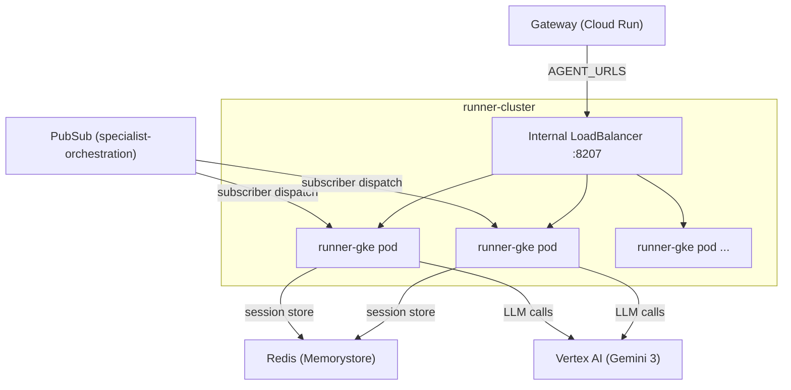

# Running the LLM Runner on GKE

The `runner_gke` deployment runs the same LLM-powered NPC runner agent on a
dedicated GKE Standard cluster, providing Kubernetes-native autoscaling
alongside the existing Cloud Run deployment. Both deployments use the same
`runner_cloudrun` container image -- only the platform configuration differs.

## Architecture



The gateway discovers `runner_gke` via its `AGENT_URLS` list, which points to
the Internal LoadBalancer IP. Runner pods pull work from PubSub in `subscriber`
dispatch mode, persist sessions in Redis Memorystore, and make LLM calls to
Vertex AI using the Gemini 3 global endpoint.

## Prerequisites

- GKE cluster `runner-cluster` provisioned via Terraform
  (`code-infra/projects/dev/runner_gke.tf`)
- `kubectl` CLI installed
- `gcloud` CLI authenticated with `n26-devkey-simulation-dev` project access
- `kustomize` CLI (or `kubectl` with `-k` support)

## Quick Start

### 1. Get cluster credentials

```bash
gcloud container clusters get-credentials runner-cluster \
  --region=us-central1 --project=n26-devkey-simulation-dev
```

### 2. Apply the kustomize overlay

```bash
kubectl apply -k k8s/runner/overlays/dev/
kubectl rollout status deployment/runner-gke -n runner --timeout=300s
```

### 3. Verify the deployment

```bash
kubectl get pods -n runner -l app=runner-gke
# Should show pods in Running state

kubectl get hpa -n runner
# Should show current/target CPU utilization and replica count
```

### 4. Get the Internal LoadBalancer IP

```bash
kubectl get svc runner-gke -n runner -o jsonpath='{.status.loadBalancer.ingress[0].ip}'
```

The IP is assigned from the GKE subnet (`10.9.0.0/22`) on the main VPC. It may
take 1-2 minutes after initial deployment.

### 5. Update gateway AGENT_URLS

Add the Internal LB URL to the gateway's `AGENT_URLS` environment variable:

```bash
# In .env or Cloud Run service configuration
AGENT_URLS=...,http://<INTERNAL_LB_IP>:8207
```

### 6. Verify agent discovery

```bash
# Health check
curl http://<INTERNAL_LB_IP>:8207/health

# Agent card
curl http://<INTERNAL_LB_IP>:8207/.well-known/agent.json
# Should return agent card with name: "runner_gke"
```

## Environment Variables

| Variable | Value | Description |
|:---|:---|:---|
| `AGENT_NAME` | `runner_gke` | Distinct agent identity for gateway discovery |
| `DISPATCH_MODE` | `subscriber` | Pull work from PubSub topic |
| `SESSION_STORE_OVERRIDE` | `redis` | Use Redis Memorystore for session persistence |
| `REDIS_ADDR` | `10.130.170.92:6379` | Redis Memorystore private IP |
| `PORT` | `8207` | A2A server listen port |
| `GOOGLE_CLOUD_PROJECT` | `n26-devkey-simulation-dev` | GCP project ID |
| `GOOGLE_CLOUD_LOCATION` | `global` | Gemini 3 endpoint (global during preview) |
| `RUNNER_MODEL` | `gemini-3.1-flash-lite-preview` | LLM model for runner inference |
| `GOOGLE_GENAI_USE_VERTEXAI` | `TRUE` | Route through Vertex AI SDK |
| `PUBSUB_TOPIC` | `specialist-orchestration` | PubSub topic for work dispatch |

These are set via the kustomize overlay's ConfigMap and should match the values
in the Cloud Run deployment (except `AGENT_NAME` and `DISPATCH_MODE`).

## Scaling Configuration

### Horizontal Pod Autoscaler (HPA)

The HPA scales runner pods based on CPU utilization:

```yaml
apiVersion: autoscaling/v2
kind: HorizontalPodAutoscaler
metadata:
  name: runner-gke
  namespace: runner
spec:
  scaleTargetRef:
    apiVersion: apps/v1
    kind: Deployment
    name: runner-gke
  minReplicas: 7
  maxReplicas: 70
  metrics:
    - type: Resource
      resource:
        name: cpu
        target:
          type: Utilization
          averageUtilization: 70
```

### Node Pool Autoscaling

The `runner-cpu-pool` uses `e2-standard-4` nodes (4 vCPU, 16 GB RAM) with
cluster autoscaler:

- **Min nodes**: 7 (matches HPA minReplicas baseline)
- **Max nodes**: 70 (matches Cloud Run max-instances ceiling)
- **Machine type**: `e2-standard-4` (fits ~3 runner pods per node)

### Adjusting Scale

```bash
# Change HPA limits
kubectl patch hpa runner-gke -n runner \
  --patch '{"spec":{"minReplicas":10,"maxReplicas":100}}'

# Check current scaling state
kubectl get hpa runner-gke -n runner -w

# Node pool scaling is managed via Terraform -- update
# code-infra/projects/dev/runner_gke.tf and apply
```

## Monitoring

### Pod Status and Logs

```bash
# Pod overview
kubectl get pods -n runner -l app=runner-gke -o wide

# Logs from a specific pod
kubectl logs -n runner <pod-name> --tail=100

# Stream logs from all runner pods
kubectl logs -n runner -l app=runner-gke -f --max-log-requests=10

# Describe a pod (events, resource usage, scheduling)
kubectl describe pod -n runner <pod-name>
```

### Scaling Metrics

```bash
# HPA status (current replicas, CPU%, scaling events)
kubectl get hpa -n runner -w

# Node pool utilization
kubectl top nodes -l cloud.google.com/gke-nodepool=runner-cpu-pool

# Pod resource consumption
kubectl top pods -n runner -l app=runner-gke
```

### Cloud Console

- **GKE Dashboard**: Workloads > `runner` namespace > `runner-gke` deployment
- **Cloud Monitoring**: Kubernetes metrics (CPU, memory, restart count)
- **Cloud Logging**: Resource type `k8s_container`, namespace `runner`

## Troubleshooting

### Pods in CrashLoopBackOff

Check container logs for startup errors:

```bash
kubectl logs -n runner <pod-name> --previous
```

Common causes:
- **Redis unreachable**: Verify `REDIS_ADDR` (`10.130.170.92:6379`) is
  accessible from the GKE subnet. The cluster must be on the main VPC.
- **Missing environment variables**: Compare the pod's env with the expected
  variables table above.
- **Service account permissions**: Ensure `runner-gke-sa` has Vertex AI User,
  PubSub Subscriber, and Artifact Registry Reader roles.

### Internal LoadBalancer IP not assigned

```bash
kubectl describe svc runner-gke -n runner | grep -A5 Events
```

Causes:
- Subnet exhaustion in `10.9.0.0/22` -- check available IPs.
- Firewall rules blocking internal LB health checks.
- Wait 1-2 minutes after initial creation; ILB provisioning is not instant.

### Gateway not discovering runner_gke

1. Verify the agent card endpoint responds:
   ```bash
   curl http://<INTERNAL_LB_IP>:8207/.well-known/agent.json
   ```
2. Confirm `AGENT_NAME=runner_gke` is set in the pod environment:
   ```bash
   kubectl exec -n runner <pod-name> -- env | grep AGENT_NAME
   ```
3. Confirm the gateway's `AGENT_URLS` includes the ILB IP.

### Pod scheduling issues

```bash
kubectl describe pod -n runner <pending-pod-name> | grep -A10 Events
kubectl get nodes -l cloud.google.com/gke-nodepool=runner-cpu-pool
```

Causes:
- Node pool at max capacity (70 nodes) -- increase via Terraform.
- Insufficient CPU/memory requests vs. node capacity.
- Node pool autoscaler lag -- new nodes take 2-3 minutes to provision.

### PubSub messages not being consumed

```bash
# Check subscription backlog
gcloud pubsub subscriptions describe runner-gke-sub \
  --project=n26-devkey-simulation-dev \
  --format='value(messageRetentionDuration)'
```

Verify pods have `DISPATCH_MODE=subscriber` and the PubSub subscription exists.

## Comparison with Cloud Run Runner

| Aspect | runner (Cloud Run) | runner_gke (GKE) |
|:---|:---|:---|
| **Platform** | Cloud Run | GKE Standard |
| **Container image** | `runner_cloudrun` | `runner_cloudrun` (same) |
| **Agent name** | `runner` | `runner_gke` |
| **Scaling mechanism** | Min/max instances | HPA + node pool autoscaler |
| **Scaling range** | 20-200 instances | 7-70 pods (7-70 nodes) |
| **Dispatch mode** | `subscriber` | `subscriber` |
| **Session store** | Redis | Redis (same instance) |
| **Service exposure** | Cloud Run internal URL | Internal LoadBalancer IP |
| **Cold start** | ~2-5s (container startup) | Near-zero (pods stay warm) |
| **Node management** | Fully managed | Self-managed node pools |
| **Cost model** | Per-request (CPU/memory/time) | Per-node (always-on baseline) |
| **Best for** | Bursty traffic, zero-to-N | Steady-state, predictable load |

Both deployments are visible to the gateway simultaneously. The gateway
distributes work across all discovered runner agents regardless of platform.

## See Also

- [Runner GKE Design](../plans/2026-04-06-runner-gke-design.md) -- architecture
  decisions and component breakdown
- [GKE vLLM Setup](gke-vllm-setup.md) -- running Gemma 4 on GKE with L4 GPUs
- [Local Ollama Setup](local-ollama-setup.md) -- running the runner locally
  with Ollama
- [Port Standardization](../architecture/ports.md) -- port allocation strategy
- [Deployment Guide](../deployment/03-backend-services.md) -- full backend
  deployment reference
