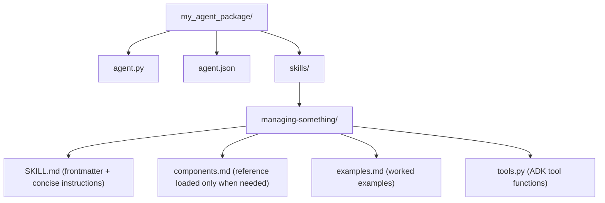
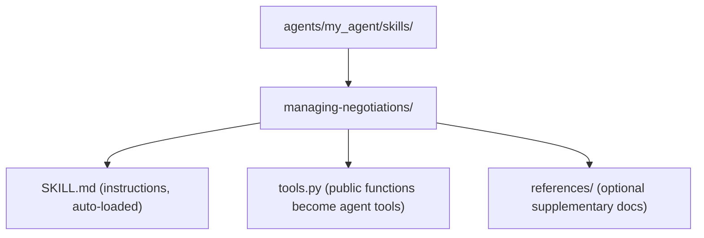

# Implementing Skills in ADK Agents

This guide explains how to add Skills to agents built with the Google Agent
Development Kit (ADK) inside Race Condition.

## What is a Skill?

In the ADK framework, a **Skill** is a structured collection of:

1. **Instructions**: Detailed guidance on how the agent should behave or use
   specific tools.
2. **References**: Supplementary documentation (e.g., Markdown files) that the
   agent can read.
3. **Assets**: Additional text-based resources or data files.

Skills differ from "Tools" (Python functions) by providing contextual knowledge
and descriptive behavior rather than just functional capabilities.

## 1. Directory Structure (Standard Pattern)

While ADK is flexible, place skill resources in a `skills/` directory within
your agent's package. Heavy reference content lives in sibling files one
level deep from `SKILL.md`.



## 2. Defining Skill Content (SKILL.md)

A skill starts with YAML frontmatter and an instruction body.

### Compliant `SKILL.md` example

```markdown
---
name: managing-negotiations
description: >
  Use when an agent must negotiate with a counterparty in a complex
  multi-party simulation. Triggered by trade proposals, deadlocks, or
  any request to mediate between agents with conflicting goals.
license: Apache-2.0
---

# Managing Negotiations

This skill governs negotiation behavior. Apply when interacting with
other agents during a trade or dispute.

## Workflow

1. Identify the core needs of the counterparty.
2. Propose trades only when a win-win is identified.
3. Maintain a professional, collaborative tone.

## Advanced guidelines

- Prioritize long-term relationship value over immediate gains.
- If a deadlock is reached, suggest a temporary recess.
```

## 3. Compliance Conventions

Race Condition enforces these rules via
`agents/tests/test_skill_compliance.py`. A failing assertion blocks merge.

### Rule 1 — Description starts with "Use when…"

The `description` field is the LLM's primary signal for skill
selection. It must list **triggering conditions**, not summarize what
the skill does.

| Form | Example |
|---|---|
| ❌ Bad (declarative) | `Tools for generating marathon routes.` |
| ❌ Bad (workflow summary) | `Generates a 26.2-mile route, then validates it.` |
| ✅ Good (trigger-based) | `Use when the marathon plan needs a 26.2-mile physical route generated from road-network GeoJSON, or when the request mentions traffic impact.` |

### Rule 2 — Third-person voice

The frontmatter is injected into the system prompt; first/second-person
pronouns confuse the model.

| Form | Example |
|---|---|
| ❌ Bad | `I can help you generate routes.` |
| ❌ Bad | `You use this skill to generate routes.` |
| ✅ Good | `Generates marathon routes from road-network GeoJSON.` |

### Rule 3 — Kebab-case + gerund-form names

ADK enforces kebab-case (`^[a-z0-9]+(-[a-z0-9]+)*$`, ≤64 chars).
Anthropic's authoring guide recommends **gerund form** (verb + -ing)
for the human-readable identity.

| Form | Examples |
|---|---|
| ❌ Avoid (noun phrases) | `race-director`, `hydration`, `pre-race`, `post-race` |
| ✅ Prefer (gerund form) | `directing-the-event`, `managing-hydration`, `preparing-the-race`, `completing-the-race` |

### Rule 4 — Length budget

`description` is hard-capped at 1024 characters by the ADK
`Frontmatter` validator. Keep it under 500.

The body has no hard cap, but frequently-loaded shared skills (e.g.
`a2ui-rendering`, loaded by every agent that renders UI) should stay
under 200 lines. Split heavier reference into sibling files one level
deep. See `agents/skills/a2ui-rendering/` for the
`SKILL.md` + `components.md` + `examples.md` pattern.

## 4. Loading and Registering Skills

This project uses auto-discovery via the `load_agent_skills()` helper in
`agents.utils`. You do **not** need to manually construct `Skill` objects.

### How auto-discovery works

`load_agent_skills(agent_dir)` scans two directories and merges results:

1. **Shared skills** in `agents/skills/` (available to all agents).
2. **Local skills** in `{agent_dir}/skills/` (agent-specific).

If a local skill has the same name as a shared skill, the local
version wins. Tools from both directories are always combined.

### Usage in an agent

```python
import pathlib
from agents.utils import load_agent_skills
from google.adk.agents import LlmAgent

_skills, skill_tools = load_agent_skills(str(pathlib.Path(__file__).parent))

def get_agent():
    return LlmAgent(
        name="my_agent",
        tools=[*skill_tools],
        # ... other config ...
    )
```

### Adding a tool to a skill

If a skill directory contains a `tools.py` file, public functions in
it become agent tools. If the module defines `__all__`, that list is
used verbatim.



## 5. ADK Extension: `metadata.adk_additional_tools`

ADK's `Frontmatter` model supports a free-form `metadata` dict. The
key `adk_additional_tools` gates a list of tool names behind
`load_skill` activation when the agent uses `SkillToolset`.

```yaml
---
name: gis-spatial-engineering
description: >
  Use when the marathon plan needs a 26.2-mile physical route generated
  from road-network GeoJSON.
license: Apache-2.0
metadata:
  adk_additional_tools:
    - plan_marathon_route
    - report_marathon_route
    - assess_traffic_impact
---
```

**When to declare:**

- The agent uses `SkillToolset` (e.g. the planner agents in
  `agents/planner/adk_tools.py` and
  `agents/planner_with_eval/adk_tools.py`), AND
- The tool should only be callable after `load_skill` activates the
  owning skill.

**When NOT to declare:**

- The agent loads tools via `load_agent_skills` and adds them
  directly to `LlmAgent(tools=...)` (e.g. the runner and simulator
  agents). The tools are always available; declaring metadata has no
  effect.

## 6. Renaming a Skill

Skill identifiers leak into many places: directory names, frontmatter
`name:` fields, prompts, agent code that calls `load_skill_tools` /
`load_skill_toolset` / `load_agent_skills`, and tests that load
`tools.py` by hyphenated path. When you rename a skill, grep for the
old name across `agents/`, `docs/`, `scripts/`, `cmd/`, and frontend
sources.

**Captured demo logs are an exception.** The NDJSON files under
`web/frontend/public/assets/sim-*-log.ndjson` are recordings of
historical agent runs. They contain pre-rename skill names by design
and must NOT be rewritten — doing so would falsify the demos. A
future debugger searching for `pre-race` or `race-tick` in those
files will find them; that is intentional historical state.

## 7. Best Practices

- **Atomic skills**: One skill = one focused behavior or domain.
- **Cross-reference instead of duplicate**: When two skills need the
  same protocol details (e.g. A2UI), one carries the canonical content
  and the others link to it by name.
- **Progressive disclosure**: Heavy reference goes in sibling files
  one level deep from `SKILL.md`, never two levels deep.
- **Workflow checklists**: For multi-step instructions, use the
  Anthropic checklist pattern (a fenced block of `- [ ]` items) so
  agents can copy and tick through.
- **Return dictionaries**: Tool functions associated with a skill
  **MUST** return a `dict` for ADK serialization and A2A compatibility.
  `agents/tests/test_adk_compliance.py` enforces this.
