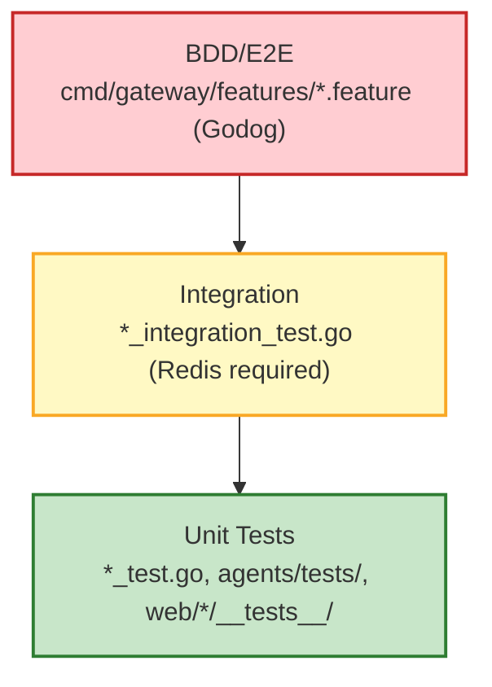

# Testing Guide

This document describes the testing strategy, commands, and conventions for the
N26 DevKey Simulation backend.

## Quick Reference

```bash
# Run everything (Go + Python)
make test

# Go unit tests only (fast, no Redis needed)
make test-unit-go

# Go integration tests (requires docker-compose.test.yml)
make test-integration-go

# Python tests
uv run pytest agents/ -x -q

# Coverage
make coverage
```

## Test Pyramid



### Layer 1: Unit Tests

Fast tests with no external dependencies. Mocks replace Redis, PubSub, etc.

| Stack      | Location            | Framework | Command                 |
| :--------- | :------------------ | :-------- | :---------------------- |
| Go         | `internal/`, `cmd/` | testing   | `make test-unit-go`     |
| Python     | `agents/tests/`     | pytest    | `uv run pytest agents/` |
| JavaScript | `web/*/__tests__/`  | vitest    | `npm test` (per app)    |

### Layer 2: Integration Tests

Require Redis via `docker-compose.test.yml`. Skipped by default with `-short`.

```bash
docker compose -f docker-compose.test.yml up -d
make test-integration-go
docker compose -f docker-compose.test.yml down
```

### Layer 3: BDD Feature Tests

Stakeholder-readable Gherkin specs in `cmd/gateway/features/`. Uses Godog with
in-process `httptest` — no Docker required.

```bash
go test ./cmd/gateway/... -run TestBDD -v
```

## Coverage

### Generating Reports

```bash
make coverage           # All coverage (Go + Python)
make coverage-go        # Go coverage profile
make coverage-py        # Python coverage + diff-cover
```

### Thresholds

| Metric         | Target | Enforcement                   |
| :------------- | :----- | :---------------------------- |
| Python overall | 60%    | `pytest --cov-fail-under=60`  |
| Python diff    | 80%    | `diff-cover --fail-under=80`  |
| Go ratchet     | HWM    | `scripts/deploy/coverage_ratchet.sh` |

### Ratcheting

Go coverage uses a high-water mark stored in `.coverage_baseline`. Coverage must
never decrease:

```bash
make coverage-ratchet-go   # Fails if coverage drops below baseline
```

## Pre-commit Hooks

Quality gates run automatically on commit/push:

| Hook                 | Stage      | What it checks         |
| :------------------- | :--------- | :--------------------- |
| `addlicense`         | pre-commit | Apache 2.0 headers     |
| `verify-gpg-signing` | pre-commit | SSH commit signing     |
| `go-vet`             | pre-commit | Go static analysis     |
| `python-ruff-check`  | pre-commit | Python linting         |
| `python-ruff-format` | pre-commit | Python formatting      |
| `go-test-short`      | pre-push   | Go unit tests          |
| `python-test`        | pre-push   | Python unit tests      |
| `diff-cover`         | pre-push   | New line coverage ≥80% |

## ADK Tool Compliance

All Python ADK tools **must** return `dict`, not `str`. This is enforced by
`agents/tests/test_adk_compliance.py` which verifies:

1. Return type annotation is `-> dict`
2. Runtime return value is `isinstance(result, dict)`

## Writing New Tests

### Go

```go
func TestMyFeature(t *testing.T) {
    // Unit test: no external deps
    result := MyFunction(input)
    assert.Equal(t, expected, result)
}

func TestMyIntegration(t *testing.T) {
    if testing.Short() {
        t.Skip("skipping integration test in short mode")
    }
    // Redis-dependent test...
}
```

### Python

```python
@pytest.mark.asyncio
async def test_my_tool(mock_tool_context):
    result = await my_tool(mock_tool_context)
    assert isinstance(result, dict)
    assert result["status"] == "success"
```

### JavaScript (Vitest)

```javascript
import { describe, it, expect } from "vitest";

describe("MyComponent", () => {
  it("renders correctly", () => {
    // jsdom-based DOM testing
  });
});
```

## Shared Test Fixtures (Python)

`agents/tests/conftest.py` provides reusable fixtures:

- `mock_callback_context` — Mocked `CallbackContext`
- `mock_tool_context` — Mocked `ToolContext`
- `mock_runner` — Mocked `Runner`
- `redis_dash_plugin` — `RedisDashLogPlugin` with mocked PubSub

---

## System Coverage Map

| System          | Critical Features                        | Testing Methodology                                  |
| :-------------- | :--------------------------------------- | :--------------------------------------------------- |
| **Gateway**     | WS Auth, Session Routing, Orch Webhook   | Integration tests, WS stress tests                   |
| **Admin**       | Phase Control, Global Config             | E2E browser tests for UI state sync                  |
| **Switchboard** | Distributed Fan-out (Redis PubSub)       | Cross-instance message delivery tests                |
| **AI Agents**   | Tool Calling, A2UI Rendering             | Model evaluation tests, A2A ABI contract validation  |
| **Tester UI**   | A2UI Components                          | Verification of rendering, recursive A2UI structures |

## Automated Stress Testing

Standard "Load Gates" for every release:

1. **ECS Benchmarks**: `go test ./internal/ecs/... -bench=.` for entity routing
   and state transition performance.
2. **Agent Concurrency**: Simulate 100+ concurrent AI agents hitting the Gateway
   telemetry pipeline.

## Cloud Environment Verification

### Development (GCP Dev)

- **Connectivity**: Verify Cloud Run VPC egress to Redis and Pub/Sub.
- **Security**: Verify IAP authorization on all public-facing endpoints.
- **Scalability**: Trigger horizontal scaling and verify session stickiness.

### Local (Emulator Mode)

- **Parity**: All tests run against `docker-compose` emulators (Redis, Pub/Sub).
- **Efficiency**: Rapid iteration cycles using `Procfile` management.

## Implementation Roadmap

- [x] Setup automated verification scripts
- [ ] Integrate all tests into Cloud Build CI/CD pipeline
