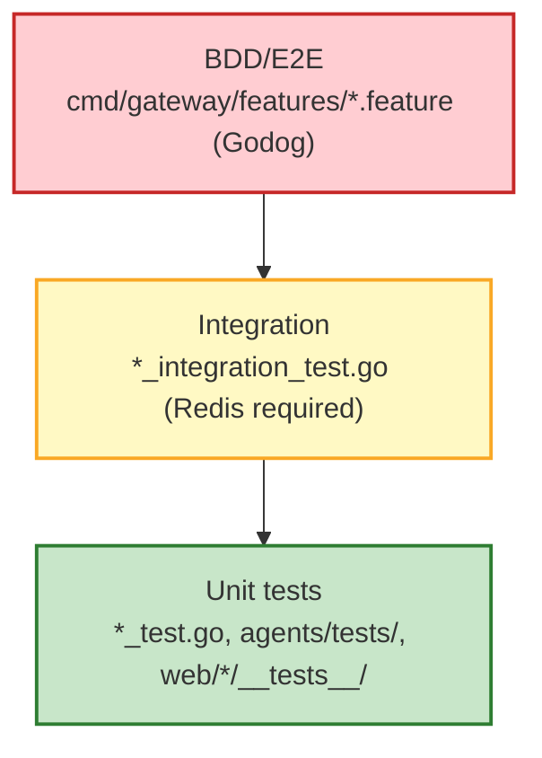

# Testing Guide

Testing strategy, commands, and conventions for Race Condition.

## Quick reference

```bash
# Everything (Go + Python + web)
make test

# Go unit tests only (fast, no Redis)
make test-unit-go

# Go integration tests (requires docker-compose.test.yml)
make test-integration-go

# Python tests (offline; conftest.py mocks GCP)
uv run pytest agents/ -x -q

# Coverage reports
make coverage

# Lint + unit tests + coverage (no infra)
make verify

# Verify + integration tests (needs Redis/Docker)
make verify-full
```

## Test pyramid



### Unit tests

Fast, no external dependencies. Mocks replace Redis, Pub/Sub, and Vertex.

| Stack      | Location            | Framework | Command                 |
| :--------- | :------------------ | :-------- | :---------------------- |
| Go         | `internal/`, `cmd/` | testing   | `make test-unit-go`     |
| Python     | `agents/tests/`     | pytest    | `uv run pytest agents/` |
| JavaScript | `web/*/__tests__/`  | vitest    | `npm test` (per app)    |

### Integration tests

Need Redis from `docker-compose.test.yml`. Skipped under `go test -short`.

```bash
docker compose -f docker-compose.test.yml up -d
make test-integration-go
docker compose -f docker-compose.test.yml down
```

### BDD feature tests

Gherkin specs in `cmd/gateway/features/`. Uses Godog with in-process
`httptest` — no Docker required.

```bash
go test ./cmd/gateway/... -run TestBDD -v
```

## Coverage

```bash
make coverage           # Go + Python
make coverage-go        # Go coverage profile
make coverage-py        # Python coverage + diff-cover
```

| Metric         | Target | Enforcement                  |
| :------------- | :----- | :--------------------------- |
| Python overall | 60%    | `pytest --cov-fail-under=60` |
| Python diff    | 80%    | `diff-cover --fail-under=80` |
| Go             | —      | Reported, not enforced       |

Go coverage is generated but not yet ratcheted. If you'd like to add a
high-water-mark check, that's a welcome contribution.

## Pre-commit hooks

```bash
pre-commit install
```

| Hook                  | What it checks                              |
| :-------------------- | :------------------------------------------ |
| `addlicense`          | Apache 2.0 headers (year 2026, Google LLC)  |
| `check-yaml`          | YAML syntax                                 |
| `check-json`          | JSON syntax (excludes `tsconfig*.json`)     |
| `end-of-file-fixer`   | Trailing newline at EOF                     |
| `trailing-whitespace` | Strips trailing whitespace                  |
| `go-vet`              | Go static analysis                          |

## ADK tool compliance

All Python ADK tools must return `dict`, not `str`. Enforced by
`agents/tests/test_adk_compliance.py`, which checks both:

1. The return type annotation is `-> dict`.
2. Runtime return value is `isinstance(result, dict)`.

## Writing new tests

### Go

```go
func TestMyFeature(t *testing.T) {
    // Unit test: no external deps
    result := MyFunction(input)
    assert.Equal(t, expected, result)
}

func TestMyIntegration(t *testing.T) {
    if testing.Short() {
        t.Skip("skipping integration test in short mode")
    }
    // Redis-dependent test...
}
```

### Python

```python
@pytest.mark.asyncio
async def test_my_tool(mock_tool_context):
    result = await my_tool(mock_tool_context)
    assert isinstance(result, dict)
    assert result["status"] == "success"
```

### JavaScript (Vitest)

```javascript
import { describe, it, expect } from "vitest";

describe("MyComponent", () => {
  it("renders correctly", () => {
    // jsdom-based DOM testing
  });
});
```

## Shared Python fixtures

`agents/tests/conftest.py` provides:

- `mock_callback_context` — mocked `CallbackContext`
- `mock_tool_context` — mocked `ToolContext`
- `mock_runner` — mocked `Runner`
- `redis_dash_plugin` — `RedisDashLogPlugin` with mocked transports

## Coverage map (what we test, where)

| System          | Critical features                        | Where                                                |
| :-------------- | :--------------------------------------- | :--------------------------------------------------- |
| Gateway         | WS auth, session routing, orchestration  | `internal/hub/`, `cmd/gateway/features/` (Godog)     |
| Switchboard     | Cross-instance Redis fan-out             | `internal/hub/switchboard*_test.go`                  |
| Agents          | Tool calling, A2UI rendering             | `agents/*/tests/`, `agents/tests/test_*compliance.py`|
| Tester UI       | A2UI primitive rendering                 | `web/tester/src/a2ui/*.test.ts`                      |
