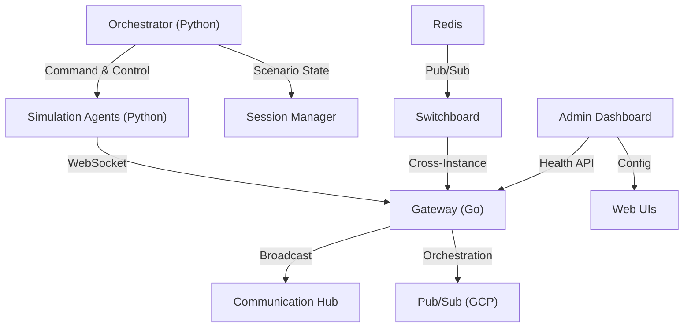

# Developer Onboarding Guide

Welcome to the `n26-devkey-simulation-code` project! This document provides a
high-level overview of how the various components interact to create a
massive-scale telemetry simulation.

## Prerequisites

Before starting, ensure you have the following installed:

- **Go** 1.25+ (`go version`)
- **Python** 3.13+ via `uv` (`uv --version`)
- **Node.js** 20+ (`node --version`)
- **Docker** (`docker --version`) — required for Redis emulator
- **golangci-lint** (`golangci-lint --version`) — Go linting
- **ruff** — installed via `uv sync` as a dev dependency
- **pre-commit** —
  `pre-commit install && pre-commit install --hook-type pre-push`

## System Overview

The simulation consists of several layers, from low-level event distribution to
high-level agent-based scenario orchestration.

## Core Components

### 1. Gateway (`cmd/gateway`)

The **Gateway** is the primary entry point for simulation events. It handles
WebSocket connections from simulation agents and distributes events to
connected observers via the Communication Hub.

### 2. Distribution (`internal/hub`)

The **Communication Hub** handles fan-out of simulation events to all connected
observers. The **Switchboard** enables cross-instance message relay via Redis.

### 3. Simulation Logic (`internal/ecs`, `internal/sim`)

For complex simulations, we use an **Entity Component System (ECS)**. This
allows us to manage thousands of simulation entities with high performance. The
**Simulation Manager** orchestrates the lifecycle (Start/Stop/Reset) of these
entities.

### 4. Agents (`agents/`)

Agents are the "actors" in our simulation.

- **Runner Agents**: Individual NPCs that simulate marathon runner behavior.
- **Orchestrator**: The "brain" that loads scenarios and directs the runners.
- **Planner Agent**: GIS expert that generates mathematically precise marathon
  routes.
- **Simulation Agent**: Manages overall simulation lifecycle and coordination.

## Local Workflow Verification

To ensure your environment is correctly configured, follow these steps:

1.  **Authentication**: Run `gcloud auth application-default login`.
2.  **Environment**: Copy `.env.example` to `.env` and set your `PROJECT_ID`.
    - **Note**: The system uses **Defensive Configuration** and **Automated
      Pre-flight Checks**. `uv run start` will verify your toolchain (docker,
      go, npm) before launching.
3.  **Dependencies**: Run `uv sync`.
4.  **Start Simulation**: Run `uv run start`.
5.  **Verify Flow**:
    - Access the **Admin Dashboard**: `http://127.0.0.1:8000`.
    - Run `uv run test-stress-agents` to verify agent communication under load.

## Getting Help

- Check individual service READMEs for technical details.
- Review `docs/architecture/` for formal proofs and design philosophy.
- See `docs/troubleshooting.md` for common issues and fixes.
- Follow the [Developer Workflow](../.agents/skills/developer-workflow/SKILL.md)
  for contribution guidelines.
