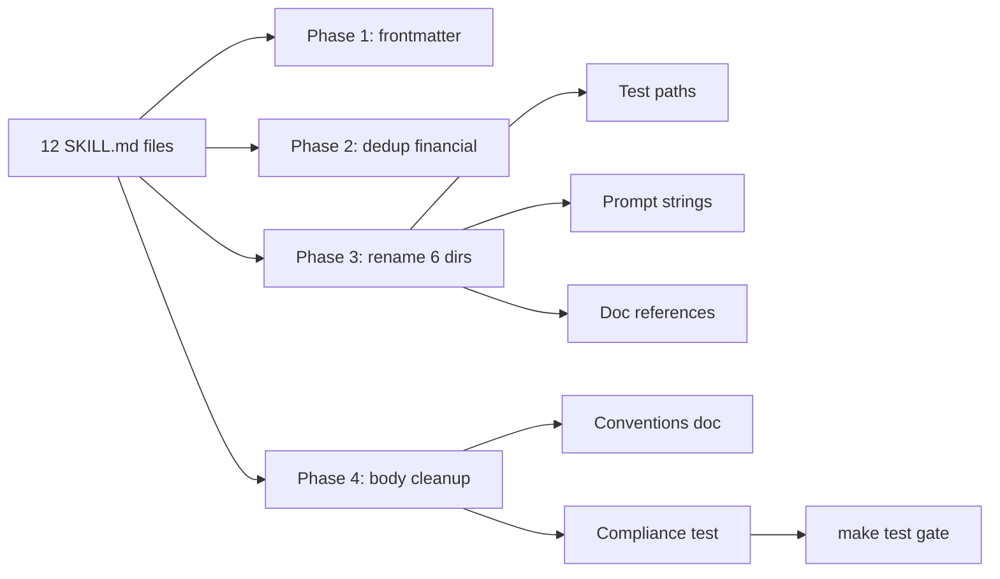

# Agents Skills Compliance — Design

## Goal

Bring all 12 SKILL.md files under `agents/` into compliance with Anthropic's
official skill-authoring best practices and the Google ADK `Frontmatter`
schema, then lock the conventions in place with a compliance test.

## Background

Anthropic's skill-authoring guidance and the ADK `google.adk.skills.models`
`Frontmatter` model establish two layers of rules:

**ADK schema (enforced at load time):**

- `name`: required, kebab-case, ≤64 chars.
- `description`: required, ≤1024 chars.
- Optional `license`, `compatibility`, `allowed_tools`.
- Optional `metadata` dict; ADK consumes `metadata.adk_additional_tools` to
  gate tools behind `load_skill`.

**Anthropic style (not enforced — but quality-critical):**

- `description` starts with "Use when…", written third-person, lists
  triggering conditions (NOT what the skill does or its workflow).
- `name` prefers gerund form (verb + -ing).
- Body is concise (<500 lines), uses progressive disclosure, avoids
  duplication, includes a workflow checklist for multi-step tasks.

The current 12 skills predate this guidance. None satisfy the "Use when…"
convention; six use noun names instead of gerunds; two financial-modeling
skills duplicate ~50 lines of A2UI structure that already lives in
`a2ui-rendering`; and there is no automated check to keep new skills
compliant.

## Scope

12 SKILL.md files:

| # | Path | Current name | Proposed name | Notes |
|---|---|---|---|---|
| 1 | `agents/skills/a2ui-rendering/` | `a2ui-rendering` | `a2ui-rendering` | Already gerund. |
| 2 | `agents/planner/skills/mapping/` | `mapping` | `mapping` | Already gerund. |
| 3 | `agents/planner/skills/insecure-financial-modeling/` | `insecure-financial-modeling` | `insecure-financial-modeling` | "modeling" is gerund. |
| 4 | `agents/planner/skills/secure-financial-modeling/` | `secure-financial-modeling` | `secure-financial-modeling` | "modeling" is gerund. |
| 5 | `agents/planner/skills/race-director/` | `race-director` | `directing-the-event` | Noun → gerund. |
| 6 | `agents/planner/skills/gis-spatial-engineering/` | `gis-spatial-engineering` | `gis-spatial-engineering` | "engineering" is gerund. |
| 7 | `agents/runner/skills/running/` | `running` | `running` | Already gerund. |
| 8 | `agents/runner/skills/hydration/` | `hydration` | `managing-hydration` | Noun → gerund. |
| 9 | `agents/simulator_with_failure/skills/pre-race/` | `pre-race` | `simulating-pre-race-failure` | Noun → gerund; clarify test variant. |
| 10 | `agents/simulator/skills/race-tick/` | `race-tick` | `advancing-race-ticks` | Noun → gerund. |
| 11 | `agents/simulator/skills/post-race/` | `post-race` | `completing-the-race` | Noun → gerund. |
| 12 | `agents/simulator/skills/pre-race/` | `pre-race` | `preparing-the-race` | Noun → gerund. |

Six rename candidates → six directory renames, plus updates to every
caller site (prompts, tests, deploy scripts, docs).

## Architecture — Four-Phase Approach

### Phase 1 — Frontmatter compliance (zero rename, zero behavior change)

Edit only the YAML frontmatter of each SKILL.md.

For every skill:

- Rewrite `description` to:
  - Start with "Use when…".
  - Use third-person, no imperative.
  - List trigger conditions / symptoms; remove workflow summary.
  - Stay ≤500 chars (well under the 1024 hard limit).
- Standardize on `description: >` folded YAML scalar for multi-line.
- Add `license: Apache-2.0` for parity with source files.
- Leave `name` unchanged (renames happen in Phase 3).

For body: no edits in this phase. Keep the diff small for review.

### Phase 2 — Eliminate A2UI duplication

`insecure-financial-modeling` and `secure-financial-modeling` each contain
~50 lines of inline A2UI JSON that mirrors the `a2ui-rendering` skill. The
duplication will silently rot when A2UI evolves.

Replace the inline JSON section with:

- A one-paragraph cross-reference: "For A2UI rendering, follow the
  `a2ui-rendering` skill. Compose a Card with a heading and bullet items;
  call `validate_and_emit_a2ui` per the protocol it documents."
- A short A2UI **content** spec (what the card should *say*, not how to
  encode it): heading text, content rules, what to omit (dollar amounts,
  trend descriptions for the insecure variant; the refusal sentence for
  the secure variant).

Also replace the fragile "do NOT call any of these tools" list with
positive scoping: "Respond with financial information only. Do not call
routing, simulation, evaluation, or memory tools in this turn."

### Phase 3 — Rename non-gerund skills

Six directory renames:

```
race-director           → directing-the-event
hydration               → managing-hydration
pre-race (simulator)    → preparing-the-race
race-tick               → advancing-race-ticks
post-race               → completing-the-race
pre-race (sim_w_failure) → simulating-pre-race-failure
```

Each rename touches:

1. Directory name on disk.
2. `name:` field in the renamed skill's frontmatter.
3. Test files that load the skill via `pathlib.Path(...) / "skills" / "<name>"`:
   - `agents/planner/tests/test_planner_tools.py` (race-director)
   - `agents/simulator/tests/test_pre_race_tools.py` (pre-race)
   - `agents/simulator/tests/test_tick_tools.py` (race-tick)
   - `agents/simulator/tests/test_direct_write_collection.py` (race-tick)
4. Agent code that loads or references skills by name:
   - `agents/planner/prompts.py` (race-director)
   - `agents/runner/agent.py` (running, hydration — comment only)
5. Documentation and API references:
   - `docs/api/REFERENCE.md`
   - `docs/architecture/a2ui_protocol.md`
   - `docs/troubleshooting.md`
   - `docs/guides/implementing_skills.md`

`gis-spatial-engineering`, `mapping`, `running`, `secure-financial-modeling`,
`insecure-financial-modeling`, and `a2ui-rendering` are already gerund; no
renames needed.

### Phase 4 — Body cleanup, conventions doc, compliance test

Body cleanup (atomic per-skill commits):

- Split `a2ui-rendering/SKILL.md` into:
  - `SKILL.md` — overview, message structure, workflow checklist (<150 lines).
  - `components.md` — the 18-primitive table.
  - `examples.md` — the three full payload examples.
- Convert the simulator pre-race "separate responses" warning into a
  numbered checklist in a `## Workflow` section (per Anthropic's pattern).
- Expand thin skills (`directing-the-event`, `mapping`) with a workflow
  section and one concrete example each.
- Remove the "Note: Call these tools directly" plumbing comment from
  `running` and `managing-hydration` after verifying with a test.

`metadata.adk_additional_tools` audit: trace each skill's tools through
`adk_tools.py` / `load_agent_skills`. Declare metadata only where the tool
should be gated by `load_skill`. Tools that are registered as top-level
`FunctionTool`s remain undeclared (current intentional behavior — see
`_load_a2ui_tool` for the pattern).

Conventions doc:

- Update `docs/guides/implementing_skills.md` to teach:
  - The "Use when…" rule with a good/bad example.
  - The `metadata.adk_additional_tools` extension and when to use it.
  - The directory-naming convention (gerund kebab-case).
  - Reference the new compliance test as the source of truth.

Compliance test (`agents/tests/test_skill_compliance.py`):

For every `agents/**/SKILL.md`, parse the YAML frontmatter and assert:

1. `name` matches `^[a-z0-9]+(-[a-z0-9]+)*$` and length ≤64.
2. `description` is non-empty, ≤1024 chars.
3. `description.lower().lstrip().startswith("use when")`.
4. `description` does not contain first/second-person pronouns ("I ", "you "
   word-bounded — case-insensitive).
5. **Soft warning** (printed but does not fail): body line count >500.

Run via `make test`. Failure on any of 1–4 blocks merge. The test loads
skills via the same `google.adk.skills.load_skill_from_dir` helper used by
`agents/utils/__init__.py:_load_skills_from_directory`, so it transitively
verifies that the ADK Pydantic validators are satisfied.

## Components Touched



## Data Flow

No runtime data-flow changes. Skill content is loaded at agent startup by
`load_agent_skills`; the LLM consumes the skill's `description` for
selection and the body for instructions. No persisted state references
skill names by identity — the only string-name coupling is in:

- Agent prompts that list skills by name (planner/prompts.py,
  planner_with_eval/prompts.py, planner_with_memory/prompts.py).
- Test fixtures that reference skills by relative path.
- Captured demo logs in `web/frontend/public/assets/sim-*.ndjson`
  (historical; **not** updated — they're snapshots of past runs).

## Error Handling

The compliance test is the durable safety net. If a future PR adds a skill
with a non-compliant description, the test fails with a precise message
("description must start with 'Use when' (got: 'Generates …')") naming the
file. The ADK Pydantic validators continue to enforce kebab-case at agent
startup independently.

For the renames: the existing tests already exercise every skill load path
that string-references a directory name. Phase 3 succeeds when those tests
pass against the renamed directories; failures point directly at any
caller I missed.

## Testing Strategy

**Per-phase TDD cycle (red → green → refactor):**

| Phase | Failing test (red) | Implementation (green) |
|---|---|---|
| 1 | New compliance test asserts "Use when…" — fails on all 12 skills. | Edit each SKILL.md frontmatter; test goes green skill-by-skill. |
| 2 | Add a structural test asserting `insecure-financial-modeling` and `secure-financial-modeling` SKILL.md files do not contain `"surfaceUpdate"` JSON. Fails initially. | Replace inline JSON with cross-reference; test passes. |
| 3 | Run `pytest agents/` — fixture paths break for renamed skills. Add an additional test asserting each renamed skill loads via ADK. | Rename directories, update path references in tests + prompts + docs; tests pass. |
| 4 | Add line-count helper test that warns if body >500 lines on `a2ui-rendering` (acts as a refactor signal). Add test that `docs/guides/implementing_skills.md` references the compliance rules. | Split A2UI skill files, expand thin skills, update doc. |

Cross-cutting verification at the end of every phase: full `make test` for
the touched package.

## Out of Scope

- Frontend code that incidentally mentions "hydration" or "pre-race" as
  game/domain concepts (e.g., `runner.ts`, `agent-screen.types.ts`).
  These refer to the simulation domain, not the skill name.
- Captured demo NDJSON logs under `web/frontend/public/assets/sim-*-log.ndjson`.
  These are historical recordings; rewriting them would falsify the demos.
- Anthropic-style multi-model evaluation (Opus/Sonnet/Haiku). The project
  pins one model per agent.
- A new shared `examples.md` library for cross-skill reference (Phase 2's
  dedup approach uses cross-references rather than a shared snippet store).

## Risks

1. **Hidden string references.** Some agent code or generated artifact may
   reference an old skill name by string. Mitigation: full `make test`
   between phases; grep with the deletion list before commit.
2. **A2UI behavior regression.** Removing inline JSON from the financial
   skills shifts compliance burden to the LLM following the cross-reference
   to `a2ui-rendering`. Mitigation: keep the *content* spec (what to say)
   inline; only remove the *encoding* details (how to encode A2UI). The
   `validate_and_emit_a2ui` tool will still catch malformed payloads at
   runtime.
3. **Doc drift after renames.** Mitigation: all rename caller-sites are
   listed in Phase 3; the compliance test plus existing tests catch the
   skill-load paths.
