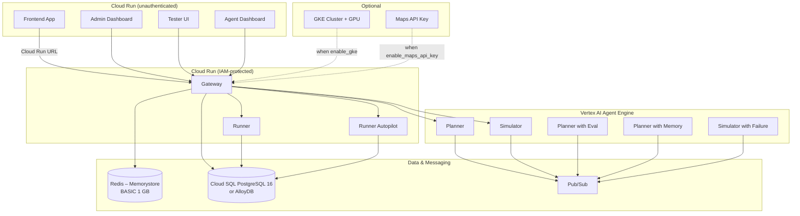

<!--
Copyright 2026 Google LLC

Licensed under the Apache License, Version 2.0 (the "License");
you may not use this file except in compliance with the License.
You may obtain a copy of the License at

    http://www.apache.org/licenses/LICENSE-2.0

Unless required by applicable law or agreed to in writing, software
distributed under the License is distributed on an "AS IS" BASIS,
WITHOUT WARRANTIES OR CONDITIONS OF ANY KIND, either express or implied.
See the License for the specific language governing permissions and
limitations under the License.
-->

# OSS Deployment

Single-GCP-project deployment of the
[Race Condition](https://github.com/GoogleCloudPlatform/race-condition)
simulation. This Terraform configuration provisions all required infrastructure
in one project and one region with sensible defaults for individual developers
or small teams.

No DNS, no GCLB, no IAP -- you access every service through its Cloud Run URL.

## Prerequisites

| Requirement | Version |
| :--- | :--- |
| GCP project with billing enabled | -- |
| `gcloud` CLI (authenticated) | latest |
| Terraform | >= 1.5 |

Authenticate before running Terraform:

```bash
gcloud auth application-default login
```

## Quick Start

```bash
cd projects/oss

# 1. Create your configuration
cp terraform.tfvars.example terraform.tfvars
# Edit terraform.tfvars -- set project_id at minimum

# 2. Initialize
terraform init

# 3. Preview changes
terraform plan

# 4. Apply
terraform apply
```

Terraform outputs (Cloud Run URLs, database IPs, etc.) are printed after apply
completes. Run `terraform output` at any time to retrieve them.

## Feature Toggles

All optional features default to **false**. Enable them in `terraform.tfvars`:

| Variable | Default | Description |
| :--- | :---: | :--- |
| `enable_alloydb` | `false` | Use AlloyDB instead of Cloud SQL PostgreSQL. Higher cost, more features. |
| `enable_gke` | `false` | Deploy a GKE cluster for `runner_gke` GPU workloads. |
| `enable_runner_cloudrun` | `false` | Deploy the LLM-powered runner as a Cloud Run service. |
| `enable_maps_api_key` | `false` | Provision a Maps/Places/Weather API key in Secret Manager. |
| `enable_monitoring` | `false` | Deploy Cloud Monitoring alerts and uptime checks (requires refactor for URL-based checks). |

## Architecture



### What Gets Deployed

**Always provisioned:**

- VPC with private services access
- Cloud SQL PostgreSQL 16 (or AlloyDB when `enable_alloydb = true`)
- Memorystore Redis (BASIC tier, 1 GB)
- Pub/Sub topic and subscriptions for agent orchestration
- Artifact Registry for Docker images
- Model Armor template
- IAM service accounts (compute, Agent Engine)
- All required GCP APIs

**Deployed by application CI (not by this Terraform):**

- Cloud Run services (frontend, admin, tester, dash, gateway, runners)
- Vertex AI Agent Engine agents (planner variants, simulator variants)

## Outputs Reference

After `terraform apply`, the following outputs are available:

| Output | Description |
| :--- | :--- |
| `project_id` | GCP project ID |
| `region` | GCP region |
| `project_number` | GCP project number |
| `artifact_registry_url` | Docker image registry URL |
| `vpc_id` | VPC network ID |
| `vpc_name` | VPC network name |
| `redis_host` | Redis instance private IP |
| `redis_port` | Redis instance port |
| `database_type` | `cloud-sql` or `alloydb` |
| `database_ip` | Database private IP address |
| `database_connection_name` | Cloud SQL connection name (Cloud SQL only) |
| `database_password_secret_id` | Secret Manager ID for database password |
| `pubsub_topic` | Orchestration topic name |
| `compute_sa_email` | Compute service account email |
| `agent_engine_sa_email` | Agent Engine service account email |
| `gke_cluster_name` | GKE cluster name (when `enable_gke = true`) |
| `features` | Map of all feature toggle states |

## Cost Estimate

Estimated monthly cost with all defaults (everything optional disabled):

| Resource | Estimate |
| :--- | :--- |
| Cloud SQL PostgreSQL (`db-custom-1-3840`) | ~$25 |
| Memorystore Redis (BASIC 1 GB) | ~$30 |
| VPC / networking | ~$3 |
| Pub/Sub, Secret Manager, misc | ~$3 |
| **Total (idle)** | **~$61/month** |

Cloud Run services are billed per-request and add minimal cost at low traffic.
Enabling optional features increases cost significantly:

- **AlloyDB**: ~$200+/month (replaces Cloud SQL)
- **GKE with GPU**: ~$300+/month depending on node count and GPU type

## Terraform Backend

The default configuration uses a **local backend** (state stored on disk). For
team use, configure a GCS backend:

```bash
# Create a state bucket
gsutil mb -p YOUR_PROJECT_ID -l us-central1 gs://YOUR_PROJECT_ID-terraform-state
gsutil versioning set on gs://YOUR_PROJECT_ID-terraform-state
```

Then uncomment the `backend "gcs"` block in [backend.tf](backend.tf) and update
the bucket name.

## Cleanup

Remove all provisioned resources:

```bash
terraform destroy
```

> **Note:** `terraform destroy` does not delete the GCP project itself. If you
> created a project specifically for this deployment, delete it through the
> Cloud Console or with `gcloud projects delete PROJECT_ID`.
