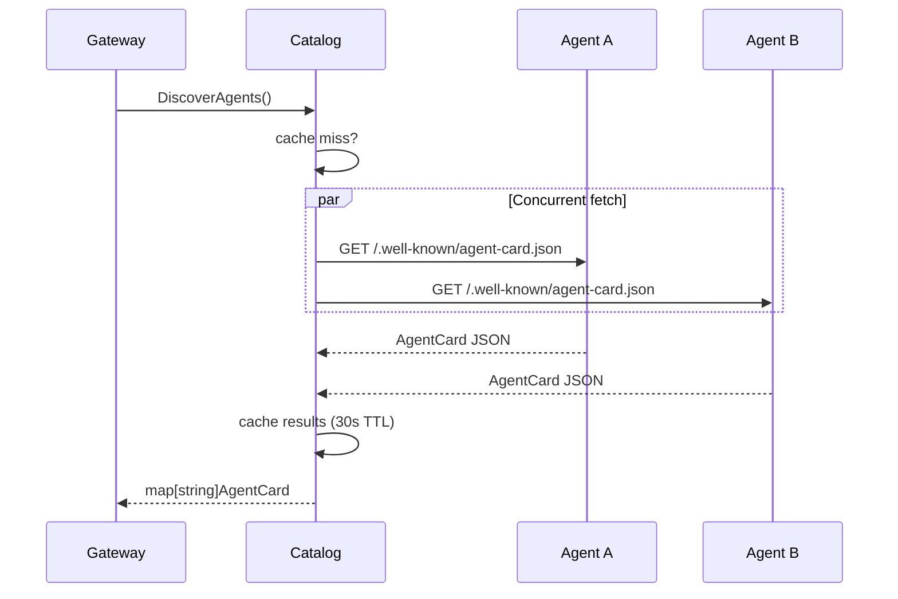

# Agent catalog

The `agent` package discovers and caches agent cards from running agent
services. The gateway uses the catalog to know which agents exist, where they
live, and how to talk to them (HTTP poke vs A2A dispatch).

## How discovery works

At startup, the gateway reads `AGENT_URLS` (a comma-separated list of base
URLs) and passes them to `NewCatalog()`. When the gateway or switchboard needs
to route a message, it calls `catalog.DiscoverAgents()`, which:

1. Checks the in-memory cache (default TTL: 30 seconds)
2. On cache miss, fetches all agent cards **concurrently** (one goroutine per
   URL)
3. Caches the results and returns `map[string]AgentCard`

Each URL gets a well-known card path appended based on the agent type:

- **Standard agents** (local or Cloud Run):
  `{baseURL}/.well-known/agent-card.json`
- **Agent Engine agents** (Vertex AI):
  `{baseURL}/a2a/v1/card`

Agent Engine URLs are detected by checking for `aiplatform.googleapis.com` and
`reasoningEngines` in the URL.



## URL resolution

Agents self-report their URL in the card JSON, but that URL might be a public
or IAP-fronted address that's unreachable server-to-server. The catalog
resolves this by rewriting the host to match the discovery base URL while
preserving the card's A2A path.

For example, if an agent's card reports `http://public.example.com/a2a/simulator/`
but the discovery URL is `http://localhost:8202`, the resolved URL becomes
`http://localhost:8202/a2a/simulator/`.

Each card stores two URLs for different purposes:

| Field | Contains | Used for |
|:------|:---------|:---------|
| `URL` | Rewritten A2A endpoint (host from discovery, path from card) | Agent-to-agent communication |
| `BaseURL` | Raw discovery URL from `AGENT_URLS` | Orchestration pokes (`/orchestration` endpoint) |

`OrchestrationBaseURL()` returns `BaseURL`, falling back to `URL` if unset.

## Dispatch modes

Agents declare a dispatch mode through the `n26:dispatch/1.0` capability
extension in their agent card:

- **`subscriber`** (default): receives orchestration events via HTTP POST to
  `/orchestration`. Used by most agents.
- **`callable`**: receives events via A2A `message/send` JSON-RPC. Used by
  Agent Engine agents that don't have an `/orchestration` endpoint.

The switchboard reads `card.DispatchMode()` to choose the routing path.

## Caching and thundering-herd prevention

The cache uses double-checked locking to prevent multiple concurrent callers
from triggering redundant HTTP fetches:

1. **Fast path** (`RLock`): if cached and not expired, return immediately
2. **Slow path** (`Lock`): re-check expiry under write lock (another goroutine
   may have populated the cache while waiting for the lock), fetch only if
   still needed

Cache TTL defaults to 30 seconds. Tests use `NewCatalogWithTTL()` to set
shorter TTLs.

## Retry and graceful degradation

Both the standard HTTP client and the GCP-authenticated client use
[hashicorp/go-retryablehttp](https://github.com/hashicorp/go-retryablehttp)
with 5 retries and exponential backoff (500ms to 5s). This handles the common
case where agents are still starting up when the gateway first tries to
discover them.

If an agent is unreachable after retries, it's logged and skipped. Discovery
only fails if zero agents are found.

## Transparent JSON proxy

`AgentCard` stores the raw JSON from each agent's card endpoint in a
`json.RawMessage` field. When the gateway serves `GET /api/v1/agent-types`,
it marshals the cards, and `MarshalJSON()` returns the raw bytes unchanged.
This means the gateway proxies exactly what agents report without needing to
know every possible field in the card schema.

The typed fields (`Name`, `URL`, `Version`, etc.) are extracted during
`UnmarshalJSON()` for the gateway's own routing logic, but they don't
constrain what the card can contain.

## File layout

```
internal/agent/
├── doc.go               # Package-level documentation
├── catalog.go           # AgentCard, Catalog, discovery logic
├── catalog_test.go      # Unit tests (httptest servers, caching, concurrency)
└── integration_test.go  # Integration tests (full lifecycle, degradation, retry)
```

## Configuration

| Variable | Example | Description |
|:---------|:--------|:------------|
| `AGENT_URLS` | `http://localhost:8210,http://localhost:8202` | Comma-separated agent base URLs |

URL formats by deployment type:

- **Local**: `http://localhost:{port}`
- **Cloud Run**: `https://{service}-{hash}.{region}.run.app`
- **Agent Engine**: `https://{region}-aiplatform.googleapis.com/v1beta1/projects/{id}/locations/{region}/reasoningEngines/{id}`

## Design decisions

**HTTP-based discovery, not static config.** An earlier version used a static
`catalog.json` file. HTTP-based discovery via well-known paths means agents
are self-describing: add a new agent to `AGENT_URLS` and the gateway picks up
its capabilities automatically.

**Two HTTP clients.** Standard agents need no auth. Agent Engine agents require
GCP OAuth2 tokens. Rather than adding auth logic to every call site, the
catalog selects the right client based on the URL pattern.

**BaseURL vs URL separation.** The switchboard needs two different addresses
for the same agent: the A2A endpoint (for `message/send`) and the
orchestration base (for `/orchestration` pokes). Collapsing them into one URL
caused 404s when the A2A path was appended to orchestration calls or vice versa.

## Further reading

- [A2A protocol agent cards](https://google.github.io/A2A/#/documentation?id=agent-card) --
  the specification for `/.well-known/agent-card.json`
- [hashicorp/go-retryablehttp](https://github.com/hashicorp/go-retryablehttp) --
  retry library used for resilient discovery
- The hub switchboard ([internal/hub/](../hub/)) uses the catalog for broadcast
  and dispatch routing
- The gateway ([cmd/gateway/](../../cmd/gateway/)) reads `AGENT_URLS` and
  serves discovered cards via `/api/v1/agent-types`
