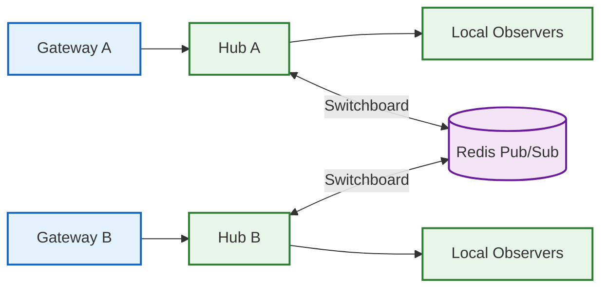

# Communication Hub

The `hub` package provides a high-concurrency WebSocket fan-out engine for
real-time telemetry distribution.

## Role

- **Connection Management**: Manages thousands of concurrent WebSocket observers
  (Visualizers, Sidecars).
- **Efficient Fan-out**: Distributes incoming telemetry segments to all
  registered observers using non-blocking channels.
- **Backpressure Handling**: Drops messages for lagging consumers to protect
  system memory and overall stability.

## Key Types

- `Hub` — Central registry of WebSocket connections with per-session routing
- `Switchboard` — Redis-backed message relay for cross-instance broadcast and
  orchestration routing between multiple Gateway processes
- `Client` — Represents a single WebSocket observer connection

## Key Files

- `hub.go`: Connection registry, session routing, fan-out loop
- `switchboard.go`: Redis Pub/Sub relay for distributed broadcasting
- `switchboard_integration_test.go`: Cross-instance message delivery tests

## Architecture

The Switchboard enables horizontal scaling: when Gateway A receives telemetry,
it broadcasts locally via its Hub AND publishes to Redis. Gateway B's
Switchboard subscription picks this up and broadcasts to its own local
observers, ensuring all connected clients see all events regardless of which
Gateway instance they're connected to.
