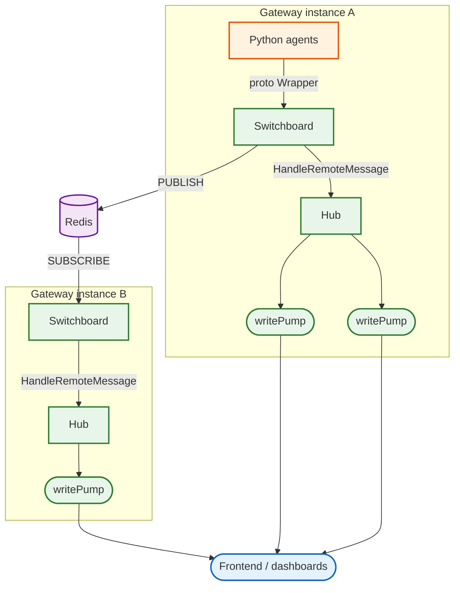

# Communication hub

The `hub` package handles WebSocket connection management, message routing, and
distributed fan-out for the simulation gateway. Every piece of real-time data
that reaches a browser -- agent narratives, tick updates, telemetry events --
flows through this package.

## What it does

The gateway needs to deliver protobuf-encoded agent events to potentially
thousands of WebSocket clients, across multiple gateway instances, with
per-simulation filtering and without blocking the event loop when a client falls
behind. The hub package solves all of these problems:

- **Session routing**: clients connect with a session ID and receive only
  messages targeted at their session, or subscribe to a simulation to receive
  its full event stream
- **Fan-out with backpressure**: non-blocking channel sends drop messages for
  slow clients rather than letting one lagging connection stall the entire
  broadcast pipeline
- **Multi-instance distribution**: a Redis Pub/Sub relay (the "Switchboard")
  ensures events published by one gateway instance reach clients connected to
  any other instance
- **Agent dispatch**: the Switchboard also handles outbound communication to
  agents, routing orchestration events via HTTP poke (local) or A2A JSON-RPC
  (Agent Engine)

## Architecture



## Hub: the event loop

`Hub.Run()` is a single-goroutine `select` loop that processes six channel
types: register, unregister, simulation subscribe/unsubscribe, broadcast, and
session-targeted messages. All client map mutations happen in this one
goroutine, which eliminates lock contention on the hot path.

Remote messages (from Redis) are the exception. They go to a **worker pool**
(default 4 goroutines, production uses 16) that processes fan-out under a
read lock, since fan-out only reads the client maps.

### Three-phase message routing

When a remote message arrives, `processRemoteMessage` delivers it in three
phases, tracking which clients already received it to prevent duplicates:

1. **Global observers** (session ID `""`): dashboard clients that see
   everything, filtered by simulation subscription state
2. **Targeted sessions**: if the protobuf `Wrapper` has a `Destination` or
   `SessionId`, route to those specific sessions
3. **Simulation subscribers**: O(1) reverse-index lookup by `SimulationId`,
   plus a cross-instance Redis fallback for clients that reconnected to a
   different gateway without re-subscribing locally

### Simulation subscription filtering

Subscription state uses three maps that work together:

- `simSubscriptions` (client -> simulation IDs): **allowlist mode**, client
  only receives messages from subscribed simulations
- `simToClients` (simulation ID -> clients): **reverse index** for O(1) lookup
  during phase 3 routing
- `simBlocked` (client -> simulation IDs): **blocklist mode**, after
  unsubscribe, the specific simulation is blocked but new/unknown simulations
  still pass through

Why three maps instead of one? Allowlist alone isn't enough: when a client
unsubscribes from its only simulation, the allowlist becomes empty, which is
indistinguishable from "never subscribed" (deliver everything). The blocklist
solves this by remembering which simulations were explicitly rejected, so
new/unknown simulations still pass through while unsubscribed ones stay blocked.
Subscribing again clears the blocklist and switches back to allowlist mode.
(See the `simBlocked` handling in [hub.go](hub.go).)

### Backpressure

Every fan-out path uses the same non-blocking pattern:

```go
select {
case c.send <- &wsMessage{mType: websocket.BinaryMessage, data: data}:
default:
    log.Printf("Hub: dropped message for session %s (buffer full)", c.sessionID)
}
```

Client send buffers default to 100,000 messages. When a buffer fills, messages
are dropped for that specific client only. This protects the event loop from
blocking on a single slow consumer.

## Switchboard: distributed relay

The `Switchboard` interface abstracts all Redis and agent communication behind
nine methods. `RedisSwitchboard` is the production implementation.

### Broadcast relay

The broadcast path avoids redundant serialization:

1. An agent emits a `gateway.Wrapper` protobuf
2. `Switchboard.Broadcast()` marshals it once and `PUBLISH`es to
   `gateway:broadcast`
3. The receiving instance's `listenBroadcasts()` goroutine deserializes the
   wrapper but passes the **raw bytes** through to
   `Hub.HandleRemoteMessage(wrapper, rawBytes)`
4. The hub forwards those raw bytes directly to WebSocket clients without
   re-marshaling

This raw-bytes passthrough was added specifically to eliminate a redundant
`proto.Marshal` call per message per instance.

### Spawn queue sharding

When the gateway spawns hundreds of runners simultaneously, all their spawn
events land in Redis queues consumed by dispatcher agents via `BLPOP`. A single
queue creates a competing-consumer hotspot. The Switchboard distributes spawn
events across 8 sharded queues using FNV-1a hashing on the session ID:

```go
func SpawnQueueName(agentType, sessionID string, numShards int) string {
    h := fnv.New32a()
    h.Write([]byte(sessionID))
    shard := int(h.Sum32()) % numShards
    return fmt.Sprintf("simulation:spawns:%s:%d", agentType, shard)
}
```

`BatchEnqueueOrchestration` further reduces N Redis round-trips to 1 pipelined
operation during spawn bursts.

### Agent dispatch routing

The Switchboard routes orchestration events to agents using two paths:

- **Local agents** (running in the same network): HTTP POST to
  `/orchestration` endpoint
- **Agent Engine agents** (running on Vertex AI): A2A `message/send` JSON-RPC
  with GCP OAuth2 authentication

This distinction matters because Agent Engine agents don't have an
`/orchestration` endpoint, and local agents don't speak A2A. Routing the wrong
way caused silent 404s in production.

### Reconnection

`Switchboard.Start()` wraps the Redis subscription listener with exponential
backoff (500ms initial, 30s max). If the Redis connection drops (VPC hiccup,
Redis restart), the subscription goroutine recovers automatically. Without this,
a gateway instance would permanently stop receiving cross-instance broadcasts
after a single transient failure.

## Subscription store: cross-instance persistence

`SubscriptionStore` persists simulation subscriptions in Redis so they survive
WebSocket reconnections to a different gateway instance.

- **Forward index**: `sim_sub:{simulationID}` SET containing session IDs
- **Reverse index**: `sim_sub_rev:{sessionID}` SET containing simulation IDs
- **TTL**: 2 hours, refreshed on each `Subscribe()` call
- **Stale data guard**: even when Redis returns a session as subscribed, the
  hub checks the local `simSubscriptions` map before delivering. This prevents
  stale Redis data from re-delivering messages after an async unsubscribe.

All Redis calls from the `Run()` loop use 2-second context timeouts and run
in background goroutines to keep the event loop non-blocking.

## PubSub drainer

`PubSubDrainer` handles environment reset by seeking GCP Pub/Sub subscriptions
to "now", discarding all queued messages. This is used during simulation reset
to clear stale events from a previous run.

## File layout

```
internal/hub/
├── hub.go                          # Hub, client, writePump, Run() event loop
├── switchboard.go                  # Switchboard interface + RedisSwitchboard
├── subscription.go                 # SubscriptionStore, Redis forward/reverse index
├── pubsub_drainer.go               # GCP Pub/Sub subscription drainer
├── hub_test.go                     # Hub unit tests (~1060 lines)
├── switchboard_test.go             # Switchboard unit tests (~1530 lines)
├── subscription_test.go            # Subscription store tests
├── pubsub_drainer_test.go          # Drainer tests
├── binary_hub_test.go              # Binary protobuf delivery tests
├── relay_integration_test.go       # End-to-end relay through Redis to WebSocket
└── switchboard_integration_test.go # Cross-instance broadcast tests
```

## Configuration

| Parameter | Default | Production | Description |
|:----------|:--------|:-----------|:------------|
| `BroadcastBuffer` | 100,000 | 100,000 | Broadcast channel capacity |
| `SessionMsgBuffer` | 100,000 | 100,000 | Targeted message channel capacity |
| `RemoteMsgBuffer` | 100,000 | 100,000 | Remote (Redis) message channel capacity |
| `ClientSendBuffer` | 100,000 | 100,000 | Per-client WebSocket write buffer |
| `RemoteWorkers` | 4 | 16 | Worker goroutines for remote message fan-out |

The worker count was bumped from 4 to 16 to handle 1000+ concurrent runner
sessions without pub/sub fan-out becoming the bottleneck.

## Design decisions

**Single-goroutine event loop for mutations, worker pool for reads.** The
`Run()` select loop handles all map mutations (register, unregister, subscribe,
unsubscribe) in a single goroutine, so no locks are needed for writes. Remote
message fan-out, which only reads maps, runs in a worker pool under `RWMutex`
read locks. This keeps the mutation path lock-free while allowing concurrent
fan-out.

**Drop messages, never block.** A slow WebSocket client cannot back-pressure
the event loop or other clients. The 100k buffer gives clients plenty of room,
but if they fall behind, messages are dropped for that client only. This is the
right tradeoff for real-time telemetry where stale data has no value.

**Raw bytes passthrough.** When protobuf bytes arrive from Redis, they're
already serialized. Deserializing to inspect routing fields and then
re-serializing for WebSocket delivery would double the marshaling cost per
message. The `remoteMessage` struct carries both the decoded wrapper (for
routing decisions) and the original bytes (for zero-copy delivery).

**Blocklist for unsubscribe.** An empty allowlist is ambiguous: does it mean
"receiving nothing" or "never opted in"? The blocklist map resolves this by
explicitly tracking rejected simulations, so the hub can distinguish between
a client that unsubscribed (block specific sims, allow new ones) and a
dashboard that never subscribed (deliver everything).

## Further reading

- [gorilla/websocket](https://github.com/gorilla/websocket) -- WebSocket
  library used for connection management
- [Redis Pub/Sub](https://redis.io/docs/latest/develop/interact/pubsub/) --
  the messaging primitive behind cross-instance relay
- [Protocol Buffers](https://protobuf.dev/) -- wire format for all agent
  events (see [gen_proto/gateway/](../../gen_proto/gateway/))
- The gateway ([cmd/gateway/](../../cmd/gateway/)) is the only consumer of
  this package
- The session package ([internal/session/](../session/)) handles the
  Redis-backed session registry that the Switchboard uses for agent routing
