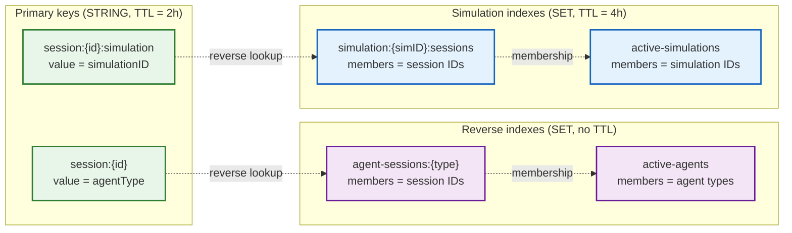

# Session management

The `session` package tracks which agent sessions are active across gateway
instances, what agent type each session belongs to, and which simulation it's
part of. The gateway uses this to make routing decisions: which agents to poke
during a broadcast, which sessions to include in a spawn batch, and which
simulation a response belongs to.

## Two interfaces, two concerns

The package defines two separate interfaces because session tracking operates
at two different levels:

**`Service`** is a local, in-process mapping between ECS entity IDs and session
strings. It's synchronous, returns no errors, and is used when the simulation
engine needs to look up a session by entity or vice versa.

**`DistributedRegistry`** is a cross-process, Redis-backed registry that maps
session IDs to agent types and simulation IDs. It's context-aware, returns
errors, and is designed for horizontal scaling across multiple gateway
instances. This is the interface the gateway and switchboard actually depend on.

`InMemorySessionService` implements both interfaces, making it a convenient
all-in-one for local development and tests. `RedisSessionRegistry` implements
only `DistributedRegistry` and is used in production.

## Redis data model

The `RedisSessionRegistry` uses STRINGs and SETs (no sorted sets, no hashes):



| Key pattern | Type | TTL | Purpose |
|:------------|:-----|:----|:--------|
| `{prefix}:session:{id}` | STRING | 2h | Session-to-agent-type lookup |
| `{prefix}:session:{id}:simulation` | STRING | 2h | Session-to-simulation lookup |
| `{prefix}:agent-sessions:{type}` | SET | none | Which sessions belong to an agent type |
| `{prefix}:active-agents` | SET | none | Which agent types have active sessions |
| `{prefix}:simulation:{simID}:sessions` | SET | 4h | Which sessions belong to a simulation |
| `{prefix}:active-simulations` | SET | none | Which simulations have active sessions |

### Why two TTL tiers?

STRING keys (the primary records) expire after 2 hours via Redis TTL. SET keys
for agent-type indexes have no TTL and are cleaned lazily by `Reap()`.
Simulation SET keys get double the session TTL (4 hours) as a safety margin:
if a session's STRING key expires at the 2-hour mark, the simulation SET
still has 2 hours of runway before it disappears, giving `Reap()` time to
clean it up properly.

## How sessions are tracked

### Single session

`TrackSession` registers one session in a single Redis pipeline (one
round-trip):

```go
reg.TrackSession(ctx, "session-uuid", "runner_autopilot", "sim-uuid")
```

This writes the session STRING, the simulation STRING, adds the session to
both reverse-index SETs, and adds the agent type and simulation ID to their
respective active-index SETs. All six writes go in one pipeline.

### Batch spawn

When the gateway spawns hundreds of runners at once, `BatchTrackSessions`
pipelines all writes into a single Redis round-trip:

```go
entries := []session.SessionTrackingEntry{
    {SessionID: "uuid-1", AgentType: "runner_autopilot", SimulationID: "sim-1"},
    {SessionID: "uuid-2", AgentType: "runner_autopilot", SimulationID: "sim-1"},
    // ... hundreds more
}
reg.BatchTrackSessions(ctx, entries)
```

This avoids the N-round-trip problem during spawn bursts where N can be 100+.

## Routing queries

The gateway and switchboard use three query methods to make routing decisions:

- **`FindAgentType(sessionID)`** -- returns the agent type for a session, used
  by the switchboard to route responses back to the correct agent
- **`ActiveAgentTypes()`** -- returns agent types that have at least one active
  session, used during broadcast to skip poking agents with no sessions
- **`FindSimulation(sessionID)`** -- returns the simulation ID for a session,
  used to attach `SimulationId` to protobuf response wrappers for
  subscription-based routing in the hub

## Cleanup: flush and reap

### Flush (nuclear reset)

`Flush()` deletes everything: all session STRINGs, all SETs, all indexes. Used
during environment reset (the `/api/v1/reset` endpoint).

### Reap (garbage collection)

`Reap()` cleans up orphaned SET entries whose STRING keys have already expired
via TTL. It runs two sweeps:

1. **Agent session sweep**: for each agent type, pipelines `EXISTS` checks for
   all member sessions. Removes stale entries. If the SET is now empty, removes
   the agent type from the active-agents index.

2. **Simulation sweep**: SCANs for all simulation SET keys, checks each member
   session, removes stale entries, and cleans up empty simulation SETs.

The gateway runs `Reap()` on a 30-minute interval. This means SET entries can
be stale for up to 30 minutes after their STRING key expires, which is
acceptable since the SETs are only used for optimization (broadcast skip) and
listing, not for correctness-critical routing.

## File layout

```
internal/session/
├── service.go             # Service + DistributedRegistry interfaces, InMemorySessionService
├── redis_registry.go      # RedisSessionRegistry (production implementation)
├── service_test.go        # InMemorySessionService tests
└── redis_registry_test.go # Redis tests using miniredis
```

## Configuration

| Parameter | Production value | Description |
|:----------|:-----------------|:------------|
| `prefix` | `"n26"` | Redis key prefix for namespace isolation |
| `ttl` | `2 * time.Hour` | Expiry for session STRING keys |
| `REDIS_ADDR` | (from `.env`) | Redis connection address |

## Design decisions

**STRINGs with TTL for primary records, SETs for indexes.** The primary
session-to-agent-type mapping is a simple STRING that auto-expires. Reverse
indexes (SETs) track membership for efficient queries like "which agent types
are active?" but don't auto-expire because Redis SET TTL would delete all
members at once. Instead, individual entries are cleaned lazily by `Reap()`.

**Pipeline everything.** Every write operation, whether single or batch, uses a
Redis pipeline. `TrackSession` pipelines 6 commands into 1 round-trip.
`BatchTrackSessions` pipelines `6*N` commands for N sessions. This is the
difference between a 100-runner spawn taking 600 round-trips vs 1.

**InMemorySessionService for both interfaces.** Local development doesn't need
Redis. The in-memory implementation satisfies both `Service` (ECS entity
mapping) and `DistributedRegistry` (session tracking), so tests and local dev
can use a single object without mocking.

## Further reading

- [Redis pipelining](https://redis.io/docs/latest/develop/use/pipelining/) --
  the technique behind batch operations
- [Redis key expiration](https://redis.io/docs/latest/develop/use/keyspace-notifications/) --
  how TTL-based cleanup works
- The hub package ([internal/hub/](../hub/)) consumes the registry through the
  switchboard for broadcast routing
- The gateway ([cmd/gateway/](../../cmd/gateway/)) instantiates the registry
  and runs the reap interval
