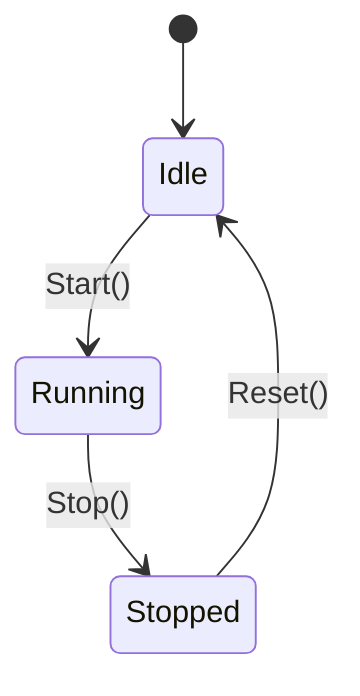

# Simulation Manager

The `sim` package orchestrates the lifecycle of simulation scenarios and global
engine state.

## Role

- **Lifecycle Control**: Manages transitions between simulation states.
- **Orchestration**: Coordinates between ECS, Telemetry, and Agents.
- **Scenario Execution**: Provides hooks for loading and running scenarios.

## State Machine

## Key Types

- `Manager` — Simulation lifecycle controller
- `Scenario` — Defines NPC counts, timing parameters
- `State` — Enum: `Idle`, `Running`, `Stopped`
