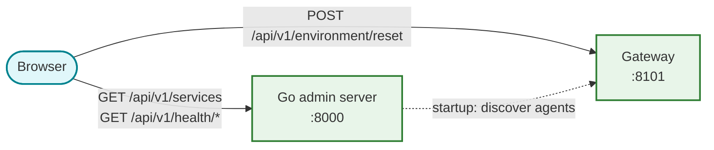

# Admin dashboard

Vanilla JavaScript SPA for simulation monitoring and environment management.
Bundled with Vite, zero runtime dependencies. Served by the Go admin server
([cmd/admin/](../../cmd/admin/)).

## What it shows

A single-page monitoring portal with four sections:

**Header**: "Simulation Admin" with a global status badge showing how many core
services are online.

**Service registry grid**: service cards organized by category (Admin & System,
Core Infrastructure, AI Agents, Developer UIs, Frontend). Each card shows a
health indicator dot, description, and a link for browseable services. Agent
Engine agents get an "AE" badge. The service list is fetched from the admin
server's `/api/v1/services` endpoint -- not hardcoded in the frontend.

**Environment management**: checkboxes for Sessions, Spawn Queues, and Session
Maps, plus a "Reset Environment" button that POSTs directly to the gateway's
`/api/v1/environment/reset` with the selected targets.

**Footer**: copyright and a "Last Check" timestamp updated every 5 seconds.

## Data flow

The dashboard talks to two backends:



- **Read operations** (service list, health checks) go to the admin server
- **Write operations** (environment reset) go directly to the gateway
- Runtime configuration comes from `/config.js` which the admin server
  generates with `window.ENV` containing all service URLs

## Health polling

Health is checked every 5 seconds via two admin server endpoints:

| Endpoint | What it checks |
|:---------|:---------------|
| `/api/v1/health/infra` | Redis, Pub/Sub, AlloyDB (admin server pings directly) |
| `/api/v1/health/services` | All registered services' `/health` endpoints (concurrent, 5s timeout) |

The dashboard updates each card's health indicator dot (green/red/grey)
based on the combined results.

## Running locally

```bash
npm install
npm run dev     # Vite dev server on :8000, proxies /api to gateway :8101
npm run build   # Production bundle (output: dist/, served by cmd/admin)
npm test        # Vitest + jsdom
```

In dev mode, Vite proxies `/api` requests to `localhost:8101` (the gateway).
In production, the Go admin server handles its own `/api/v1/*` routes and
serves the built assets from `dist/`.

## File layout

```
web/admin-dash/
├── index.html          # HTML shell (header, main container, footer)
├── main.js             # All application logic (377 lines, vanilla JS)
├── style.css           # Dark-themed glassmorphism styles
├── vite.config.ts      # Dev server config + API proxy
├── vitest.config.js    # Test config (jsdom environment)
├── package.json        # Zero runtime deps, Vite + Vitest devDeps
└── __tests__/
    └── dashboard.test.js  # DOM construction, health polling, reset flow
```

## Further reading

- The Go admin server ([cmd/admin/](../../cmd/admin/)) serves this SPA and
  provides the monitoring API
- The gateway ([cmd/gateway/](../../cmd/gateway/)) handles environment reset
  requests
