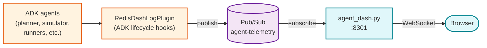

# Agent telemetry dashboard

Single-file, zero-dependency SPA for real-time debugging of ADK agent
lifecycle events. Displays every model call, tool execution, agent start/stop,
and error across all agents in the simulation.

## What it shows

Four panels on a dark-themed dashboard:

**Simulation metrics** (sidebar): total sessions, total turns, average run
latency, event count, error count, dropped log count.

**Real-time chart** (sidebar): Chart.js line graph with three datasets on a
rolling 60-second window -- events/second, error rate %, and average latency.

**Token metrics** (sidebar): per-model token consumption tracked from
`model_end` events, sorted by total tokens descending.

**Live event feed** (main panel): chronologically-ordered log of every
telemetry event with time, sequence number, session ID, agent name, event
type, and a human-readable summary with latency annotations.

## Data pipeline

The dashboard does not connect to the gateway WebSocket. It receives telemetry
through a separate Pub/Sub channel:



The `RedisDashLogPlugin` hooks into every ADK lifecycle callback and publishes
structured JSON events to the `agent-telemetry` Pub/Sub topic. The
`agent_dash.py` server (a Python FastAPI app) subscribes to this topic and
broadcasts every message to all connected browser clients via WebSocket.

## Event types tracked

| Event | Source callback | Key data |
|:------|:----------------|:---------|
| `run_start` / `run_end` | `before_run` / `after_run` | Session lifecycle, latency |
| `agent_start` / `agent_end` | `before_agent` / `after_agent` | Agent name, nesting |
| `model_start` / `model_end` | `before_model` / `after_model` | Model name, token usage |
| `model_error` | `on_model_error` | Error details |
| `tool_start` / `tool_end` | `before_tool` / `after_tool` | Tool name, args, result |
| `tool_error` | `on_tool_error` | Error details |
| `user_message` | `on_user_message` | Inbound message text |

Each event includes `session_id`, `invocation_id`, `seq` (monotonic per
session), and `timestamp`.

## Filtering and grouping

**Session color-coding**: each session ID is hashed to a deterministic HSL
color, applied as a left border on every log entry for visual grouping.

**Click-to-filter**: click any session ID, agent name, or event type to filter
the feed. Three independent filter dimensions can be combined. Active filters
appear as removable pill badges.

**Lifecycle badges**: start events get a green START badge, end events get a
red END badge, errors get a red background tint.

## Chronological ordering

Events arrive out of order from multiple agents. The dashboard uses smart
insertion: events within 50ms of each other are sorted by a type weight system
(end events rank above start events) and `seq` number for same-session
ordering.

## Performance

- `requestAnimationFrame` batching for log entry insertion
- 1000-entry feed cap with 200-entry eviction batches
- Deduplication via composite key (`session_id:type:seq:timestamp`), capped
  at 5000 entries
- Chart animation disabled for high-throughput scenarios

## Architecture

This is a single HTML file with no build step. The only external dependency
is Chart.js loaded from a CDN. The backend is `scripts/core/agent_dash.py`,
a FastAPI server that creates an ephemeral Pub/Sub subscription per instance
and cleans it up on shutdown.

## Running locally

The dashboard starts automatically via Honcho (`dash` process in the
Procfile). It runs on port 8301.

```bash
# Standalone
python scripts/core/agent_dash.py

# Via Honcho
honcho start dash
```

## File layout

```
web/agent-dash/
└── index.html    # Entire SPA (1190 lines, zero-build)
```

The backend server lives at `scripts/core/agent_dash.py`.

## Further reading

- The `RedisDashLogPlugin` ([agents/utils/plugins.py](../../agents/utils/plugins.py))
  is the ADK plugin that emits all telemetry events
- The admin dashboard ([web/admin-dash/](../admin-dash/)) provides
  infrastructure monitoring (separate concern from agent telemetry)
