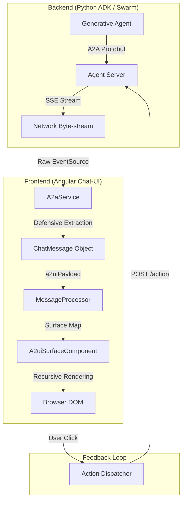
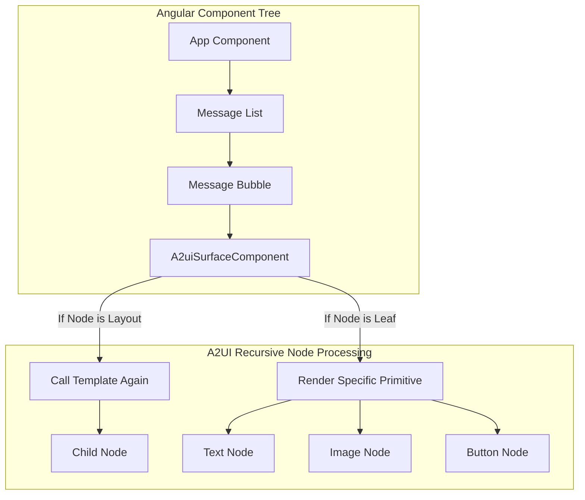
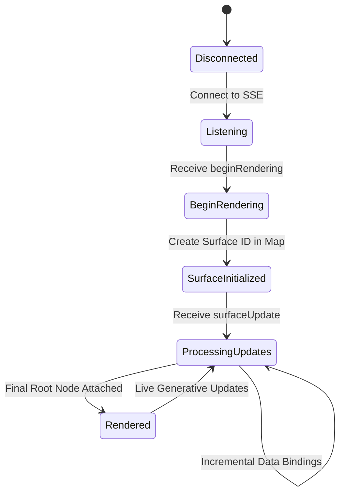

# A2UI Architecture Diagrams

## Data Flow: Agent to UI

This diagram illustrates how a generative response moves from the multi-agent
backend to the visual pixels on the screen.

## Component Hierarchy

How the custom recursive renderer decomposes the A2UI tree.

## State Machine: Rendering Lifecycle

