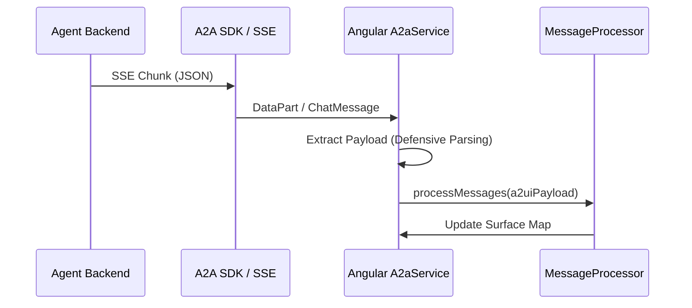

# A2UI Protocol & Stream Handling

## A2A SSE Architecture

The communication between the frontend and the agent backend follows the A2A
(Agent-to-Agent) protocol over Server-Sent Events (SSE). This allows for
real-time streaming of both text responses and UI component definitions.

### Payload Extraction Flow



## Critical Fix: `msg.parts` vs `msg.content`

### The Discrepancy

The `@a2a-js/sdk` TypeScript definitions suggest that message content resides in
a `.content` property. However, live responses from Vertex AI and ADK-based
agents often nest content under a `.parts` array.

- **SDK Expectation**: `chunk.content` or `msg.content`
- **Wire Reality**: `chunk.parts` or `msg.parts`

### Defensive Implementation

To ensure no data is lost during streaming, the extraction logic must query both
properties:

```typescript
// Support both native JSON arrays and protobuf decoded classes
const partsToProcess = chunk.parts || chunk.content || [];

// When iterating through message history
const parts = msg.parts || msg.content || [];
```

## A2UI State Machine

Rendering is driven by a strict state machine in the `@a2ui/angular`
`MessageProcessor`. To successfully render a surface, the backend MUST send:

1. **`beginRendering`**: Initializes the surface ID and root component.
2. **`surfaceUpdate`**: Provides the actual component definitions and data
   bindings.

### Minimum Required Schema

```json
[
  { "beginRendering": { "surfaceId": "unique-id", "root": "root-node-id" } },
  { "surfaceUpdate": { "surfaceId": "unique-id", "catalog": "inline", "components": [...] } }
]
```

## Error Handling

In SSE streams, 4xx/5xx errors can be opaque. Always implement a "Raw Payload
Debug" view in development to verify that the byte-stream actually contains JSON
before it reaches the parser.
