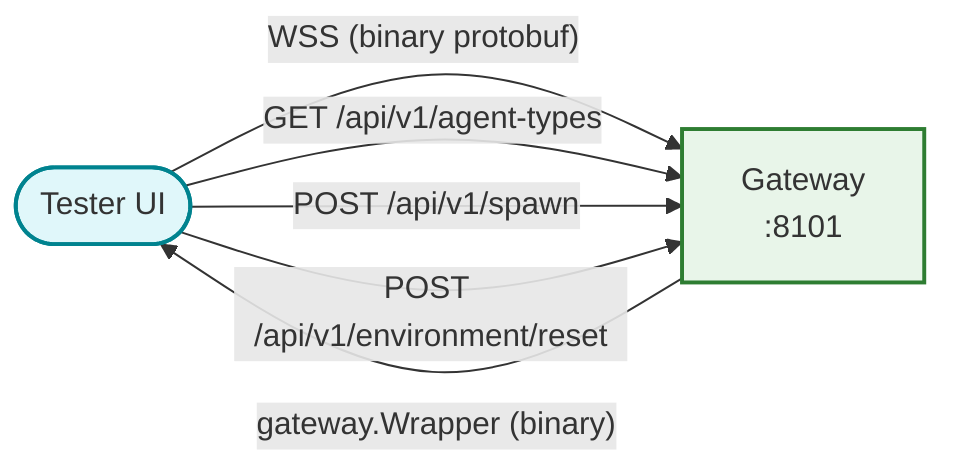

# Tester UI

Developer-facing WebSocket debugger and A2UI protocol renderer. Connects to
the gateway's binary protobuf WebSocket and displays every message flowing
through the simulation as a structured, color-coded log stream.

## What it does

The tester is a test harness for the gateway's distributed switchboard and the
A2UI protocol. It provides five capabilities:

1. **Agent discovery and session management**: fetch the agent catalog from
   the gateway, spawn sessions (individually or in batches), reset the
   environment
2. **Real-time message monitor**: binary protobuf WebSocket connection that
   decodes and displays every `gateway.Wrapper` message with type-specific
   color coding and session-colored borders
3. **A2UI v0.8.0 renderer**: parses and renders A2UI component trees into
   live interactive DOM elements, supporting all 20 primitives from the spec
4. **Targeted broadcast emitter**: select active sessions and fan out
   arbitrary payloads via protobuf-encoded `BroadcastRequest` messages
5. **A2UI action feedback loop**: button clicks on rendered A2UI components
   send `A2UIAction` protobuf messages back to the originating agent through
   the WebSocket

## How it connects



The WebSocket connection uses `binaryType = "arraybuffer"`. Messages are
decoded at runtime using `protobufjs` loading `gateway.proto` from the public
directory. Auto-reconnects after 2 seconds on disconnect.

## A2UI rendering engine

The renderer in `src/a2ui/index.ts` implements the full A2UI v0.8.0
component catalog:

| Category | Components |
|:---------|:-----------|
| Layout | Column, Row, Card, List, Tabs, Modal, Divider |
| Display | Text (h1-h5, body, caption), Image (avatar, hero), Icon, Video, AudioPlayer |
| Input | Button (with action wiring), TextField, MultipleChoice, CheckBox, Slider, DateTimeInput |
| Internal | MessageBox (log card), Notification |

The renderer handles three A2UI delivery modes:

- **Native A2UI events** (`msg.event === "a2ui"`): payload is structured JSON
- **Embedded in markdown**: extracted via regex from `` ```a2ui `` fenced
  blocks in narrative text
- **System messages**: `beginRendering`, `dataModelUpdate`, `surfaceUpdate`

A2UI property values are resolved through the `resolveValue()` function which
handles `literalString`, `literalNumber`, `literalBoolean`, `literalArray`,
and path bindings.

## Message log

Each message is rendered as a `MessageBox` card with:

- Session-colored left border (HSL hash of session ID for visual grouping)
- Speaker name and message type label
- Collapsible body with markdown rendering (via `marked` + `DOMPurify`)
- Embedded A2UI component slot
- Raw protobuf JSON toggle
- Clipboard copy buttons for session ID, simulation ID, and raw proto

A performance-aware log buffer (`src/logBuffer.ts`) uses
`requestAnimationFrame` batching and `DocumentFragment` insertion with a
500-entry cap and 100-entry eviction to keep the DOM manageable during
high-volume streaming.

## Gateway event types handled

`narrative`, `text`, `json`, `a2ui`, `tool_start`, `tool_end`, `model_end`,
`model_error`, `tool_error`, `crowd_reaction`, `environment_reset`,
`broadcast`

## Running locally

```bash
npm install
npm run dev     # Vite dev server, proxies /api to gateway :8101
npm test        # Vitest + jsdom
npm run build   # Production bundle (output: dist/)
```

Default port: 8304.

## Dependencies

| Package | Purpose |
|:--------|:--------|
| `protobufjs` | Runtime protobuf encoding/decoding |
| `marked` | Markdown-to-HTML rendering |
| `dompurify` | XSS sanitization for rendered markdown |
| `luxon` | Timestamp formatting |
| `lodash-es` | Utility functions |

## File layout

```
web/tester/
├── src/
│   ├── main.ts              # All core logic: WebSocket, message decoding, DOM, event wiring
│   ├── agents.ts             # Typed API client for agent discovery and session creation
│   ├── url.ts                # ws:// to http:// URL conversion
│   ├── logBuffer.ts          # rAF-batched ring buffer for log entries
│   ├── index.css             # Tailwind v4 + custom theme
│   └── a2ui/
│       ├── index.ts          # A2UI rendering engine (component registry, value resolution)
│       └── components/
│           ├── messageBox.ts     # Log card with markdown, A2UI slot, raw proto toggle
│           ├── multipleChoice.ts # Option buttons with selection state
│           ├── image.ts          # Image with usageHint scaling
│           ├── video.ts          # Video with aspect ratio and controls
│           └── notification.ts   # Color-coded slide-in notifications
├── public/
│   └── gateway.proto         # Protobuf schema loaded at runtime
├── index.html                # SPA shell
├── vite.config.ts            # Dev server + API proxy
└── package.json              # 5 runtime deps, Vite + Vitest + Tailwind devDeps
```

## Further reading

- [A2UI protocol](https://google.github.io/A2A/#/documentation?id=a2ui) --
  the component catalog this renderer implements
- The gateway ([cmd/gateway/](../../cmd/gateway/)) is the WebSocket endpoint
  this app connects to
- [Protocol Buffers](https://protobuf.dev/) -- wire format for all messages
  (see [gen_proto/gateway/](../../gen_proto/gateway/))
